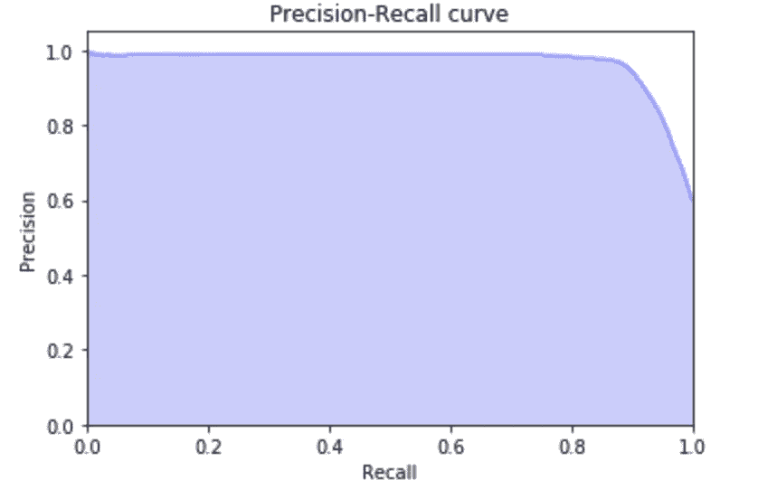

# 利用图表和统计数据控制假新闻

> 原文：<https://towardsdatascience.com/controlling-fake-news-using-graphs-and-statistics-31ed116a986f?source=collection_archive---------25----------------------->

## 公平的选举，安全的交易，公正的推荐？

你一定已经听说了来自中国的新威胁。不，我不是在说冠状病毒。

不，你没有？


[来源](https://finance.yahoo.com/news/click-farms-internet-china-154440209.html)

上面这些东西叫做点击农场。他们已经是一个产业了。

一个点击农场可能包含货架上成千上万的 iPhones 和 Android 手机，以影响和操纵推荐系统，传播假新闻，影响公众舆论，有时甚至赢得选举——这是美国一些政客的当务之急。

> 假新闻无处不在。很多假用户也是如此。

在任何时候，数以百万计的交易都在我们日益互联的世界中发生。这些事务是有时间限制的，我们需要在动态造成任何损害之前尽早发现它们。

那么，我们能在这些欺诈交易发生时抓住它们吗？数据科学会拯救我们吗？

***在这篇文章中，我将谈论***[***MIDAS***](https://github.com/bhatiasiddharth/MIDAS)***，一个基于微簇的边缘流异常检测器，旨在解决这个问题。***

# 使用的数据:

为了解决这个问题，我们将使用在 [MIDAS 论文](https://www.comp.nus.edu.sg/~sbhatia/assets/pdf/midas.pdf)中使用的 [DARPA](https://www.ll.mit.edu/r-d/datasets/1998-darpa-intrusion-detection-evaluation-dataset) 入侵检测数据集。DARPA 在 87.7K 分钟内在 9.4K 源 IP 和 2.3K 目的 IP 之间进行 450 万次 IP →IP 通信。每个通信都是有向边(src_IP、dst_IP、时间戳、攻击)的形式，其中地面真实攻击标签指示通信是否是攻击(异常占总数的 60.1%)。数据如下图所示。

```
230.001.010.020,172.016.112.050,07/03/1998-18:17,neptune
230.001.010.020,172.016.112.050,07/03/1998-18:17,neptune
230.001.010.020,172.016.112.050,07/03/1998-18:17,neptune
230.001.010.020,172.016.112.050,07/03/1998-18:17,neptune
230.001.010.020,172.016.112.050,07/03/1998-18:17,neptune
```

但是在 MIDAS 中使用之前，我们必须将 src_node、dst_node 和 timestamp 改为整数。幸运的是，库的作者已经为我们做了这个预处理，我们可以从[这里](https://www.comp.nus.edu.sg/~sbhatia/assets/datasets/darpa_midas.csv)的一个预处理文件开始。你也可以在这里下载原始数据[。处理后的文件如下所示:](https://www.comp.nus.edu.sg/~sbhatia/assets/datasets/darpa_original.csv)

```
2,3,1
2,3,1
3,4,2
3,4,2
5,9,2
5,9,2
```

# 算法思路:

## a)计数最小草图(CMS):


所以首先，我们来谈谈 CMS，它是这个算法中使用的主要数据结构。来自[维基百科](https://en.wikipedia.org/wiki/Count%E2%80%93min_sketch):

> 在计算中， **CMS** 是一种概率数据结构，充当数据流中事件的频率表。它使用哈希函数将事件映射到频率，但与哈希表不同的是，它只使用亚线性空间，代价是由于冲突而导致的一些事件的过度计数。

***简单来说，CMS 就是一个近似字典的*** 。一种数据结构，可以保存关键字的近似计数。

它被实现为具有 *w* 列和 *d* 行的网格，其中每一个 *d* 行具有不同的散列函数。每当我们遇到一个键，我们就根据行的散列函数将列中的所有行加 1。当我们需要检索键的值时，我们遍历所有行，并给出给定键的所有行中的最小值。


遍历所有的 j 行，得到键的最小值。h 是哈希函数，count 是这里的网格名。

这种数据结构的优点是，当网格的大小保持不变时，我们可以在恒定的时间内获得一个键的值。

## b)流式假设检验方法(MIDAS):


上涨可能是危险的

先从简单的开始，说说两个顶点 *u* 和 *v* 之间的单条边。我们有这种边缘的过去趋势，我们可以看到在时间段 10 有相当大的上升。我们需要创建一个异常值来捕捉这种上升。在现实世界中，这种上升可能是 DDOS 攻击。或者，可能是从一个 IP 地址到另一个 IP 地址的抓取尝试。

那么，我们怎样才能抓住这样的上升趋势呢？

一种方法是假设时间序列遵循特定的生成模型，例如，高斯分布。然后，我们可以找到这个高斯分布的平均值和标准偏差，并使用它们来声明特定时间点的边缘是异常的。

但是那是一个相当严格的条件。 而分布可能是任何东西。因此，MIDAS 算法使用较弱的假设，即当前时间刻度(例如， *t* = 10)中的平均水平(即，边缘出现的平均速率)与当前时间刻度( *t* < 10)之前的平均水平相同。

因此，我们建立了一个假设检验，它避免了为每个时间点假设任何特定的分布。我们可以将过去的优势分为两类:

1.  当前时间刻度( *t* = 10)，
2.  所有过去的时间刻度(*t*t 35】10)。

现在，设 *sᵤᵥ* 为从 *u* 到 *v* 到当前时间为止的总边数( *t* ≤10)。而 *aᵤᵥ* 是当前时刻从 *u* 到 *v* 的边数( *t* =10)。

我们可以使用两个 CMS 数据结构来保存所有边的这些计数。一个保存过去的命中，另一个保存两个节点之间的当前命中。

所以在( *t* = 10)的点击次数是 *aᵤᵥ* ，而在过去时间刻度( *t* < 10)的点击次数是*sᵤᵥaᵤᵥ*

现在，我们可以进行卡方拟合优度检验，该检验用于确定样本数据( *t* = 10)是否符合假设分布( *t* < 10)。我们的卡方统计是:


该统计/异常分数越高，出现异常边缘的可能性就越大。

MIDAS 算法看起来很简单:


## c) MIDAS-R

上述思想在 MIDAS-R 算法中得到了扩展，增加了:

1.  ***有些时间弹性***——为什么考虑某个特定的时间滴答而不是最近的过去？最近过去的边也应计入当前时间刻度，但通过减少权重进行修改。使用我们的 CMS 数据结构实现这一点的一个简单而有效的方法如下:在每个时间点结束时，我们不是重置我们的 CMS 数据结构 *aᵤᵥ* ，而是将它的所有计数减少一个固定的分数 *α* ∈ (0，1)。这允许过去的边以减少的权重计入当前时间刻度。
2.  **我们使用的一个简单的直觉是，在这两种情况下，我们期望观察到突然出现大量边的节点。因此，我们可以像以前一样使用两个附加的 CMS 数据结构来跟踪边计数，除了计数与任何节点 *u* 相邻的所有边。具体来说，我们创建 CMS 计数器 *aᵤ* 和 *sᵤ* 来近似节点 *u* 附近的当前和总边数。给定每个传入的边缘( *u，v* )，我们然后可以计算三个异常性分数:一个是边缘( *u，v* )，如在我们之前的算法中一样；一个用于节点 *u* ，一个用于节点 *v* 。最后，我们通过取它们的最大值来组合这三个分数。**

这导致更高性能的 MIDAS-R 算法。


# 编码/入门

我们从获取完整的代码开始:

```
git clone [https://github.com/bhatiasiddharth/MIDAS.git](https://github.com/bhatiasiddharth/MIDAS.git)
```

然后，我们可以:

1.  运行`make`来编译代码并创建二进制文件。
2.  运行`./midas -i darpa_midas.csv`。你也可以使用你的数据。

run 命令的输出如下:


当我们查看 scores.txt 文件时，我们看到:


然后，我们可以使用带有地面实况标签的原始 DARPA 文件来检查 AUC 分数。

```
from sklearn import metrics
from sklearn.metrics import precision_recall_curve
import pandas as pddata = pd.read_csv("darpa_original.csv", names=['src', 'dst', 'time', 'label'])
is_anom = data.label != '-'scores = pd.read_csv("scores.txt", header=None, squeeze=True)
fpr, tpr, _ = metrics.roc_curve(is_anom, scores)
auc = metrics.roc_auc_score(is_anom, scores)
precision, recall, _ = metrics.precision_recall_curve(is_anom, scores)
print("AUC: ", auc)
----------------------------------------------------------------
AUC:  0.9515446059172757
```

这是公关曲线:

```
import matplotlib.pyplot as pltplt.step(recall, precision, color='b', alpha=0.2,
         where='post')
plt.fill_between(recall, precision, step='post', alpha=0.2,
                 color='b')plt.xlabel('Recall')
plt.ylabel('Precision')
plt.ylim([0.0, 1.05])
plt.xlim([0.0, 1.0])
plt.title('Precision-Recall curve')
```



与 SEDANSPOT 提供的基线(=0.64)相比，MIDAS-R 实现了更高的 AUC(= 0.95)(sedan spot 使用个性化的 PageRank 来检测次线性空间中的异常和每个边缘的恒定时间)，同时运行速度也显著更快(0.39 秒对 84 秒)。

***这是一个 48%的 AUC 改进，速度提高了 215 倍。***

# 结论

MIDAS 提供了一个简单的框架来发现任何数据中的异常，这些异常可以用一个随时间变化的/动态的图表来表示。

它可以用于社交网络和交易网站中的各种用例，以检测微聚类和欺诈。

所以打倒新冠肺炎，打倒假新闻。

随着如此多的社交数据的出现，网络分析可以在改善我们的模型和产生价值方面提供很大帮助。如果您想了解更多关于图形算法的信息，请访问:

[](/data-scientists-the-five-graph-algorithms-that-you-should-know-30f454fa5513) [## 数据科学家，你应该知道的 5 种图形算法

### 因为图表分析是未来

towardsdatascience.com](/data-scientists-the-five-graph-algorithms-that-you-should-know-30f454fa5513) 

还有，这里有一个[UCSanDiego](https://www.coursera.org/learn/big-data-graph-analytics?ranMID=40328&ranEAID=lVarvwc5BD0&ranSiteID=lVarvwc5BD0-uD3tAFL0mCUdzcfwDd6FTQ&siteID=lVarvwc5BD0-uD3tAFL0mCUdzcfwDd6FTQ&utm_content=2&utm_medium=partners&utm_source=linkshare&utm_campaign=lVarvwc5BD0)在 Coursera 上的大数据图形分析课程，我强烈推荐学习图论的基础知识。

感谢[西达尔特·巴蒂亚](https://www.comp.nus.edu.sg/~sbhatia/)(《迈达斯》的原作者)

# 参考

西达尔特·巴蒂亚，布莱恩·胡伊，姬敏·尹，吉荣·申和克里斯特斯·法鲁索斯。" MIDAS:基于微团簇的边缘流异常检测器."2020 年 AAAI 人工智能大会(AAAI)。[https://arxiv.org/abs/1911.04464](https://arxiv.org/abs/1911.04464)