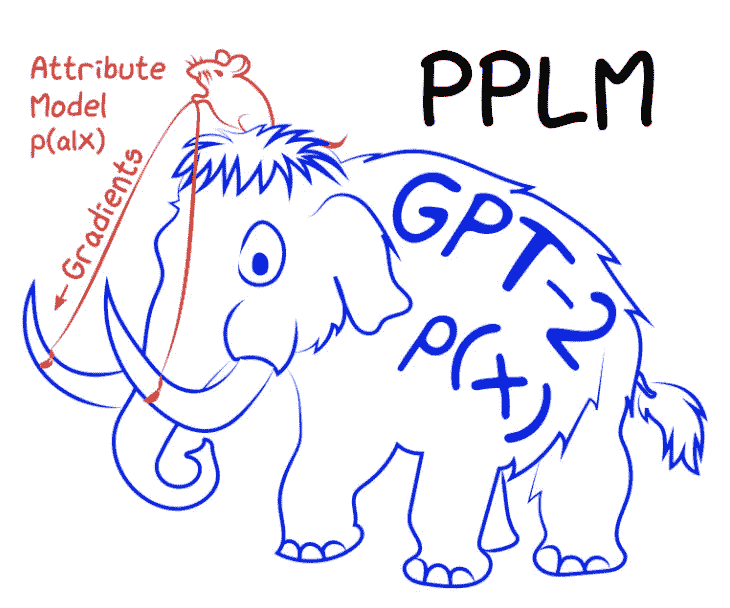
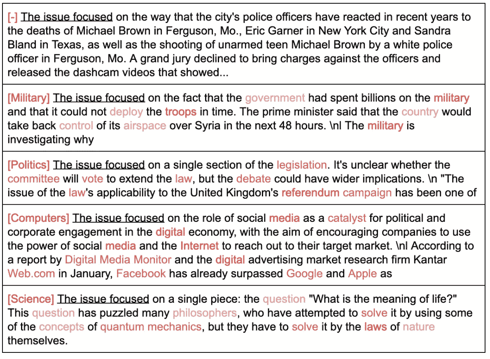
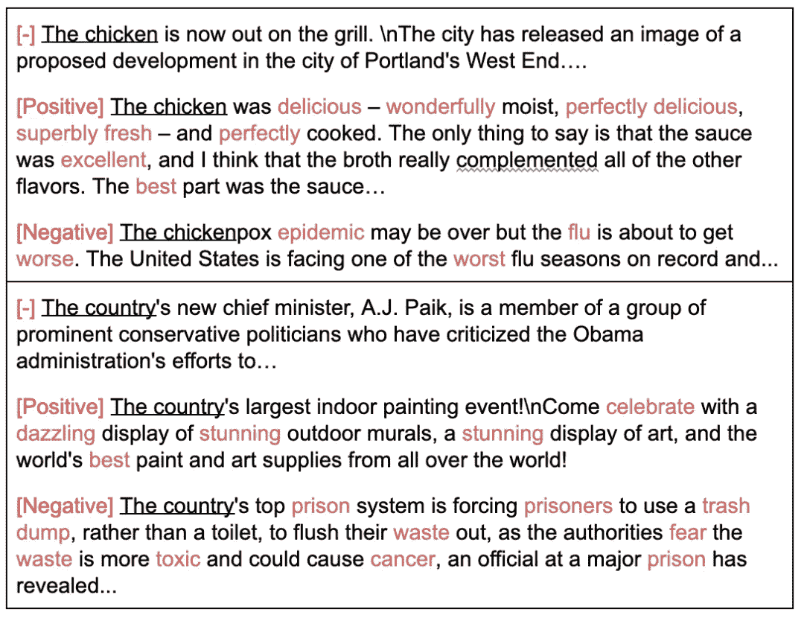

# 控制语言模型的文本生成

> 原文：<https://towardsdatascience.com/controlling-text-generation-from-language-models-6334935e80cf?source=collection_archive---------23----------------------->

## 控制机器生成文本的样式和内容的实际操作方法

乔恩·弗洛布兰特在 [Unsplash](https://unsplash.com?utm_source=medium&utm_medium=referral) 上的照片

# 介绍

现在看到机器能够生成任何种类的流畅文本已经很酷了。但是，如果我们可以告诉机器生成什么风格或形式，而不需要为每种风格训练单独的模型，会怎么样呢？这将耗费大量的计算能力和时间。

如果我告诉你我们真的可以做到呢？介绍 [**PPLM**](https://arxiv.org/pdf/1912.02164.pdf) ，代表**即插即用语言模型**。多亏了 [**优步人工智能**](https://www.uber.com/us/en/uberai/) ，PPLM 是一种将预训练的语言模型与一个或多个属性模型相结合的方法，这些模型将能够指导文本生成。PPLM 最好的一点是，它不需要语言模型训练或微调，并且对可以使用的属性模型没有限制。

# 它是如何工作的

来源:[优步艾博文](https://eng.uber.com/pplm/)

在官方的[博客文章](https://eng.uber.com/pplm/)中，作者将 GPT-2 这样的大型语言模型描绘成一只猛犸，而将属性模型描绘成一只老鼠。GPT-2 训练的计算成本更高，就像猛犸因其体积而难以移动一样。解决方案是使用一个较小的模型(像一只老鼠)，可以控制 GPT-2 的方向。

PPLM 使用了两种属性模型:词袋(BoW)和鉴别器。在词袋中，给出一个包含特定主题的所有相关词的文件来训练模型。该模型像分类器一样附加在基本语言模型(GPT-2)之上。通过这样做，GPT-2 将比以前更频繁地产生这些词。作者包括以下 BoW 作为例子开始:法律，军事，怪物，政治，积极的话，宗教，科学，空间，技术。

下图显示了在给定相同输入标记“关注的问题”的情况下，基于不同单词包的不同输出。

来源:[优步艾博文](https://eng.uber.com/pplm/)

对于 Discriminator，主题属性可以由包含与该属性相关的不同类的样本的数据集来表示。然后，PPLM 可以根据作为输入提供的类生成相应的文本。作者包括了以下鉴别器例子:积极情绪，消极情绪，点击诱饵，非点击诱饵。

下图再次显示了基于*正*和*负*鉴别器类的相同输入令牌的不同输出。

来源:[优步 AI 博文](https://eng.uber.com/pplm/)

现在我们已经了解了 PPLM 是如何工作的，让我们继续实现。由于时间关系，本文将主要关注 PPLM-鲍的实现。

# 履行

## 第 1 部分:微调 GPT2(正如我在上一篇文章中提到的)

在我之前的[帖子](/fine-tuning-gpt2-for-text-generation-using-pytorch-2ee61a4f1ba7)中，我描述了如何微调 GPT2 以在您的自定义数据集中生成任何文本。这篇博客文章将使用那篇文章中的微调模型，该模型是根据书籍摘要训练的。如果你没有读过那篇文章，你可以先去看看那篇文章，或者用预先训练好的 GPT2 模型。拥有一个微调的模型将允许生成一个更具体的领域(例如，书籍摘要)，而不仅仅是一般的文本。

 [## 使用 Pytorch 微调用于文本生成的 GPT2

### 使用 Pytorch 和 Huggingface 微调用于文本生成的 GPT2。我们在 CMU 图书摘要数据集上进行训练，以生成…

towardsdatascience.com](/fine-tuning-gpt2-for-text-generation-using-pytorch-2ee61a4f1ba7) 

## 第 2 部分:下载回购

我们将使用优步研究所的官方回购，您可以通过以下方式下载他们的回购:

`git clone https://github.com/uber-research/PPLM`

`cd PPLM/`

## 第三部分:构建 PPLM 弓

造一个*。txt* 文件，包含与您希望生成的特定主题相关的单词。例如，如果我们想要生成浪漫书籍摘要，我们可以构建一个包含浪漫相关单词列表的浪漫 BoW:

## 第 4 部分:在微调的 GPT2 上运行 PPLM

现在，我们已经构造了 BoW 文本文件，我们可以用它来运行 PPLM:

`CUDA_VISIBLE_DEVICES=$N python run_pplm.py -B /path/to/BoW/romance.txt --pretrained_model=/path/to/model/ --cond_text="The novel" —- num_samples=20 --length=150 --stepsize=0.03 --num_iterations=3 --window_length=5 --gamma=1.5 --gm_scale=0.95 --kl_scale=0.01 --colorama --verbosity='regular' --sample`

上面的命令将使用`/path/to/BoW/romance.txt`作为预训练模型`/path/to/model/`上的弓分类器来运行 PPLM。我们将条件文本(输入文本)设置为“小说”，看看它之后会生成什么。我们生成 20 个长度为 150 的样本。请注意，`--stepsize`可以用来控制主题的强度，因此增加它将导致生成的文本更频繁地包含在 BoW 中。`--colorama`将用红色对生成文本中的蝴蝶结进行颜色编码，`--sample`将确保模型用相同的种子生成不同的样本。您也可以使用预训练的 GPT-2，默认情况下没有指定任何模型将是“GPT 2-中等”。

如果您希望能够保存生成的输出，我已经添加了一个额外的命令行参数`--save_path` ，它将允许您保存(这里有[代码](https://github.com/itsuncheng/PPLM))。您只需运行下面的命令，输出将保存到该文件夹中:

`CUDA_VISIBLE_DEVICES=$N python run_pplm.py -B /path/to/BoW/romance.txt --pretrained_model=/path/to/model/ --cond_text="The novel" —- num_samples=20 --length=150 --stepsize=0.03 --num_iterations=3 --window_length=5 --gamma=1.5 --gm_scale=0.95 --kl_scale=0.01 --colorama --verbosity='regular' --sample --save_path="/path/to/save/romance.txt"`

## 第五部分:瞧！您现在可以看到生成的样本

以下是使用 romance BoW 生成的一些示例，输入条件为文本“The novel…”:

> 这部小说以两个年轻人的故事开始，他们是英国一位富有实业家的女儿，和他的妻子，一位富婆美丽女儿的女儿，嫁给了同一个男人。他们结婚是为了永远在一起，他们没有孩子。他们的女儿原来是一个美丽的女人，她的丈夫在爱了她多年后，决定给她一生的爱来结婚…
> 
> 这部小说讲述了年轻夫妇丽莎和大卫第二次结婚的故事。他们过着幸福的生活，但当大卫的父亲去世时，他们的婚姻注定要失败。这对夫妇与他们的鳏夫父亲和女婿住在一起，但他们有婚外情。
> 
> 这部小说是一系列闪回故事，讲述了一个名叫苔莎的年轻孤儿的生活，她的母亲死于一场火灾，她住在自己工作的房子里。房子的主人是一个同名的女人。当苔莎去和她母亲住在附近的房子里几年时，她惊讶地看到一个英俊、迷人的年轻人。她爱上了他，但他不再爱她，她怀了她第一任丈夫的孩子…

更多例子可以在我的 Github [repo](https://github.com/itsuncheng/PPLM/blob/master/generated_romance.txt) 上查看。

# 结论

本文通过使用强大的语言模型 GPT-2 实现 PPLM，深入探讨了如何控制文本生成。PPLM 的强大之处在于它允许不同的属性模型组合来产生不同样式的文本。就是这样！希望你们能从这篇文章中学到一些东西，并期待在下一篇文章中见到你们！

如果感兴趣，这里有更多我写的文章😊

 [## 使用 Pytorch 的 BERT 文本分类

### 文本分类是自然语言处理中的一项常见任务。我们应用 BERT，一个流行的变压器模型，对假新闻检测使用…

towardsdatascience.com](/bert-text-classification-using-pytorch-723dfb8b6b5b)  [## 基于 Pytorch 的 LSTM 文本分类

### 一步一步的指导你如何在 Pytorch 中建立一个双向 LSTM！

towardsdatascience.com](/lstm-text-classification-using-pytorch-2c6c657f8fc0) 

# 参考资料:

[1] S. Dathathri，A. Madotto，J. Lan 等。，[即插即用语言模型:控制文本生成的简单方法](https://arxiv.org/pdf/1912.02164.pdf) (2020)，2020 年学习表征国际会议

[2] R .刘、s .达塔瑟里、a .马多托等。、[用即插即用语言模型控制文本生成](https://eng.uber.com/pplm/)、AI 博客

[3] S. Dathathri，A. Madotto，J. Lan 等。， [PPLM 代码](https://github.com/uber-research/PPLM)，Github

[4] [用变形金刚](https://transformer.huggingface.co/doc/pplm)，拥抱脸和优步 AI 写