# Conv2d:终于明白了向前传球会发生什么

> 原文：<https://towardsdatascience.com/conv2d-to-finally-understand-what-happens-in-the-forward-pass-1bbaafb0b148?source=collection_archive---------3----------------------->

## 2D 卷积层及其参数的直观和数学解释

# 介绍

深度学习的**库**和平台如 **Tensorflow** 、 **Keras** 、 **Pytorch** 、 **Caffe** 或 **Theano** 在日常生活中帮助我们，以至于每天都有新的应用让我们觉得“哇！”。我们都有自己最喜欢的框架，但它们的共同点是，它们通过易于使用、可按需配置的功能来简化我们的工作。但是我们仍然需要理解**可用的参数是什么**来利用这些框架给我们的所有能力。

在这篇文章中，我将尝试列出所有这些论点。如果您想了解它们对**计算时间**、可训练参数**的数量**以及卷积输出通道的**大小**的影响，那么这篇文章就是为您准备的。

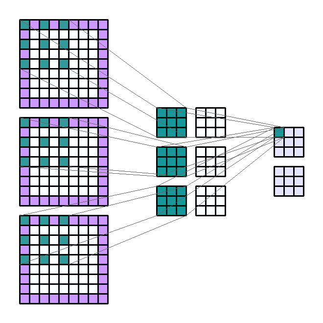

输入形状:(3，7，7) —输出形状:(2，3，3) — K : (3，3) — P : (1，1) — S : (2，2) — D : (2，2) — G : 1

所有的 gif 都是用 python 做的。你将能够测试这些论点中的每一个，并且**自己想象**它们对我的 Github 上的[脚本的影响(或者制作你的 gif)。](https://github.com/AxelThevenot/GIF_convolutions)

这篇文章的各个部分将根据以下论点进行划分。这些参数可以在 **Conv2d** 模块的 **Pytorch** 文档中找到:

*   **in _ channels**([*int*](https://docs.python.org/3/library/functions.html#int))—输入图像的通道数
*   **out _ channels**([*int*](https://docs.python.org/3/library/functions.html#int))—卷积产生的通道数
*   **kernel _ Size**([*int*](https://docs.python.org/3/library/functions.html#int)*或*[*tuple*](https://docs.python.org/3/library/stdtypes.html#tuple))—卷积核的大小
*   **步距** ( [*int*](https://docs.python.org/3/library/functions.html#int) *或* [*元组*](https://docs.python.org/3/library/stdtypes.html#tuple) *，可选* ) —卷积的步距。默认值:1
*   **填充**([*int*](https://docs.python.org/3/library/functions.html#int)*或* [*元组*](https://docs.python.org/3/library/stdtypes.html#tuple) *，可选* ) —输入两边加零。默认值:0
*   **膨胀**([*int*](https://docs.python.org/3/library/functions.html#int)*或* [*元组*](https://docs.python.org/3/library/stdtypes.html#tuple) *，可选* ) —内核元素之间的间距。默认值:1
*   **组**([*int*](https://docs.python.org/3/library/functions.html#int)*，可选* ) —输入通道到输出通道的阻塞连接数。默认值:1
*   **偏置** ( [*布尔*](https://docs.python.org/3/library/functions.html#bool) *，可选* ) —如果`True`，向输出添加一个可学习的偏置。默认:`True`

最后，我们将让**的所有键根据参数和输入通道的大小计算输出**通道的大小。

# 什么是内核？

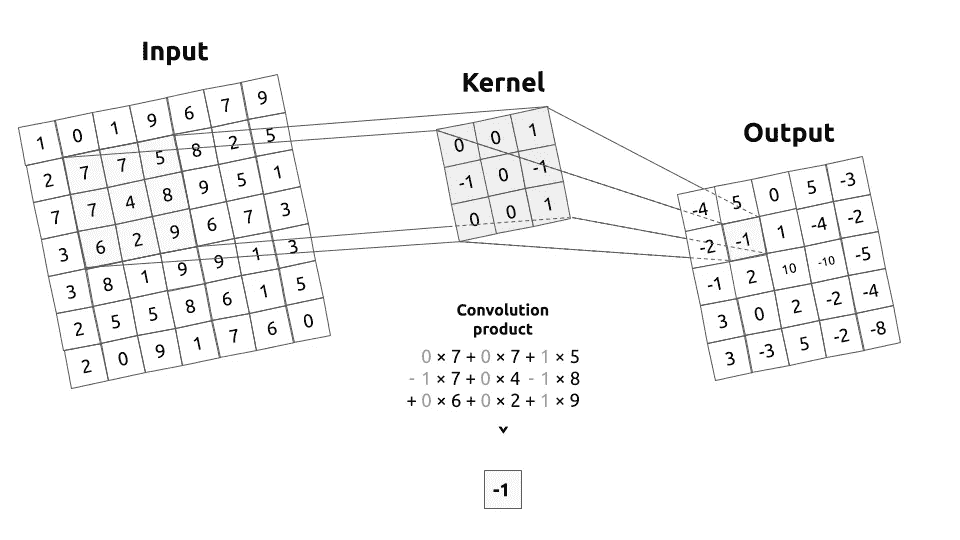

输入图像和内核之间的卷积

我来介绍一下什么是**内核**(或者说**卷积矩阵**)。内核描述了一个**过滤器**，我们将通过它来处理输入图像。简单来说，内核将通过应用**卷积乘积**在整个图像上从左到右、从上到下移动。该操作的输出被称为**过滤图像**。

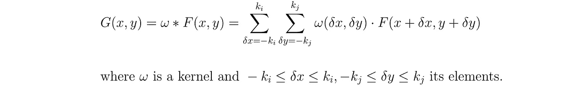

卷积乘积

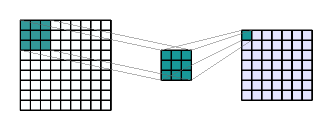

输入形状:(1，9，9) —输出形状:(1，7，7) — K : (3，3) — P : (0，0) — S : (1，1) — D : (1，1) — G : 1

举一个非常基本的例子，让我们想象一个 3 乘 3 卷积核过滤一个 9 乘 9 图像。然后，这个内核在整个图像上移动，以在图像中捕获所有大小相同的正方形。卷积乘积是一个**元素级**(或点级)乘法。这个结果的总和就是输出(或过滤)图像上的结果像素。

如果你还不熟悉滤波器和卷积矩阵，那么我强烈建议你多花一点时间来理解卷积核。**它们是 2D 卷积层的核心**。

# 可训练参数和偏差

**可训练参数**，也简称为“参数”，都是网络训练时**会更新**的参数。在 Conv2d 中，可训练元素是由**组成内核**的值。因此，对于我们的 3 乘 3 卷积核，我们有 3*3=9 个可训练参数。

有偏卷积积

为了更完整。我们可以包括**偏差**或不包括。偏差的作用是加到卷积乘积的和上。这个偏差**也是一个可训练的** **参数**，这使得我们的 3 乘 3 内核的可训练参数的数量增加到 10 个。

# 输入和输出通道的数量

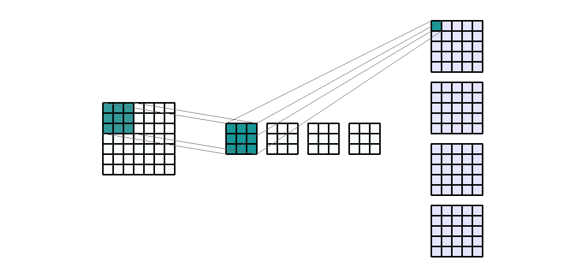

输入形状:(1，7，7) —输出形状:(4，5，5) — K : (3，3) — P : (0，0) — S : (1，1) — D : (1，1) — G : 1

使用层的好处是能够**同时执行类似的操作**。换句话说，如果我们想要对一个输入通道应用 4 个相同大小的不同滤波器，那么我们将有 4 个输出通道。这些通道是 4 个不同过滤器的结果。因此产生了 4 个不同的内核。

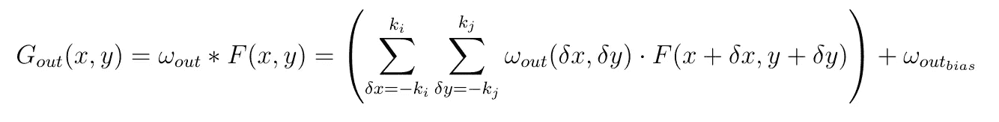

在上一节中，我们看到可训练参数构成了卷积核。因此**参数的数量随着卷积核的数量线性增加**。因此与所需输出声道的数量成线性关系。还要注意的是，**计算时间**也随着输入通道的大小和内核的数量成比例地变化**。**

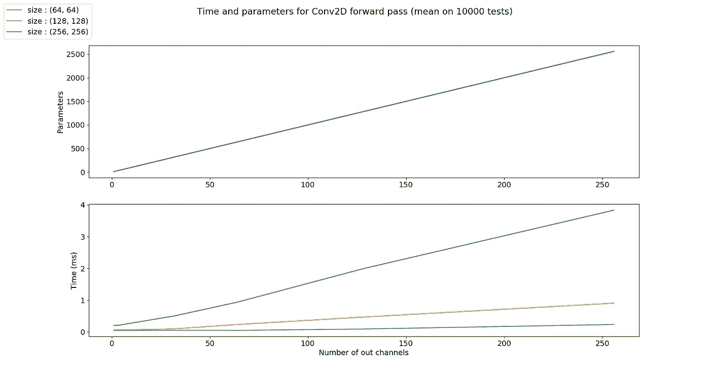

请注意，参数图中的曲线是相同的

同样的原理适用于**输入通道**的数量。让我们考虑 RGB 编码图像的情况。这个图像有三个通道:红色，蓝色和绿色。我们可以决定在这 3 个通道的每一个上用相同大小的滤波器提取信息，以获得 4 个新通道。因此，对于 4 个输出通道，操作是相同的 3 倍。

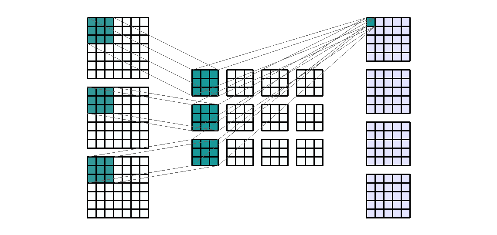

输入形状:(3，7，7) —输出形状:(4，5，5) — K : (3，3) — P : (0，0) — S : (1，1) — D : (1，1) — G : 1

**每个输出通道是经过滤波的输入通道的总和。**对于 4 个输出通道和 3 个输入通道，每个输出通道是 3 个滤波后的输入通道之和。换句话说，卷积层由 4*3=12 个卷积核组成。

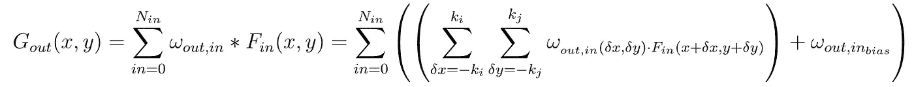

提醒一下，参数数量和计算时间与输出通道数量成比例变化。这是因为每个输出通道都链接到不同于其他通道的内核。对于**输入通道**的数量也是如此。计算时间和参数数量成比例增长。

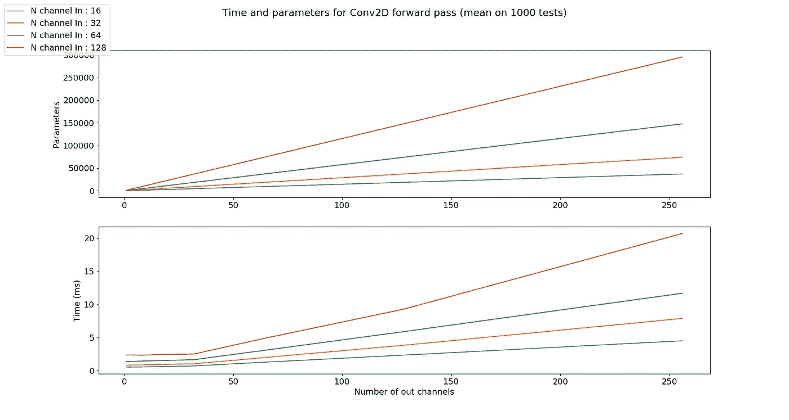

# 内核大小

到目前为止，所有的例子都给出了 3 乘 3 大小的内核。其实它的**大小**的选择完全**由你**决定。可以创建核心大小为 1*1 或 19*19 的卷积层。

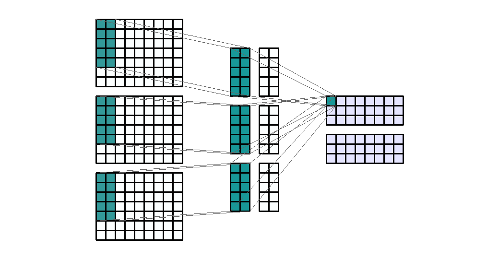

输入形状:(3，7，9) —输出形状:(2，3，9) — K : (5，2) — P : (0，0) — S : (1，1) — D : (1，1) — G : 1

但是也绝对有可能没有方形核。有可能决定让内核具有不同的高度和宽度。在信号图像分析中经常会出现这种情况。例如，如果我们知道我们想要扫描信号或声音的图像，那么我们可能想要 5*1 大小的内核。

最后，你会注意到所有尺寸都由奇数**和奇数**定义。定义一个**甚至**的内核大小也是可以接受的。实际上，很少这样做。通常，选择奇数大小的内核是因为在中心像素周围有对称性。

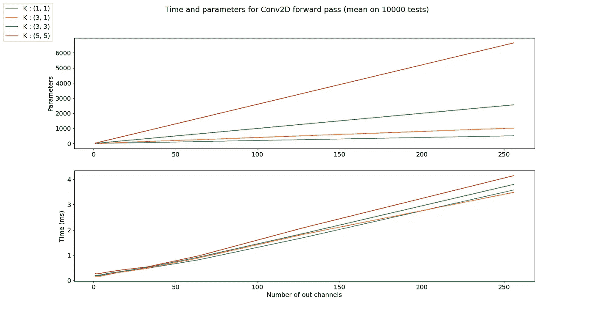

由于卷积层的所有(经典)可训练参数都在内核中，参数的数量**随着内核的大小**线性增长。计算时间也成比例地变化。

# 大步

默认情况下，内核从左向右移动，从上到下逐像素移动。但是这种转变也是可以改变的。常用于**下采样**输出通道。例如，对于(1，3)的步长，滤波器从水平方向的 3 到 3 和从垂直方向的 1 到 1 进行**移位**。这会产生水平向下采样 3 倍的输出通道。

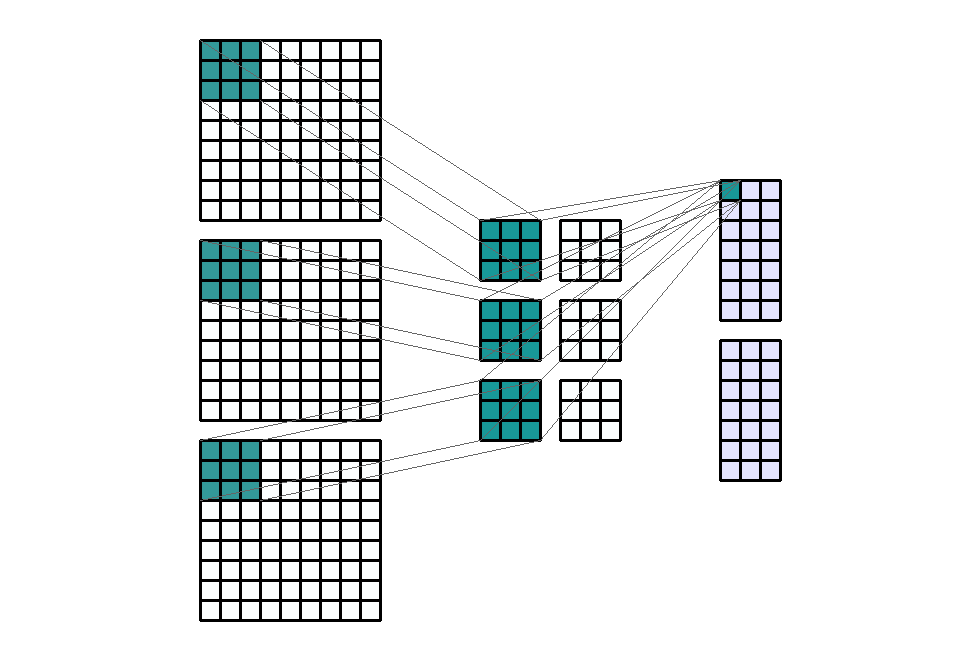

输入形状:(3，9，9) —输出形状:(2，7，3) — K : (3，3) — P : (0，0) — S : (1，3) — D : (1，1) — G : 1

步长对参数的数量没有影响，但是逻辑上，计算时间随着步长线性减少。

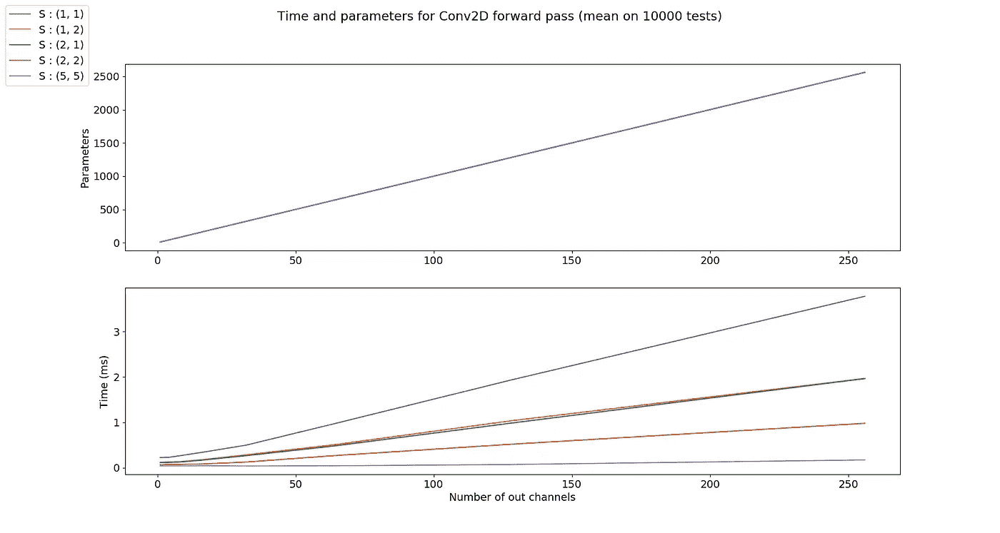

请注意，参数图中的曲线是相同的

# 填料

填充定义了在卷积滤波之前添加到输入通道**的侧边**的**像素的数量。通常，填充像素被设置为零。输入通道**延长**。**

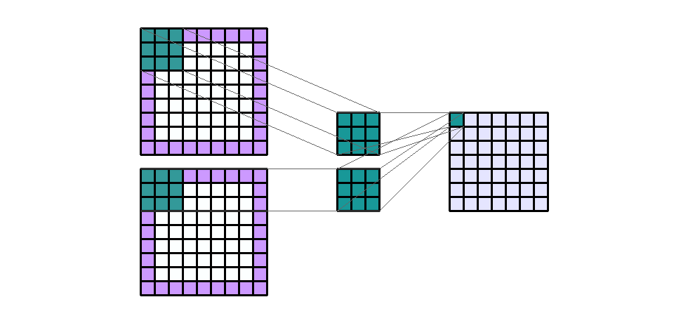

输入形状:(2，7，7) —输出形状:(1，7，7) — K : (3，3) — P : (1，1) — S : (1，1) — D : (1，1) — G : 1

当您希望**输出**通道的大小与**输入**通道的大小**相等**时，这非常有用。简单来说，当内核为 3*3 时，输出通道的大小每侧减少一个。为了克服这个问题，我们可以使用填充 1。

因此，填充对参数数量没有影响，但会产生与填充大小成比例的额外计算时间。但一般来说，与输入声道的大小相比，填充通常足够小，以至于不会影响计算时间。

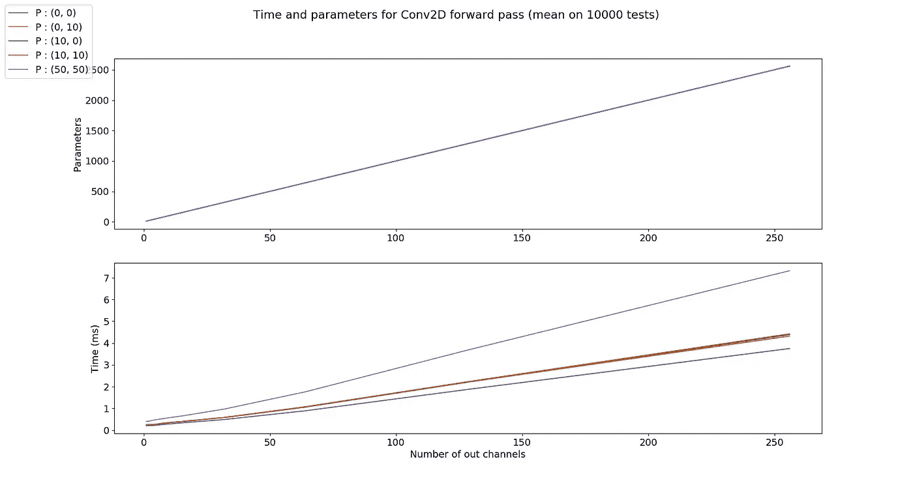

请注意，参数图中的曲线是相同的

# 扩张

在某种程度上，膨胀就是地核的宽度。默认等于 1，对应于 **卷积**期间输入通道**上内核的每个像素**之间的**偏移。**

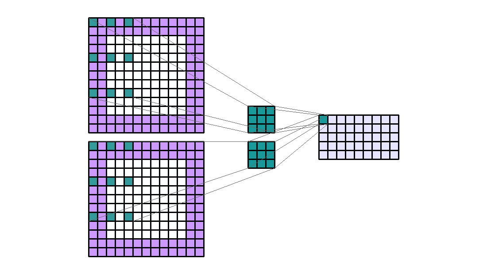

输入形状:(2，7，7) —输出形状:(1，1，5) — K : (3，3) — P : (1，1) — S : (1，1) — D : (4，2) — G : 1

我在我的 GIF 上夸大了一点，但如果我们以(4，2)的膨胀为例，那么输入通道上的内核的**感受域在垂直方向上加宽了 4 * ( 3 -1)=8，在水平方向上加宽了 2 *(3–1)= 4(对于 3 乘 3 的内核)。**

就像填充一样，膨胀对参数的数量没有影响，对计算时间的影响也非常有限。

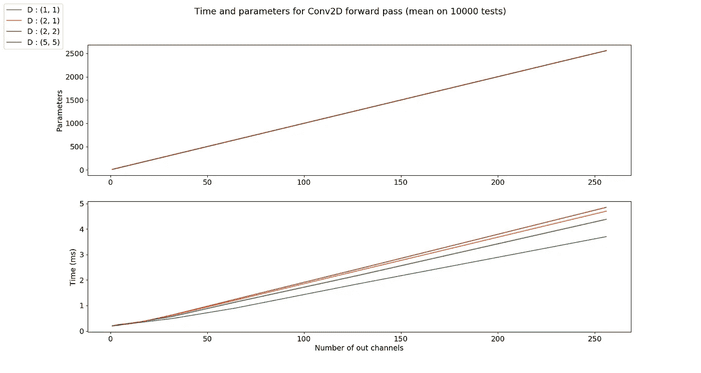

请注意，参数图中的曲线是相同的

# 组

在特定的情况下，组非常有用。例如，如果我们有几个串联的数据源。当没有必要对待他们相互依赖的时候。输入通道可以**分组并独立处理**。最后，输出通道在最后被**连接**。

如果有 2 组 2 个输入通道和 4 个输出通道。这就像将输入通道分成两组(每组一个输入通道)，并使其通过一个输出通道数量减半的卷积层。然后输出声道被连接起来。

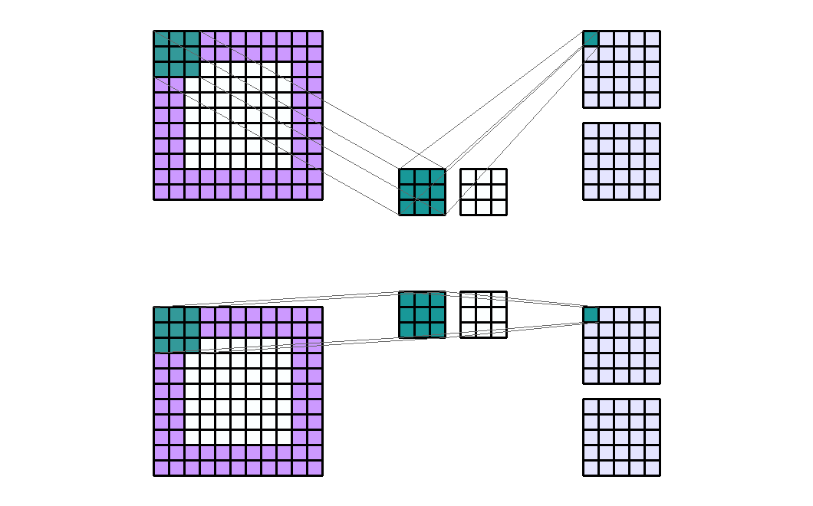

输入形状:(2，7，7) —输出形状:(4，5，5) — K : (3，3) — P : (2，2) — S : (2，2) — D : (1，1) — G : 2

需要注意的是，组的数量必须完全除以输入通道的数量和输出通道的数量(**公约数**)。

因此，参数的数量除以组的数量。关于 Pytorch 的计算时间，该算法针对组进行了优化，因此应该会减少计算时间。但是，还应该考虑到，必须将输出通道的**组形成**和**连接**的计算时间与**相加。**

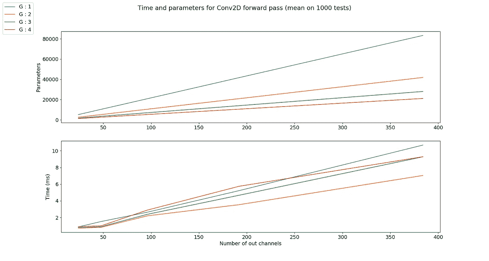

# 输出通道尺寸

有了所有参数的知识，就可以从输入通道的大小计算出输出通道的大小。

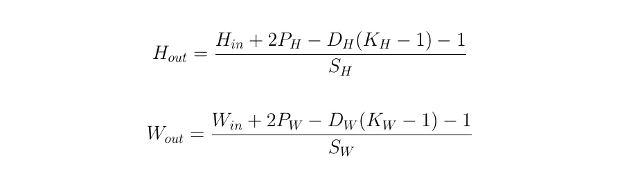

> 知识就是分享。
> **支持**我，获得**访问 [**中我所有文章的**一键点击此处](https://axel-thevenot.medium.com/membership)** 。

# 来源

[深度学习教程](https://cs.nyu.edu/~yann/talks/lecun-ranzato-icml2013.pdf)，Y. LeCun

[文档 torch.nn](https://pytorch.org/docs/stable/nn.html) ，Pytorch

[卷积神经网络](https://cs231n.github.io/convolutional-networks/)，cs231n

[卷积层](https://keras.io/layers/convolutional/)，Keras

所有的图像都是自制的

所有计算时间测试都是在我的 GPU (GeForce GTX 960M)上用 Pytorch 执行的，如果你想自己运行它们或执行替代测试，可以从 GitHub 库 获得 [**。**](https://github.com/AxelThevenot/GIF_convolutions)