# 随机变量的收敛性

> 原文：<https://towardsdatascience.com/convergence-of-random-variables-c1830b3c95bc?source=collection_archive---------20----------------------->

## 用简单的术语解释不同的聚合模式

陈逸飞在 [Unsplash](https://unsplash.com/photos/FPMRxKd7MxI) 上的照片

随机变量的收敛；

> 一个随机变量序列(RVs)在重复多次后会遵循一个固定的行为

RVs (Xn)序列最初保持变化的值，并最终稳定在更接近 X 的数字。

但是，“收敛到一个接近 X 的数”是什么意思呢？

通常，RVs 可能不会精确地固定在一个最终的数字上，但是对于一个非常大的 n，方差会变得越来越小，导致序列收敛到一个非常接近 x 的数字。

所以，让我们学习一个符号来解释上述现象:

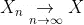

随着 n 变大，级数 Xn 收敛到最终值 X

作为数据科学家，我们经常会讨论一个算法是否收敛？现在，让我们通过下面的[示例](https://i.stack.imgur.com/dBBM5.png)来观察上述收敛特性:

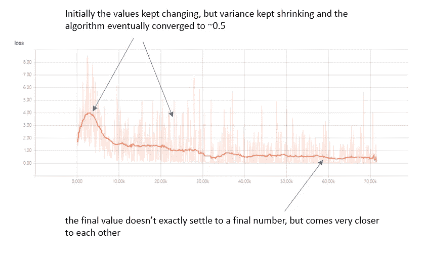

算法的收敛图

既然我们已经彻底了解了收敛的概念，那么让我们来理解在上面的上下文中“接近”应该有多“接近”吧？

> 按照数学家的说法，**“接近”意味着要么提供两个 Xn 和 X 之间距离的上界，要么取一个极限**。

下面，我们将根据取值限制列出三种主要的收敛类型**:**

1)几乎必然收敛

2)概率收敛

3)分布的趋同性

但是，为什么我们会有不同类型的收敛，当它所做的只是确定一个数字的时候？这是因为，没有一种方法可以定义 RVs 的收敛性。

我将在下面的结构中解释每种收敛模式:

*   **直觉和概念类比:**这将有助于初学者理解概念。如果是第一次接触，理解这些章节应该就足够了
*   **定义和数学示例:**概念的正式解释，了解关键概念和三种模式之间的细微差别

# **不同收敛模式之间的关系:**

如果一个级数收敛于“几乎必然”强收敛，那么这个级数也以概率和分布收敛。但是，反过来就不正确了

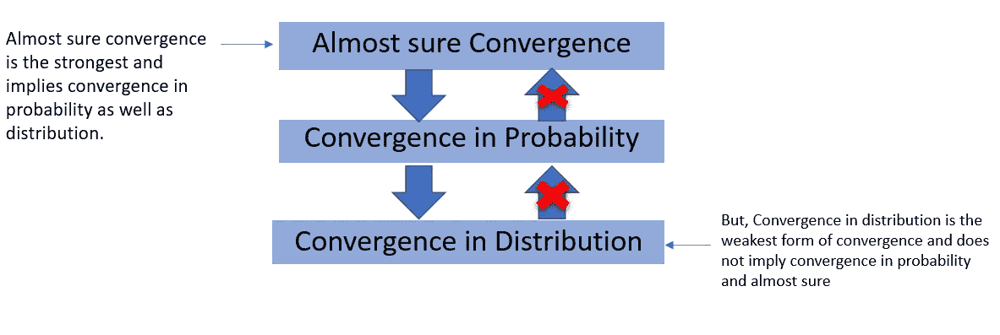

# **分布收敛:**

**直觉:**这意味着随着 n 变得越来越大，我们在建模分布以及下一个输出时变得越来越好。

**定义:**一系列实数 RVs 依分布收敛如果当 n 增长到∞时 Xn 的 cdf 收敛到 X 的 cdf

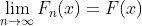

其中 F 代表 cdf，对于所有 x € R 应该是连续的

由于它只依赖于随机变量序列*和极限随机变量*的 cdf，因此不要求两者之间有任何依赖关系。所以，分布的收敛不像概率的收敛和几乎必然的收敛那样，告诉我们任何关于联合分布或概率空间的东西。

**批注**:

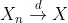

**举例:**中心极限定理(CLT)

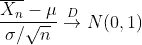

𝜇和𝜎是总体的平均值和标准差

**问题**:设 Xn 是 x₂,…suchx₁的随机变量序列，其 cdf 定义为:

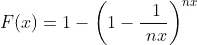

给定 X~ exp(1 ),让我们看看它是否收敛于分布

**解法:**让我们首先计算 Xn 的 cdf 的极限:

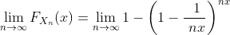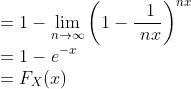

当 Xn 的 cdf 等于 X 的 cdf 时，证明级数依分布收敛。

**概念类比:**在学习新技能的初始上升曲线期间，与技能被掌握时相比，输出是不同的。在一段时间内，可以肯定地说，产量或多或少是恒定的，并且在分布上趋于一致

# **概率收敛**:

**直觉:**Xn 与 X 相差大于ε(固定距离)的概率为 0。换句话说，随着系列的进展，不寻常结果的概率不断缩小。

**定义:**称一个级数 Xn 按概率收敛于 X 当且仅当:

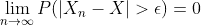

与分布收敛不同，概率收敛取决于联合 CDF，即 Xn 和 X 是相关的

**符号**:

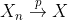

**例子**:弱大数定律

因为“弱”和“强”大数定律是大数定律(LLN)的不同版本，并且主要基于收敛模式来区分，我们将在后面讨论它们。

**问题**:设 Xn 是随机变量序列 X₁，X₂,…such，xn～unif(2–1∕2n，2+1∕2n)

对于给定的定数 0 < ε<1, check if it converges in probability and what is the limiting value?

**解:**对于 Xn 以概率收敛到一个数 2，我们需要找出 P(|Xn — 2| > ε)对于某个ε是否趋向于 0

让我们看看分布是什么样的，RV 偏离收敛常数超过一定距离的概率变为 0 的区域是什么。

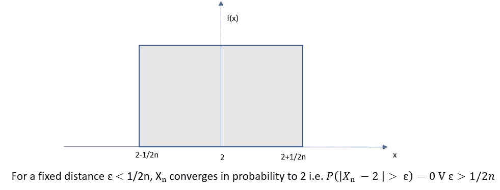

**概念类比:**根据每个班级随机抽取 10 名学生的表现得出的学校排名，不会反映学校的真实排名。但是，当每个班级越来越多的学生的表现被计入学校排名时，它就接近了学校的真实排名。

# **几乎确定收敛:**

**直觉:**对于非常高的 n 值，Xn 收敛到 X 的概率几乎是确定的即 prob 为 1。

**定义:** 无穷序列 RVs X1(ω)，X2(ω)… Xn(w)有一个概率为 1 的极限，就是 X(ω)

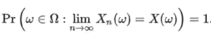

ω:定义随机变量的基础概率空间的样本空间

注意极限在概率收敛中是在概率之外，而极限在几乎必然收敛中是在概率之内。

**符号**:

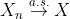

**举例**:强收敛定律

**问题:**设 Xn 是一个随机变量序列，X₁、X₂,…such 认为

Xn = t + tⁿ，其中 T ~ Unif(0，1)

**解法:**我们把样本空间分成两个区域，应用下图所示的全概率定律:

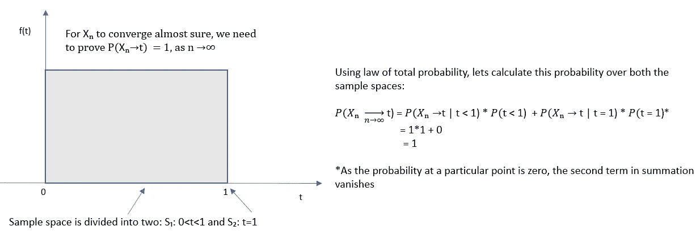

当概率评估为 1 时，级数 Xn 几乎必然收敛

**概念类比:**如果一个人基于抛硬币的结果，从他的语料库中向慈善机构捐赠了一定的金额，那么 X1，X2 暗示了第一天，第二天捐赠的金额。随着时间的推移，本金将不断减少，因此慈善捐赠的金额几乎肯定会减少到 0，即概率为 1。

**依概率收敛和几乎必然收敛的区别:**

*   “弱”大数定律是依概率收敛的结果，被称为弱收敛，因为它可以从较弱的假设中得到证明。它指出，随着 n 的增加，样本均值将更接近总体均值𝜇，但留下了 ***ε误差可能出现无限次的范围。***
*   然而，几乎确定收敛是一个更具约束性的收敛，它认为两个平均值之间的差小于ε的情况会无限频繁地出现，即概率为 1。也就是说， ***违反几乎必然收敛中所述的不等式仅在有限数量的情况下发生***
*   Eric Towers [在这里做了一个很好的区分](https://math.stackexchange.com/questions/2806713/difference-in-conditions-of-weak-and-strong-law-of-large-numbers)。

希望这篇文章能让你很好地理解不同的融合模式

感谢阅读！！！

参考资料:

*   [https://www . probability course . com/chapter 7/7 _ 2 _ 4 _ convergence _ in _ distribution . PHP](https://www.probabilitycourse.com/chapter7/7_2_4_convergence_in_distribution.php)
*   [https://en . Wikipedia . org/维基/Convergence _ of _ random _ variables](https://en.wikipedia.org/wiki/Convergence_of_random_variables)