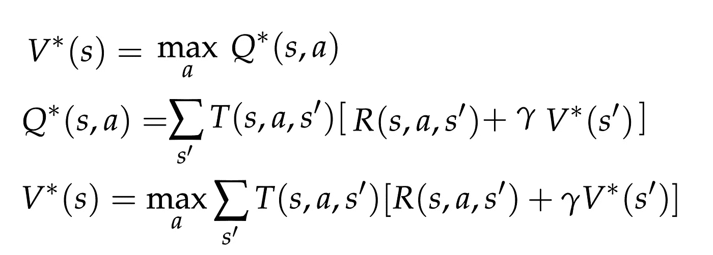
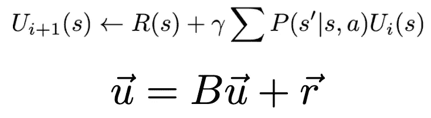
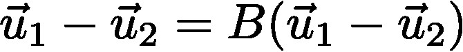
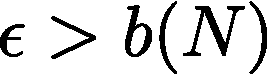
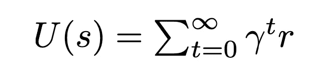
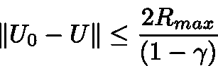
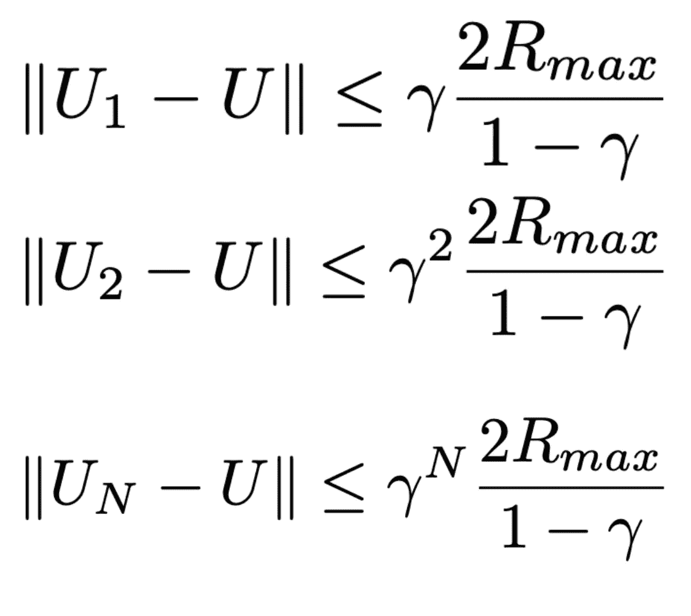
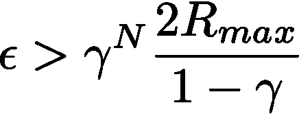
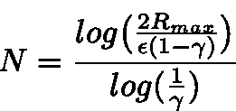
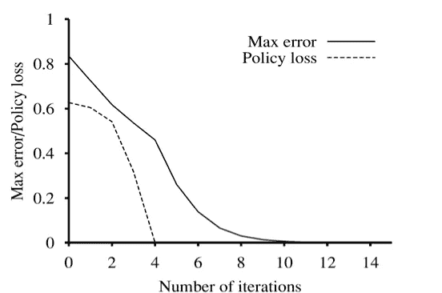

# 强化学习算法的收敛性

> 原文：<https://towardsdatascience.com/convergence-of-reinforcement-learning-algorithms-3d917f66b3b7?source=collection_archive---------15----------------------->

## 学习一项任务的速度有什么简单的界限吗？Q-learning 背景下的研究。

激动人心的时刻即将到来。照片由[亚历山大·奈特](https://www.pexels.com/@agk42?utm_content=attributionCopyText&utm_medium=referral&utm_source=pexels)从[派克斯](https://www.pexels.com/photo/high-angle-photo-of-robot-2599244/?utm_content=attributionCopyText&utm_medium=referral&utm_source=pexels)拍摄

D eep 强化学习算法可能是最近机器学习发展中最难对其性能设定**数值界限**的算法(在那些起作用的算法中)。理由是双重的:

1.  深层神经网络是模糊的黑匣子，没有人真正理解它们如何或为什么如此好地融合。
2.  强化学习任务**收敛是** **历史上不稳定**因为从环境中观察到的稀疏奖励(以及底层任务的难度— ***从零开始学习！*** )。

在这里，我将向您介绍一种启发式算法，我们可以用它来描述 RL 算法如何收敛，并解释如何将其推广到更多的场景。

来源——作者，哥斯达黎加。

一些相关的文章，可以在这之前看，或者在这之后看:

1.  什么是马尔可夫决策过程？
2.  [强化学习的隐藏线性代数。](/the-hidden-linear-algebra-of-reinforcement-learning-406efdf066a)
3.  [强化学习的基础迭代方法。](/fundamental-iterative-methods-of-reinforcement-learning-df8ff078652a)

这篇文章解决了 ***的问题:像值迭代、q 学习和高级方法这样的迭代方法在训练时是如何收敛的？*** 在这里，我们将简要回顾马尔可夫决策过程(更多细节请参见上面的链接 1 和 3)，解释我们如何将贝尔曼更新视为一个**特征向量**方程(更多信息请参见链接 2)，并展示**的数学运算，即值如何收敛到最优量**。

# 回顾马尔可夫决策过程

马尔可夫决策过程是支持强化学习的随机模型。如果你很熟悉，你可以跳过这一部分。

MDP 就是一个例子。来源——我在 CS188 做的一个[讲座](https://inst.eecs.berkeley.edu/~cs188/sp20/assets/lecture/lec10.pdf)。

## 定义

*   一组状态 **s ∈ S** ，动作 **a ∈ A** 。
*   一个转移函数 **T(s，a，s’)**。
*   一个奖励函数 **R(s，a，s’)。**这个函数 r 的任何样本都在区间[-Rmax，+Rmax]内。
*   区间[0，1]中的折扣因子 **γ (gamma)** 。
*   开始状态 **s0** ，也可能是结束状态。

## 重要的价值观

MDP 有两个重要的特征效用-状态值和机会节点的 q 值。任何 MDP 或 RL 值中的 ***** 表示一个 ***最优量*** 。效用是 1)一个状态的 v 值**和 2)一个状态、动作对的 Q 值**T21。****

最佳值与最佳动作条件 q 值相关。然后值和 q 值更新规则非常相似(加权转换、奖励和折扣)。顶部)值与 q 值的耦合；mid) Q 值递归，bot)值迭代。我在加州大学伯克利分校 cs 188 的讲座。

> 我们试图做的是**估计这些价值、q 值和效用**，以便我们的代理人能够**计划最大化回报的行动**。
> 
> 真实估计=最优策略。

来源，作者。美国印第安纳州詹姆斯敦。

# 概括迭代更新

在新内容的第一部分中，我将回忆我正在使用的 RL 概念，并强调获得一个方程组所需的**数学变换**，该方程组的**以离散的步骤**发展，并且**具有收敛界限**。

## 强化学习

RL 是我们试图“解决”和 MDP 的范例，但我们不知道底层环境。简单的 RL 解决方案是基本 MDP 求解算法(价值和策略迭代)的基于采样的变体。回想一下 Q 值迭代，这是我将重点关注的贝尔曼更新:

MDP 的 q 值迭代。

看看精确值迭代或策略迭代如何提炼为在上述等式中的每次赋值(←)后比较一个值向量，这是一轮递归更新。这些方法的收敛产生了与强化学习算法如何收敛成比例的度量，因为**强化学习算法是价值和策略迭代的基于采样的版本，具有一些更多的移动部分**。

*回忆:Q-learning 是与 Q-value 迭代相同的更新规则，但是将转移函数替换为采样的动作，将奖励函数替换为实际样本，* ***r*** *，从环境中接收。*

## 线性算子和特征向量

我们需要将我们的 Bellman 更新公式化为一个线性操作符， ***B*** ，(矩阵是线性操作符的子集)，看看我们是否可以让它表现为一个 [**随机矩阵**](https://en.wikipedia.org/wiki/Stochastic_matrix) 。随机矩阵[保证](https://math.stackexchange.com/questions/40320/proof-that-the-largest-eigenvalue-of-a-stochastic-matrix-is-1)有一个**特征向量**与**特征值 1** 配对。

[λ](https://en.wikipedia.org/wiki/Lambda#Lower-case_letter_%CE%BB) x =Ax，其中 `lambda=1.`

> 也就是说，我们可以像研究特征空间的演化一样研究 RL 中的迭代更新。

现在，我们需要做一些符号上的改变，从矩阵中关于 *Q 值的公式过渡到向量中作用于**效用的公式(效用概括为值和 Q 值，因为它被定义为奖励的贴现和)。***

1.  我们知道效用与 q 值成正比；**改变符号**。我们将使用*。*
2.  *将实用程序重新排列为一个**向量**类似于许多编码库的`flatten()`功能(例如，将 XY 状态空间转换为跨越状态的 1d 向量索引)。我们得到*。**

****

**将 q 状态转换为特征值的通用效用向量。**

**这些变化对于将问题公式化为特征向量是至关重要的。**

## **了解 Q-learning 的各个部分**

**从下面 Q 值迭代的基本方程开始，我们如何将它推广到线性系统？**

****

**MDP 的 q 值迭代。**

**在这种情况下，我们需要更改右侧，使其如下所示:**

****

**将我们的系统移向线性算子(矩阵)**

**这给我们留下了最后一种形式(合并本节的方程，以及本征值部分的结尾)。我们可以用这个作为我们需要的线性算子吗？考虑一下，如果我们使用的是最优策略(不失一般性)，那么棘手的最大 over actions 就会消失，留给我们的是:**

****

**这是我们能得到的最接近的，使它成为一个纯特征向量方程。它非常接近所谓的[广义特征向量](https://en.wikipedia.org/wiki/Generalized_eigenvector)。**

****

**来源——作者，香港维多利亚的山顶。**

# **研究趋同**

**在本节中，我将推导出一个关系式，该关系式保证 N 步后ε的**最小误差，并展示其含义。****

## **我们可以研究的系统**

**我们在上面看到，我们可以用一种非常接近特征向量的方式来制定效用更新规则，但是我们偏离了一个常数向量 ***r*** 来表示 MDP 的基本回报面。如果我们取两个效用向量的差会发生什么？常数项消失了。**

****

**取两个效用向量之间的差，我们看到, **r 向量**可以抵消。**

**我们现在有我们的系统，我们可以像特征向量的动态系统一样研究，但我们在效用之间的差异空间中工作，用矩阵***B****—***加权转移概率的总和**。因为效用向量是相互定义的，所以我们可以神奇地重新排列这个(代入递归的贝尔曼方程，取范数)。**

****

**贝尔曼更新后的误差减少了折扣因子。**

> **研究任何效用估计之间的差异是巧妙的，因为它显示了 a)估计如何不同于真实值，或者 b)仅来自递归更新的数据如何演变(而不是小向量 ***r*** )。**

## **ε-N 关系**

**任何收敛证明都将寻找**误差界限**，ε，和**步数**， *N* ，(迭代)之间的关系。这种关系将使我们有机会用一个**分析方程**来限制性能。**

****

**我们希望在步骤 N-b(N)-处效用误差的界限小于ε。该界限将是一个解析表达式，ε是一个标量，表示估计的和真实的效用向量之间的差的范数。**

**换句话说，我们在寻找ε的一个界限，这是 n 的函数**

**首先，我们知道(根据 MDP 的定义)每一步的回报，***【r】***，有界在区间[-Rmax，+Rmax]内。那么，把效用(报酬的贴现和)的定义看做一个几何级数，我们就可以把任意向量的差绑定到真实向量上。 *(* [*等比数列收敛的证明*](https://en.wikipedia.org/wiki/Geometric_series#Proof_of_convergence) *)。***

********

**左)效用的定义:贴现报酬的期望总和。右)我们收敛的起点。从一个[几何级数](https://en.wikipedia.org/wiki/Geometric_series)的收敛来考虑真实效用 U 和初始效用 U(0)之间的差异。**

**界限来自最坏情况的估计——其中每一步的真实回报是+Rmax，但我们将估计值初始化为-Rmax。唉，我们对我们的实用程序的误差有一个**初始界限！**回忆一下 U0 是我们初始化效用向量的值，然后每当我们运行贝尔曼更新时，索引就会增加。**

**贝尔曼更新— **初始化时的界限如何随着每一步**而演变？上面，我们看到**在每一步**误差都减少了折扣因子(从递归更新中的总和总是预先加上一个伽玛)。随着每次迭代，这将演变成一系列递减的误差。**

****

**当前效用更新(U_i)与真实值 **U** 之差的收敛。**

**剩下的就是宣告界限，***ε***，相对于步数， ***N*** 。**

## **结果——可视化融合**

**在上面等式的右边，我们有一个效用估计的精确度界限。**

> **从逻辑上讲，对于任何ε，我们知道误差将在 N 步中小于ε。**

****

**我们还可以用数学技巧在ε和 N 之间来回变换——因此，如果我们知道*我们希望估计值有多精确，我们就可以解决让我们的算法运行多长时间的问题*！**

****

**通过取两边的对数，我们可以解出达到所述界限的迭代次数！**

**我们发现的界限是状态空间上累积值误差的界限(下面的实线)。精明的读者会想知道的是，政策错误与此相比如何？从概念上来说，这意味着，*‘在多少个州，当前政策会与最优政策不同？’*事实证明，随着数值的标准化(因此它们在数值上相似)，政策误差收敛得更快，并且更快地达到零(没有渐近线！).**

****

**政策迷失空间中价值迭代与政策迭代的收敛性。策略的离散性使得策略迭代收敛更快**在许多情况下** *。* [来源](http://aima.cs.berkeley.edu/)。**

**这代表了在某些情况下使用策略迭代优于值迭代的优势。它会带来更多的算法吗？**

## **影响-限制最近的深度增强算法**

**绑定深度 RL 算法是每个人都想要的。近年来我们已经看到了令人印象深刻的成果，机器人可以[跑](https://arxiv.org/pdf/1812.11103.pdf)、[叠毛巾](https://bair.berkeley.edu/blog/2018/11/30/visual-rl/)、[玩](https://www.aaai.org/ocs/index.php/AAAI/AAAI18/paper/viewFile/16669/16677)游戏。如果我们在性能上有限制，那就太好了。**

**我们所能做的，必然是我们对世界的表述将如何趋同。我们已经证明**效用函数将会收敛**。有两个持久的挑战:**

1.  ***我们没有被赋予* ***奖励功能*** *对于现实生活中的任务，我们必须设计它。***
2.  **运行这些迭代算法目前是不安全的。机器人探索涉及大量的力量、相互作用和(实际上)损害。**

> **我们可以研究算法的收敛性，但是限制深度强化学习应用于现实世界任务的大多数工程问题是奖励工程和安全学习。**

**这就是我留给你们的——一个帮助我们设计更好系统的行动号召，这样我们就可以展示更多管理它的基础数学。**

**以下是我对人们在深度 RL 研究中使用的方法的总结。**

** [## 最新深度增强算法概述

### 获得 RL 算法要点的资源，无需浏览大量文档或方程。

towardsdatascience.com](/getting-just-the-gist-of-deep-rl-algorithms-dbffbfdf0dec)** 

**更多？订阅我关于机器人、人工智能和社会的时事通讯！**

** [## 自动化大众化

### 一个关于机器人和人工智能的博客，让它们对每个人都有益，以及即将到来的自动化浪潮…

robotic.substack.com](https://robotic.substack.com/)**