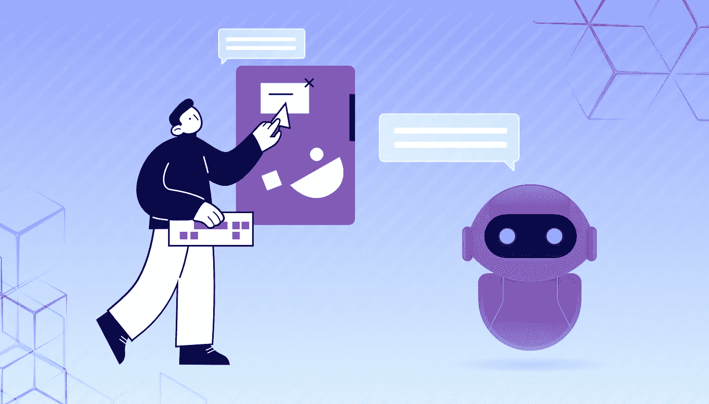
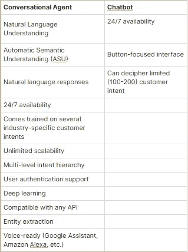
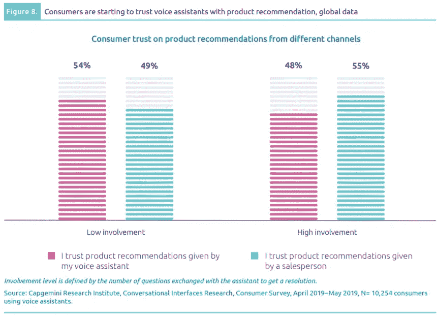

# 对话代理:聊天机器人的一种更自信的形式

> 原文：<https://towardsdatascience.com/conversational-agent-a-more-assertive-form-of-chatbots-de6f1c8da8dd?source=collection_archive---------22----------------------->

## 意图识别和客户体验是聊天机器人的未来。智能对话式人工智能代理是聊天机器人的新进展，它可以根据客户过去的对话、购买或浏览行为来预测客户的需求。

图片作者[作者](https://acquire.io/)

在过去的几年里，人工智能的进步抓住了公众更大的想象力，并导致人工智能助手的普遍采用。然而，这种变化和创新的快速步伐伴随着对技术方向以及它将如何影响社会的越来越多的怀疑。

尽管如此，普遍的共识是，提高计算机以更自然的方式与人类互动的潜力对于人工智能与人类的关系进一步发展非常重要。

人工智能以前所未有的速度改变了通信环境。这些不仅包括媒体行业的彻底变革，还涉及我们与之沟通的合作伙伴。今天和电脑互动很平常。

它们已经进化得不仅仅是人与人之间对话的媒介，还可以以聊天机器人和虚拟助手的形式与人类互动。

这已经可以通过对话式人工智能来实现，对话式人工智能是一种合成的智能，使计算机能够理解、处理人类语言并对其做出反应。

通过利用先进的深度学习措施和自然语言理解(NLU)，对话式人工智能可以提升到能够真正改变客户体验的地步。客户将不必感受到原始聊天机器人的局限性，因为它们的范围狭窄。

有了对话代理，你可以超越简单的聊天机器人的反应，使他们更有上下文。客户可以直接从聊天窗口做任何事情，从提交保险索赔到请求天气建议以及外出是否安全。

## 对话代理和聊天机器人的区别

对话代理不仅给你建议，还和你一起思考，帮你做决定。例如，他们可以搜索数据集，在您最喜欢的网站上预订您的旅行，还可以找到最合适的日期。

这些智能体使用自然语言理解，并且比聊天机器人更具情境性。此外，成功的对话代理可以跨各种面向客户的渠道实现，并使用真实的用户数据进行训练。

## 对话代理

据聊天机器人杂志报道，一个对话代理是:

> *“对话代理是一个软件程序，它解释并响应用户用普通自然语言所做的陈述。它将计算语言学技术与互联网上的交流相结合。”*

对话代理是一个对话系统，它执行自然语言处理(NLP ),然后用人类语言响应查询。会话代理体现了计算语言学的实用用法，它通常被用作互联网上的虚拟代理，作为服务助理。

## 聊天机器人

根据[牛津词典](https://www.lexico.com/definition/chatbot)，聊天机器人是:

> 设计用来模拟与人类用户对话的计算机程序，尤其是在互联网上

聊天机器人是由人工智能驱动的设备，用于模拟和模仿人类对话的非结构化流。聊天机器人不同于目的驱动的对话代理，它利用人工智能在理解意图和分析话语背景的基础上，用一组特定的预定义回复来响应人类对话。

总结一下，对话代理和聊天机器人的区别是:

图片由[作者](https://acquire.io/)

## 对话代理是如何工作的

如前所述，对话代理是进行自然语言处理并以人类语言回应对话的对话系统。所讨论的对话系统可以用于从输入通道读取，然后通过输出通道以图形、语音或触觉辅助的物理手势的形式回复相关响应。

该过程的第一步包括在一种自动语音识别器(ASR)或光学手写/手势识别器的帮助下，将现实世界的输入转换为机器代码。

在这之后，输入在自然语言理解(NLU)单元的帮助下被破译。这超越了标准的自然语言处理，包括词性标注、名称识别和语义/句法分析器。

在解密的同时，对话管理器还运行以跟踪对话的历史和状态，从而通过启动/终止相关的子任务域来保持对话不脱离逻辑轨道。

最后，响应被处理并交付给输出生成器，然后输出生成器匹配任何输入。

## 对话代理与人工智能的联系

走向模拟对话是人机交互发展的下一步。这种转变也已经发生，从我们的手机到网站到应用程序，人工智能聊天机器人无处不在。

我们可以向他们提出各种各样的问题，并以打字文本的形式得到答案。但是蜜月期并没有持续多久。

彭博贝塔公司的合伙人希文·齐尔利斯说:

> *“聊天机器人曾经很火，现在没那么火了。他们在客户支持和智能家电等少数几个狭窄的应用领域看到了一些早期成功，但人们越来越失望，因为他们的期望过高。”*

用户报告说，随着他们的期望值开始上升，他们对聊天机器人的失望程度越来越高。这是因为聊天机器人无法进行前后关联的交流，这可能包括从同一个对话中获取线索。

聊天机器人也缺乏感知和理解用户情绪的同理心，无法对他们做出更自然的反应。这些限制之所以存在，是因为计算机无法在自然语言理解和对话方面取得与自然语言处理相同的进步。

那么，一个人如何超越简单的“我不明白”作为对意外查询或触发的回复呢？答案在于在对话代理中嵌入更好的上下文感。建立这种环境可能需要几个相互联系的知识积累层，这些知识是计算机通过它们参与的每一次互动积累起来的。

密歇根大学人工智能实验室主任[说:“在整个对话过程中，你如何真正把握上下文？这是最大的挑战。你如何理解我在说什么，很大程度上取决于我在五句或十五句前说了什么。你正在建立一种对话状态。”](https://medium.com/cognitivebusiness/i-spent-a-month-in-the-minds-of-ai-experts-heres-what-i-learned-24b7837076a)

显而易见，在对话代理中引入上下文感并不简单——这是一个复杂的问题，计算机科学家正在试验许多不同的潜在解决方案。这就是人工智能的用武之地。

计算机科学家正在特别试验机器学习算法，并在两种技术的帮助下训练它们:强化学习和监督学习，这两种技术已被用于训练人工智能系统执行单独的任务。

强化学习包括在让系统说出它以前从未说过的话时，通过反复试验来教会系统。这有助于对话更快、更有效地进行。

科学家试图用不同的方式说同样的事情，以帮助对话代理学习映射系统，从而在给定对话的整体背景和任务目标的情况下，理解接下来要说什么。有了监督学习，计算机通过例子来学习。它训练对话系统学习在特定上下文中说的对话，然后模仿它们。

加深对话代理和 AI 之间联系的另一个因素是物联网能力的持续发展。每当传感器将物体和人的上下文数据中继到人工智能系统时，这些设备将有助于为人工智能系统提供更大的上下文。

当这些设备继续相互“交谈”时，它们将获得更好的上下文感觉，并且随着该上下文可用于对话，对话将变得更自然、有用和更好。

## 对话代理的应用和用例

正确部署的对话代理将彻底改变你与用户互动的方式、时间和地点。您可以通过任何渠道与消费者进行无缝、无错误、同步的互动。对话代理用例的范围很广，下面将提到其中最少的一个。

## 收集线索并促进转化

令人惊讶的是，比起销售人员，用户更信任对话代理。

图片来自[凯捷](https://www.capgemini.com/wp-content/uploads/2019/09/Report_Conversational-Interfaces-1.pdf)

这种信任通过实现对话式人工智能程序赋予企业巨大的权力。例如，得克萨斯州的软件公司 Cigniti 在他们的对话代理上看到了 [40%的转化率](https://collect.chat/blog/for-this-software-testing-company-4-out-of-10-leads-comes-through-the-chatbot/)。

## 提供客户支持

对话代理也是客户支持的一个改变者。他们可以为客户答疑解惑，提供建议，帮助他们做决定等等。

图片由 [Helpshift](https://go.helpshift.com/rs/113-UDX-599/images/Report_State_of_CS_Automation.pdf)

客户也喜欢对话代理具有的即时可访问性。使用对话式人工智能也可以让你大规模地管理对话。事实上，对话代理帮助零售商在不需要额外员工帮助的情况下处理了 167%的订单量增长。

## 个人助理

也许，对话代理最普遍的应用是以个人助理的形式。这些助理做从理解开放式对话到满足用自然语言提出的请求的一切事情。

尽管个人助理代表着一个新兴的市场，却受到了消费者的极大热情。根据 KPCB 的一项研究，与文本相比，用户对这项技术的速度非常着迷。

这种热情反映在遥遥领先的市场领导者亚马逊的 Echo 的销量上，根据 TechCrunch 的数据，[该公司在 2019 年售出了超过 1.469 亿台。](https://techcrunch.com/2020/02/17/smart-speaker-sales-reached-new-record-of-146-9m-in-2019-up-70-from-2018/)

## 结论

在不久的将来，基于更广泛背景的对话将创造出更好、更有用的助手。人类通过上下文对话与人工智能系统互动和互动的能力将有助于计算机科学家将该技术嵌入对话代理。

然而，显而易见的是，具有无所不在和上下文相关的人工智能的对话代理将成为人类和计算机之间协作和互动关系背后的驱动力。而且，该领域最大的影响将来自于发现使人和计算机很好地相互合作的最佳方法。