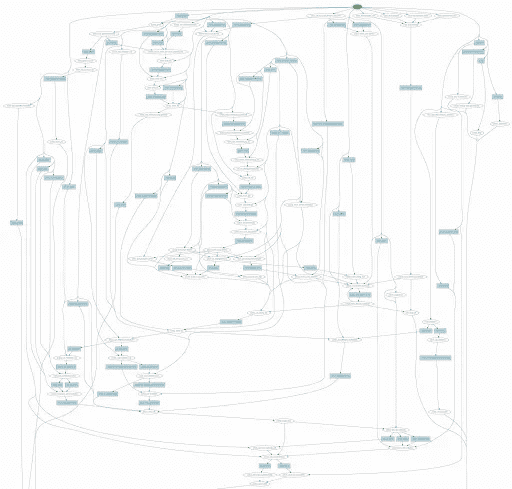

# 面向开发者的对话式人工智能:你的堆栈中的四个基本层

> 原文：<https://towardsdatascience.com/conversational-ai-for-developers-the-four-essential-layers-in-your-stack-77582e47f5e2?source=collection_archive---------31----------------------->

对话式 AI 组件；资料来源:Rasa

打造一个 AI 助手很难。构建一个不仅能处理问题和执行任务，还能参与灵活的来回对话的人工智能助手可能会非常困难。它需要机器学习、工程最佳实践、强大的工具和有价值的用户对话形式的数据。

你可能认为构建伟大的人工智能助手意味着从头开始构建一切。但是，您不需要从基本的构建模块开始，就可以获得高性能、企业就绪、足够灵活的产品来满足您的需求。像 Rasa 这样的开源框架是介于自己构建一切和使用 SaaS 框架之间的中间地带，你不能根据你的用例和训练数据来定制这个框架。

Rasa 一直在发布开源软件，这些软件已经授权成千上万的个人开发者、初创公司和财富 500 强公司创造人工智能助手。Rasa 在开发者友好的工作流程中发布了应用研究，如 [TED 政策](https://blog.rasa.com/unpacking-the-ted-policy-in-rasa-open-source/)，以及[国会](https://blog.rasa.com/introducing-dual-intent-and-entity-transformer-diet-state-of-the-art-performance-on-a-lightweight-architecture/) NLU 架构。

Rasa 不是一个包罗万象的对话式人工智能平台。这是一个可定制的基础设施层，在即插即用的架构中提供对话式人工智能构建模块。在这篇文章中，我们将讨论构建人工智能助手所需的组件，以及 Rasa 如何融入您的堆栈。

# Rasa 如何融入您的堆栈

每个对话式人工智能应用程序都由几个不同的层组成:

*   计算层
*   对话式人工智能基础设施层
*   工具/服务层
*   应用层

对话式 AI 组件；作者图片

假设你在做披萨。如果你精通比萨饼制作的细微差别，你会知道你需要生面团、奶酪、酱汁和配料的原料。

您可能有三种选择:

*   你可以自己做所有的配料
*   你可以定制预先准备好的配料，然后把所有的配料放在一起做比萨饼
*   或者你可以买一个比萨饼，里面所有的东西都是预先制作和选择的，你不能定制

披萨的解剖，作者图片

# 计算层

计算层是基础层，其他层位于其上。机器学习友好的编程语言，如 [Python](https://www.python.org/) 和 [Julia](https://julialang.org/) ，以及机器学习框架，如 TensorFlow、PyTorch 和 spaCy，构成了计算层。

这些开源框架提供了高级 API，使得构建和实验模型变得更加容易；它们带有预先打包的算法，可以解决常见的 ML 问题，如使用神经网络的机器翻译、命名实体识别等。他们中的一些人甚至帮助将模型部署到生产中。

把编程语言想象成构成比萨饼面团的原料，像面粉、油、盐和水。ML 框架可以被认为是你可以在超市找到的预先包装好的面团。使用开源软件库或框架来开始构建您的助手可能比从头开始构建更容易。

计算层；作者图片

# 对话式人工智能基础设施层

对话式人工智能基础设施层位于计算层之上。它提供了一个内聚的框架，帮助开发人员构建 AI 助手。Rasa 开源是一个用于构建 AI 助手的对话式 AI 框架。它包括识别意图和实体的自然语言理解能力、机器学习驱动的对话管理、有助于与流行的消息服务集成的连接器，以及可以被调用来与外部系统集成的定制动作。

把 Rasa 开源软件想象成你的披萨酱。从头开始制作具有挑战性，需要专业知识；但是使用预包装的版本，你可以根据自己的喜好定制和改造酱料，并专注于制作一个伟大的披萨，而不是酱料。

Rasa 开源是像 TensorFlow 这样的机器学习框架之上的一个抽象层。就像你可能不会编写自己的编程语言、算法或 TensorFlow 版本一样，你也不必构建自己的对话式人工智能基础设施组件。

对话式人工智能基础设施层；作者图片

Rasa 开源抽象出了构建人工智能助手所涉及的复杂性。但是它是完全可扩展和可定制的。您可以使用 Rasa 开源构建任何类型的助手。您可以将自己的工具插入 Rasa，或者在它的基础上构建额外的层。

由于人工智能助手可以是特定于用例和行业的，因此基于问题和训练数据挑选各种管道、策略和配置选项的能力可能是有价值的。例如，您可以使用像 BERT 这样的语言模型，转换或插入您的自定义模型。

Rasa 开源还使用机器学习策略和对话管理来处理非线性对话和杂乱的人类行为。用户经常会插入一些离题的信息，回到之前的话题，或者离题。他们通常以非线性和无序的方式说话。助理的目的是自动化对话或处理一定数量的客户服务请求，他必须能够处理这些类型的对话。状态机或开箱即用的 SaaS 聊天机器人平台并不最适合这些类型的用例，因为它们无法扩展到规则和 if/else 语句之外。

澄清一下，大部分 AI 助手里还是需要规则和业务逻辑的。如果您没有在真实用户中测试过，那么最初您也许可以使用状态机。

典型的状态机流程；资料来源:Rasa

但是当你开始用真正的用户测试它并添加更多的功能时，它很快变得难以置信的混乱、不可维护和难以扩展。

状态机意大利面条代码；作者图片

可定制的框架使用机器学习来预测下一个最佳行动，并根据对话历史进行归纳，允许您创建支持灵活、自然的多回合对话的助手。

# 工具/服务层

工具或服务层位于基础设施层之上。使用 Rasa 开源，您可以构建一个 MVP 助手，它可以进行对话，理解上下文，并执行某些任务。下一步是测试和改进你的助手。工具可以帮你做到这一点。Rasa X 提供了收集、可视化和审查用户对话的工具。它允许您与真实用户一起测试，建立 CI/CD 管道，并进行持续改进。把 Rasa X 或者其他工具想象成你披萨上的奶酪。它改善你的助手，就像奶酪如何使你的比萨饼更好！

工具/服务层；作者图片

# 应用层

应用层是你的 AI 助手生活的地方。它可以与其他系统和 web 应用程序共存。例如，一个企业的工资单、人力资源和 IT 系统都在这里。根据你的人工智能助手的使用情况，它可能会与一个或多个上述系统进行交互。这一层的应用程序也有用户界面，用户可以实际看到并与之交互。基于安全和隐私考虑，您可以将您的助手部署到云中或在本地托管它。

对话式 AI 组件；作者图片

# 结论

构建任务关键型对话式 AI 需要机器学习、对话数据、声音工程和强大的工具来设计、分析和改进对话式 AI 工作流。Rasa 使强大的对话式人工智能研究和工具可用于没有资源从头开始构建的开发人员，以及希望专注于解决有趣问题而无需重新发明轮子的组织。定制开源框架的能力，而不是从头开始构建或使用黑盒 SaaS 聊天机器人平台，已经使对话式人工智能开发不仅可以用于机器学习研究人员，还可以用于世界各地成千上万的开发人员。