# 对话式人工智能——关键技术和挑战——第二部分

> 原文：<https://towardsdatascience.com/conversational-ai-key-technologies-and-challenges-part-2-b8dea63aeafc?source=collection_archive---------29----------------------->

来自 [Unsplash](https://unsplash.com/photos/MECKPoKJYjM) 的 Arseny Togulev

## 让我们来探讨为面向任务的聊天机器人开发行业级对话式人工智能解决方案的关键挑战。

继我之前讨论关于对话式人工智能解决方案 的[*关键技术的帖子之后，我将深入探讨人工智能工程师团队在为您的客户或顾客构建虚拟代理或聊天机器人解决方案时会遇到的典型挑战。*](/conversational-ai-key-technologies-and-challenges-part-1-a08345fc2160)

让我们首先定义对话应用程序的范围和目标。

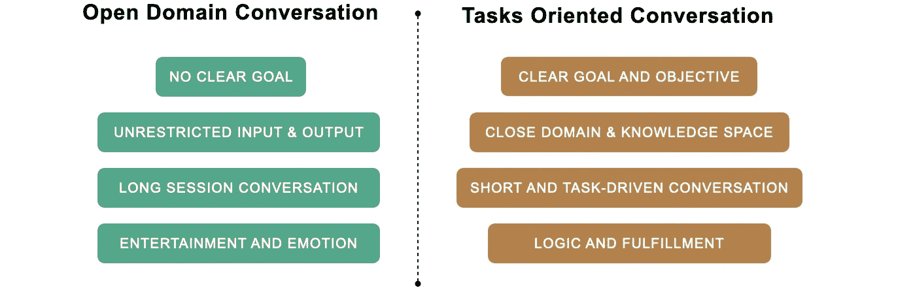

由凯瑟琳·王创作

对话代理可以分为两个主流。**开放领域对话**和**面向任务的对话**。

**开放域对话**的典型代理有 Siri、谷歌助手、脸书的 BlenderBot、谷歌的 Meena。用户可以在没有明确目标的情况下开始对话，话题不受限制。这些代理商将娱乐和情感反应融入他们的设计，并能够与最终用户进行长时间的对话。

大多数商用的虚拟代理都是面向任务的。它们包括你在银行网站上看到的聊天机器人，或者当你打电话给飞行中心热线时会和你打招呼的虚拟代理。这些代理是为特定的目标服务的。他们专注于封闭领域的对话，通常会通过响应来满足您的请求。面向任务的代理中的对话倾向于简短而有逻辑性。

现在我们对代理类型有了一个很好的定义，让我们来探索面向任务的对话领域中的挑战。(开放域对话超出了今天的主题，将在以后的帖子中讨论)

# 面向任务的对话

(请参考上一篇文章，了解下面架构图的详细解释)

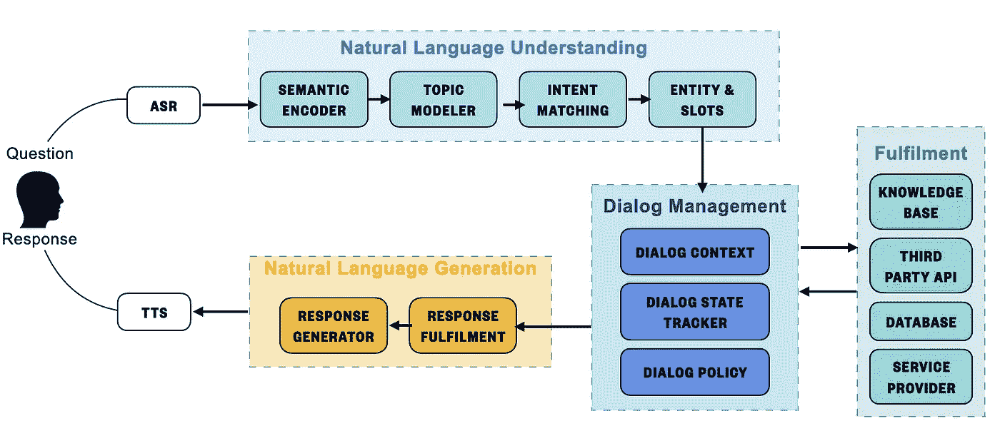

**对话式人工智能架构** —由凯瑟琳·王创建

## 1.融合，融合，再融合！

沿着聊天机器人建立一个摊位很容易。如果您参加了在线课程或跟进了教程笔记本，您大概可以在几个小时内设置一个语音代理。

但是在现实世界中，对话组件需要与现有的系统和基础设施无缝集成。虚拟代理的架构会因客户技术体系的数字成熟度而有很大差异。

如果你使用的是云平台上流行的对话服务(Dialogflow，Lex，Azure bot service 等。)，而你的虚拟代理暴露在公众面前，先想想**安全**。本质上，bot 或虚拟代理是对您的核心对话服务的一系列 API 调用，确保解决方案具有健壮的**认证和授权**机制，并且敏感信息被**加密**。如果 bot/虚拟代理解决方案需要与您现有的系统或数据库进行交互，请设置一个外部 TCL/SSL 代理来解释和规范化请求，而不是让 bot 直接向您的核心系统发送未序列化的消息。使用外部代理的另一个潜在好处是，您可以构建一个通用的 RESTful API，使您能够快速扩展。

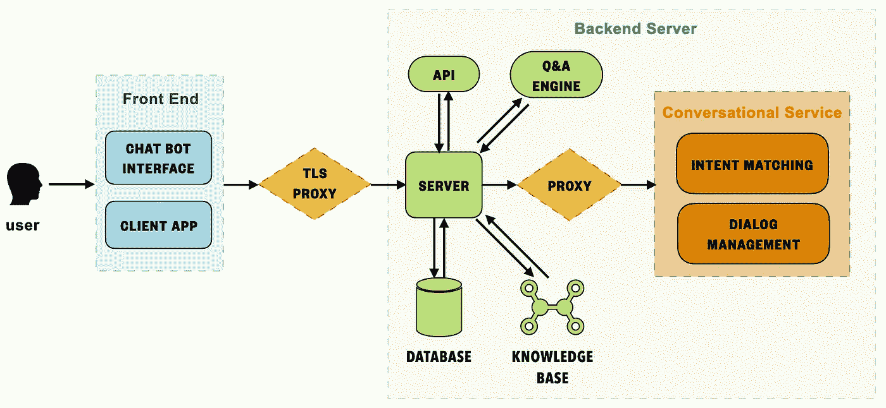

**对话组件集成** -由 Catherine Wang 创建

如果你在云上使用对话服务，并为内部用户构建一个虚拟代理，这些代理很可能需要大量的信息检索。内部用户或员工希望使用虚拟代理作为一个知识搜索引擎****让聊天机器人查找上一次的会议记录、税务发票、具体的公司政策或去年的提案。这种解决方案的关键是创建和维护一致的知识库和动态索引策略。知识库是智能体搜索空间的基础，它与答案的准确性相关。然而，文档和内容分散在组织中，缺乏管理和所有权。因此，构建这种类型的虚拟代理的第一步应该是设计全面的**数据接收、管理和治理管道**。如果你需要收集和查询的数据同时在线和离线，或者在多个云平台，就要小心了。****

****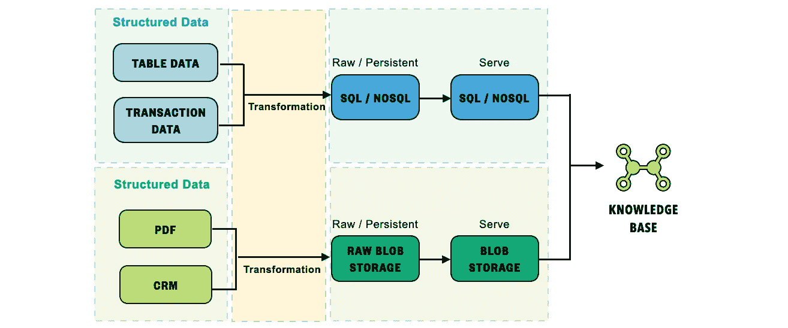****

******代理知识库的数据管道** —由 Catherine Wang 创建****

****上述解决方案的另一个关键部分是维护代理查询知识库的索引和知识本体。在最简单的版本中，虚拟代理由精选的 **Q & A** 集合支持，并将相似的问题与预定义的答案进行匹配。一个更高级的代理将具有**语义搜索**能力(可以通过弹性搜索实现)，它可以理解自然语言并在知识库上执行查询搜索。最终的解决方案涉及**机器理解**，让机器理解语料库和长问题，从而在相关文档中找到答案的跨度。一个成熟的虚拟代理解决方案通常会堆叠这些组件来增加健壮性。****

****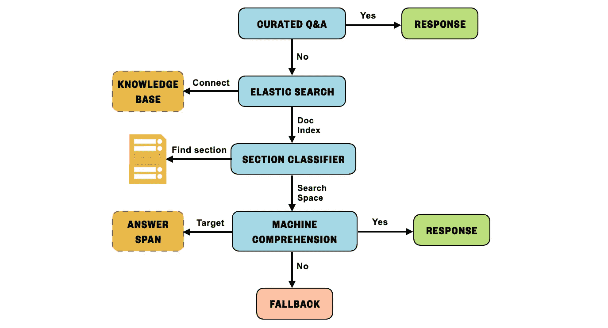****

******带信息检索的知识库** —由 Catherine Wang 创建****

## ****2.如何处理嵌套或复合意图匹配****

****在完美的场景中，用户会带着单一和直接的意图问一个问题。但是当人类交流时，我们更喜欢将几个意图组合成一个对话。****

> ****问题:你能帮我查一下天气吗？如果好的话，帮我订一张去 XXX 的票。****
> 
> ****意图:["查看天气"，"订票"]****

****在虚拟代理解决方案中，对话管理组件需要跟踪对话的状态，并从用户表达(或问题)中识别多个意图。一旦匹配了多个意图，下一步就是确定执行或实现的优先级。****

****潜在的解决方案可以是:****

*   ******主要主题和平行意图，优先级分数******

********

****具有优先分数的平行意图-凯瑟琳·王****

****如果在您的用户场景中，意图自然地聚集到一个主题中，您可以使用自顶向下的设置，如上图所示。主主题分类器将帮助您深入了解意向子集，然后通过考虑预定义的优先级分数来匹配个人意向。****

*   ******主要意图和跟进意图******

****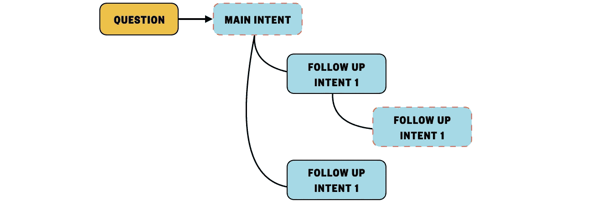****

****意向层次——凯瑟琳·王****

****假设您的用户场景有一个自然的逻辑流，可以转换成一系列意图。那么更好的配置是设置主要意图和后续意图，类似于逻辑决策树。然后，虚拟代理将引导用户通过预定义的逻辑。****

*   ******触发混淆和错误检测引擎，并使用恢复策略阐明意图。******

****该选项将在第 ***4 节中讨论。管理混乱和模糊*** 。****

## ****3.将对话映射到预定义任务的挑战。****

****机器和人类有不同的逻辑框架。人类的对话是直觉的和非线性的，但是机器程序是线性的、逻辑的和严格定义的。当设计你的对话代理时，考虑用户场景和用户通常会问什么问题。****

****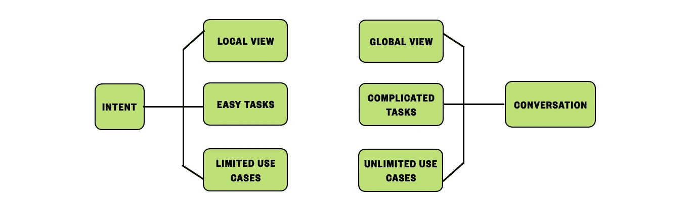****

****由凯瑟琳·王创作****

****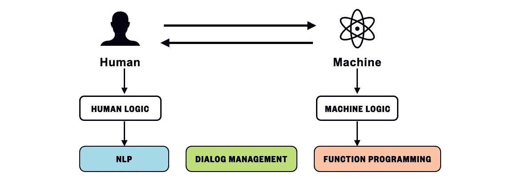****

****由凯瑟琳·王创作****

****一旦你理解了你的客户的行为，试着找到他们行为的关键驱动力和主题，然后为每种类型的主题(用户场景)开发一个任务流。请保持简单，易于遵循，并灵活扩展。(主分支和可选子节点)****

****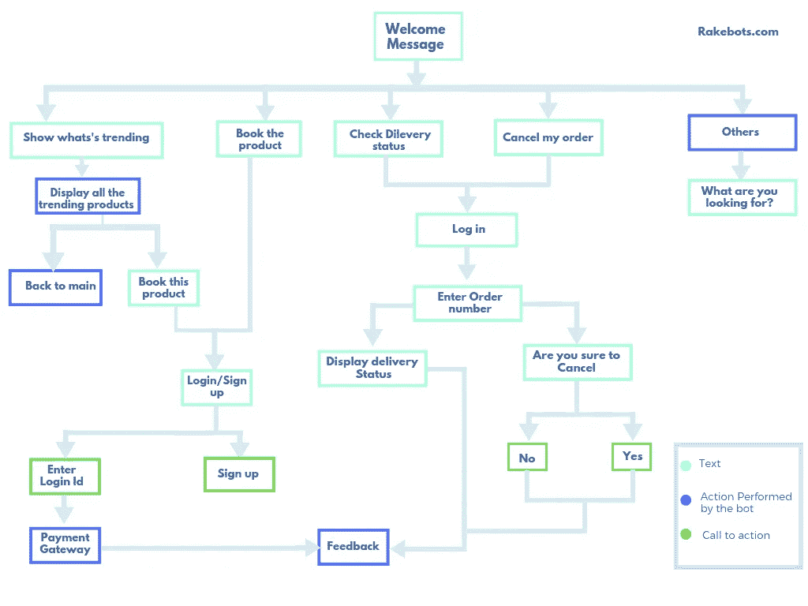****

****Rakebots 的任务流示例****

****您的对话代理需要基于任务流进行配置，并保持主任务流更新，在早期阶段解决冲突的逻辑点。****

****假设您正在处理一个大型客户项目，其中有多个并行的业务部门，并且可能有数百个意图聚集在一个主题范围内。在这种情况下，您可以采用多代理架构。主代理控制子代理，子代理有自己的知识空间和意图配置。****

****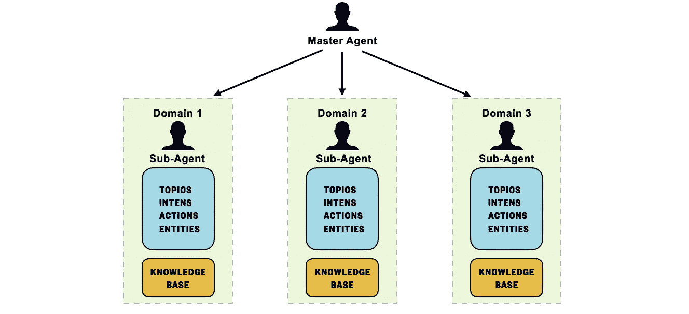****

****多代理架构(Multi-Agent Architecture)——由 Catherine Wang 创建****

*******【小心如果选择实现上述架构，不适合 PoC 或快速实验。始终从易于集成和部署的简单解决方案开始。当开发周期更加成熟和稳定时，获得一些速赢来建立势头，转向细粒度的架构设计。】*******

## ****4.应该如何覆盖长尾意图？****

****长尾意图指的是你的虚拟代理在服务期间会收到的低频率和高方差的问题。****

****这可能会导致“出乎意料”或“超出词汇表”的错误。****

****解决这个问题的标准方法是建立一个知识库，并使用信息检索技术来为看不见的问题生成答案(而不是创建额外的问答对或定义新的意图映射)。****

****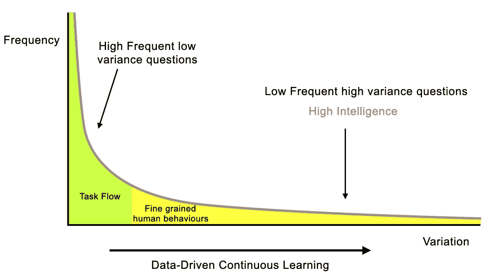****

****长尾理论——由凯瑟琳·王创作****

****无论你如何设计你的代理人的对话和潜在的任务流，长尾意图总是会发生。人类喜欢即兴创作和抽象，因此为看不见的和未知的事物做准备。****

## ****5.如何管理谈话中的困惑和歧义？****

****人类有一个强大的通信协议，能够迅速澄清模糊和混乱。****

****但是对于机器来说，为了消除歧义，我们需要设计一种机制来触发恢复和回退策略(AI 工程师定义的规则)。用户的表达(问题)可以分为三组，1)清晰直接的意图(易于理解和处理)，2)未知的意图(超出范围的问题)，以及 3)不确定的意图(具有潜在的匹配，但需要额外的澄清)****

****对话管理引擎应该能够确定当前用户表达式应该属于哪个组。总的想法是，我们假设常见的用户问题通常遵循正态分布。并且 DM(对话管理)正在使用分类阈值来对所接收的问题进行分类。****

****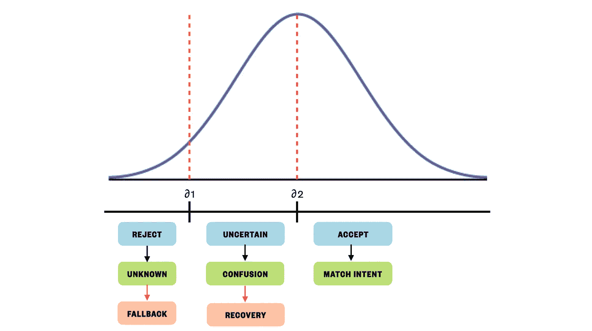****

******意向分类分布**—Catherine Wang 创建****

> ****< ∂1, [Reject], trigger [Fallback] response****
> 
> ****∂1<predict_proba trigger="" response=""></predict_proba>****
> 
> ****predict_proba(expression)>预测 _proba(表达式)【∂2】，【接受】，触发【匹配意向】响应****

## ****6.如何设计 A/B 测试来提高你的虚拟代理？****

****依我拙见，A/B 测试是提高虚拟代理可用性和采用率的银弹。****

****在进行 A/B 测试之前，代理只在测试人员和开发人员可能在开发周期中有无意识偏见的避难所环境中使用。不要在特性路线图上做任意的决定，构建优先级应该由 A/B 测试结果来指导。****

****以下是代理 A/B 测试的一些设计原则:****

*   ****在一段时间内运行测试，并为开/关测试功能设计一个时间间隔。****
*   ****收集大量样本进行假设检验。****
*   ****根据不同的人口统计数据建立测试组。****
*   ****测试中分离 UI 变化和虚拟代理功能变化。****

****要跟踪的关键指标有:****

*   ******激活率**:随机用户在你的客户端应用上打开聊天机器人的比率。****
*   ******混淆触发:** 对话代理将用户表达分类为“不确定”并触发恢复策略的百分比是多少。****
*   ******回退率:**会话会话中触发回退响应的比率。****
*   ******目标完成率:**对话成功完成任务的百分比。****
*   ******保持**:用户在与虚拟代理的对话会话中保持多长时间。****
*   ******自助率:**代理独立完成用户请求的频率(无触发回退，需要人工干预)。****
*   ******用户满意度:**对使用虚拟代理服务的体验满意度进行评级的用户反馈。****

## ****7.通过持续学习提高你的对话代理****

****大多数工程团队不需要使用这种方法来改进他们的代理。对话式云平台(Dialogflow 或 Lex)将为您完成繁重的工作。****

****然而，如果你想从头开始构建你的对话系统，下面是一个构建持续学习管道的方法来改进你的对话系统。****

****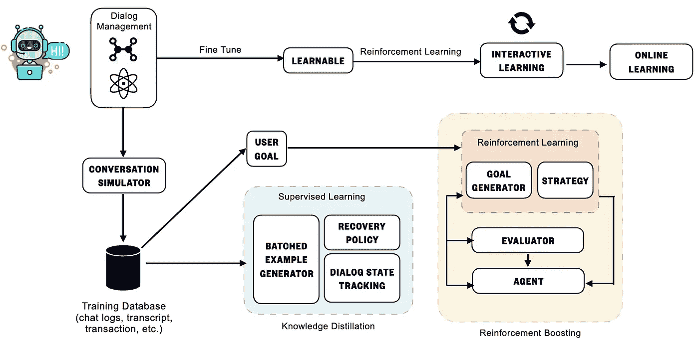****

******持续学习** —凯瑟琳·王创造****

****为了训练你的对话模型，你需要准备一个相关的数据集。如果你已经向最终用户展示了你的代理，建立一个反馈回路来收集聊天记录，抄本，交易，博客等。然后将这些数据转换并标准化到训练数据库中。****

****如果您没有用户交互数据，请使用用户模拟器(例如..)与您的代理聊天，并从模拟对话中收集标记的数据(例如，分类或错误分类)。这些数据可用于训练恢复策略和对话状态跟踪模型。下一步是对用户目标(用户希望在聊天会话中完成的任务)进行采样，并在接下来的强化学习阶段将其用作奖励评估者。****

****最后，将您的代理暴露在网上，并启用在线学习机制。确保当越来越多的人使用它时，您的代理会变得越来越聪明。****

****(这是一个高级的话题，我不会在这篇帖子里讲得太深。如果你有兴趣探索更多，请联系我。)****

****这篇文章中所讨论的只是你在现实生活中所面临的一小部分问题。而且已经提到的每一个点都可以展开成一个研究帖。****

****我们在探索什么是可能的，在学习的同时建设未来。试着带着你的客户一起踏上旅程，真诚而透明地交流。****

********

****来自[像素](http://pexels)的像素****

****请记住，我们正在构建一个对话式的人工智能解决方案，所以为什么我们不能在考虑如何让我们的虚拟代理与最终用户更顺畅地交互之前，首先与我们的客户进行更好的沟通呢？****

****感谢阅读，下次见。****

*****关于我，我是一只*👧🏻*现居澳洲墨尔本。我学的是计算机科学和应用统计学。我对通用技术充满热情。在一家全球咨询公司担任 AI 工程师领导*👩🏻‍🔬，帮助组织集成人工智能解决方案并利用其创新力量。在 [**LinkedIn**](https://www.linkedin.com/in/catherine-wang-67547a53/) **上查看更多关于我的内容。******