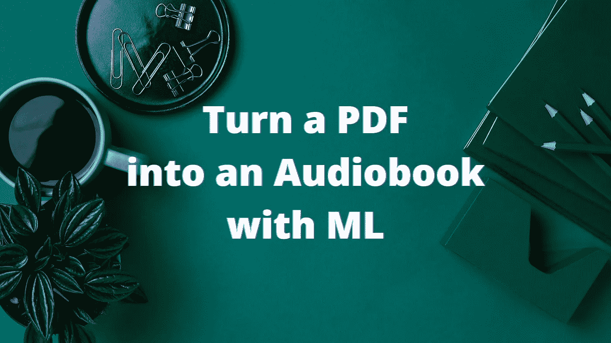
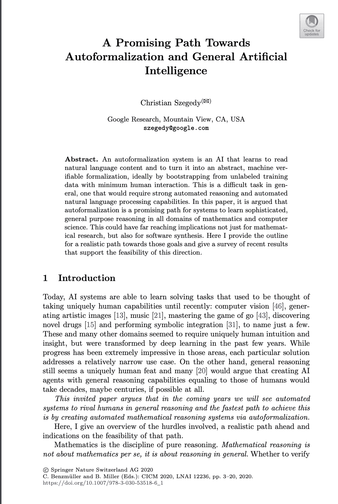
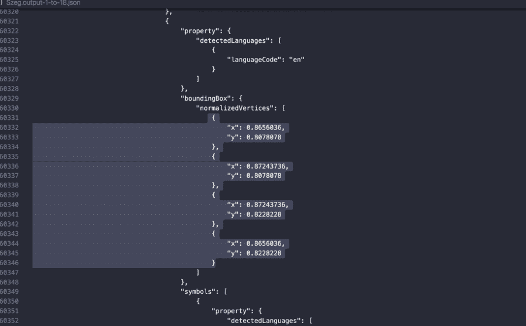
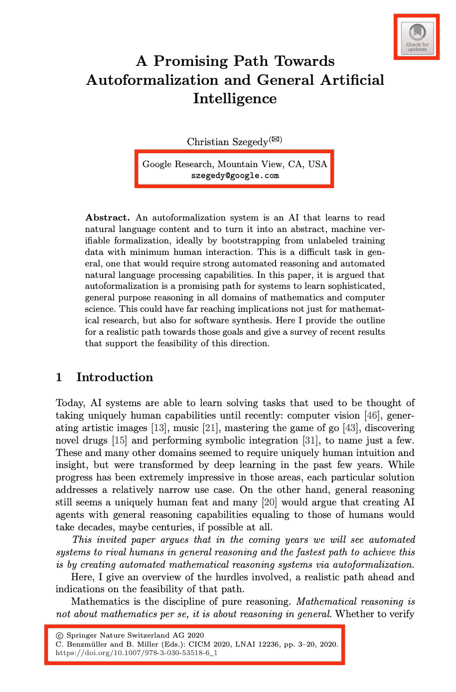
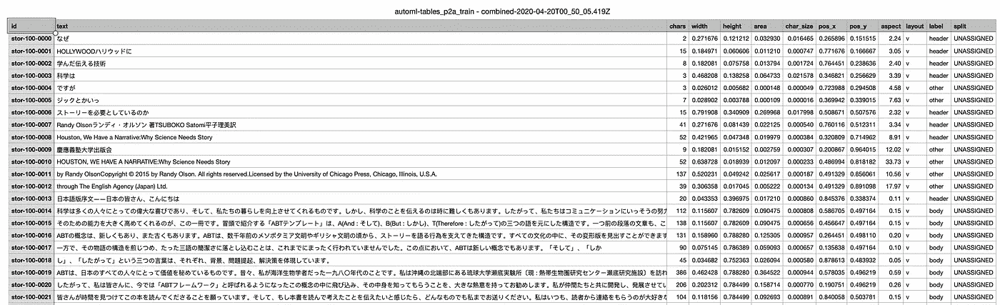
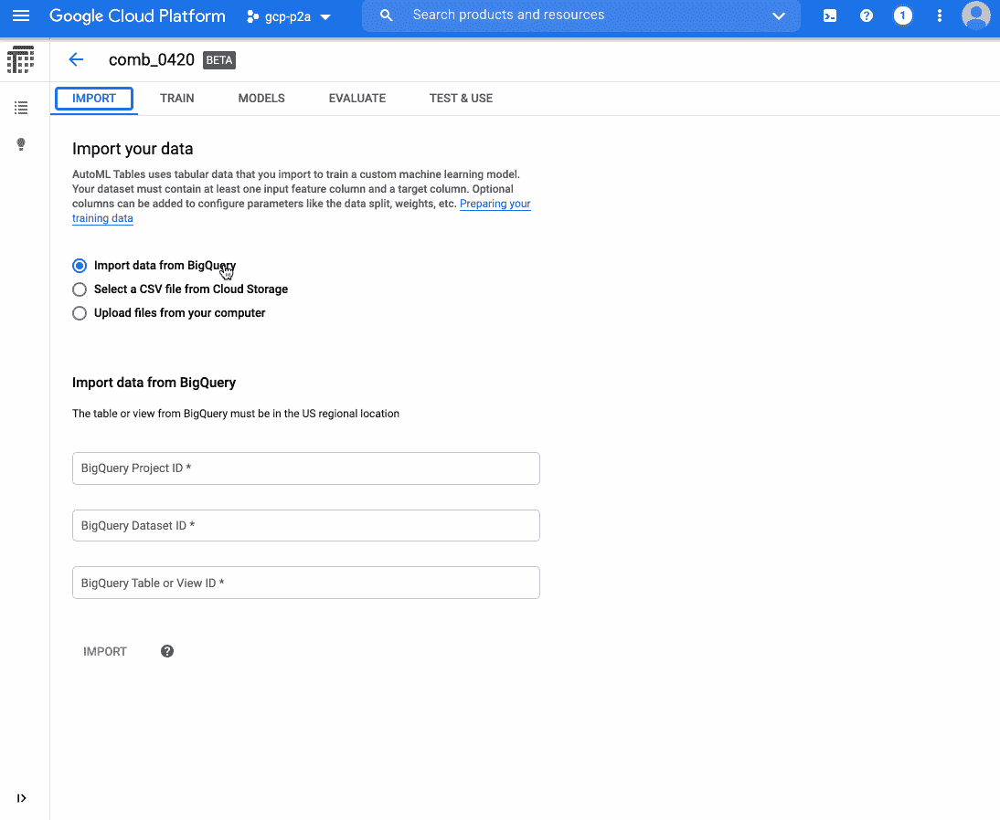
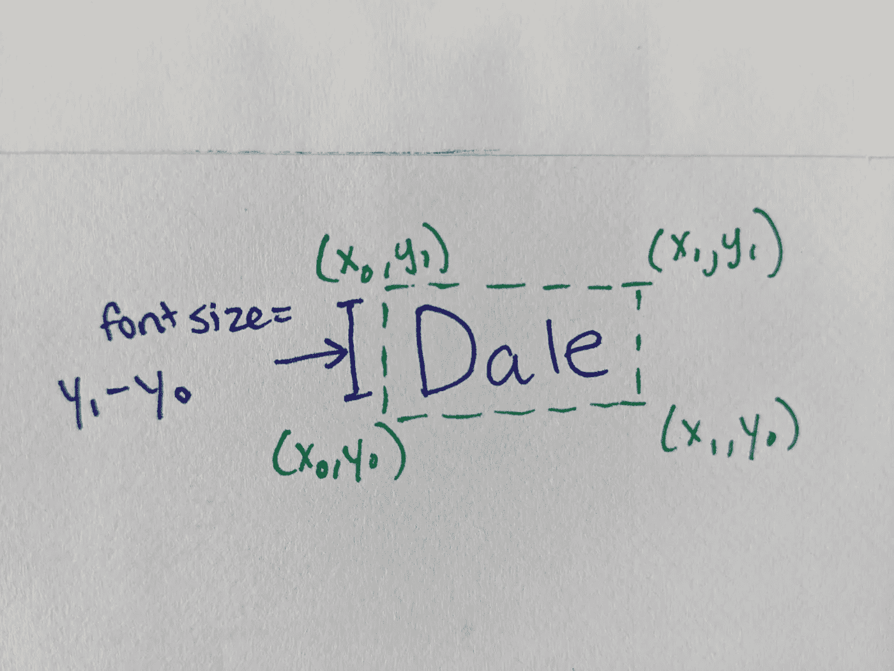
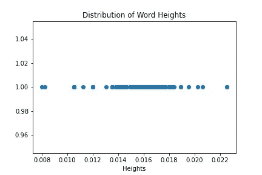

# 使用机器学习将 pdf 转换为有声读物

> 原文：<https://towardsdatascience.com/convert-pdfs-to-audiobooks-with-machine-learning-6f2f6461a29c?source=collection_archive---------15----------------------->



## 使用 ML 将 pdf 和图像转换成有声读物或播客

*这个项目最初是由* [*和佐藤*](https://medium.com/u/4b21e207ea2c?source=post_page-----6f2f6461a29c--------------------------------) *设计的。*

我把这个帖子拍成了视频。看看吧！

散步——这是新冠肺炎最大的(也是唯一的)乐趣之一，不是吗？如今，你可以步行做任何事情:听新闻、参加会议，甚至写笔记(通过语音听写)。走路的时候唯一不能做的事情就是看机器学习研究论文。

还是不能？

在这篇文章中，我将向您展示如何使用机器学习，通过计算机视觉和文本到语音转换，将 PDF 或图像格式的文档转换为有声读物。这样，您可以在旅途中阅读研究论文。

但是你应该吗？这由你来决定。

想直接跳到代码？在 [GitHub](https://github.com/kazunori279/pdf2audiobook) 上查看。

但首先:这要归功于 [Kaz Sato](https://github.com/kazunori279) ，一位在日本的谷歌工程师，他最初创建了这个[项目](https://github.com/kazunori279/pdf2audiobook)(他正在根据计算机科学教科书创建日语有声读物)。我把借来的建筑稍加改动。

我们将通过三个主要步骤来构建 PDF 到有声读物的转换器:

1.  从 pdf(或图像)中提取文本
2.  决定将文本的哪些部分包含在有声读物中
3.  将文本转换成口语

在这篇文章中，我将向您展示如何将[这篇密集的研究论文](http://link-springer-com-443.webvpn.fjmu.edu.cn/content/pdf/10.1007%2F978-3-030-53518-6_1.pdf)(“通向自动规范化和通用人工智能的一条有前途的道路”)转换成有声读物。它看起来是这样的:



# 从 pdf 到文本

首先，我们将使用 OCR 从文档中提取文本。您可以使用许多不同类型的工具来完成这项工作，例如:

*   [Calamari](https://github.com/Calamari-OCR/calamari) ，在开源 Python 库上
*   谷歌云[视觉人工智能 API](https://cloud.google.com/vision/docs)
*   (新！)Google Cloud [文档 AI API](https://cloud.google.com/solutions/document-ai) 。这个 API 不仅提取文本，还智能地解析表格和表单

对于这个项目，我使用了 Vision API(比新文档 AI API 便宜)，发现质量相当不错。查看 Kaz 的 GitHub repo ,看看你到底是如何调用 API 的。

当您通过 Vision API 传递文档时，会返回原始文本和布局信息。下面是回应的样子:



如您所见，API 不仅返回页面上的原始文本，还返回每个字符的(x，y)位置。

在这一点上，如果你是个傻瓜，你可以把所有的原始文本直接转储到有声读物中。但是你不是一个傻瓜，你可能不希望这样做，因为那样你会听到各种各样无趣的东西，比如图像标题、页码、文档页脚等等。

所以下一步，我们将决定哪些原始文本应该包含在有声读物中。

# 在 pdf 中查找相关文本

我们希望在有声读物中包含研究论文的哪一部分？可能是论文的标题、作者的名字、章节标题、正文，但这些都没有用红色突出显示:



事实证明，识别这些相关部分是一个棘手的问题，有许多可能的解决方案。在这篇文章中，我将向您展示两种方法，一种是快速但不干净的方法，另一种是高质量但需要更多工作的方法。

# 使用机器学习查找相关文本

当你看一篇研究论文时，你可能很容易通过注意布局来掩饰不相关的部分:标题大而粗；字幕很小；正文为中等大小，位于页面中央。

利用页面上文本布局的空间信息，我们也可以训练一个机器学习模型来做到这一点。我们向模型展示了一堆正文、标题文本等等的例子，希望它能学会识别它们。

这是这个项目的原作者 Kaz 在试图将教科书变成有声读物时采取的方法。

在这篇文章的前面，我提到 Google Cloud Vision API 不仅返回页面上的文本，还返回它的布局。它将文本分组为块(页面、块、段落、单词和字符),并返回它在页面上的位置。具体来说，对于每个单词，它都返回一个类似如下的边界框:

```
"boundingBox": {

   "normalizedVertices": [
		{"x": 0.9248292,"y": 0.06006006},
 		{"x": 0.9384966,"y": 0.06006006},
        {"x": 0.9384966,"y": 0.067567565},
        {"x": 0.9248292,"y": 0.067567565}
    ]

}
```

*上面的边框描述了一个单词在页面上的位置，以及它有多大*。

我们可以用这些数据来训练一个模型。下面我们来看看 Kaz 收集的数据:



显然，Kaz 正在转换的书是日文的。对于每一个文本块，他都创建了一套特征来描述它:文本块中有多少个字符？它有多大，在页面上的什么位置？包围文本的框的长宽比是多少(例如，一个窄框可能只是一个侧栏)？

请注意，在上面的电子表格中还有一个名为“label”的列。这是因为，为了训练机器学习模型，我们需要一个带标签的训练数据集，模型可以从中“学习”对于训练数据中的每个文本块，Kaz 必须手动将该文本块标记为“正文”、“标题”、“标题”或“其他”。标注训练数据总是 ML 项目中比较耗时的部分之一，这次也不例外！

这就是为什么，当我重新创建 Kaz 的项目时，我使用了一个黑客来避免它(下面会有更多)。

在 Kaz 收集并标记了一堆文档后，他使用 [Google Cloud AutoML Tables](https://cloud.google.com/automl-tables) 训练了一个机器学习模型。这是一个基于表格数据构建模型的无代码工具。这里有一个小的 gif 展示了这个工具的样子，以及 Kaz 如何用它来训练一个模型:



如您所见，该模型相当准确(约 95%的精确度和召回率)！所以 Kaz 使用这个模型作为一个中间步骤来确定将哪些文本放入有声读物。

# 用 Spit、Glue 和字体大小查找相关文本

看，我不是娘娘腔——我一生中花了很多时间来标记训练数据(尽管，这些天来，你[真的不必](https://cloud.google.com/ai-platform/data-labeling/docs))。但是对于这个项目，我想知道我是否可以使用一个简单的启发式方法(一个可以让我避免标记数据的方法)来代替。

我觉得光看字体大小就能学到很多东西。比如:论文的标题很可能是用最大的文字尺寸写的。同时，正文是文档中最常见的文本。根据这些观察，我使用了这个启发法:

1.  计算所有单词的字体大小
2.  计算最常见的字体大小。用字体大小“body”来标记文本的每一位
3.  计算最大字体大小。将该字体大小每一位文本标记为“标题”

第一步，计算字体大小，我减去单词周围的 y 坐标:



接下来，为了看看我的想法是否可行，我绘制了文档中字体大小的分布:



你可以看到在右边，有一个点(最大的文本)代表文档标题(woohoo！).同时，中间那一大段点，就是正文。标题和其他文档元数据，甚至更小的文本，都在图的左侧。

这个图表给了我信心，我的小技巧会起作用，至少对这个文档是这样(注意，它并不适用于*所有的*研究论文，尤其是那些有花哨的侧栏或垂直布局的论文！).

然而，这里有一个棘手的问题，正文字体大小在一个*范围内*(不是一个固定值)。这是因为我不是像我们通常认为的那样计算字体大小(即 12 磅)，而是作为减去的像素值，并且有一些噪声。找出界限(例如，什么是正文的界限？)，我用的是 [Jenks Natural Breaks 算法](https://en.wikipedia.org/wiki/Jenks_natural_breaks_optimization)(如果你没听说过这个，没关系——我在这个项目之前也没听说过！).

我知道我说的有点快，所以请在这里或 Twitter 上给我留言，我一定会回答你的问题！

# 从文本到口语

这个项目最有趣的部分无疑是选择一个电脑声音来做我们的解说员。为此，我使用了谷歌文本到语音转换 API，它使用了一种叫做 [WaveNet](https://deepmind.com/blog/article/wavenet-generative-model-raw-audio) 的技术来产生非常逼真的声音。API 支持许多声音和语言，你可以直接从[产品页面](https://cloud.google.com/text-to-speech)的输入文本中自己比较它们。

我选择男声读论文题目，女声读论文正文。以下是由此产生的“有声读物”听起来的样子:

[https://soundcloud . com/dale-markowitz/a-promising-path-against-auto formalization-and-general-artificial-intelligence](https://soundcloud.com/dale-markowitz/a-promising-path-towards-autoformalization-and-general-artificial-intelligence)

不算太坏，对吧？

反正目前就这些了。

如果你做出了这样的好东西，请与我分享，我会在社交媒体上展示它！

同时，我们在 [Instagram](https://daleonai.com/instagram.com/dale_on_ai) 或 [Twitter](https://daleonai.com/twitter.com/dalequark) 上连线吧！

*原载于 2020 年 9 月 1 日 https://daleonai.com*[](https://daleonai.com/pdf-to-audiobook)**。**