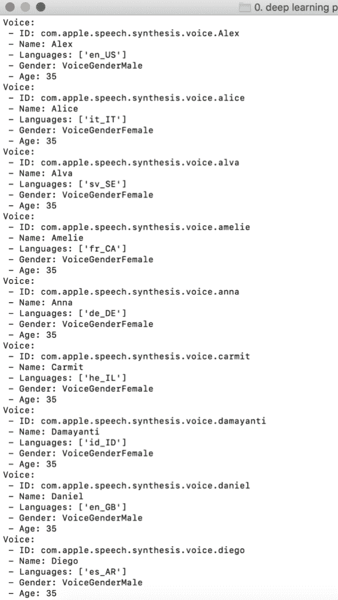

# 用 5 行代码将文本转换成语音

> 原文：<https://towardsdatascience.com/convert-text-to-speech-in-5-lines-of-code-1c67b12f4729?source=collection_archive---------31----------------------->

## 了解文本到语音转换可以发挥作用的领域


照片由 [Pexels](https://www.pexels.com/photo/crop-unrecognizable-woman-listening-to-music-on-smartphone-in-car-4436365/?utm_content=attributionCopyText&utm_medium=referral&utm_source=pexels) 的[赖爷 Subiyanto](https://www.pexels.com/@ketut-subiyanto?utm_content=attributionCopyText&utm_medium=referral&utm_source=pexels) 拍摄

在这篇文章中，我将向你展示如何使用 Python 将文本转换成语音。这将是一个简单的机器学习项目，我们将了解一些基础的语音库称为 pyttsx3。如果你想知道在现实生活中我们可以在哪里使用文本到语音的转换，不要担心，你并不孤单。我在学习几乎任何东西之前都会问同样的问题，我会问自己这些信息会对我有什么帮助，在现实生活中哪里可以用到。这种思维方式帮助我更快地学习新事物，并激励我在个人生活中使用这些信息。

我将列举几个以非常好的方式使用文本到语音转换的行业。其中之一是在教室环境中，学生们还不知道如何阅读，但当你对他们说话时，他们可以理解。如今，技术在课堂上经常使用，一些文本到语音转换软件可以给老师们很大的帮助。一个简单的文本到语音转换会很有帮助，而不是老师花时间和每个孩子在一起，为他们朗读。这是一个很好的视频，展示了如何在课堂上使用文本到语音转换:

另一个文本到语音转换的好例子是在 Chromebooks 上。他们有一个辅助功能，称为“选择说话”，你可以选择/突出显示文本，计算机将大声朗读给使用该功能的人。

最后一个文本到语音转换的例子，我想和你分享的是有声读物。使用以前音频文件中的一些训练数据，可以让机器使用受过训练的人的声音阅读一本书。是的，人工智能越来越成为我们日常生活的一部分。此外，教一台机器比教一个人容易得多。这使得该领域的发展要快得多。让我们回到项目上来。

我们将建立一个机器程序，将我们的文本转换成语音。文本可以是不同的语言，这就是为什么在选择我们的语音模型时，我们必须确保语言匹配。让我们从导入库开始。

# 步骤 1 —图书馆

首先，我们将安装模块，这样我们就可以在我们的程序中使用它。我们将在这个项目中使用的唯一模块是 Pyttsx3。这是文本到语音模块，这个模块的一个好处是，它可以在你安装后离线工作。下面是安装该模块的代码:

```
pip install pyttsx3
```

如果你想进一步了解这个模块，这里有[文档](https://pypi.org/project/pyttsx3/)。现在让我们将模块作为库导入到我们的程序中。

```
import pyttsx3
```

# 第 2 步—文本

这一步是最容易的。您应该定义一个变量，并为其分配一个文本值。你的文字可长可短，这取决于你想要什么。下面，你可以看到我创建的文本变量，它被称为测试。

```
test = "Once upon a time, a person was trying to convert text to speech using python"
```

# 步骤 3 —语音引擎

在下面几行中，我们定义一个变量来分配我们的语音引擎。这很简单。

```
engine = pyttsx3.init()
```

现在，我们必须定义我们希望机器说的语言。如前所述，它必须与我们在文本中使用的语言相匹配。若要查看可用的语言，请运行以下代码:

```
voices = engine.getProperty('voices')for voice in voices: 
 print("Voice:") 
 print(" - ID: %s" % voice.id) 
 print(" - Name: %s" % voice.name) 
 print(" - Languages: %s" % voice.languages) 
 print(" - Gender: %s" % voice.gender) 
 print(" - Age: %s" % voice.age)
```

您将在终端中看到类似这样的内容:



声音

复制您想要使用的语言的“id ”,并将其粘贴到我们的程序中。我们使用 setProperty 方法来定义口语。

```
en_voice_id = "com.apple.speech.synthesis.voice.Alex"engine.setProperty('voice', en_voice_id)
```

# 最后一步

我们差不多完成了，下面的代码将告诉我们的语音引擎大声说出我们之前定义的文本。基本上电脑会给你读出来。确保您的扬声器已打开，可以听到声音。

```
engine.say(test)engine.runAndWait()
```

恭喜你，你已经创建了一个将文本转换成语音的程序。现在，您已经了解了这些软件是如何在幕后工作的。希望你喜欢这篇教程，并在今天学到一些新东西。伟大的提示:当你觉得太懒的时候，你可以用这个和你的朋友交流🙂

*跟随我的* [博客](https://medium.com/@lifexplorer) *和* [走向数据科学](https://towardsdatascience.com/) *留下灵感。*

## 另一个你可能会感兴趣的机器学习项目

[](/convert-your-speech-to-text-using-python-1cf3eccfa922) [## 使用 Python 将您的语音转换为文本

### 使用麦克风将您的语音实时转换为文本

towardsdatascience.com](/convert-your-speech-to-text-using-python-1cf3eccfa922)