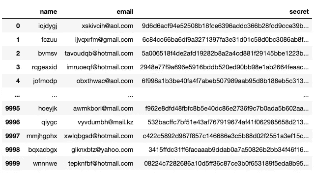
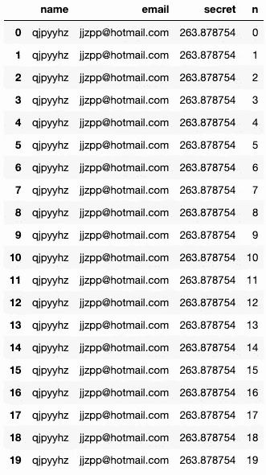
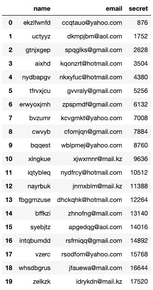

# 转换到新的火花 3.0 UDF 风格

> 原文：<https://towardsdatascience.com/convert-to-new-spark-3-0-udf-style-8d2e4cee3c0f?source=collection_archive---------40----------------------->

## 提示和技巧

伊恩·巴塔格利亚在 [Unsplash](https://unsplash.com?utm_source=medium&utm_medium=referral) 上拍摄的照片

Apache Spark 2.3 版本在 2017 年引入了熊猫 UDF。自从 Apache Arrow 取代 Py4J 来加速 JVM 和 Python 之间的数据传输以来，这个新特性显著提高了 Python UDFs 的性能。通过 Spark 与 Pandas 的接口，用户可以通过将 Python 库(例如`sklearn`、`scipy`)中编写的方法封装在 Pandas UDFs 中来轻松扩展它们。

除了原有的 Python UDF ( `pyspark.sql.functions.udf`在 1.3 版本引入)，Spark 2.3+还有 3 种熊猫 UDF，包括`PandasUDFType.SCALAR`、`PandasUDFType.GROUPED_MAP`(均在 2.3.0 版本引入)，以及`PandasUDFType.GROUPED_AGG`(2.4 版本引入，也可作为窗口函数)。2020 年 6 月，Spark 3.0 的发布为熊猫 UDF 引入了一套新的接口。在本文中，我将简要地探讨两个如何将旧样式(Pandas)UDF 转换成新样式的例子。

# 数据准备

我模拟了一个包含以下 4 列的数据框架

*   `name`:5 到 10 个字符之间的随机字符串名称
*   `email`:随机假冒邮箱地址
*   `secret`:长度为 4096 的十六进制字符串
*   `n`:重复次数。我将重复一个更小的数据帧 1000 次

首先，为模拟定义一些函数

在熊猫身上模拟 10000 个样本

这将得到如下所示的数据帧

示例模拟数据

然后，重复这个数据帧 1000 次

对于 Spark 来说，这是一个很好的数据量

和最终模式

# 从 UDF 到熊猫 UDF 迭代器

最初的`spark.sql.functions.udf`将一个定制函数应用于列中的每一项，将另一列的值作为输入。在这个例子中，我们使用`withColumn`来存储`udf`应用程序的结果。

结果如下所示

应用 udf 的输出示例

在 Spark 3.0 中，我们可以使用迭代器熊猫 UDF 来代替

迭代器使用 Python 类型作为提示，让函数知道它正在迭代一对作为输入的`pandas.series`，并返回另一个`pandas.series`。上面的`pandas_udf`装饰器指定了系列元素将被返回的数据类型。请注意，输入序列的长度需要与输出序列的长度相同。嵌套函数`apply_custom_mapper`将两列作为熊猫系列，用户需要迭代该系列的每个元素来应用函数(例如`custom_mapper`)。然后接下来，用户需要构造迭代器来`yield`函数应用的结果。这看起来像一个双 for 循环，但它实际上是分离输入和输出的迭代，即首先迭代输入以应用初等函数`custom_mapper`来获得结果的迭代器，然后将结果逐步映射回输出序列。

# 具有分组和应用功能的熊猫 UDF

`groupby.apply(pandas_udf)`模式通常用于通过迭代数据帧的每个子组来应用自定义函数。自定义`pandas_udf`将每个组的数据作为 Pandas Dataframe(我们称之为`pdf_in`)作为输入，并返回另一个 Pandas Dataframe 作为输出(我们称之为`pdf_out`)。`pdf_out`的模式不需要与`pdf_in`的模式相同。在下面的例子中，我们将用组中列`n`的累积和(转换为字符串)替换`secret`列。然后我们将删除列`n`。我们需要在`panads_udf`装饰器中指定从`df.drop("n").schema`获得的输出模式。

对于在模式中添加新列，我们可以这样做

上述代码的输出如下所示

应用熊猫 UDF 的输出，后降一列

UDF 返回的行数不必与输入的行数相同。在下面的例子中，我们修改了上面的脚本，这样我们只返回每隔一行。

新界面改用`groupby.applyInPandas(python_func, schema)`。

第一个示例随后更改为

第二个示例更改为

注意，`apply`采用了一个`pandas_udf`函数，其中模式是在装饰器中指定的。另一方面，`applyInPandas`采用 Python 函数，其中模式在`applyInPandas`参数中指定。

# 熊猫 UDF 的记忆使用

最后要注意的是这些函数的内存使用情况。Spark 的熊猫 UDF 文档表明整组数据将被加载到内存中。在我们的`groupby`示例中，我们将`pdf`作为一个 10000 行的数据帧，因此我们期望每个执行器内核有大约 43 MB 的数据。如果每个执行器有 5 个内核。那么在内存中就变成了 215 MB 的数据。此外，我们的 UDF 的内存堆栈也增加了内存使用。假设我们将长度为 4096 的十六进制字符串转换为长度为 16384 的二进制`numpy` 布尔数组，每个数组将消耗大约 16kB 的内存，其中 10000 个数组将额外消耗 165 MB。5 个内核总共会额外增加 825 MB，也就是总共超过 1GB 的内存。因此，在涉及熊猫 UDF 的情况下调优 Spark 时，除了作为熊猫数据帧的公开数据组的大小之外，还需要注意 UDF 使用的内存量。