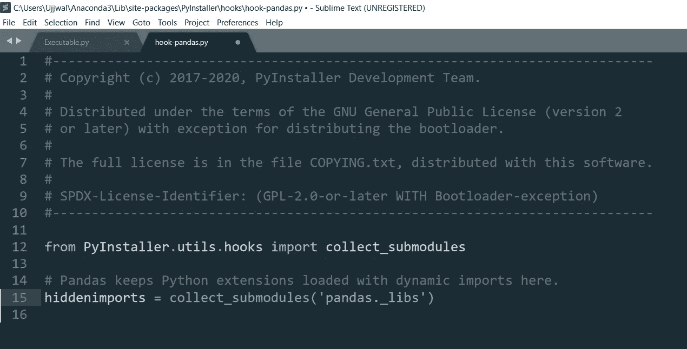
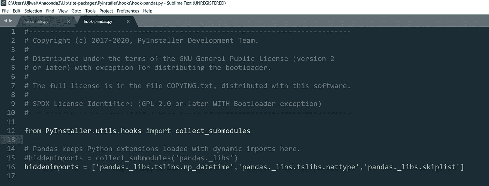

# 将 Python 代码转换成 Windows 应用程序(。exe 文件)

> 原文：<https://towardsdatascience.com/convert-your-python-code-into-a-windows-application-exe-file-28aa5daf2564?source=collection_archive---------0----------------------->

## 无限制共享的快速技巧


塔达斯·萨尔在 [Unsplash](https://unsplash.com?utm_source=medium&utm_medium=referral) 上拍摄的照片

您编写了一个令人惊叹的 Python 应用程序，并提交给了您的老板。他对此印象深刻，并希望在自己的系统中使用它。他既没有在自己的系统上安装 Python，也没有使用过它。你被卡住了！！！

如果以上听起来很熟悉，那么本教程将解决你的问题。在这里，我们将学习将 Python 代码转换成 *Windows* 可执行文件的过程。从现在开始，每当您想要与更广泛的社区共享您的优秀成果时，您不必担心在他们的系统上设置 Python 环境。只需创建一个可执行文件并发送给他们。他们将能够使用该应用程序，就像您在您的系统上一样。

# 你需要什么？

## **1。要转换的脚本**

对于本教程，我们已经编写了一个小的 Python 代码来读取。csv '文件从*窗口的*文件夹中取出。这个文件有两列，每列包含一组随机数。该代码创建一个新列，其中包含两个输入列的数字之和。修改后的文件保存在与旧文件相同的文件夹位置。

```
**#### Importing the required library**
import pandas as pd**#### Reading csv file**
df = pd.read_csv("C:\\Ujjwal\\New_File_V1.csv")**#### Adding 2 columns**
df["Third_Column"] = df["Randome Numbers 1"] + df["Random Numbers 2"]**#### Exporting the data to same location**
df.to_csv("C:\\Ujjwal\\New_File_V2.csv",index = False)
```

输入 CSV 文件的示例列如下:


输入 CSV 文件(图片由作者提供)

代码执行后的输出文件如下所示:


输出 CSV 文件(图片由作者提供)

## **2。Pyinstaller 包**

为了将 Python 代码转换成可执行文件，我们将使用 *Pyinstaller* 包。使用标准的“pip install”命令来安装此软件包。

```
**#### Install Command**
pip install pyinstaller
```

# 实际任务

让我们一步一步地将 Python 文件转换成一个 *Windows* 可执行文件:

*   **打开命令提示符—** 使用命令行将 Python 脚本转换为 *Windows* 可执行文件。为此，我们必须转到命令提示符。在你的*窗口*搜索框中键入“cmd”并打开命令提示符
*   **更改文件夹位置** —使用以下命令，将命令提示符指向 Python 代码的位置:

```
**#### Change Folder Location**
cd folder_location
```

*   **转换** —使用以下命令将 Python 文件转换成一个 *Windows* 可执行文件:

```
**#### Command for conversion**
pyinstaller --onefile filename
```

上述代码将创建一个与 python 代码功能相同的可执行文件。该可执行文件将在一个新文件夹 **dist，**中提供，该文件夹与您的 Python 脚本位于同一位置。

*   **执行—** 要执行文件，只需双击可执行文件，它将产生与您的 Python 脚本相同的结果。

# **常见问题解答**

使用 *pyinstaller* 时，人们会面临一些常见的问题/挑战。本节将回答其中的大部分问题:

## **附加文件**

除了包含可执行文件的 **dist 文件夹**之外，其他文件和文件夹正在被创建。你不需要它们。您可以在没有这些附加文件的情况下共享您的可执行文件。即使您将删除额外的文件和文件夹，您的可执行文件也不会失去其功能。

## **完成时间**

可执行文件的创建和可执行文件的执行都是耗时的任务。对于像我们这样的短脚本，创建可执行文件需要将近 5 分钟，执行需要将近 30 秒。

## **可执行文件的大小**

因为我们在 Python 脚本中导入包，为了使可执行文件自给自足，完整的包被合并到可执行文件中。这增加了可执行文件的大小。对于我们的例子，它超过了 300 MB

## **可执行文件失败，错误为**

在执行可执行文件时，最容易遇到的错误是“**ModuleNotFoundError:****没有名为*的模块，模块名*** ”。此错误和实际错误提示的示例屏幕截图如下:

```
**#### Error Prompt Message**
ModuleNotFoundError: No module named 'pandas._libs.tslibs.nattypes' 
```

如果您遇到这样的错误(模块名称可能不同)，请采取以下步骤:

*   转到安装 *pyinstaller* 包的 *Windows* 位置。因为我使用的是 Anaconda 发行版，所以下面是我系统上的位置:

```
**#### Package Location**
C:\Users\Ujjwal\Anaconda3\Lib\site-packages
```

*   在 *pyinstaller* 包文件夹中，搜索名为 **hooks** 的文件夹。这个文件夹里有大多数常用 Python 包的**钩子文件。搜索引发错误的 Python 包的钩子文件。在我们的例子中，是熊猫。示例钩子文件及其内容如下:**



原始钩子文件(图片由作者提供)

*   错误背后的原因是初始化' **hiddenimports'** '的命令出现故障。**注释此语句并添加一个新的**，其中' **hiddenimports** '用引发错误的相同模块名初始化。对我们来说，是“**熊猫。_libs.tslibs.nattype** '。要添加的代码行如下:

```
**#### Code line for hook file**
hiddenimports = 'pandas._libs.tslibs.nattype'
```

*   一旦钩子文件被修改，保存它并重新创建新的可执行文件。在重新创建之前，请**确保删除旧的可执行文件和相关文件夹。**如果错误仍然存在，继续在钩子文件中添加其他缺失的模块。请注意，多个模块应该作为一个列表结构添加。

```
**#### Code line after adding multiple modules**
hiddenimports = ['pandas._libs.tslibs.np_datetime','pandas._libs.tslibs.nattype','pandas._libs.skiplist']
```

我们在示例中使用的最终钩子文件如下所示:



最终挂钩文件(图片由作者提供)

一旦添加了所有模块，错误就会得到解决。

# 结束语

在上面的教程中，我们已经尝试解决了一个小问题，这个问题是我们大多数人在工作中遇到的。

我希望这篇教程是有启发性的，并且你学到了一些新的东西。

会在以后的教程中尝试并带来更多有趣的话题。在此之前:

快乐学习！！！！