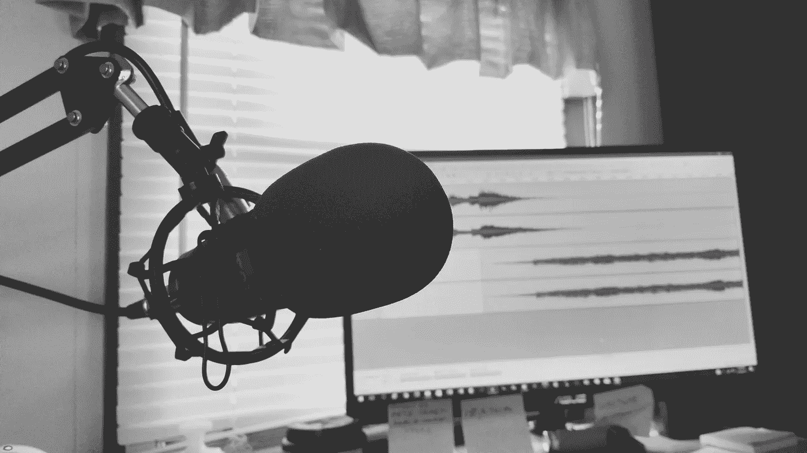
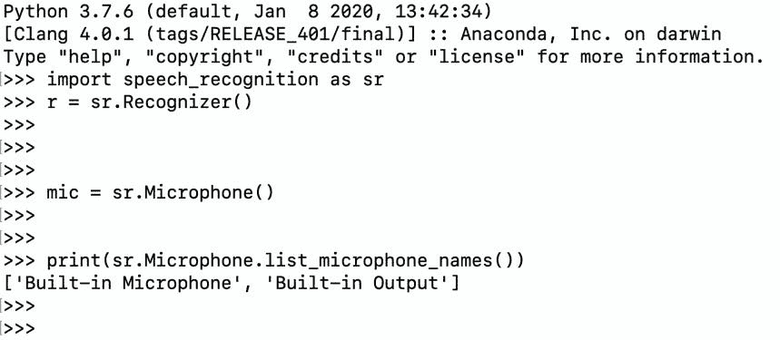

# 使用 Python 将您的语音转换为文本

> 原文：<https://towardsdatascience.com/convert-your-speech-to-text-using-python-1cf3eccfa922?source=collection_archive---------24----------------------->

## 使用麦克风将您的语音实时转换为文本



汤米·洛佩兹从[派克斯](https://www.pexels.com/photo/greyscale-photography-of-condenser-microphone-765139/?utm_content=attributionCopyText&utm_medium=referral&utm_source=pexels)拍摄的照片

在这篇文章中，我将向您展示如何使用 Python 将您的演讲转换成文本文档。在编程的话，这个过程基本上叫做语音识别。这是我们日常生活中常用的东西。例如，当你用声音给朋友发信息时。语音到文本的另一个很好的例子是添加一个正在说话的人的字幕。你在网飞节目或 YouTube 视频上看到的大多数字幕都是由使用人工智能的机器制作的。你能想象一群人整天工作只是为了给你最喜欢的节目添加字幕吗？我知道这很难想象。电脑编程的力量来了。我仍然记得我学习 for loops 的那一天，感觉我找到了一种在现实世界中达到无穷大的方法。不管怎样，介绍够了，让我们开始工作吧。

正如你从标题中可以理解的，在这篇文章中，我们将创建一个 python 程序，将我们的演讲转换成文本，并导出为文本文档。如果你是一个喜欢记笔记的人，这个程序将帮助你通过记录你自己来节省时间，并且也有你记录的打印版本。这就像在一场比赛中赢得两个奖杯🙂

# 让我们开始编码吧！

## 导入库

我们将使用 SpeechRecognition 模块，如果您还没有，让我们快速安装它。不用担心，在 Python 中安装一个模块是超级容易的。

```
pip install SpeechRecognition
```

是的，就是它。SpeechRecognition 模块支持多种识别 API，Google Speech API 就是其中之一。你可以从[这里](https://pypi.org/project/SpeechRecognition/)了解更多关于这个模块的信息。我们将在代码中使用 Google 的识别器。现在，在安装模块完成后，我们可以将它导入到我们的程序中。

```
import speech_recognition as sr
```

## 创建识别器

在这一步中，我们将创建一个识别器实例。

```
r = sr.Recognizer()
```

## 定义您的麦克风

在定义麦克风实例之前，我们将选择输入设备。可能有多个输入设备插入您的计算机，我们需要选择我们打算使用哪一个。你知道机器是假人，你必须准确地告诉他们该做什么！使用下面的代码，你将能够看到你的输入设备。

```
print(sr.Microphone.list_microphone_names())
```



麦克风名称列表

这里你可以看到我检查输入设备的结果。我建议您在定义麦克风之前运行这个脚本，因为您可能会得到不同的结果。该脚本返回一个带有输入名称的数组列表，对我来说我想使用“内置麦克风”，所以数组列表的第一个元素。定义麦克风代码将如下所示:

```
mic = sr.Microphone(device_index=0)
```

## 识别语音

如前所述，我们将使用 *recognize_google* 方法，这是我们在 google 的朋友创建的语音识别模型。多亏了他们！

```
with mic as source: 
  audio = r.listen(source) result = r.recognize_google(audio)
```

如果您想在将结果导出到文本文档之前检查结果，可以在代码中添加下面一行。

```
print(result)
```

## 最后一步:导出结果

在这一步中，我们将创建一个文本文档并导出我们在上一步中得到的结果。您将看到“导出过程完成！”这个过程完成后，在终端窗口中添加一行。

```
with open('my_result.txt',mode ='w') as file: 
   file.write("Recognized text:") 
   file.write("\n") 
   file.write(result) print("Exporting process completed!")
```

# 最终代码

```
# import the module 
import speech_recognition as sr # create the recognizer 
r = sr.Recognizer() # define the microphone 
mic = sr.Microphone(device_index=0) # record your speech 
with mic as source: 
   audio = r.listen(source) # speech recognition 
result = r.recognize_google(audio)# export the result 
with open('my_result.txt',mode ='w') as file: 
   file.write("Recognized text:") 
   file.write("\n") 
   file.write(result) print("Exporting process completed!")
```

恭喜我的朋友！您已经创建了一个将您的演讲转换为文本并将其导出为文本文档的程序。希望你喜欢读这篇文章，并且今天学到了一些新的东西。从事像这样有趣的编程项目会帮助你提高编码技能。

> 关注我的[博客](https://medium.com/@lifexplorer)和[走向数据科学](https://towardsdatascience.com/)以获得灵感。

## 您可能会感兴趣的另一个语音识别项目

[](/building-a-speech-recognizer-in-python-2dad733949b4) [## 用 Python 构建语音识别器

### 使用谷歌云语音 API 将您的音频文件转换为文本

towardsdatascience.com](/building-a-speech-recognizer-in-python-2dad733949b4)