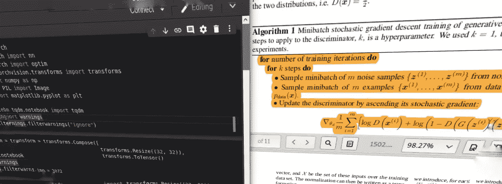

# 将深度学习研究论文转化为有用的代码

> 原文：<https://towardsdatascience.com/converting-deep-learning-research-papers-to-code-f-f38bbd87352f?source=collection_archive---------8----------------------->

如果深度学习是一种超能力，那么将理论从纸上转化为可用的代码就是一种超能力

作者图片

## 为什么要学习实现机器学习研究论文？

正如我所说的，能够将一张纸转换成代码绝对是一种超能力，尤其是在机器学习这样一个每天发展越来越快的领域。

大多数研究论文来自大型科技公司或大学的人，他们可能是博士或从事尖端技术工作的人。

还有什么比能够复制这些顶尖专业人士的研究更酷的呢？另一件需要注意的事情是，那些能够将研究论文复制成代码的人需求量很大。

一旦你掌握了实施研究论文的诀窍，你将处于与这些研究者不相上下的状态。

这些研究人员也通过阅读和实施研究论文的实践获得了这些技能。

## 我如何阅读和实施论文？

你可能会说，“嗯，我对深度学习算法有一个大致的了解，如全连接网络，卷积神经网络，递归神经网络，但问题是，我想开发 SOTA(最先进的)语音克隆人工智能，但我对语音克隆一无所知:(”。

好的，这是你的答案(我的方法的某些部分摘自[吴恩达关于阅读论文的建议](https://www.youtube.com/watch?v=733m6qBH-jI&list=PLoROMvodv4rOABXSygHTsbvUz4G_YQhOb&index=8))。

如果您想了解某个特定主题:

1.  收集 5-6 篇与特定主题相关的论文(您可以简单地搜索 arxiv 或类似网站来获得与某个主题相关的论文)。
2.  不要完全阅读一篇论文，而是浏览所有的论文，选择一篇你感兴趣的论文，或者如果你心中有一篇特定的论文，就去选择它，没有人能阻止你。
3.  仔细阅读摘要，从高层次上理解文章的思想，看看你的兴趣是否仍然存在，如果是，继续浏览图片，看看你能否对文章的内容做出假设。
4.  现在请一行一行地仔细阅读引言，因为论文中包含的大部分内容将在这里用最简单的方式和最少的数学来解释。
5.  如果你愿意，你可以跳过第一遍的数学方程，如果希腊字母很熟悉就不要跳过数学。
6.  在任何情况下，如果你被卡住了或者有些词令人困惑，不要犹豫去谷歌一下。没有人生来就是万物的主宰；)
7.  完成第一遍后，你将处于这样一种状态，你理解这篇论文试图证明或改进的高层次观点。
8.  在第二遍中，试着理解论文中的几乎所有内容，如果你遇到任何伪代码，试着把它转换成你选择的 python 库(PyTorch，TensorFlow…)
9.  你可以通过阅读每篇论文的参考文献部分，获得更多的论文来阅读，并对该领域有更好的理解(与点连接相同)。

💡有效理解论文的一些技巧:

*   如果你是一个阅读研究论文的初学者，在阅读论文本身之前，阅读一些与该主题/研究论文相关的博客帖子和视频是很好的。这使你的工作更容易，你也不会因为那些希腊字母而气馁。
*   在为论文实现代码时，始终记笔记并突出研究论文中的要点，以便于参考。
*   如果您是实现研究论文的新手，并且在任何地方都遇到了困难，那么浏览开源实现并看看其他人是如何做到这一点的，这并不是一个坏主意。

**注意**:不要把第三点当成常规练习，因为你的学习曲线会下降，你会过度适应:)

你应该发展你自己的阅读和实施论文的方法，这只有通过开始才有可能，所以上面的步骤将帮助你开始。

根据吴恩达的说法，如果你能阅读**关于一个主题的 5-10 篇论文**(例如:声音克隆)，你将处于实施声音克隆系统的**良好状态**，但是如果你能阅读**关于那个主题的 50-100 篇论文**，你将处于研究或开发该主题的尖端技术的状态。

## 让我们讨论一篇论文

1.  **高级概述**

现在，你已经了解了如何阅读论文，让我们为自己阅读和实现一个。

我们将仔细阅读 Ian Goodfellow 的论文—**(GAN)并用 PyTorch 实现同样的内容。**

**在论文摘要中清楚地讨论了论文内容的高级概述。**

**摘要告诉我们，研究人员正在提出一个包含两个神经网络的新框架，它们被称为**生成器**和**鉴别器**。**

**不要被名字搞混了，它们只是给两个神经网络取的名字。**

**但是在摘要部分要注意的要点是，上面提到的生成器和鉴别器相互竞争。**

**好吧，让我说清楚一点。**

**让我们以使用 GANs 生成不存在的新人脸为例。**

**生成器生成与真实图像具有相同尺寸(H×W×C)的新人脸，并将其显示给鉴别器，鉴别器判断该图像是生成器生成的假图像还是真实的人的图像。**

**现在你可能会有一个问题，“嗯，这个鉴别器是如何区分真假图像的？”，这是你的答案:**

**鉴别器的问题类型是图像分类，即鉴别器将不得不辨别图像是假的还是真的(0 或 1)。因此，我们可以像训练狗和猫分类器网络一样训练鉴别器，但我们将使用完全连接的网络，而不是卷积神经网络，因为这是论文所提出的。**

**💡DCGAN 是另一种类型的 GAN，它使用卷积神经网络而不是全连接网络，并且具有更好的结果。**

**所以我们以这样一种方式训练鉴别器，我们馈入一个图像，鉴别器输出 0 或 1，即假或真。**

**由于我们已经训练了鉴别器，我们将把生成器生成的图像传递给鉴别器，并分类它是真的还是假的。生成器调整其所有权重，直到它能够欺骗分类器来预测所生成的图像是真实的。**

**我们将为生成器提供一个随机概率分布(随机张量)，生成器的职责是改变这个概率分布，以匹配真实图像的概率分布。**

**这些是我们在实施准则时应该遵循的步骤:**

**→加载包含真实图像的数据集。**

**→创建一个随机二维张量(虚假数据的概率分布)。**

**→创建鉴别器模型和发电机模型。**

**→训练鉴别器辨别真假图像**

**→现在将假图像的概率分布输入发生器，并测试鉴别器是否能够识别发生器产生的假图像。**

**→调整生成器(随机梯度下降)的权重，直到鉴别器无法识别伪图像。**

**你可能有几个疑问，但现在没关系，一旦我们将理论实现到代码中，你就会知道它是如何工作的。**

**2.**损失函数****

**在实现代码之前，我们需要一个损失函数，以便优化我们的发生器网络和鉴别器网络。**

**鉴别器模型存在二进制分类问题，因此我们对鉴别器使用二进制交叉熵损失，或者您也可以使用本文中讨论的自定义损失函数。**

**来自论文的损失函数:*【log D(x)】+【log(1-D(G(z)))】***

***x*→实景**

***z*→虚假数据或噪声(随机张量)**

***D*→鉴别器型号**

***G*→发电机型号**

***G(z)*→向发生器输入虚假数据或噪声(输出为虚假图像)**

***D(x)*→将真实图像送入鉴别器(输出为 0 或 1)**

***D(G(z))*→假数据被送到发生器，发生器输出图像，图像被送到鉴别器进行预测(输出为 0 或 1)**

**如果你想用纸上的损失函数，让我解释给你听:**

**根据该论文，对于鉴别器，我们需要最大化上述损失函数。**

**让我们看看等式的第一部分:**

**— *D(x)* 输出 0 或 1，所以当我们最大化*log[D(x)】*时，它使鉴别器在 *x* (实像)馈入时输出一个接近 1 的值，这就是我们所需要的。**

**现在，让我们来看看等式的第二部分:**

**— *G(z)* 输出一个与真实图像尺寸相同的图像，现在这个假图像被馈送到鉴别器( *D(G(z)* )，当我们最大化这个值时，鉴别器的输出将接近 1，因此当我们做[*1d(G(z))*]时，我们将得到一个接近于零的值，这正是我们将假图像传递到鉴别器时所需要的。**

****注**:你可以在方程中加一个负号，把损失函数变成鉴别器的最小化问题，这比最大化容易。**

**对于发生器，我们需要最小化上述等式，但本文仅考虑等式*【log(1D(G(z)))】*的第二部分进行最小化。**

**—当我们最小化 *D(G(z))* 时，鉴别器输出一个接近于 0 的值，方程的整体输出变得接近于 1，这就是我们的生成器想要实现的，在给定来自生成器的假图像时，忽悠鉴别器预测 1(真实)。**

## **耶，让我们开始吧！**

**我已经在 google colab 中完成了代码实现，所以如果你尝试 google colab 或 jupyter notebook 中的代码将是最好的。**

1.  **导入所需的库—**

**2.我们将使用单个图像作为真实图像，以便更快地训练和获得结果，因此生成器生成的图像将与此图像相似，您也可以使用图像的数据集，这完全取决于您。**

**我们将使用 *PIL 库*加载图像作为 PIL 图像，我们将使用 *torchvision transforms* 调整图像大小并将其转换为张量，然后为图像生成创建大小为(1×100)的假噪声。**

**3.创建一个鉴别器模型，它只不过是一个完全连接的神经网络，接收真实图像或虚假图像，输出 0 或 1。**

**4.创建一个生成器模型，它也是一个完全连接的网络，接收随机噪声并输出与真实图像大小相同的图像张量。**

**5.初始化模型、优化器和损失函数，然后将它们移动到所需的设备(cuda 或 cpu)。我们将对鉴别器使用二进制交叉熵损失，对发生器使用本文中讨论的损失函数(*log(1D(G(z)))*)。**

**6.现在我们将训练该模型，整个 GAN 被训练五百个时期，鉴别器将被训练四个时期，并且对于五百个时期中的每个时期，发生器将被训练三个时期。**

**7.将生成图像的结果与真实图像进行比较。您可以调整学习率、动量、时期数以及生成器和鉴别器模型的层数，以获得更好的结果。**

****

**将我们的生成器图像与真实图像进行比较(图像由作者提供)**

## **最后的想法**

**生成的图像可能没有很高的分辨率，因为这篇论文只是整个生成模型世界的开始。如果您的兴趣仍然存在，您可以继续阅读 [DCGANs](https://arxiv.org/abs/1511.06434) (深度卷积 GANs)或[GANs 世界的任何其他论文](https://github.com/nightrome/really-awesome-gan#papers)，并实施它以查看惊人的结果，但请始终记住，本文是所有这些论文的基础。**

**链接到完整的代码可在[这里](https://github.com/bipinKrishnan/Paper2Code_vanillaGAN/blob/master/GAN_from_scratch.ipynb)。**