# 凸和非凸损失函数下的价格优化

> 原文：<https://towardsdatascience.com/convex-and-non-convex-optimisation-899174802b60?source=collection_archive---------26----------------------->

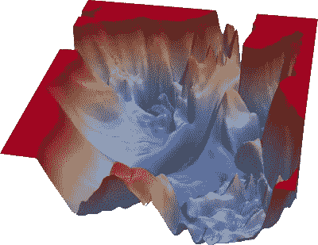

ML 问题的典型损失面([来源](https://www.cs.umd.edu/~tomg/projects/landscapes/ and arXiv:1712.09913)

优化用于许多日常活动，从使用谷歌地图找到到达目的地的最快路线，到通过在线应用程序点餐。在本帖中，我们将介绍两种主要损失函数的价格优化，即凸损失函数和非凸损失函数。我们还将介绍使用名为 scipy 的 python 库解决这些问题的最佳方法。在这个博客中使用的示例数据和代码的细节可以在这个[笔记本](https://gitlab.com/praj88/optimisation)中找到。

# 凸优化

*凸优化问题*是一个所有约束都是凸函数的问题，如果最小化，目标是凸函数，如果最大化，目标是凹函数。凸函数可以描述为具有单一全局最小值的光滑曲面。凸函数的示例如下:

```
*F(x,y) = x2 + xy + y2.*
```

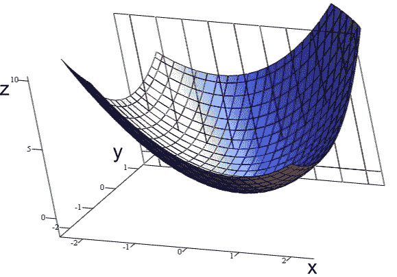

凸函数([来源](https://en.wikipedia.org/wiki/Convex_function#/media/File:Grafico_3d_x2+xy+y2.png))

# 1.数据生成

为了了解优化是如何工作的，我正在生成一个玩具数据集，其中包括销售价格、数量和成本。让我们设定数据集的目标是找到一个使总利润最大化的价格。

**销售价格(price):** 这是一个在 1000 到 7000 之间产生的随机数。使用 numpy 随机函数生成数据。

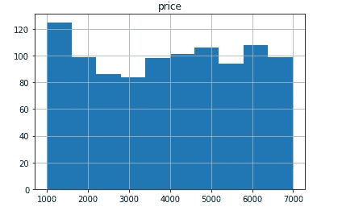

价格直方图

**交易量:**交易量是销售价格的直线函数，其下降斜率如下所示:

```
*f(volume) = (-price/2)+4000*
```

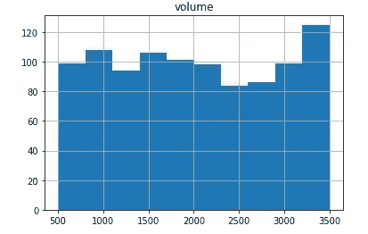

体积直方图

销售价格和销售量之间的关系如下所示。正如预期的那样，随着价格的下降，我们看到了销售量的增加。

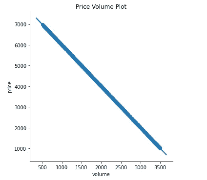

**成本:**成本变量代表产品的制造成本。这考虑了一些固定成本(即 300 英镑)和可变成本(即 0.25 英镑)，可变成本是交易量的函数。

```
 *f(cost) = 300+volume*0.25*
```

现在我们已经有了所有需要的变量，我们可以使用下面的简单公式来计算利润:

```
*f(profit) = (price — cost)*volume*
```

销售价格、交易量和利润的三维图如下所示。我们可以看到，这是一个钟形曲线，峰值利润在特定的数量和成本。一个企业的目标可能是利润最大化，在下一节中，我将展示我们如何使用 scipy 来实现这一目标。

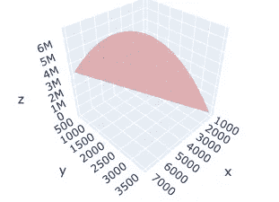

3d 绘图:价格(x)、交易量(y)和利润(z)

## **2。根据观察数据估算成本和数量**

在上面的部分中，我们已经生成了一个样本数据集。然而，在现实世界中，我们可能获得一小组观察数据，即产品的价格、数量和成本。此外，我们不知道支配因变量和自变量之间关系的基本函数。

为了模拟观察数据，让我们截取生成的数据，即价格为"<3000”. With this observational data we need to find the relationship between price vs cost and volume vs cost. We can do that by performing a simple linear regression on the observation data set. However for real world problem this may involve building complex non-linear models with a large number of independent variables.

**线性回归:**的所有点

1.  **价格 vs 成交量**

我们把价格作为自变量‘X’，把成交量作为因变量‘y’。使用 python 中的 stats 模型库，我们可以确定一个线性回归模型来捕捉量价关系。

从下面的观察数据可以看出，我们的 R 平方为 1(即 100%)，这意味着产品价格的变化可以很好地解释销量的变化。然而，这种完美的关系在现实生活的数据集中很难观察到。

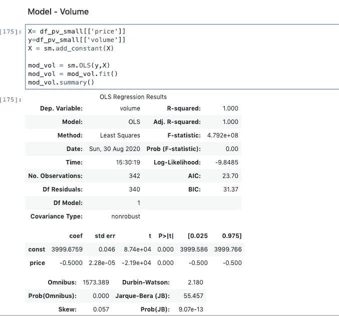

此外，我们可以看到偏差为-3，999.67，价格系数为-0.5，近似于用于生成交易量数据的函数。

**2。数量与成本**

以类似的方式，以成本为因变量“y”和以数量为自变量“X”进行线性回归，如下所示。我们可以看到，成本模型的偏差和系数近似于用于生成成本数据的函数。因此，我们现在可以使用这些训练好的模型来确定凸优化的成本和体积。

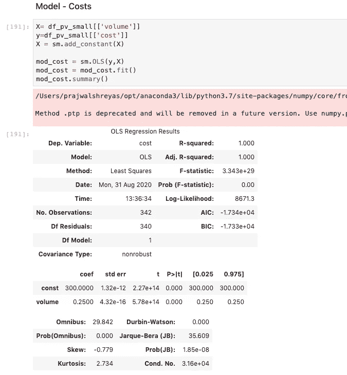

线性回归模型的结果——成本与数量。

## 使用 scipy 优化

我们将使用 scipy 优化库进行优化。该库有一个最小化功能，它接受以下参数，关于 scipy 最小化功能的更多细节可以在[这里](https://docs.scipy.org/doc/scipy/reference/generated/scipy.optimize.minimize.html#scipy.optimize.minimize)找到:

```
result = optimize.minimize(fun=objective, 
                           x0=initial,
                           method=’SLSQP’,
                           constraints=cons,
                           options={‘maxiter’:100, ‘disp’: True})
```

1.  **fun:** 要最小化的目标函数。在我们的情况下，我们希望利润最大化。因此，这将意味着'-利润'最小化，其中利润被计算为:*利润=(价格-成本)*数量*

```
def cal_profit(price):
 volume = mod_vol.predict([1, price]) 
 cost = mod_cost.predict([1, volume])
 profit = (price — cost)*volume
 return profit###### The main objective function for the minimisation.
def objective(price):
 return -cal_profit(price)
```

**2。x0:** 初步猜测，即在这种情况下，我们设定的初始价格为 2000 英镑。

```
initial = [2000]
```

**3。界限:**界限是优化中使用的下限和上限区间。它只能为某些支持有界输入的优化方法设置，如 L-BFGS-B、TNC、SLSQP、Powell 和 trust-const 方法。

```
#################### bounds ####################
bounds=([1000,10000])
```

**4。约束:**这里我们指定优化问题的约束。这种情况下的约束条件是可以生产的产品数量(即设置为 3，000 件)。这是一个不等式约束，即体积必须小于指定的单位数。也可以使用其他类型的约束，如等式约束。

```
# Left-sided inequality from the first constraint
def constraint1(price):
    return 3000-mod_vol.predict([1, price])# Construct dictionaries
con1 = {'type':'ineq','fun':constraint1}# Put those dictionaries into a tuple
cons = (con1)
```

**5** 。**方法**:有多种方法可用于执行最小化操作，例如(见[参考](https://docs.scipy.org/doc/scipy/reference/generated/scipy.optimize.minimize.html#scipy.optimize.minimize)):

*   内尔德-米德'[(见此)](https://docs.scipy.org/doc/scipy/reference/optimize.minimize-neldermead.html#optimize-minimize-neldermead)
*   ' BFGS' [(看这里)](https://docs.scipy.org/doc/scipy/reference/optimize.minimize-bfgs.html#optimize-minimize-bfgs)
*   牛顿-CG' [(见此处)](https://docs.scipy.org/doc/scipy/reference/optimize.minimize-newtoncg.html#optimize-minimize-newtoncg)
*   L-BFGS-B' [(看这里)](https://docs.scipy.org/doc/scipy/reference/optimize.minimize-lbfgsb.html#optimize-minimize-lbfgsb)
*   SLSQP' [(看这里)](https://docs.scipy.org/doc/scipy/reference/optimize.minimize-slsqp.html#optimize-minimize-slsqp)
*   [(见此处)](https://docs.scipy.org/doc/scipy/reference/optimize.minimize-trustconstr.html#optimize-minimize-trustconstr)

我们将使用 SLSQP 方法进行优化。**序列二次规划** ( **SQP 或 SLSQP** )是一种约束非线性优化的迭代方法。

并非所有上述方法都支持使用边界和约束。因此我们使用 SLSQP，它支持使用优化的边界和约束。

## 凸优化的结果

优化总共运行了 3 次迭代。基于此，目标函数返回值为-6.6 密耳(即-6，587，215.16)。这导致价格为 4577 英镑，数量为 1710 英镑。我们得到一个负值，因为我们通过最小化负利润来最大化利润，这是一个凸函数。

```
Optimization terminated successfully.    (Exit mode 0)
            Current function value: -6587215.163007045
            Iterations: 3
            Function evaluations: 9
            Gradient evaluations: 3
```

优化的结果与生成的数据集中看到的最大利润非常匹配。因此，我们知道优化已经如预期的那样工作。

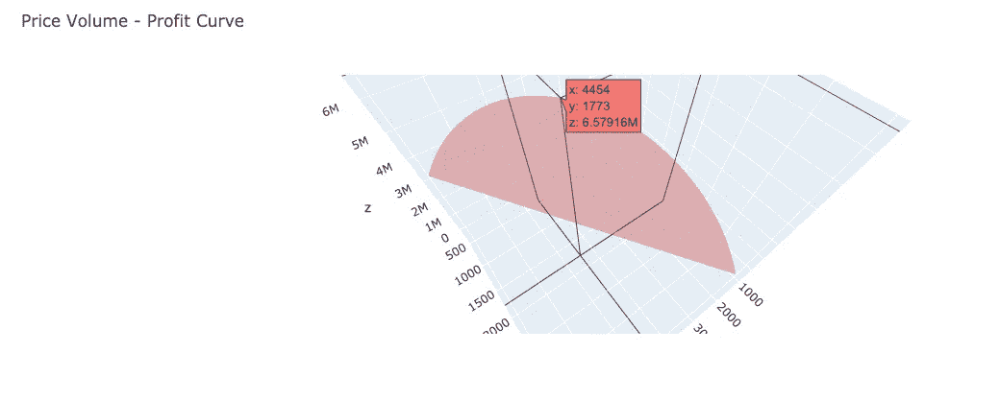

最大利润值:价格(x)、数量(y)和利润(z)

# 非凸优化

在大多数机器学习问题中，我们会遇到本质上非凸的损失曲面。因此，它们将具有多个局部最小值。因此，在求解这种非凸问题时，如果我们“凸化”一个问题*(使其凸优化友好)*，然后使用非凸优化，可能会更简单且计算量更小。我将通过下面的例子演示我们如何实现这一点。

## 非凸数据集生成；

在这里，我们创造了另一种产品，其价格、数量和利润略有不同。假设该公司只能生产这些产品中的一种，并希望使用优化来找出它需要专注于哪些产品以及它需要以什么价格出售。

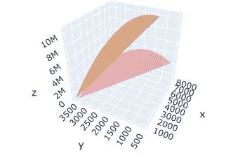

3d 绘图:产品 1 和产品 2 的非凸数据集

## 对非凸数据使用凸极小化

对于上述数据，如果我们使用与上面相同的凸优化，我们得到的解将是局部最小值，如下所示。对于**5018**的优化价格和 **0** 的产品类型，我们获得了**686 万**的最大利润。

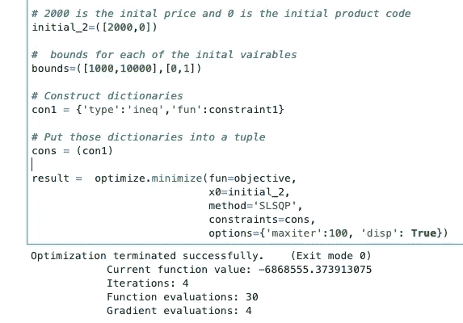

凸优化的局部最小值

## 盆地跳跃算法

跳盆算法是一种结合了全局步进算法和每步局部最小化的算法。因此，这可用于寻找非凸损失表面可用的所有局部最小值选项中的最佳选项。下面的代码演示了这个算法的实现。

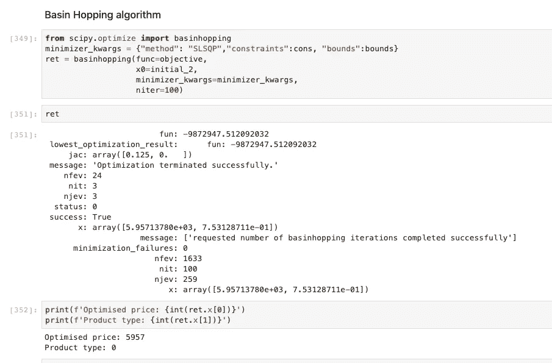

跳盆算法的全局最小值

如上所述，我们使用了与上例相同的方法，即 SLSQP，以及相同的边界和约束。然而，我们现在得到了一个稍微不同的结果。最大利润为**980 万**，优化价格为**5957**，产品类型为 **1** 。

## 结论:

总之，我们已经回顾了 scipy 中优化库在具有单一全局最小值的简单凸优化数据集上的使用，还回顾了在损失面具有多个局部最小值和一个全局最小值的情况下盆地跳跃算法的使用。希望你会发现上面的帖子很有用，并且提供了解决现实世界中优化问题的框架。

## 参考资料:

[](https://en.wikipedia.org/wiki/Sequential_quadratic_programming) [## 序列二次规划

### 序列二次规划(SQP)是一种求解约束非线性优化的迭代方法。SQP 方法是…

en.wikipedia.org](https://en.wikipedia.org/wiki/Sequential_quadratic_programming) [](https://docs.scipy.org/doc/scipy/reference/generated/scipy.optimize.basinhopping.html) [## SciPy . optimize . basin hopping-SciPy v 1 . 5 . 2 参考指南

### 使用盆地跳跃算法寻找函数的全局最小值盆地跳跃是一种两阶段方法，它…

docs.scipy.org](https://docs.scipy.org/doc/scipy/reference/generated/scipy.optimize.basinhopping.html) [](https://docs.scipy.org/doc/scipy/reference/generated/scipy.optimize.minimize.html#scipy.optimize.minimize) [## SciPy . optimize . minimize-SciPy v 1 . 5 . 2 参考指南

### 一元或多元标量函数的最小化。参数要最小化的目标函数。在哪里……

docs.scipy.org](https://docs.scipy.org/doc/scipy/reference/generated/scipy.optimize.minimize.html#scipy.optimize.minimize) [](https://stats.stackexchange.com/questions/324981/why-study-convex-optimization-for-theoretical-machine-learning) [## 为什么要研究理论机器学习的凸优化？

### begingroup$机器学习算法一直在使用优化。我们最小化损失或错误，或最大化一些…

stats.stackexchange.com](https://stats.stackexchange.com/questions/324981/why-study-convex-optimization-for-theoretical-machine-learning)