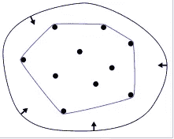
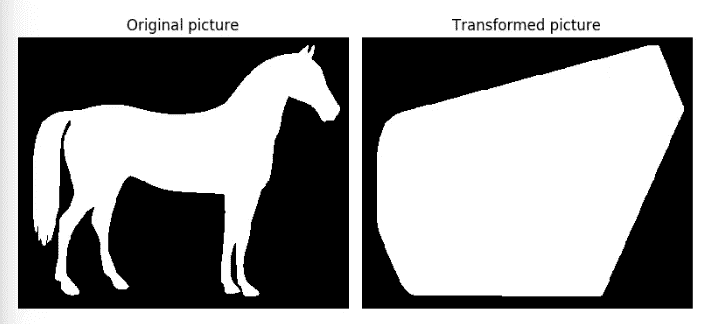
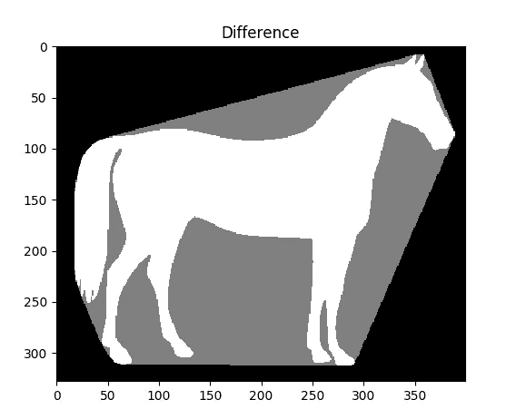
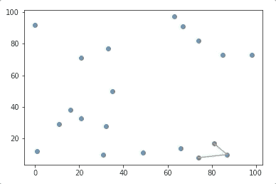
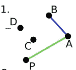
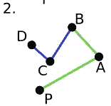
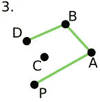
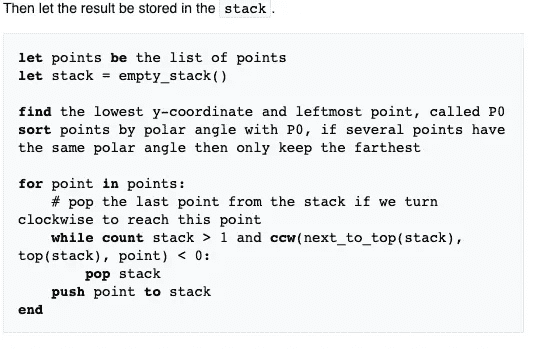
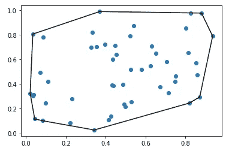
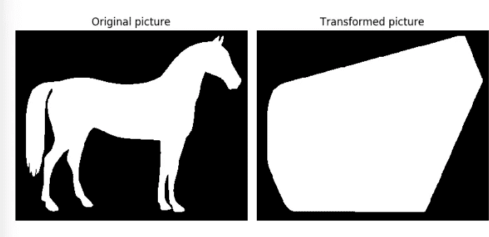

# 凸包:包装数据的创新方法

> 原文：<https://towardsdatascience.com/convex-hull-an-innovative-approach-to-gift-wrap-your-data-899992881efc?source=collection_archive---------20----------------------->

## 如何利用包装算法实现数据可视化

# 什么是凸包？

假设我们有一组数据点。

检索自[维基百科](https://en.wikipedia.org/wiki/Convex_hull)

想象一下，一根橡皮筋绕在这些钉子的周围。如果松开橡皮筋，它会在产生原始集合的紧密边界的点周围捕捉。

最终的形状是凸包，由接触橡皮筋创建的边界的点的**子集描述。凸包是计算几何中普遍存在的结构。凸包在数据科学中有许多应用，例如:**

*   **分类**:给定一组数据点，我们可以通过确定每一类的凸包将它们分成不同的类
*   **避碰:**通过定义物体的凸包来避免与其他物体的碰撞。
*   **图像处理和识别:**图像处理的要求是鲁棒性、高识别率和捕捉图像中物体形状的灵活性。这正是凸包发挥作用的地方。

从 [Scikit 图像](https://scikit-image.org/docs/dev/auto_examples/edges/plot_convex_hull.html)中检索

从 [Scikit 图像中检索](https://scikit-image.org/docs/dev/auto_examples/edges/plot_convex_hull.html)

*   **定义地图上的聚类:**地理信息系统，简称 GIS，存储地理数据，如国家的形状，山脉的高度。用凸包作为工具来定义不同区域的聚类，GIS 可以用来提取不同区域之间的信息和关系。

凸包还应用于其他领域，如**数据挖掘、模式识别、人工智能、统计中异常值的检测**等等。我希望凸包的应用能让你对这个工具感兴趣。更好的是。我们可以**为我们的数据**创建凸包！在开始写代码之前，让我们先了解一下凸包算法是如何工作的

# 格雷厄姆算法

格雷厄姆的扫描算法是一种计算平面中一组确定点的凸包的方法。

## 直觉:

*   对于每个点，首先确定从这些点之前的两个点行进是否构成左转或右转

从维基百科检索

*   如果是右转，倒数第二个点不是凸包的一部分，而是位于凸包内部。下图中，由于 **D** 相对于矢量 **BC** 做了一个**右转**， **C** 是**而不是**凸包的一部分。

检索自[维基百科](https://en.wikipedia.org/wiki/Graham_scan)

*   然后我们将 D 与向量 BA 进行比较。由于 **D** 相对于矢量 **BA** 做了一个**左转**，D 被追加到凸包的栈中

检索自[维基百科](https://en.wikipedia.org/wiki/Graham_scan)

## 伪代码:

代码使用`ccw`作为左转或右转的行列式。如果`ccw > 0`，那么新的点如果在前 2 点的左侧。`ccw <0`用于左侧，而`ccw=0`用于线性

检索自[维基百科](https://en.wikipedia.org/wiki/Graham_scan)

你可以在这里更深入的了解算法[。](https://en.wikipedia.org/wiki/Graham_scan)

# 为您的数据创建一个凸包

让我们看看如何利用 Python 的库来存储数据。用`scipy.spatial.ConvexHull:`使用凸包极其容易

或者用`skimage`把图像变成凸包

从 [Scikit-image](https://scikit-image.org/docs/dev/auto_examples/edges/plot_convex_hull.html) 中检索

从 [Scikit-image](https://scikit-image.org/docs/dev/auto_examples/edges/plot_convex_hull.html) 中检索

太好了！我们把数据包装得像礼物一样好。现在，它可以作为“礼物”送给你的朋友或同事了。用你的数据试试这个，观察它的神奇之处！

# 结论:

恭喜你！您刚刚学习了凸包，这是处理数据的额外工具。数据科学并不总是一条线性回归线。大多数时候，你会处理杂乱的数据。因此，知道有哪些工具将会给你带来灵活性和控制数据的能力。

如果你对如何用 Python 编写这个算法很好奇，可以在我的 [Github 资源库](https://github.com/khuyentran1401/Computational-Geometry/blob/master/Graham%20Scan.ipynb)中找到并分叉源代码。在我的笔记本中，我详细解释了每段代码，并提供了算法所需的函数(逆时针、点类、从点到向量、叉积等)。也许理解了这段代码会让你有信心尝试其他计算几何算法，并用 Python 创建自己的模块？

我喜欢写一些基本的数据科学概念，并尝试不同的算法和数据科学工具。你可以通过 [LinkedIn](https://www.linkedin.com/in/khuyen-tran-1401/) 和 [Twitter](https://twitter.com/KhuyenTran16) 与我联系。

如果你想查看我写的所有文章的代码，请点击这里。在 Medium 上关注我，了解我的最新数据科学文章，例如:

 [## 如何用 Altair 创建交互式剧情

### 在 5 行简单的 Python 代码中利用您的数据分析

towardsdatascience.com](/how-to-create-interactive-and-elegant-plot-with-altair-8dd87a890f2a)  [## 什么是卓越的图形以及如何创建它

### 作为一名数据科学家，了解如何制作重要的图表至关重要

towardsdatascience.com](/what-graphical-excellence-is-and-how-to-create-it-db02043e0b37)  [## 用于机器学习的线性代数:求解线性方程组

### 代数是机器学习算法的底线机制

towardsdatascience.com](/linear-algebra-for-machine-learning-solve-a-system-of-linear-equations-3ec7e882e10f)  [## 如何从头开始构建矩阵模块

### 如果您一直在为矩阵运算导入 Numpy，但不知道该模块是如何构建的，本文将展示…

towardsdatascience.com](/how-to-build-a-matrix-module-from-scratch-a4f35ec28b56)  [## 高效 Python 代码的计时

### 如何比较列表、集合和其他方法的性能

towardsdatascience.com](/timing-the-performance-to-choose-the-right-python-object-for-your-data-science-project-670db6f11b8e) 

# 参考

[1]哈桑·弗莱耶。*图像处理中的凸包:范围审查*。研究门。2016 年 5 月

[2]维基百科。*格雷厄姆扫描*

[3] Jayaram，M.A. *图像处理中的凸包:范围审查。*科学&学术出版。2016