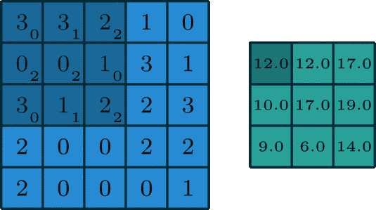

# 高级卷积层概述

> 原文：<https://towardsdatascience.com/convolution-layers-e2e5ba340565?source=collection_archive---------43----------------------->

## **卷积层总结，以跟踪计算机视觉文献中的关键发展和先进概念**

卷积层是计算机视觉体系结构的基本构件。采用卷积层的神经网络被广泛应用于分割、重建、场景理解、合成、对象检测等等

这篇文章的目的是提供一个**摘要** **和概述**最近文献中出现的高级卷积层和技术。为了完整起见，我们从卷积的基础开始，然而，更严格的解释可以从。

**卷积:**从数学上来说，卷积是将两个信号合并成一个信号的“运算”，下面是维基百科中的一个插图，它突出了两个函数/信号 f(t)和 f(t-z)之间的卷积。卷积来获得(f*g)(t)


来自维基百科的卷积


深度学习中的主要卷积运算有

1.  《2D》卷积:

形象地说，我们将一个核(绿色大小)卷积“滑动”到一个图像(蓝色)上，并学习这些核的权重。该内核的空间范围(F)是 3，并且过滤器，即内核的深度是 1，因此权重的数量是 3*3*1=9。我们可以通过“步幅”跳过像素并填充原始图像的区域，这里步幅是 0



[图像来源](/intuitively-understanding-convolutions-for-deep-learning-1f6f42faee1)

的卷积块接受尺寸为 W1×H1×D1 的图像或特征图以及尺寸为(F*F*K)的核，并且**典型地需要四个超参数:**

*   过滤器数量 K: K
*   它们的空间范围 F: F
*   大步走
*   零填充的数量:P:如果我们对任何图像进行零填充
*   参数数量是(通道*F*F)*K
*   典型地，权重矩阵的形状是(F，F，通道，K)

这些操作组合起来提供了 W2*H2*D2 的最终输出特征图。工作细节见[帖子](https://medium.com/@prvnk10/the-convolution-operation-48d72a382f5a)

*   w2 =(W1 F+2P)/S+1 w2 =(W1 F+2P)/S+1
*   H2 =(H1 F+2P)/S+1 H2 =(H1 F+2P)/S+1

对于卷积，使用了两个额外的运算

*   **Max-pool** :该操作减少了图像的数量维度:通常使用“Max”pool 操作中的 2*2 滤波器。过滤器用该块的最大值替换图像/特征图中的每个 2*2 块，这减小了下一层的特征图的大小。
*   [非线性](https://www.coursera.org/lecture/neural-networks-deep-learning/why-do-you-need-non-linear-activation-functions-OASKH) (relu，tanh 等)在 max-pool 操作之前使用，以将非线性添加到操作中[ ***TODO:*** *未来工作:*添加关于各种非线性性能的注释]

滤波器(F)的空间范围是每个核的权重数量的主要贡献者。正如 CS231n 讲义中所解释的，当 F=3 和 F=7 时，砝码数量增加了三倍。通常，完整的深度网络由多层 CONV + RELU +池操作组成，以提取特征。因此，通常 F=3 被用作在每层学习特征向量的折衷，而不增加计算成本。

请参阅 C231n 课堂讲稿上的计算考虑部分作为额外参考


CS231n notes 中很好地总结了使用这三层的对象分类任务的关键架构，它们是 LeNet、AlexNet、ZFNet、GoogLeNet、VGGnet、Resnet。这些都是为了赢得 Imagenet 挑战赛而开发的。这些年来，有一种趋势是更大/更深的网络来提高性能。


图片来自 Resnet 文章

**剩余/跳过连接**

这些是微软[团队](https://arxiv.org/abs/1512.03385)在 2015 年推出的，目的是在更深的网络中保持准确性，作为 ImageNet 挑战赛的一部分。单个网络跳过的连接如下所示，其目的是学习剩余 R(x)。在更深的网络中，这允许在每一层学习“残留信息”。因此得名剩余连接。这项技术已经通过实验证明可以提高更深层网络的准确性。实现剩余/跳过的连接非常简单，如下所示。跳过连接也让我们克服了深层渐变消失的问题，并加快了训练速度。自从最初引入以来，这一实验结果已经在一系列计算机视觉算法中被广泛采用。resnets 的变体在此[帖子](/an-overview-of-resnet-and-its-variants-5281e2f56035)中突出显示，其他细节和插图请参见[博客](https://theaisummer.com/skip-connections/)。


```
*R(x)* = Output — Input = *H(x)* — *x***def** res_net_block(input_data, filters, conv_size): x = layers.Conv2D(filters, conv_size, activation='relu',
      padding='same')(input_data)
  x = layers.BatchNormalization()(x)
  x = layers.Conv2D(filters, conv_size, activation=**None**,   
      padding='same')(x)
  x = layers.BatchNormalization()(x)
  x = layers.Add()([x, input_data])
  x = layers.Activation('relu')(x)
  **return** x
```

以上各层是用于计算机视觉任务的神经网络的关键组件，并且在广泛的领域和不同的体系结构中找到应用。现在我们转向更专业的层面。

**卷积转置/步进卷积**

具有步幅(≥2)和/或填充的卷积运算降低了所得特征图的维度。卷积转置是用来学习核的反向过程，将特征上采样映射到更大的维度。通常采用步幅> 1 来对图像进行上采样，这一过程在下面由 [Thom Lane](https://medium.com/apache-mxnet/transposed-convolutions-explained-with-ms-excel-52d13030c7e8) 撰写的文章中有很好的说明，其中 2*2 输入与填充和步幅卷积与 3*3 内核一起产生 5*5 特征图


[图片来源](https://medium.com/apache-mxnet/transposed-convolutions-explained-with-ms-excel-52d13030c7e8) : Thom Lane 的博文

步长卷积在不同领域有着广泛的应用

1.  **U-nets** (医学图像分割)
2.  **生成模型** : **甘**:生成器**:解码器，上采样层**

****实现**:所有主要的 DL 框架都跨越了卷积，然后需要使用适当的初始化，即随机或 Xavier 初始化。**

****屏蔽和门控卷积****

**屏蔽和门控卷积在 2016 年左右开始流行，在那里，Aaron van den Oord 等人的开创性工作引入了像素 RNN 和像素 CNN。这些是自回归方法，以先前像素为条件从概率分布中采样像素。**

****

**参考[像素 RNN](https://arxiv.org/pdf/1601.06759.pdf)**

****

**由于每个像素都是通过对先前像素进行调节而生成的，因此在应用卷积运算时，为了确保对来自左侧和顶部行的像素进行调节，使用了掩码。两种类型的遮罩是:遮罩 A，用于第一通道和先前像素。蒙版:B，蒙版 B 所有通道和先前的像素，下面的层，都可用[这里](https://github.com/JP-MRPhys/fastMRI-GAN/blob/master/model/layers/PixelCNN2.py)**

****

**[图片来自像素 RNN](https://arxiv.org/pdf/1601.06759.pdf) 2016**

**注意:输入必须二进制化:2⁸，例如 256 位颜色，或者每个样本在 RGB 图像中介于 0-256 之间**

**引入屏蔽门控卷积以避免屏蔽卷积中的盲点。 [Ord 等人，2016](https://arxiv.org/pdf/1606.05328.pdf) 提出隔离水平和垂直堆栈，即具有 1*1 卷积的门，水平堆栈中有剩余连接，如下所示。垂直堆栈中的剩余连接没有提供额外的性能改进，因此没有实现。**

****

**[van den Oord 等人 2016 年推出的门卷积块](https://arxiv.org/pdf/1606.05328.pdf)**

**屏蔽门卷积的实现是可用的[在这里](https://github.com/JP-MRPhys/fastMRI-GAN/blob/master/model/layers/PixelCNN2.py)。**

****应用:**主要用于解码器，例如用于 VAE 框架中的在先采样，以避免训练 GAN 的问题，例如模式崩溃，并生成高分辨率图像。**

1.  ****像素 CNN 解码器:**以先前值为条件的像素，导致更好的性能。需要在逐个像素的基础上进行更长的推断/采样。这些在 [PixelCNN++](https://openreview.net/pdf?id=BJrFC6ceg) 中进行了优化，并在 [Tensorflow Probability](https://www.tensorflow.org/probability/api_docs/python/tfp/distributions/PixelCNN) 上实现。**
2.  ****像素-VAE:** 组合，每个维度是协方差矩阵的对角元素，这种高斯假设导致样本图像质量差，因此将传统解码器与 PixelCNN 组合，以帮助分布的“小尺度/相似”方面，这降低了对潜在学习更多全局信息的要求，通过改进 KL 项来证明，从而提高了性能。实现见[此处](https://github.com/JP-MRPhys/fastMRI-GAN/blob/master/model/VAE-PixelCNN.py)**
3.  ****VQ-VAE 和 VQ-瓦埃 2** :在 VAE 的潜在码图中使用 Pixel-CNN，避免了所有潜在变量的高斯假设，从而在更高维度中产生不同的图像。VQ-VAE 实现是由作者开源的，其他实现也是广泛可用的**

****可逆卷积****

**基于归一化流的可逆卷积目前被应用于生成模型中，以学习计算机视觉中图像的潜在概率分布 p(x)。维护动机是提供更好的损失函数，即负对数似然。**

**两个最常见的生成框架建模遭受近似推理时间问题，即 VAE 的损失函数函数(基于证据的下界，即 ELBO)是对数似然的下界的近似，因此推理/重建是近似。在 GAN 的方法中采用的对抗损失是基于“搜索”的方法，并且遭受采样多样性的问题，并且难以训练，即模式崩溃。**

**标准化流量的数学预备知识在斯坦福课堂笔记[中有最好的概述，这里](https://deepgenerativemodels.github.io/notes/flow/)，我们使用那里的摘要。**

**在**归一化流程**中，随机变量 Z 和 X 之间的映射，由函数 f 给出，参数化θ，它是确定的和可逆的，使得**

********

**然后，使用变量公式的[变化，可以获得 X 和 Z 的概率分布，在这种情况下，两个概率分布通过行列式项相关。不严格地说，决定因素是“比例”或标准化常数。](https://en.wikipedia.org/wiki/Change_of_variables)**

****

**这里，**

1.  ****“标准化”**意味着变量的变化在应用可逆变换后给出了标准化的密度**
2.  ****“流”**表示可逆变换可以相互组合，以创建更复杂的可逆变换。**

**注:函数可以是单个函数，也可以是一系列序列函数，通常是从简单的(如潜在向量(Z ))到复杂分布(如(X)图像)的变换。这个公式允许我们“精确地”在两个分布之间进行变换，从而可以推导出负对数似然损失函数，推导见[讲座](https://www.youtube.com/watch?v=JBb5sSC0JoY&t=5604s)。**

**标准化流量和神经网络:Dinh 等人，2014 年(NICE)和 Dinh 等人，2017 年(Real-NVP)的工作，开始提供神经网络架构，采用标准化流量进行密度估计。Kingma 等人的 Glow 是当前(2018 年)的技术水平，它建立在这些作品的基础上，其中引入了 1*1 可逆卷积来合成高分辨率图像。**

****

**发光关节[参考](https://arxiv.org/pdf/1807.03039.pdf)**

****

**可逆卷积的 Glow 实现**

> **对于 1*1 学习可逆卷积，关键的新颖之处在于减少了权重矩阵的行列式项的计算成本。这是通过对权重矩阵进行置换的 [LU 分解](https://en.wikipedia.org/wiki/LU_decomposition)，即 PLU 分解来实现的。随机排列被用来在每次迭代中保持“流动”。数学细节包含在论文[的第 3.2 节](https://arxiv.org/pdf/1807.03039.pdf)中，它们还提供了一个使用 numpy 和 tensorflow 的实现，以便于查询。**

**这些由 [Hoogeboom](https://ehoogeboom.github.io/authors/emiel-hoogeboom/) 等人进一步推广为 N*N 卷积，更多细节和实现(带优化)请见博文。我们的目的只是为了突出这些模型，更全面的细节我们请读者参考 CS236 讲座 [7](https://deepgenerativemodels.github.io/assets/slides/cs236_lecture7.pdf) 和 [8](https://deepgenerativemodels.github.io/assets/slides/cs236_lecture8.pdf) 以及 Glow 论文和 Lilian Weng 的博客文章[。](https://lilianweng.github.io/lil-log/2018/10/13/flow-based-deep-generative-models.html)**

****应用领域:**图像合成与生成建模**