# 卷积神经网络数学直觉

> 原文：<https://towardsdatascience.com/convolution-neural-network-maths-intuition-6b047cb48e90?source=collection_archive---------29----------------------->

我花了很长时间才明白 CNN 是如何运作的。相信我，这上面的内容少得令人难以置信，真的很少。无论在哪里，他们都会告诉你在 CNN 中前向传播是如何工作的，但从来没有开始向后传播。不了解全貌，一个人的理解总是半吊子。

# 先决条件

1.  应熟悉 CNN 的基础知识——卷积层、最大池、全连接层。做一个基本的谷歌搜索，理解这些概念。应该需要一个小时左右才能开始。
2.  微分学——应该知道链式法则是如何工作的，以及微分的基本规则。
3.  应该知道反向传播数学在人工神经网络中的实际工作原理。如果你不知道的话，我强烈推荐你阅读我之前关于这个的文章。

## **本文性质**

所以，我对其余文章的主要问题是——它们没有提到整体流程。每一层和概念都得到了很好的解释，但是反向传播是如何跨层工作的——这方面的信息缺失了。所以，对我来说，很难想象错误是如何从整体上回流的。因此，这篇文章将采取 CNN 的几个场景，并试图让你了解整个流程。

目的不是覆盖深度，而是覆盖广度和整体流程。至于深度，我会在需要的地方给你指出相关的文章，以帮助你有更深的直觉。把这篇文章当作 CNN 数学的索引。只是为了清楚地设定期望，这不会是一个 5 分钟的阅读。但是，我会要求你在需要的时候阅读相关的文章。

# 场景 1: 1 个卷积层+ 1 个全连接层

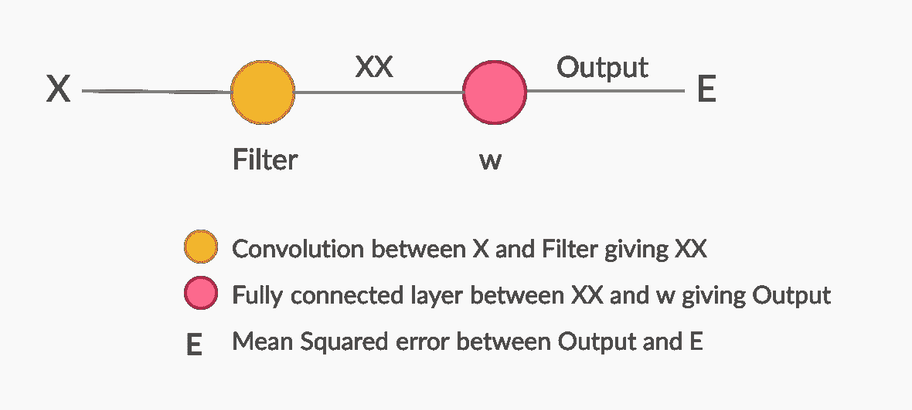

作者图片

## 前进传球

x 是输入图像，比如说(3*3 矩阵)，滤波器是 a (2*2 矩阵)。两者都将被卷积以给出输出 XX (2*2 矩阵)。

现在，XX 将被拉平，并馈入一个以 w (1*4 矩阵)为权重的全连通网络，该网络将给出一个—输出。

最后，我们将通过计算 Y(预期)和输出(实际)之间的均方误差来计算误差。

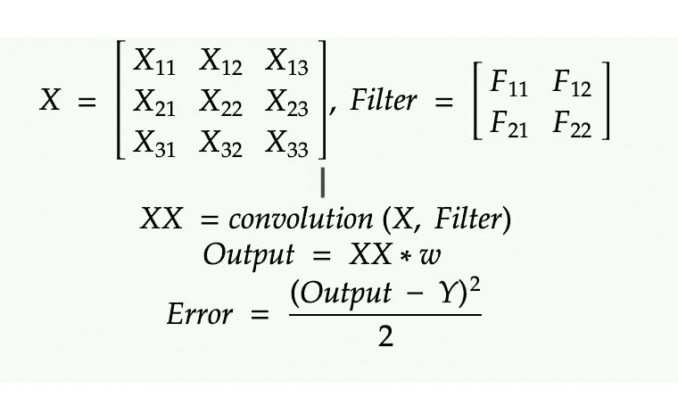

作者图片

我强烈建议你自己计算 XX。这会给你一个卷积层的直觉。

 [## 人类的未来是基因工程和神经移植|数据驱动投资者

### 领先的技术、音乐和电影节将于 2020 年 3 月 13 日至 22 日举行。它将以前沿的谈话为特色…

www.datadriveninvestor.com](https://www.datadriveninvestor.com/2020/01/13/the-future-of-humanity-is-genetic-engineering-and-neural-implants/) 

## 偶数道次

*向后传递的目标是选择* ***滤镜*******w****这样我们就可以减少* ***E*** *了。基本上，我们的目标是如何改变 w 和滤波器，使 E 降低。**

*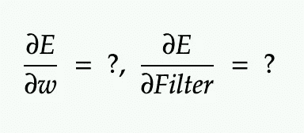*

*作者图片*

****让我们从第一个学期开始。****

*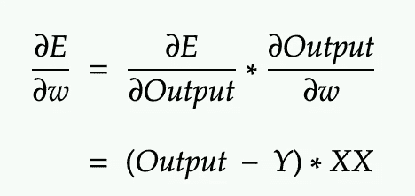*

*作者图片*

*猜猜怎么回事？！*

*第 1 行:使用链式法则。
第二行:运用微分学。花一分钟在这上面。应该很容易理解。如果不是查我以前的[文章](https://medium.com/datadriveninvestor/neural-network-maths-in-5-minutes-f385eeddf783)(前提中提到的)。或者检查这个[一个](https://medium.com/@pavisj/convolutions-and-backpropagations-46026a8f5d2c)。*

*在下一步之前，一定要确保你自己做了这些计算。如果这不容易理解，请评论。*

****移到第二学期。****

*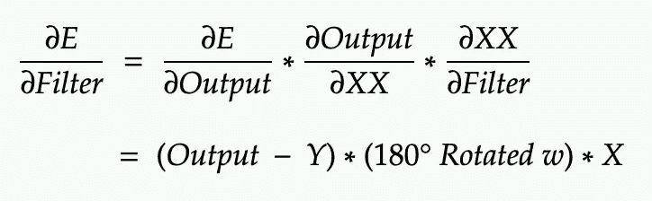*

*作者图片*

*不在办公室/假面骑士..这里有太多奇怪的逻辑吗？跟着我，会帮助你理解这一点。*

*第 1 行:基本链规则
第 2 行:第一项和第三项位于上述计算本身的线上。再次花一分钟或在纸上做它来理解这一点。*

*现在，这个**转 w** 到底是什么鬼！？我花了很长时间才明白这是怎么计算出来的。为此，您只需按照提到的顺序浏览这些概念。*

1.  *转置卷积—输出为[1*1 矩阵]，XX 为[1*4 矩阵(因为这里被扁平化)]，对。所以，当我们反向传播时，我们增加了矩阵的大小。[转置卷积有助于此。](https://www.youtube.com/watch?v=96_oGE8WyPg)快进视频，看看他们进行转置卷积的逻辑。*
2.  *现在深呼吸，通读[和](https://medium.com/@pavisj/convolutions-and-backpropagations-46026a8f5d2c)。**这是理解计算输出如何随过滤器和 x 变化的直觉的最重要的一个**粘贴上面文章的结论。JFYI，不要被全卷积弄糊涂了，它只不过是转置卷积(你刚刚在上面理解的)。*

*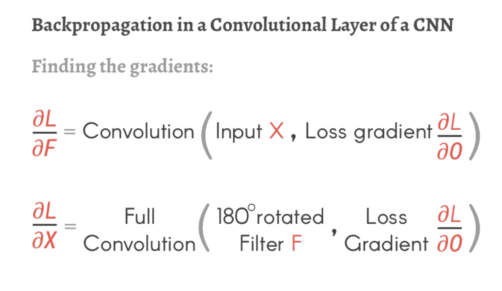*

*[来源](https://medium.com/@pavisj/convolutions-and-backpropagations-46026a8f5d2c)*

*最后，我们可以像这样减小滤波器和 w 值。*

*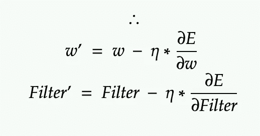*

*作者图片*

# *场景 2–2 个卷积层+ 1 个全连接层*

*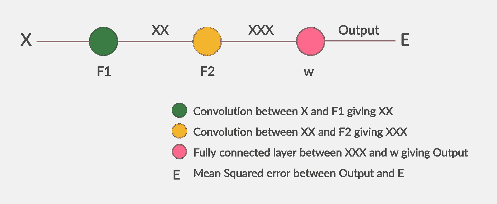*

*作者图片*

*现在，添加尽可能多的卷积层，我们的方法将保持不变。像往常一样，目标是:*

*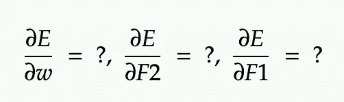*

*作者图片*

*前面两项我们已经计算过了。让我们看看最后一个学期的公式是什么。*

*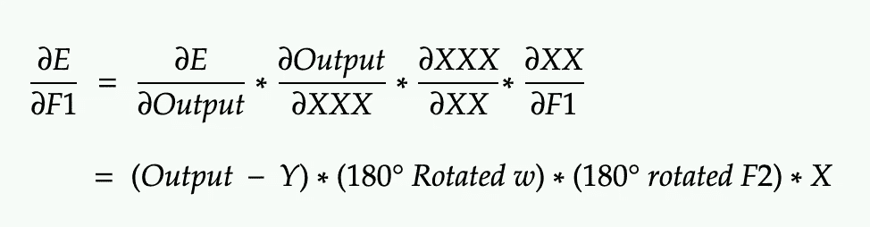*

*作者图片*

*以防你需要深入研究这个。我推荐这篇[文章](/only-numpy-understanding-back-propagation-for-transpose-convolution-in-multi-layer-cnn-with-c0a07d191981)。并相应地计算新的 F1、F2 和 w。*

# *场景 3—最大池层如何？？*

*最大池是 CNN 的一个重要概念，反向传播是如何实现的？*

*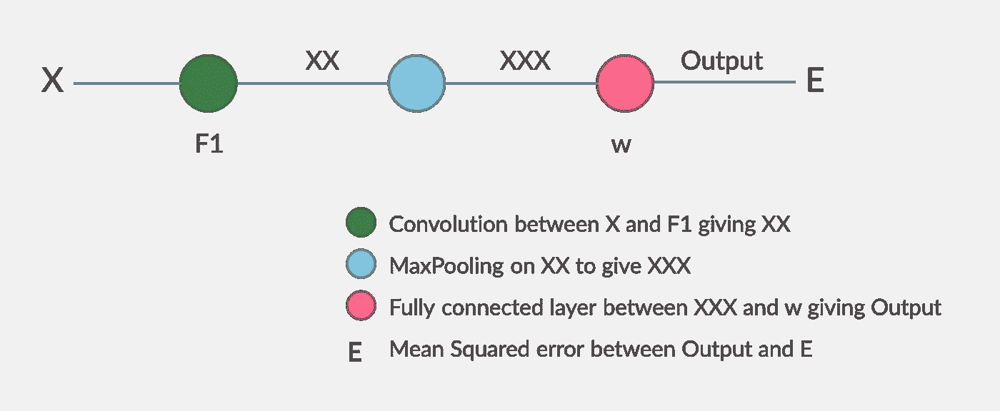*

*作者图片*

*仔细想想，max pooling layer 中没有像 filters 这样的变量。所以，我们不需要在这里调整任何值。*

*但是，它影响了我以前的层，对不对？！它通过将矩阵中的几个元素合并成一个数字来减小矩阵的大小。基本上，它确实会影响反向传播。它说有非最大值的值不会有任何梯度。*

*所以，我们在这里说的是，所有没有最大值的值都是 0。更有[深度](https://medium.com/the-bioinformatics-press/only-numpy-understanding-back-propagation-for-max-pooling-layer-in-multi-layer-cnn-with-example-f7be891ee4b4)。*

*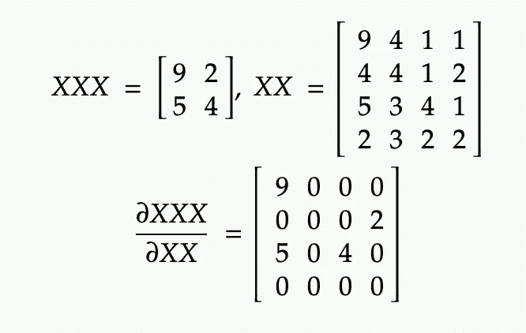*

*作者图片*

*已经尝试把所有好的相关文章放在一个地方，并帮助你看到卷积的全貌。请仔细阅读以上内容，如果在整个流程中仍然缺少一些东西，请告诉我——我很乐意编辑它以适应相同的内容。*