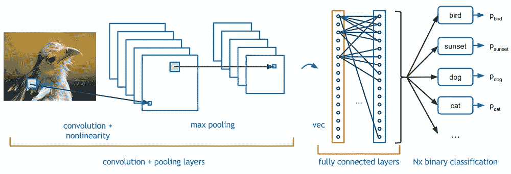
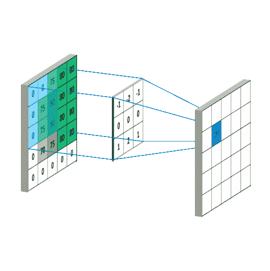
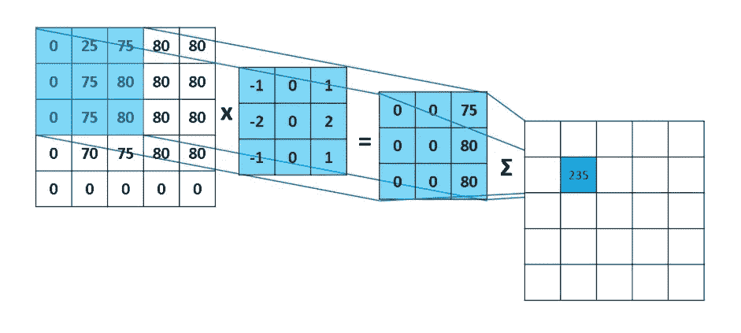
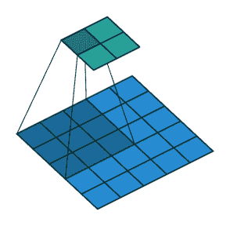
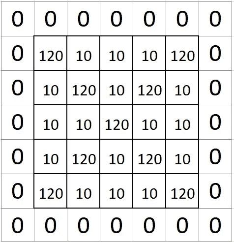
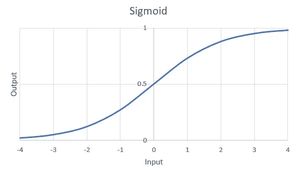
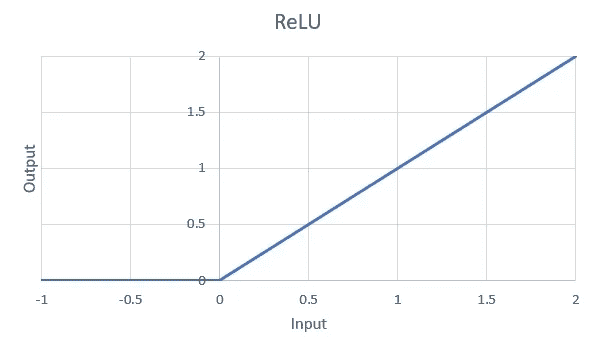
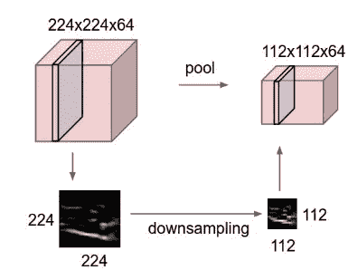
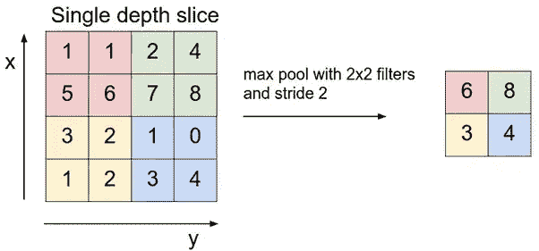
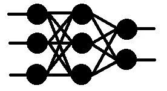

# 卷积神经网络

> 原文：<https://towardsdatascience.com/convolutional-neural-network-1368ee2998d3?source=collection_archive---------36----------------------->

## 理解层背后的直觉

1950 年，艾伦·图灵提交了一篇名为 ***的论文图灵测试，*** 其中他为机器被称为智能机器奠定了基础。尽管在人工智能领域取得了突破，但即使在今天，机器也不能被视为智能的。神经网络是人工智能的一个领域，旨在模仿人体的大脑结构。人工神经网络(ANN)是神经网络的一种基本类型，它能有效地发现数据中的隐藏模式并给出结果。

> 注意:本文假设读者对神经网络有基本的了解

> 一个问题仍然存在，即使机器可以处理和理解给它们的数据，但它们有能力像人类一样看东西吗？

**是的！为机器提供视觉似乎是一件荒谬的事情，但一种叫做 ***卷积神经网络*** 的神经网络赋予了机器部分视觉。**

既然一个图像只是数值像素值的集合，ANN 的就不能处理吗？这个问题的答案是**不！**虽然人工神经网络对数值数据分类很好，但在处理图像时缺乏对空间关系的考虑。我来简化一下。在处理图像列表时，如果 ANN 发现一只猫出现在一幅图像的右上角，那么它将假设它将一直出现在那里。因此，无论你的猫在图像的哪个位置，如果它不能在右上角找到它，那么它将给出一个否定的结果。

另一方面，卷积神经网络，也称为 ***ConvNet*** 在图像中的任何地方寻找物体时表现都异常出色。还有，如果你的猫脾气暴躁也不用担心，它还是会识别的。

图片来源:Adesh desh pande via[GitHub](https://github.com/adeshpande3/adeshpande3.github.io/blob/master/assets/Cover.png)(麻省理工)

上图展示了 ConvNet 的基本架构，其中包含池化、FC 层、卷积等术语，乍一看似乎令人不知所措。本文旨在揭开这些术语的神秘面纱，并获得使用它们背后的直觉。

***入门，先来了解一下我们在给网络喂什么！***

安德烈·迈克在 [Unsplash](https://unsplash.com/t/nature?utm_source=unsplash&utm_medium=referral&utm_content=creditCopyText) 上的照片

我们看到的图像看起来很迷人。但机器不是这么看的。它将其视为代表颜色通道强度值的数字像素值的集合。这张图片的尺寸是 5999 x 4000 x 3；其中 3 表示颜色通道的数量，即 RGB。其他颜色通道可以是 HSV、灰度等等。

## 机器如何从像素值中提取特征？

在数学中，一个称为卷积的概念将两个函数考虑在内，并产生第三个函数来表达一个函数的形状如何受另一个函数的影响。想象一下将滤镜应用到照片上。这里发生的是，它采取你的照片，并应用过滤器的功能，这可能是为了突出阴影。滤镜激活图像的某些功能，并生成输出图像。

***那么问题来了，这些滤镜是什么？*** 滤镜只不过是具有特定值的 3D 矩阵，当它们在附近看到想要的图案时会变得兴奋。它们比在图像的宽度和高度上滑动的输入图像小得多。

用 3×3 滤波器对 5×5 图像进行卷积运算。摄影:Rob Robinson on [MLNoteBook](https://mlnotebook.github.io/img/CNN/convSobel.gif)

当滤镜滑过图像时，它会聚焦在图像的某个邻域。它执行过滤器和图像部分的算术运算，并将结果存储在单个单元格中。在技术术语中，细胞被视为**神经元**。多个这样的神经元，当组合在一起时，形成了一个 2D 矩阵，称为**激活图/特征图，**或者更确切地说，我会说是来自图像的过滤器的喜好的集合**。**单个神经元指向的邻域称为**局部感受野。**

算术运算和局部感受野。Rob Robinson 在 [MLNoteBook](https://mlnotebook.github.io/post/CNN1/) 上拍摄的照片

这个特征图是一个过滤器提取特征的结果。对于卷积图层，会使用多个要素，进而生成多个要素地图。要素地图堆叠在一起，作为输入传递给下一个图层。

> 过滤器的数量越多，特征图的数量就越多，特征的提取就越深入。

## 输出图像的大小会发生什么变化？

卷积运算。图片作者: [GitHub](https://github.com/vdumoulin/conv_arithmetic/blob/master/gif/no_padding_strides.gif) 上的 [vdumoulin](https://github.com/vdumoulin) (麻省理工学院)

卷积运算后，输出图像的尺寸必然会减小。控制输出音量大小的参数是步幅、滤波器大小和填充。

1.  **步幅**:步幅是我们滑动滤镜时移动的像素数。当步幅为 2 时，我们将过滤器移动 2 个像素。步幅越高，输出音量越小。通常，我们将步幅设置为 1 或 2。
2.  **过滤器大小**:当我们增加过滤器大小时，我们间接增加了单个神经元中存储的信息量。在这种情况下，滤镜在图像上移动的次数会减少。这将最终导致输出体积的空间尺寸的减小。

填充 1

3.**填充**:顾名思义，它在原始图像周围添加一个无关紧要的覆盖物，以保持输出图像的大小不变。使用公式 ***计算要添加的层数 P=(((O-1)*S)+F-W)/2*** 其中 O 是输出图像的大小，W 是输入图像的大小，F 是滤波器大小，P 是要作为填充添加的层像素的数量，S 是跨距。例如，如果输入图像的大小是 5×5，过滤器的大小是 3×3，步幅是 1，并且我们希望输出图像的大小与输入图像的大小相同，则有效填充将是 1。

现在我们已经完成了图片的大部分工作，是时候考虑下一步了。

我们渴望让我们的神经网络变得灵活，也就是说，无论数据是什么，它都应该足够有效地从数据中进行识别。由于我们拥有的特征地图可以用一些线性函数来表示，不确定性因素似乎消失了。我们需要函数将不确定性，或者我应该说是非线性引入我们的神经网络。

有许多函数能够执行此任务，但这两个函数被广泛使用。

**Sigmoid** :它使用 g(z)=1/1+e⁻ᶻ函数引入非线性，该函数将数字转换为 0-1 之间的范围。Sigmoid 函数的主要问题之一是 ***消失梯度问题*** 。如果你不熟悉这个术语，不要担心。由奇-汪锋撰写的这篇[文章](/the-vanishing-gradient-problem-69bf08b15484)解释了渐变消失的现象。

Sigmoid 函数图

**ReLU:** ReLU 代表整流线性单元。它使用函数 ***g(w)=max(0，w)将输入阈值设为 0。***ReLU 的性能也优于 Sigmoid 函数，它部分解决了消失梯度问题。虽然 ReLU 所遭受的一个问题是 [***垂死的 ReLU***](https://www.quora.com/What-is-the-dying-ReLU-problem-in-neural-networks?share=1)*问题，但它的变体 [**泄漏的 ReLU**](https://medium.com/@himanshuxd/activation-functions-sigmoid-relu-leaky-relu-and-softmax-basics-for-neural-networks-and-deep-8d9c70eed91e) 解决了这个问题。*

**

*ReLU 函数的一个图*

*既然我们已经使我们的网络强大到足以适应变化，我们可以把注意力集中在计算时间的另一个问题上。如果你还记得，我们的图像的尺寸是 5999 x 4000 x 3，对于一个单独的图像来说有 71，988，000 个像素值，我们有很多这样的图像。虽然机器的速度非常快，但处理这些数量庞大的像素值需要相当长的时间。*

*一个基本的本能是在群体中选择一个主导价值。这是通过机器使用称为**池的操作来实现的。***

**

*图像的缩减采样。图片来自 [Github](https://cs231n.github.io/) (麻省理工学院)*

*我们定义一个池窗口，比如说 2 x 2。类似于过滤器，该窗口在图像上滑动，并从窗口中选择一个主导值。**主导**的定义随着方法而变化。*

*其中一种方法是 **Max Pooling** ，这是一种广泛流行的方法，从窗口内的图像中选择最大值。这将尺寸减小到 25%。其他汇集方法包括**平均汇集**、**矩形邻域的 L2 范数**，其不同之处在于选取主导值的方法。*

**

*最大池化。图片来自 [Github](https://cs231n.github.io/) (麻省理工学院)*

*因此，拥有 ***池层*** 的主要动机是为了降维。虽然，已经有关于移除池层并用卷积层代替它的讨论。[力求简单:全卷积网](https://arxiv.org/abs/1412.6806)提出了一个这样的架构，他们建议偶尔使用更大的步幅来减少初始表示的维数。*

*人工神经网络和 CNN 之间的关键区别是 CNN 处理图像中空间关系的能力，除此之外，两者的计算能力是相同的。既然我们已经提供了一个使用卷积、激活和汇集来处理空间关系的平台，我们现在可以利用 ANN 的能力。*

****全连接层*** 是常规神经网络或多层 Perceptron (MLP)的代表。*

**

*多层感知器*

*使用这些层的主要思想是通过卷积层和池层提取的高级特征的非线性组合进行学习。在训练网络时，神经元之间的权重作为一个参数，在训练时进行调整。由于这一层接受 1D 矢量形式的输入，我们需要 ***展平*** 来自先前层的输出，以馈送到 FC 层。*

*在分类多个类别的情况下，该层的输出是每个类别的真实值。为了从这些值中获得一些洞察力，使用了 ***Softmax 函数*** 。更多关于 Softmax 功能的信息可以在这里找到[。它将这些真实值转换成类别概率。然后提取概率最高的类别作为预测类别。](https://victorzhou.com/blog/softmax/)*

*虽然这些不是构建 CNN 时使用的唯一层，但它们是它的基本构件。根据问题的性质，可以添加多种其他类型的图层，例如缺失图层和归一化图层。*

*有许多 CNN 架构已经被证明在图像分类上表现得非常好。其中几个是:*

1.  *AlexNet*
2.  *VGGNet*
3.  *雷斯内特*
4.  *开始*
5.  *DenseNet*

* [## AlexNet、VGGNet、ResNet、Inception、DenseNet 的架构比较

### ILSVRC 挑战结果中具有超参数和准确性的图层描述

towardsdatascience.com](/architecture-comparison-of-alexnet-vggnet-resnet-inception-densenet-beb8b116866d) 

虽然这些架构已经可以使用了，但是我强烈建议您尝试一下这些架构，并构建一个您自己的架构。* 

****感谢阅读！希望这篇文章有助于获得关于卷积神经网络的基本直觉。如有任何反馈或建议，可通过我的*** [***邮箱***](mailto:gpithadia@gmail.com)*[***LinkedIn******联系我。我很想听听！***](https://www.linkedin.com/in/geetpithadia3/)**

**下一篇文章将关注 CNN 的一个端到端例子！**

*****快乐学习！*****