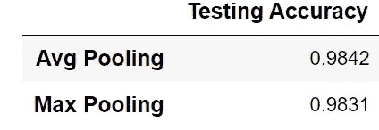

# 卷积神经网络冠军第 1 部分:LeNet-5 (TensorFlow 2.x)

> 原文：<https://towardsdatascience.com/convolutional-neural-network-champions-part-1-lenet-5-7a8d6eb98df6?source=collection_archive---------30----------------------->

## 关于最流行的卷积神经网络(CNN)架构的多部分系列的第 1 部分，包含可复制的 Python 笔记本。


查尔斯·德鲁维奥在 [Unsplash](https://unsplash.com/s/photos/fingers?utm_source=unsplash&utm_medium=referral&utm_content=creditCopyText) 上拍摄的照片

卷积神经网络是一种特殊类型的神经网络，用于对具有强空间相关性的数据进行建模，例如图像、多元时间序列、地球科学研究(地震分类和回归)以及许多其他应用。自 1998 年以来，卷积网络经历了重大变化，在这一系列文章中，我旨在再现著名的模型架构冠军，即 LeNet、AlexNet、Resnet。我的目标是与更广泛的受众分享我的发现和研究，并提供可复制的 Python 笔记本。

**第二部分:**ImageNet 和 Tensorflow 上的 AlexNet 分类:

[](/convolutional-neural-network-champions-part-2-alexnet-tensorflow-2-x-de7e0076f3ff) [## 卷积神经网络冠军第 2 部分:AlexNet (TensorFlow 2.x)

### 关于最流行的卷积神经网络(CNN)架构的多部分系列的第 2 部分…

towardsdatascience.com](/convolutional-neural-network-champions-part-2-alexnet-tensorflow-2-x-de7e0076f3ff) 

**第三部分**:ImageNet 和 Tensorflow 上的 VGGnet 分类:

[](/convolutional-neural-network-champions-part-3-vggnet-tensorflow-2-x-ddad77492d96) [## 卷积神经网络冠军第 3 部分:VGGNet (TensorFlow 2.x)

### 这个多部分系列的第 3 部分介绍了最流行的卷积神经网络(CNN)架构，包括…

towardsdatascience.com](/convolutional-neural-network-champions-part-3-vggnet-tensorflow-2-x-ddad77492d96) 

> **用于这项研究的 Python 笔记本位于我的**[**Github**](https://github.com/anejad/Convolutional-Neural-Network-Champions)**页面。**
> 
> **本研究使用的 Tensorflow 版本为 1.15.0。**
> 
> **本研究中使用的机器采用英特尔酷睿 I7 处理器，1.8 GHZ，16 GB 内存。**

对图像应用卷积层(也称为“ConvNet”)并提取图像的关键特征进行分析是 conv net 的主要前提。每次将“Conv 层”应用于图像并将该图像分成称为感受野的小片，从而从图像中提取重要特征并忽略不太重要的特征。内核通过将其元素与感受野的相应元素相乘，使用一组特定的权重与图像进行卷积。通常将“合并图层”与 Conv 图层结合使用，以对卷积后的要素进行缩减采样，并降低模型对输入中要素位置的敏感度。

最后，向模型中添加密集块并公式化问题(分类和/或回归)，可以使用典型的梯度下降算法(如 SGD、ADAM 和 RMSprop)来训练这种模型。

当然，在 1998 年之前，卷积神经网络的使用是有限的，通常支持向量机是图像分类领域的首选方法。然而，当乐纯等人[98]发表了他们关于使用基于梯度的学习进行手写数字识别的工作后，这种说法发生了变化。

# 数据

LeNet 模型是基于 MNIST 数据开发的。该数据集由手写数字 0-9 组成；六万幅图像用于模型的训练/验证，然后一千幅图像用于测试模型。该数据集中的图像大小为 28×28 像素。下图中可以看到一个例子。使用 MNIST 数据集的挑战在于，数字在形状和外观上经常会有细微的变化(例如，数字 7 的写法不同)。


MNIST 数据示例

查看 MNIST 数据集中的标签，我们可以看到标签的数量是平衡的，这意味着没有太大的差异。


MNIST 数据集中的标签计数

# 网络结构


LeCun 等人[98]，LeNet5 网络的建议结构

LeNet-5 的建议模型结构有 7 层，不包括输入层。如数据部分所述，该模型中使用的图像是 MNIST 手写图像。提议的结构可以在上面的图片中看到，取自乐纯等人[98]的论文。每层的详细信息如下:

1.  **图层 C1** 是第一个 Conv 图层，有 6 个特征地图，跨度为 1。使用附录中给出的公式，可以用 156 个可训练参数计算该层 28×28 的输出尺寸(详情请参考附录 1)。该层的激活功能为`tanh` (详见附录 2)。
2.  **层 S2** 是一个平均汇集层。该图层将上一个 Conv 图层的平均值映射到下一个 Conv 图层。汇集层用于降低模型对要素位置的依赖性，而不是对要素形状的依赖性。LeNet 模型中的池层大小为 2，跨度为 2。
3.  **层 C3** 是第二组卷积层，有 16 个特征图。该层的输出维数是 10，有 2416 个参数。这一层的激活功能是`tanh`。
4.  **层 S4** 是另一个平均池层，维度为 2，步长为 2。
5.  下一层负责将前一层的输出展平为一维数组。该层的输出尺寸为 400 (5×5×16)。
6.  **层 C5** 是一个密集块(全连通层)，有 120 个连接，48120 个参数(400×120)。这一层的激活功能是`tanh`。
7.  **层 F6** 是另一个 84 参数，10164 参数(84×120+84)的致密区块。这一层的激活功能是`tanh`。
8.  **输出层**有 10 个维度(等于数据库中的类别数)，850 个参数(10×84+10)。输出层的激活函数是`sigmoid` (详见附录 2)。

以下代码片段演示了如何使用 Tensorflow/Keras 库在 Python 中构建 LeNet 模型。Keras `sequential` 模型是层的线性堆叠。然后，我们需要定义每一层，如下所示。最后，需要编译模型，并且需要明确定义优化器、损失函数和指标的选择。这项工作中使用的优化器是`sgd` 或随机梯度下降。损失函数被优化以训练机器学习模型。这里使用的损失函数是交叉熵或对数损失，用于测量分类模型的性能，其输出是 0 到 1 之间的概率值。准确性度量用于评估培训的表现。损失函数是一个连续的概率函数，而准确度是正确预测的标签数除以预测总数的离散函数(参见附录 3)。

LeNet-5 层结构

请注意，在上面的代码片段中，我们没有指定任何关于如何初始化神经网络权重的内容。默认情况下，Keras 使用一个`glorot_uniform`初始化器。权重值是随机选择的，以确保通过网络传递的信息可以被处理和提取。如果权重太小，信息会因此缩小。如果权重太大，信息就会增长，变得太大而无法处理。Glorot 统一算法(也称为 Xavier 算法)从多元随机正态分布中选择适当的随机权重值，该随机正态分布根据神经网络的大小进行缩放[参见 Glorot 2010]。

用 Tensorflow 构建的 LeNet-5 网络总结如下(使用`model.summary()`):

```
Model: "sequential"
_________________________________________________________________
**Layer (type)                 Output Shape              Param #** 
=================================================================
conv2d (Conv2D)              (None, 28, 28, 6)         156       
_________________________________________________________________
average_pooling2d (AveragePo (None, 14, 14, 6)         0         
_________________________________________________________________
conv2d_1 (Conv2D)            (None, 10, 10, 16)        2416      
_________________________________________________________________
average_pooling2d_1 (Average (None, 5, 5, 16)          0         
_________________________________________________________________
flatten (Flatten)            (None, 400)               0         
_________________________________________________________________
dense (Dense)                (None, 120)               48120     
_________________________________________________________________
dense_1 (Dense)              (None, 84)                10164     
_________________________________________________________________
dense_2 (Dense)              (None, 10)                850       
=================================================================
Total params: 61,706
Trainable params: 61,706
Non-trainable params: 0
_________________________________________________________________
```

现在我们已经使用 Tensorflow 和 Keras 构建了 LeNet 模型，我们需要训练该模型。使用`model.fit()`和 feeding 训练和验证集，对模型进行训练。训练所需的附加参数是时期数、批量大小和详细信息:

*   一个时期是训练数据的一个完整呈现。从训练数据集中随机选择样本，并呈现给模型进行学习。因此，一个时期代表整个训练数据集的一个周期。
*   如前所述，一个时期指的是将数据完整地呈现给模型。训练数据是随机选择的，并输入到模型中。随机选择的数据中样本的数量称为批量。与较大的批量相比，较小的批量会产生噪声，但它们可能会很好地概括。较大的批处理大小用于避免内存限制问题，尤其是在使用图形处理单元(GPU)时。
*   Verbose 指定输出日志记录的频率。如果设置为 1，将打印每个迭代模型损失。

培训代码片段。注意`**to_categorical**` 命令用于将一个类向量转换成二进制类矩阵。

一旦模型被训练，我们就可以使用我们已经准备好的测试集，通过使用`model.evaluate()`命令来评估模型训练的性能:

测试代码片段

下图显示了 10 个时期的模型训练结果。最初，随机选择神经网络的权重，但是在向模型呈现 48，000 张图片的 2 个时期之后，模型损失从 0.38 减少到 0.1。经过 10 个周期的模型训练，模型在测试集上的准确率超过了 95%。与当时以前的模型(主要是支持向量机)相比，这是一个大幅提高的准确性，因此 LeNet-5 巩固了其作为计算机视觉最早冠军之一的遗产。


LeNet-5 训练结果(10 个时期)

使用`model.optimizer.get_config()`,我们可以询问优化器参数。注意，我们只指定了优化器的类型、损失函数和准确性指标。从下面的代码片段可以看出，用于训练 LeNet 模型的优化器是一个随机梯度下降(SGD)优化器。`learning rate`默认设置为 0.01。学习率响应于由损失函数测量的观测误差来控制模型参数的变化。想象模型训练过程是从一座山到一座谷，学习率定义步长。步长越大，遍历解的速度越快，但可能导致跳过解。另一方面，步长越小，收敛时间越长。在比较复杂的问题中，步长常用`decay`。然而，在这个问题中，没有衰变足以得到好的结果。使用 SGD 的另一个参数是`momentum`。动量不是只使用当前步骤的梯度来引导搜索，而是累积过去步骤的梯度来确定前进的方向。因此，动量可以用来提高 SGD 的收敛速度。另一个参数是`nesterov`。如果设置为 true(布尔值)，SGD 将启用内斯特罗夫加速梯度(NAG)算法。NAG 也是一种与动量密切相关的算法，其中步长使用学习率变化的速度进行修改(参见内斯特罗夫[1983])。

```
model.optimizer.get_config():
{'name': 'SGD',
 'learning_rate': 0.01,
 'decay': 0.0,
 'momentum': 0.0,
 'nesterov': False}
```

# 模型询问

有多种方法可以评估分类器的性能。从任何模型开发任务中获得的测试数据集的准确性性能是显而易见的选择。然而，混淆矩阵可以提供分类器的详细报告，并更好地评估分类性能。此外，如果每个类别中存在不相等数量的观察值，分类精度可能会产生误导。

混淆矩阵是正确/错误分类的样本数量的详细报告。沿着混淆矩阵对角线的样本数是正确预测的样本。所有其他样本都被误分类了。对角线上的样本数量越多，模型精度越高。从 MNIST 数据集上 LeNet-5 的混淆矩阵可以看出，大部分类别被正确分类。然而，在少数情况下，分类器很难正确地对标签进行分类，例如标签 5、4 和 8。例如，在 16 种情况下，分类器错误地将数字 2 分类为数字 7。下图描述了上述情况。


LeNet-5 混淆矩阵


误分类标签示例

# 优化器的选择

在前面的部分中，提到了 SGD 优化器用于这个优化的神经网络模型。然而，由于 SGD 的收敛速度慢和陷入局部极小值的问题，这种方法并不流行。自推出以来，自适应矩估计 aka Adam(有关更多详细信息，请参考 Kingma 等人[2014])在深度学习领域非常受欢迎。Adam 优化算法是随机梯度下降的扩展，其中动量默认应用于梯度计算，并为每个参数提供单独的学习速率。使用 Adam optimizer 并从头开始重新训练 LeNet-5，模型准确性可以提高到 98%，如以下学习曲线所示:


使用 Adam 优化器的 LeNet-5 训练结果(10 个时期)。

# 批量大小的影响

批量是神经网络训练中最重要的超参数之一。如前一节所述，神经网络优化器在每个训练时期随机选择数据并将其提供给优化器。所选数据的大小称为批量大小。将批量大小设置为训练数据的整个大小可能会导致模型无法对之前没有见过的数据进行很好的概括(参考 Takase 等人[2018])。另一方面，将批处理大小设置为 1 会导致更长的计算训练时间。批量大小的正确选择特别重要，因为它导致模型的稳定性和准确性的提高。以下两个条形图展示了从 4 到 2，048 的各种批量的测试精度和训练时间。该模型对批量 4-512 的测试准确率在 98%以上。然而，批量大小 4 的训练时间是批量大小 512 的训练时间的四倍以上。对于具有大量类和大量训练样本的更复杂的问题，这种影响可能更严重。


批量大小对模型准确性(上图)和训练时间(下图)的影响

# 汇集层的影响

如前所述，需要池层对要素地图中的要素检测进行下采样。有两个最常用的池操作符:平均池和最大池层。平均池层通过计算要素图中所选修补的平均值来运行，而最大池层计算要素图的最大值。

最大池操作如下图所示，通过从特征映射中选择最大特征值来工作。最大池化图层会歧视激活函数不太重要的要素，并且仅选择最高值。这样，只有最重要的功能才通过池层提供。最大池化的主要缺点是池化算子在具有高量值特征的区域中，仅选择最高值特征，而忽略其余特征；执行最大池化操作后，明显的特征消失，导致信息丢失(下图中的紫色区域)。


最大池操作

另一方面，平均池的工作方式是计算要素地图所选区域中要素的平均值。特征图中所选区域的所有部分都使用平均池来馈通。如果所有激活的幅度都很低，则计算出的平均值也会很低，并且由于对比度降低而上升。当池区域中的大多数激活都带有零值时，情况会变得更糟。在这种情况下，特征映射特征将大量减少。


平均联营业务

如前所述，最初的 LeNet-5 模型使用平均池策略。将平均池策略改为最大池策略在 MNIST 数据集上产生了大致相同的测试准确度。人们可以争论不同的池层的观点。但是，应该注意的是，与其他复杂的数据集(如 CIFAR-10 或 Imagenet)相比，MNIST 数据集相当简单，因此最大池化在此类数据集中的性能优势要大得多。



平均池策略和最大池策略的比较

# 特征旋转和翻转的效果

到目前为止，我们已经探索了 LeNet-5 模型的不同方面，包括优化器的选择、批量大小的影响和池层的选择。LeNet-5 模型是根据 MNIST 数据设计的。正如我们到目前为止所看到的，数字在每个图像中居中。然而，在现实生活中，数字在图像中的位置经常会发生移动、旋转，有时还会发生翻转。在接下来的几节中，我们将探讨 LeNet-5 模型对图像翻转、旋转和移动的图像增强和灵敏度的影响。图像增强是在 Tensorflow 图像处理模块`[tf.keras.preprocessing](https://keras.io/api/preprocessing/image/).`的帮助下完成的

**翻动的效果**

在本练习中，使用`ImageDataGenerator (horizontal_flip=True)`沿水平轴翻转图像。应用`ImageDataGenerator`测试新数据集中的图像结果，图像水平翻转，如下图所示。可以看出，预期该模型在翻转图像数据集上具有低精度。从测试准确率表可以看出，LeNet-5 模型的准确率从 98%下降到 70%。


测试翻转图像的准确性

仔细观察翻转图像数据集的混淆矩阵，可以发现一些有趣的东西。最高精度的标签是 0、1、8 和 4。前三个标签是对称的(0，1，8 ),因此模型对此类具有良好的预测准确性。但有趣的是，LeNet-5 模型在标签 4 上有很好的分类精度。这项测试的另一个有趣的方面是模型如何识别数字。例如，在翻转的数据集中，模型遭受准确性的标签之一是 3。该模型几乎有一半的时间将它误归类为数字 8。理解模型如何识别每个数字对于建立一个健壮的分类器是非常有用的。像 [SHAP](https://github.com/slundberg/shap/blob/master/README.md) 这样的包可以提供理解任何深度神经网络模型的输入输出映射的手段(在 SHAP 库中找 DeepExplainer 模块)。


翻转图像预测的混淆矩阵

**图像旋转**

图像旋转是现实生活中另一个可能的场景。数字可以以相对于图像边界的角度书写。使用 Tensorflow 图像增强模块，可以使用下面的代码行生成随机旋转的图像:`ImageDataGenerator(rotation_range=angle)`。下图是 LeNet-5 模型在各种随机旋转图像下的测试结果。旋转越多，模型的预测越差。有趣的是，模型预测对于高达 20 度的旋转是相当令人满意的，然后预测迅速退化。


LeNet-5 在随机旋转图像上的预测

**换挡的效果**

一个最终的图像增强效果是沿着图像内的水平或垂直轴移动手指。使用`ImageDataGenerator(width_shift_range=shift)`，这种效果可以很容易地应用于 MNIST 测试数据集。请注意，在本节中，我将演示`width_shift` 生成器的结果。LeNet-5 网络对宽度偏移的敏感度远高于图像翻转和图像旋转。从下图中可以看出，精度下降的速度比其他讨论过的图像增强过程要快得多。仅仅 10 度的宽度偏移就导致准确度从超过 95%下降到大约 48%。这种影响可能归因于模型的过滤器大小和核维数。


LeNet-5 在随机移位图像上的预测

# 在 CIFAR-10 数据集上的性能

正如我们从前面所有章节中看到的，LeNet-5 模型在手写数字识别中实现了一个重要的里程碑。由于其在分类问题上的优越性能，LeNet-5 模型在 20 世纪 90 年代中期被用于银行和 ATM 机的自动数字分类。然而，该模型的下一个前沿是解决图像识别问题，以识别图像中的各种对象。

在这最后一部分，我们的目标是在 CIFAR-10 数据集上训练 LeNet-5。CIFAR-10(加拿大高级研究所)是一个已建立的计算机视觉数据集，包含 60，000 幅彩色图像，大小为 32×32，包含 10 个对象类，如下图所示。这 10 个不同的类别代表飞机、汽车、鸟、猫、鹿、狗、青蛙、马、船和卡车。从下面的图片可以看出，图片的复杂程度远远高于 MNIST。


CIFAR-10 数据集

将 LeNet-5 结构应用于该数据集并训练该模型 10 个时期，得到 73%的准确度。该模型的测试准确率为 66%。考虑到人类在该数据集上的准确率约为 94%(根据 Ho-Phuoc [2018])，LeNet-5 类型结构的效率不足以实现高识别能力。


LeNet-5 结构在 CIFAR-10 数据集上的性能

# 摘要

LeNet-5 为训练和分类手写数字提供了重要的框架。正如我们在前面的章节中所看到的，LeNet-5 结构尽管在光学字符识别任务中取得了许多成功的里程碑，但在图像识别任务中表现不佳。然而，**[**Yann andréle Cun**](http://yann.lecun.com/)和许多同时代的人为更复杂的神经网络模型结构和优化技术铺平了道路。在下一篇文章中，我将探讨和讨论另一个卷积神经网络结构冠军， **ALexNet。****

> ***感谢阅读！我叫* ***阿米尔·内贾德博士。*** *我是一名数据科学家和*[***QuantJam***](https://medium.com/quantjam)*的编辑，我喜欢分享我的想法并与其他数据科学家合作。可以在*[***Github***](https://github.com/anejad)*[***Twitter***](https://twitter.com/Dr_Nejad)***和*[***LinkedIn***](https://www.linkedin.com/in/amir-nejad-phd-8690a44b/)*上和我联系。******

****QuantJam:****

****[](https://medium.com/quantjam) [## QuantJam

### Quantjam 是一个媒体发布平台，提供金融、算法交易和…

medium.com](https://medium.com/quantjam) 

你可以在以下网址看到我的其他作品:

[](http://amirnejad.medium.com/) [## 阿米尔·内贾德-中等

### Python 在金融数据集中的多部分时间序列分析时间序列是一系列数据…

amirnejad.medium.com](http://amirnejad.medium.com/) 

# 附录(1)层尺寸

计算卷积神经网络输出维数的公式:


计算参数数量的公式:


使用上面的两个公式，可以计算 LeNet5 模型的输出维数和参数数目如下:


LeNet 尺寸和参数

# 附录(2)激活功能


tanh 激活函数


sigmoid 激活函数

# 附录(3)损失和精度函数

损失函数:


交叉熵函数

精度函数:


准确度函数

# 参考

*   *勒昆，y .，博图，l .，本吉奥，y .，哈夫纳，P. (1998d)。基于梯度的学习在文档识别中的应用。IEEE 会议录，86(11)，2278–2324。*
*   *神经网络的历史:*[*https://dataconomy.com/2017/04/history-neural-networks/*](https://dataconomy.com/2017/04/history-neural-networks/)
*   Khan，Asifullah，等人“深度卷积神经网络的最新架构综述”arXiv 预印本 arXiv:1901.06032 (2019)。

**优化器:**

*   S. J. Reddi，S. Kale 和 S. Kumar。亚当和超越的融合。在 2018 年国际学习代表大会上。
*   *随机梯度下降:*[*https://blog . paper space . com/intro-to-optimization-momentum-rms prop-Adam/*](https://blog.paperspace.com/intro-to-optimization-momentum-rmsprop-adam/)
*   金玛，迪德里克 P 和巴，吉米雷。亚当:一种随机优化方法。arXiv 预印本 arXiv:1412.6980，2014。
*   *损失函数:*[*https://ml-cheat sheet . readthedocs . io/en/latest/Loss _ functions . html*](https://ml-cheatsheet.readthedocs.io/en/latest/loss_functions.html)
*   纽约州内斯特罗夫市(1983 年)。收敛速度为 o(1/k2)的无约束凸极小化问题的一种方法。Doklady ANSSSR(翻译为 Soviet.Math.Docl .)，第 269 卷，第 543–547 页。

**批量大小:**

*   *T. TAKASE、S. OYAMA 和 M. KURIHARA。“为什么大批量训练会导致泛化能力差？一个全面的解释和一个更好的策略。载于:神经计算 30.7 (2018)，第 2005–2023 页*

**联营策略:**

*   夏尔马、沙鲁和拉杰什·梅赫拉。"卷积神经网络中汇集策略的含义:深刻的见解."计算与决策科学基础 44.3(2019):303–330。
*   *布鲁，Y-Lan，等人《问本地人:图像识别的多向本地汇集》2011 计算机视觉国际会议。IEEE，2011 年。*

**初始化**:

*   [*https://andyljones . Tumblr . com/post/110998971763/an-explain-of-Xavier-initial ization*](https://andyljones.tumblr.com/post/110998971763/an-explanation-of-xavier-initialization)
*   [*http://proceedings.mlr.press/v9/glorot10a/glorot10a.pdf*](http://proceedings.mlr.press/v9/glorot10a/glorot10a.pdf)

**混淆矩阵:**

*   [*https://deepai . org/machine-learning-glossary-and-terms/confusion-matrix*](https://deepai.org/machine-learning-glossary-and-terms/confusion-matrix)

MNIST:

*   [*http://yann.lecun.com/exdb/mnist/*](http://yann.lecun.com/exdb/mnist/)

**西法尔-10:**

*   [*https://www.cs.toronto.edu/~kriz/cifar.html*](https://www.cs.toronto.edu/~kriz/cifar.html)
*   克里日夫斯基、亚历克斯和杰弗里·辛顿。"从微小的图像中学习多层特征."(2009): 7.
*   *和珅，天。“CIFAR10 比较深度神经网络和人类之间的视觉识别性能。”arXiv 预印本 arXiv:1811.07270 (2018)。*

**张量流图像增强:**

*   [*https://machinelementmastery . com/how-to-configure-image-data-augmentation-when-training-deep-learning-neural-networks/*](https://machinelearningmastery.com/how-to-configure-image-data-augmentation-when-training-deep-learning-neural-networks/)

**SHAP**

*   [*https://github.com/slundberg/shap/blob/master/README.md*](https://github.com/slundberg/shap/blob/master/README.md)****