# 卷积神经网络冠军第 2 部分:AlexNet (TensorFlow 2.x)

> 原文：<https://towardsdatascience.com/convolutional-neural-network-champions-part-2-alexnet-tensorflow-2-x-de7e0076f3ff?source=collection_archive---------34----------------------->

## 关于最流行的卷积神经网络(CNN)架构的多部分系列的第 2 部分，包含可复制的 Python 笔记本

卷积神经网络是一种特殊类型的神经网络，用于对具有强空间相关性的数据进行建模，例如图像、多元时间序列、地球科学研究(地震分类和回归)以及许多其他应用。自 1998 年以来，卷积网络经历了重大变化，在这一系列文章中，我的目标是再现著名的模型架构冠军，如 LeNet、AlexNet、ResNet 等。我的目标是与更广泛的受众分享我的发现和研究，并提供可复制的 Python 笔记本。


信用:[https://unsplash.com/@cbarbalis](https://unsplash.com/@cbarbalis)

**第一部分:**tensor flow 中的 Lenet-5 和 MNIST 分类:

[](/convolutional-neural-network-champions-part-1-lenet-5-7a8d6eb98df6) [## 卷积神经网络冠军第 1 部分:LeNet-5

### 关于最流行的卷积神经网络(CNN)架构的多部分系列，具有可再现的 Python…

towardsdatascience.com](/convolutional-neural-network-champions-part-1-lenet-5-7a8d6eb98df6) 

**第三部分**:ImageNet 和 Tensorflow 上的 VGGnet 分类；

[](/convolutional-neural-network-champions-part-3-vggnet-tensorflow-2-x-ddad77492d96) [## 卷积神经网络冠军第 3 部分:VGGNet (TensorFlow 2.x)

### 这个多部分系列的第 3 部分介绍了最流行的卷积神经网络(CNN)架构，包括…

towardsdatascience.com](/convolutional-neural-network-champions-part-3-vggnet-tensorflow-2-x-ddad77492d96) 

> 用于这项研究的 Python 笔记本位于我的 [**Github**](https://github.com/anejad/Convolutional-Neural-Network-Champions/tree/master/AlexNet) 页面中。
> 
> 本研究中使用的 Tensorflow 版本为 2.3。

LeNet-5 模型展示了阅读和分类手写数字的卓越能力。尽管 LeNet-5 网络结构在 MNIST 数据集上表现良好，但对 CIFAR-10 等更复杂图像进行分类的实际测试表明，该模型学习如此复杂模式的能力太低。因此，更强大的架构的开发进入了休眠状态，直到 2012 年 AlexNet 诞生。AlexNet 被认为是第一个深度 CNN 模型，由 Krizhevesky 等人提出。在此期间，有几项发展抑制了神经网络分类准确性的提高，即:

1.  **Max pooling** : Pooling 层用于降低神经网络模型对图像中特征位置的敏感性。在最初的 LeNet-5 模型中，使用了平均池层。然而，Ranzato 等人[2007]通过使用最大池层学习不变特征展示了良好的结果。最大池化图层会歧视激活函数不太重要的要素，并且仅选择最高值。这样，只有最重要的特性才会通过池层提供。更多信息请参考本系列的第 1 部分([链接](/convolutional-neural-network-champions-part-1-lenet-5-7a8d6eb98df6))。
2.  **GPU/CUDA 编程**:在神经网络的早期发展中，模型训练过程中的一个主要瓶颈是计算机的计算能力，因为它们主要使用 CPU 来训练模型。2007 年，NVIDIA 公司推出了 CUDA(计算统一设备架构)编程平台，以促进 GPU(图形处理单元)上的并行处理。CUDA 支持在 GPU 上进行模型训练，与 CPU 相比，训练时间要短得多。因此，培训更大的网络成为可能。
3.  **ReLU 激活函数** : Nair 和 hint on【2010】展示了修正线性单元(ReLU)提高受限玻尔兹曼机器分类精度的能力。ReLU 单元只是让任何大于零的值通过过滤器，并抑制任何小于零的值。ReLU 函数是不饱和的，这意味着当输入增加时函数的极限接近无穷大，因此它可以缓解消失梯度问题。
4.  ImageNet:深度学习领域取得成功的另一个催化剂是费-李非教授的团队在斯坦福大学建立的 ImageNet 数据库。ImageNet 包含来自数千个类别的数百万张带注释的图像。一年一度的 ImageNet 大规模视觉识别挑战赛(ILSVRC)见证了包括 AlexNet 在内的卷积神经网络结构的许多进步。训练数据是 2012 年发布的 ImageNet 的子集，具有属于 1，000 个类的 120 万个图像。验证数据集由属于 1，000 个类的 50，000 个图像组成(每个类 50 个图像)。在下面的示例中可以看到 ImageNet 图像的示例:

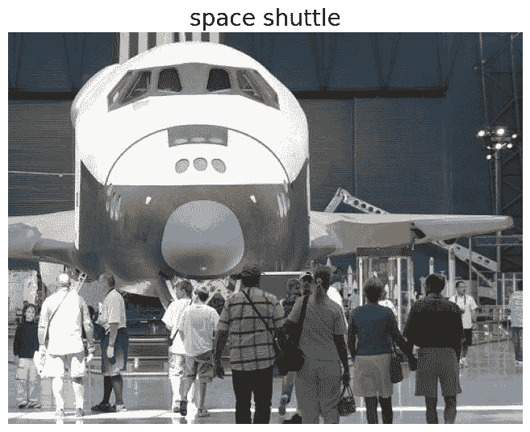

ImageNet 图片示例(l .飞飞,《ImageNet:众包、基准和其他很酷的东西》, CMU·VASC 研讨会，2010 年 3 月)

*下载资料注意事项:ImageNet 官网(* [*链接*](http://www.image-net.org/) *)可向个人提供图片。但是，提交请求后，我没有收到任何下载链接。下载图像最简单的方法是通过 ImageNet 对象本地化挑战(* [*链接*](https://www.kaggle.com/c/imagenet-object-localization-challenge/) *)。*

# AlexNet 模型结构

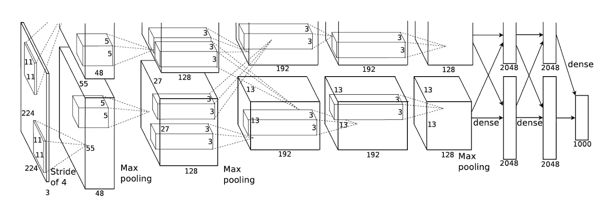

克里日夫斯基、亚历克斯、伊利亚·苏茨基弗和杰弗里·e·辛顿。"使用深度卷积神经网络的图像网络分类."神经信息处理系统进展。2012.

AlexNet 在 ILSVRC-2012 比赛中取得了 15.3%的前 5 名测试错误率(之前的模型错误率为 26%)的胜利。网络架构类似于 LeNet-5 模型(阅读更多关于 LeNet-5: [Link](/convolutional-neural-network-champions-part-1-lenet-5-7a8d6eb98df6) 的内容)，但具有更多卷积层，因此模型更深入。

模型中使用的主要激活函数是非饱和整流线性单元(ReLU)函数。该模型主要由 8 层组成:5 个卷积层和 3 个密集层。内核大小从 11×11 减小到 3×3。每个卷积层后面都有一个最大池层。该模型在前两个完全连接的层中使用 dropout 以避免过度拟合。下面给出了 AlexNet 在 Tensorflow 中的实现。

使用随机梯度下降(SGD)优化算法训练该模型。学习率初始化为 0.01，动量为 0.9，权重衰减为 0.0005。在 Tensorflow 中构建 AlexNet 模型的代码片段如下所示:

注意，模型中使用的优化器是带动量的梯度下降。这个优化器位于一个名为`tensorflow_addons`的独立包中(更多信息可以在[这里](https://www.tensorflow.org/addons)看到)。

# 2 节课的 AlexNet 演示

在整个 ImageNet 数据集上训练 AlexNet 非常耗时，并且需要 GPU 计算能力。因此，在本节中，我将在 ImageNet 数据集上演示 AlexNet 类型结构的训练，该数据集由两个类组成:

*   类别`*n03792782*`:山地车、全地形车、越野车
*   `*n03095699*`级:集装箱船，集装箱船

训练数据集由属于两类的 2，600 幅图像组成。调用`AlexNet` 函数会产生一个超过 6200 万可训练参数的网络，如下图所示:

```
Model: "AlexNet"
_________________________________________________________________
Layer (type)                 Output Shape              Param #   
=================================================================
conv2d (Conv2D)              (None, 55, 55, 96)        34944     
_________________________________________________________________
max_pooling2d (MaxPooling2D) (None, 27, 27, 96)        0         
_________________________________________________________________
conv2d_1 (Conv2D)            (None, 27, 27, 256)       614656    
_________________________________________________________________
max_pooling2d_1 (MaxPooling2 (None, 13, 13, 256)       0         
_________________________________________________________________
conv2d_2 (Conv2D)            (None, 13, 13, 384)       885120    
_________________________________________________________________
conv2d_3 (Conv2D)            (None, 13, 13, 384)       1327488   
_________________________________________________________________
conv2d_4 (Conv2D)            (None, 13, 13, 256)       884992    
_________________________________________________________________
max_pooling2d_2 (MaxPooling2 (None, 6, 6, 256)         0         
_________________________________________________________________
flatten (Flatten)            (None, 9216)              0         
_________________________________________________________________
dense (Dense)                (None, 4096)              37752832  
_________________________________________________________________
dropout (Dropout)            (None, 4096)              0         
_________________________________________________________________
dense_1 (Dense)              (None, 4096)              16781312  
_________________________________________________________________
dropout_1 (Dropout)          (None, 4096)              0         
_________________________________________________________________
dense_2 (Dense)              (None, 1000)              4097000   
_________________________________________________________________
dense_3 (Dense)              (None, 2)                 2002      
=================================================================
Total params: 62,380,346
Trainable params: 62,380,346
Non-trainable params: 0
_________________________________________________________________
```

# 模型训练和评估

AlexNet 模型在整个训练数据上训练 90 个时期，并在来自验证数据集的 50K 个图像上验证。CPU 上的训练模型示例如下所示(要在 GPU 上训练，使用`tf.distribute.MirroredStrategy`):

经过充分训练的 AlexNet 模型在 2 个类上可以达到 95%的准确率。下图显示了学习曲线以及训练集和验证集的损失。可以看出，验证集上的训练损失在 20 个时期后保持不变，并且模型学习不能被改进。

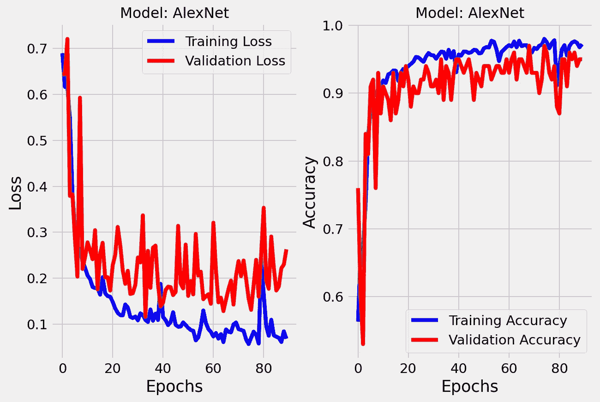

学习曲线(作者图片)

评估模型性能的另一种方法是使用一种叫做**混淆矩阵**的方法。混淆矩阵是表格布局，由数据类别和使用训练好的分类器得到的预测组成。这里可以看到一个混淆矩阵的例子。这个混淆矩阵是通过在 100 个验证图像(每个类别 50 个图像)上运行训练好的神经网络分类器而获得的。可以看出，该模型在 bikes 类别中只错误分类了 1 个图像(用 0 表示)。然而，该模型将 3 幅图像错误分类到船只类别(用 1 表示)。

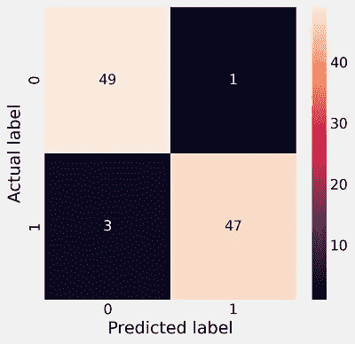

困惑矩阵(图片由作者提供)

4 个错误分类的图像如下图所示。在以下情况下，模型似乎无法完全识别图像中的对象:

*   图像中的对象被裁剪(部分可见的对象)
*   对象在背景中或被周围环境覆盖

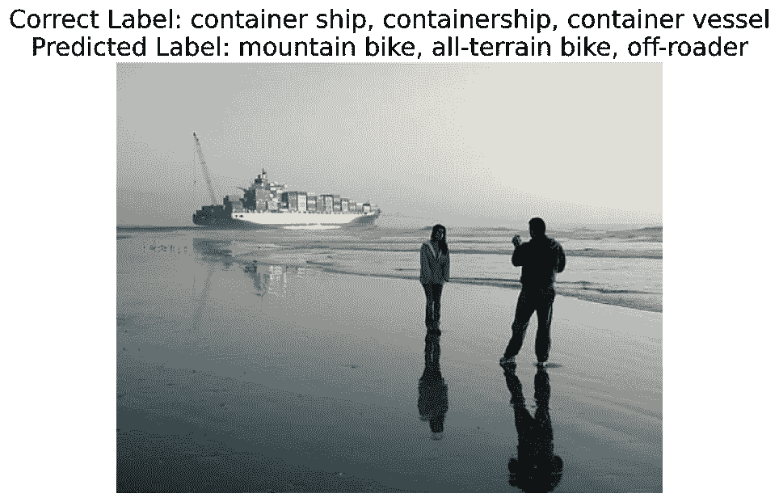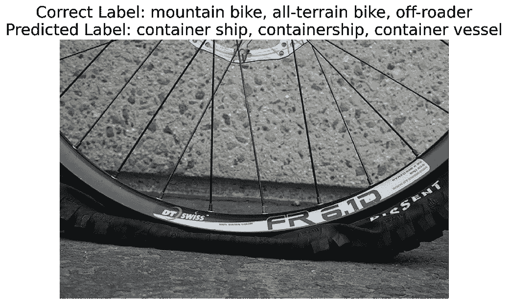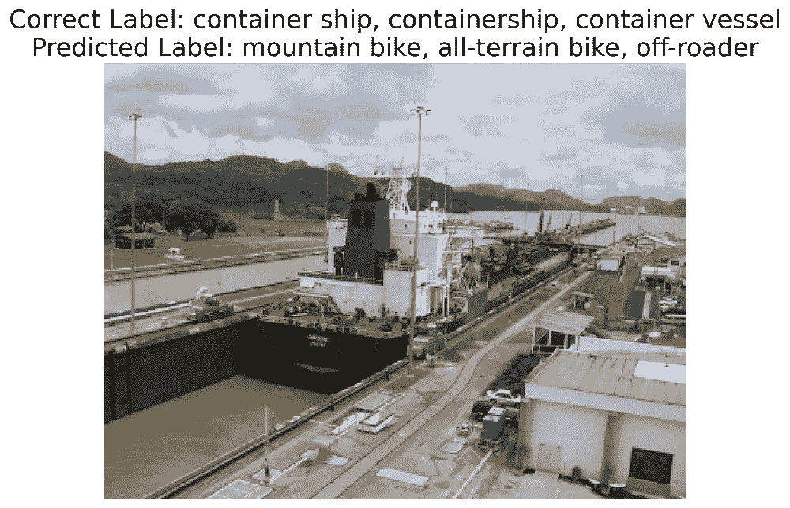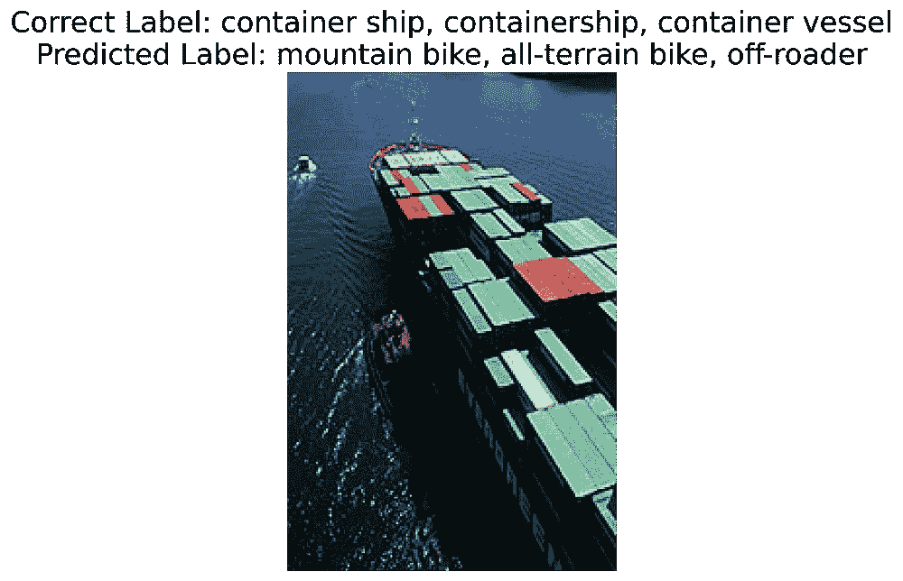

错误分类的图片(作者图片，修改后的 ImageNet)

查看上面的图像并将它们与训练图像进行比较，很难看出这些图像分类错误背后的原因。使 CNN 模型更加透明的一种方法是可视化对预测“重要”的输入区域。有许多方法可以完成这项任务，如`GradCAM`、`GradCAM++`、`ScoreCAM`等。我使用 `tf-keras-vis`库中的`GradCAM`(更多信息:[https://pypi.org/project/tf-keras-vis/](https://pypi.org/project/tf-keras-vis/))来检查错误分类图像上的模型行为。结果可以在下面看到。可以看出，模型很难聚焦于导入区域(用红色表示)。

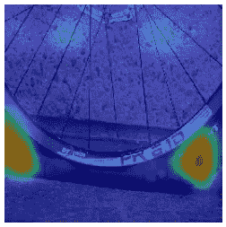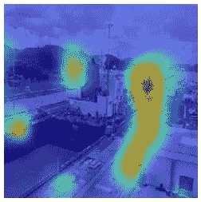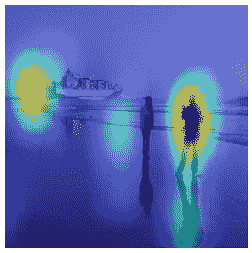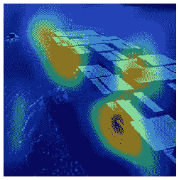

分类错误的例子(作者图片，修改后的 ImageNet)

以下图像展示了正确分类的图像示例。可以看出，该模型关注图像中的重要特征，并且正确地预测图像的类别。有趣的是，经过训练的模型似乎能够识别自行车和骑自行车的人。一种不仅检测物体而且检测物体在图像中的位置的物体识别模型可以适当地解决这个问题。AlexNet 只能检测对象，但不能识别图像中的对象。物体识别的主题将在本系列的后续章节中讨论。

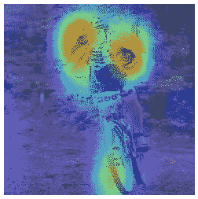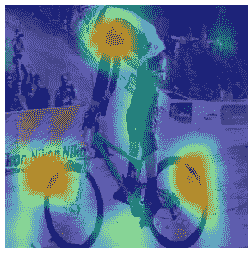

正确分类的图片示例(作者图片，修改后的 ImageNet)

# 摘要

AlexNet 开启了计算机视觉和深度学习的新时代。AlexNet 引入(或在某些情况下推广)了许多今天使用的相关计算机视觉方法，如 conv+池设计、dropout、GPU、并行计算和 ReLU。因此，作为这些发明的结果，AlexNet 能够减少 ImageNet 数据集上的分类错误。然而，AlexNet 模型需要提高分类精度。因此，许多模型都建立在 AlexNet 的成功之上，比如 **VGGNet、**，我将在下一篇文章中探讨和讨论这些模型。敬请关注，并在下面告诉我你的看法。

> *感谢阅读！我叫* ***阿米尔·内贾德博士。*** *我是一名数据科学家，也是*[***QuantJam***](https://medium.com/quantjam)*的编辑，我喜欢分享我的想法，并与其他数据科学家合作。可以在*[***Github***](https://github.com/anejad)*[***Twitter***](https://twitter.com/Dr_Nejad)***和*[***LinkedIn***](https://www.linkedin.com/in/amir-nejad-phd-8690a44b/)*上和我联系。****

**QuantJam:**

**[](https://medium.com/quantjam) [## QuantJam

### Quantjam 是一个媒体发布平台，提供金融、算法交易和…

medium.com](https://medium.com/quantjam) 

你可以在以下网址看到我的其他作品:

[](http://amirnejad.medium.com/) [## 阿米尔·内贾德-中等

### Python 在金融数据集中的多部分时间序列分析时间序列是一系列数据…

amirnejad.medium.com](http://amirnejad.medium.com/) 

*所有图片均由作者制作，除非另有说明。*

# 附录

**Relu 激活功能:**

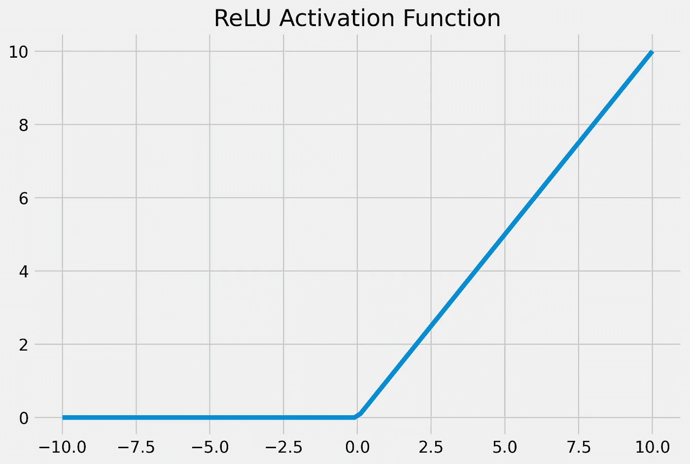

Relu 激活功能(图片由作者提供)

# 参考

*   克里日夫斯基、亚历克斯、伊利亚·苏茨基弗和杰弗里·e·辛顿。"使用深度卷积神经网络的图像网络分类."神经信息处理系统进展。2012.
*   第九讲，CNN 建筑，费-李非&杨小琳，2017 ( [Youtube](https://youtu.be/DAOcjicFr1Y?t=196) )

**最大池:**

*   不变特征层次的无监督学习及其在物体识别中的应用。2007 年 IEEE 计算机视觉和模式识别会议。IEEE，2007 年。

**ReLU:**

*   奈尔、维诺德和杰弗里·e·辛顿。"校正的线性单位改进了受限的玻尔兹曼机器."ICML。2010.

**CUDA:**

*   *E. Lindholm、J. Nickolls、s .奥伯曼和 J. Montrym，“NVIDIA Tesla:统一的图形和计算架构”，IEEE Micro，第 28 卷，第 2 期，第 39–55 页，2008 年 3 月。*

**ImageNet:**

*   *Russakovsky，Olga 等，“Imagenet 大规模视觉识别挑战”国际计算机视觉杂志 115.3(2015):211–252。*
*   [*https://www . learnopencv . com/keras-tutorial-using-pre-trained-imagenet-models/*](https://www.learnopencv.com/keras-tutorial-using-pre-trained-imagenet-models/)**