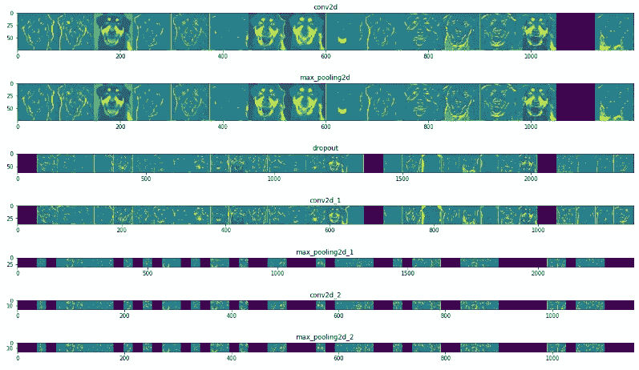
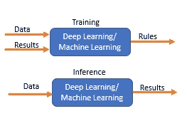
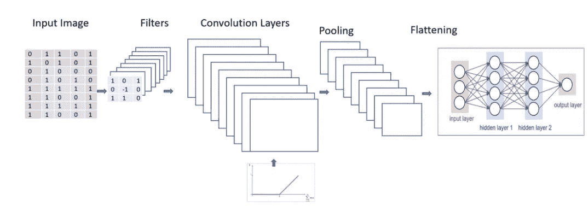
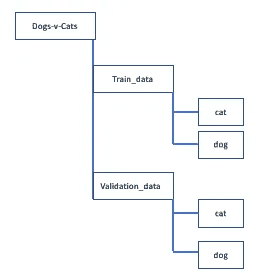
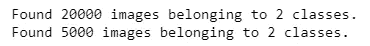
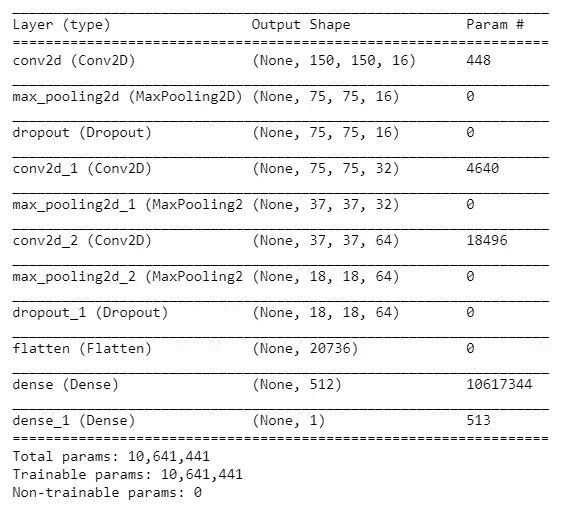
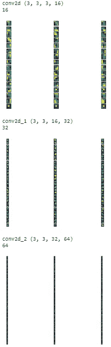
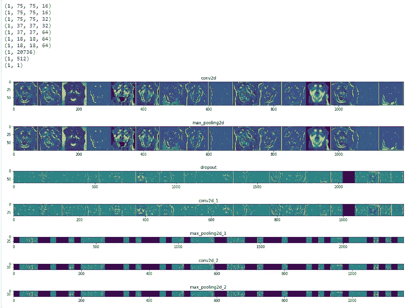
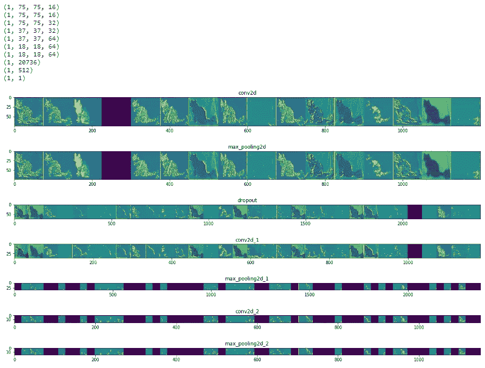

# 卷积神经网络:特征映射和滤波器可视化

> 原文：<https://towardsdatascience.com/convolutional-neural-network-feature-map-and-filter-visualization-f75012a5a49c?source=collection_archive---------0----------------------->

## 了解卷积神经网络如何理解图像。



***在本文中，我们将可视化不同 CNN 层的中间特征表示，以了解 CNN 内部发生了什么来对图像进行分类。***

## 先决条件:

[卷积神经网络基础知识](https://medium.com/datadriveninvestor/convolutional-neural-network-cnn-simplified-ecafd4ee52c5)，

[使用 Keras 构建强大的图像分类卷积神经网络](https://medium.com/datadriveninvestor/building-powerful-image-classification-convolutional-neural-network-using-keras-a1839d0ff298)

[使用 Keras 构建强大的图像分类 CNN](https://medium.com/datadriveninvestor/building-powerful-image-classification-convolutional-neural-network-using-keras-a1839d0ff298)

## CNN 的快速概览

**有监督的深度学习和机器学习在训练期间将数据和结果作为输入，以生成规则或数据模式**。理解模型生成的数据模式或规则有助于我们理解结果是如何从输入数据中得出的。



**训练:**卷积神经网络以一幅二维图像和该图像的类别，如猫或狗作为输入。作为训练的结果，我们得到训练的权重，这是从图像中提取的数据模式或规则。

**推理或预测:**图像将是传递给训练好的模型的唯一输入，训练好的模型将输出图像的类别。图像的类别将基于训练期间学习的数据模式。

## CNN 架构



**将过滤器**或**特征检测器应用于输入图像**以使用 Relu 激活功能生成**特征图或激活图。**特征检测器或过滤器有助于识别图像中的不同特征，如边缘、垂直线、水平线、弯曲等。

**然后，为了平移不变性，在特征图上应用池化**。**汇集是基于这样一个概念:当我们少量改变输入时，汇集的输出不会改变**。我们可以使用最小池、平均池或最大池。与最小或平均池相比，最大池提供了更好的性能。

**展平所有输入，并将这些展平的输入传递给深度神经网络，该网络输出对象的类别**

图像的类别可以是二进制的，如猫或狗，或者可以是多类别的分类，如识别数字或对不同的服装项目进行分类。

神经网络就像一个黑匣子，神经网络中学习到的特征是不可解释的。您传递一个输入图像，模型返回结果。

*如果你得到了一个不正确的预测，并想弄清楚为什么 CNN 会做出这样的决定，该怎么办？*

> 如果您能在 CNN 中可视化应用于不同卷积层的中间表示，以了解模型如何学习，那该多好。了解模型的工作将有助于了解错误预测的原因，从而更好地微调模型并解释决策

这里使用的例子是一个深度 CNN 模型，用于[对猫狗](https://www.kaggle.com/c/dogs-vs-cats/data)进行分类。在开始学习可视化 CNN 生成的过滤器和要素地图之前，您需要了解卷积层和应用于它们的过滤器的一些关键点。

## 关于卷积层和过滤器的要点

*   **CNN 中滤镜的深度必须与输入图像的深度相匹配**。滤镜中颜色通道的数量必须与输入图像保持一致。
*   **为彩色图像的三个通道**创建不同的 Conv2D 滤镜。
*   **基于正态或高斯分布随机初始化每层的过滤器。**
*   **卷积网络的初始层从图像中提取高级特征，因此使用较少的滤波器。**随着我们构建更深的层，我们将过滤器的数量增加到前一层过滤器大小的两倍或三倍。
*   **更深层的过滤器学习更多的特征，但是计算非常密集**。

## 构建卷积神经网络

我们建立一个 CNN 来对狗和猫进行分类，然后将特征图或激活图以及用于在输入图像上生成它们的过滤器可视化

**导入所需的库**

```
**import tensorflow as tf
from tensorflow.keras.models import Sequential
from tensorflow.keras.layers import Dense, Conv2D, Flatten, Dropout, MaxPooling2D
from tensorflow.keras.preprocessing.image import ImageDataGenerator, img_to_array, load_img****import os
import numpy as np
import matplotlib.pyplot as plt**
```

**为图像处理创建数据**

数据集可以从[这里](https://www.kaggle.com/c/dogs-vs-cats/data)下载

我们将解压文件并创建如下所示的文件夹，然后将数据分成包含 10，000 只猫和 10，000 只狗图像的训练数据集以及包含 2500 只猫和 2500 只狗图像的验证数据集



**设置关键参数**

```
**batch_size = 64 
epochs = 50
IMG_HEIGHT = 150
IMG_WIDTH = 150**
```

**重新缩放并对训练图像应用不同的增强**

```
**train_image_generator = ImageDataGenerator(                                                rescale=1./255,                                              rotation_range=45,                                                width_shift_range=.15,                                                height_shift_range=.15,                                                horizontal_flip=True,                                                zoom_range=0.3)**
```

**重新调整验证数据**

```
**validation_image_generator = ImageDataGenerator(rescale=1./255)**
```

**为训练和验证数据集生成批量归一化数据**

您的数据存储在目录中，因此使用 **flow_from_directory()** 方法。flow_from_directory()将从指定的路径获取数据，并生成批量的扩充规范化数据。

```
**train_data_gen = train_image_generator.flow_from_directory(batch_size=batch_size,                                                     directory=TRAIN_PATH,                                                     shuffle=True,                                                     target_size=(IMG_HEIGHT, IMG_WIDTH),                                                     class_mode='binary')****val_data_gen = validation_image_generator.flow_from_directory(batch_size=batch_size,                                                              directory=VAL_PATH,                                                              target_size=(IMG_HEIGHT, IMG_WIDTH),                                                              class_mode='binary')**
```



**创建深度卷积神经网络模型**

```
*#Build the model***model = Sequential([
    Conv2D(16, 3, padding='same', activation='relu', 
           input_shape=(IMG_HEIGHT, IMG_WIDTH ,3)),
    MaxPooling2D(),
    Dropout(0.2),
    Conv2D(32, 3, padding='same', activation='relu'),
    MaxPooling2D(),
    Conv2D(64, 3, padding='same', activation='relu'),
    MaxPooling2D(),
    Dropout(0.2),
    Flatten(),
    Dense(512, activation='relu'),
    Dense(1)
])***# Compile the model*
**model.compile(optimizer='adam',              loss=tf.keras.losses.BinaryCrossentropy(from_logits=True),              metrics=['accuracy'])***# print the model architecture*
**model.summary(*)***
```



**训练模特**

我们训练模型 50 个时期

```
***history = model.fit_generator(
    train_data_gen,
    steps_per_epoch=1000,
    epochs=epochs,
    validation_data=val_data_gen,
    validation_steps=1000
)***
```

## 特征可视化

特征可视化将图像中存在的内部特征转化为视觉上可感知或可识别的图像模式。特征可视化将帮助我们明确地理解所学的特征。

首先，您将可视化应用于输入图像的不同过滤器或特征检测器，并在下一步中可视化生成的特征映射或激活映射。

## CNN 中的可视化过滤器或特征检测器

CNN 使用学习过的过滤器来卷积来自前一层的特征地图。过滤器是二维权重，并且这些权重彼此具有空间关系。

**可视化过滤器的步骤。**

1.  使用 ***model.layers*** 遍历模型的所有层
2.  如果该层是卷积层，则使用***get _ weights()***提取该层的权重和偏差值。
3.  将过滤器的权重归一化到 0 和 1 之间
4.  画出每个卷积层和所有通道的滤波器。对于彩色图像，RGB 有三个通道。对于灰度图像，通道数为 1

```
*#Iterate thru all the layers of the model*
**for layer in model.layers:
    if 'conv' in layer.name:
        weights, bias= layer.get_weights()
        print(layer.name, filters.shape)**

        *#normalize filter values between  0 and 1 for visualization*
        **f_min, f_max = weights.min(), weights.max()
        filters = (weights - f_min) / (f_max - f_min)  
        print(filters.shape[3])
        filter_cnt=1**

       * #plotting all the filters*
       ** for i in range(filters.shape[3]):**
            *#get the filters*
           ** filt=filters[:,:,:, i]**
            *#plotting each of the channel, color image RGB channels*
            **for j in range(filters.shape[0]):
                ax= plt.subplot(filters.shape[3], filters.shape[0], filter_cnt  )
                ax.set_xticks([])
                ax.set_yticks([])
                plt.imshow(filt[:,:, j])
                filter_cnt+=1
        plt.show()**
```



应用于猫和狗的 CNN 模型的过滤器。

## 可视化 CNN 中生成的特征图或激活图

通过将过滤器或特征检测器应用于输入图像或先前层的特征图输出来生成特征图。要素图可视化将提供对模型中每个卷积层的特定输入的内部表示的深入了解。

**可视化特征地图的步骤。**

1.  定义一个新的模型，***visualization _ model***，该模型将图像作为输入。模型的输出将是要素地图，它是第一个图层之后所有图层的中间表示。这是基于我们用于培训的模型。
2.  加载我们想要查看其特征地图的输入图像，以了解哪些特征对于图像分类是显著的。
3.  将图像转换为 NumPy 数组
4.  通过重新调整数组的大小来规范化数组
5.  通过可视化模型运行输入图像，以获得输入图像的所有
    中间表示。
6.  为所有卷积层和最大池层创建图，但不为全连接层创建图。要打印要素地图，请检索模型中每个图层的图层名称。

```
**img_path='\\dogs-vs-cats\\test1\\137.jpg' #dog**
*# Define a new Model, Input= image 
# Output= intermediate representations for all layers in the  
# previous model after the first.*
**successive_outputs = [layer.output for layer in model.layers[1:]]***#visualization_model = Model(img_input, successive_outputs)*
**visualization_model = tf.keras.models.Model(inputs = model.input, outputs = successive_outputs)***#Load the input image*
**img = load_img(img_path, target_size=(150, 150))***# Convert ht image to Array of dimension (150,150,3)* **x   = img_to_array(img)                           
x   = x.reshape((1,) + x.shape)***# Rescale by 1/255*
**x /= 255.0**# Let's run input image through our vislauization network
# to obtain all intermediate representations for the image.
**successive_feature_maps = visualization_model.predict(x)**# Retrieve are the names of the layers, so can have them as part of our plot
**layer_names = [layer.name for layer in model.layers]
for layer_name, feature_map in zip(layer_names, successive_feature_maps):
  print(feature_map.shape)
  if len(feature_map.shape) == 4:**

    *# Plot Feature maps for the conv / maxpool layers, not the fully-connected layers*

    **n_features = feature_map.shape[-1]**  *# number of features in the feature map*
    **size       = feature_map.shape[ 1]**  *# feature map shape (1, size, size, n_features)*

    *# We will tile our images in this matrix*
    **display_grid = np.zeros((size, size * n_features))**

    # Postprocess the feature to be visually palatable
    **for i in range(n_features):
      x  = feature_map[0, :, :, i]
      x -= x.mean()
      x /= x.std ()
      x *=  64
      x += 128
      x  = np.clip(x, 0, 255).astype('uint8')** # Tile each filter into a horizontal grid
 **display_grid[:, i * size : (i + 1) * size] = x***# Display the grid*
    **scale = 20\. / n_features
    plt.figure( figsize=(scale * n_features, scale) )
    plt.title ( layer_name )
    plt.grid  ( False )
    plt.imshow( display_grid, aspect='auto', cmap='viridis' )**
```



狗图像的特征图



猫图像的特征图

我们可以看到，对于狗的图像，鼻子和舌头是非常突出的特征，而对于猫的图像，耳朵和尾巴在特征图中非常突出。

代码可用[此处](https://github.com/arshren/Feature-Visualization)

## 结论:

可视化 CNN 如何学习识别图像中存在的不同特征的内部故事，提供了对该模型如何工作的更深入的了解。这也将有助于理解为什么模型可能无法正确地对一些图像进行分类，从而微调模型以获得更好的准确性和精确度。

## 参考资料:

[](https://keras.io/api/layers/) [## Keras 文档:Keras 层 API

### 层是 Keras 中神经网络的基本构建块。一个层包括一个张量输入张量输出…

keras.io](https://keras.io/api/layers/) [](https://keras.io/examples/conv_filter_visualization/) [## 卷积滤波器可视化— Keras 文档

### 从 __future__ import print_function 导入时间将 numpy 作为 np 从 PIL 导入图像作为 pil_image 从…

keras.io](https://keras.io/examples/conv_filter_visualization/) 

[卷积神经网络如何看待世界——卷积神经网络可视化方法综述](https://arxiv.org/pdf/1804.11191.pdf)

[可视化和理解卷积网络](https://cs.nyu.edu/~fergus/papers/zeilerECCV2014.pdf)

[特征可视化——谷歌人工智能博客](https://ai.googleblog.com/2017/11/feature-visualization.html)

[https://cs.nyu.edu/~fergus/papers/zeilerECCV2014.pdf](https://cs.nyu.edu/~fergus/papers/zeilerECCV2014.pdf)