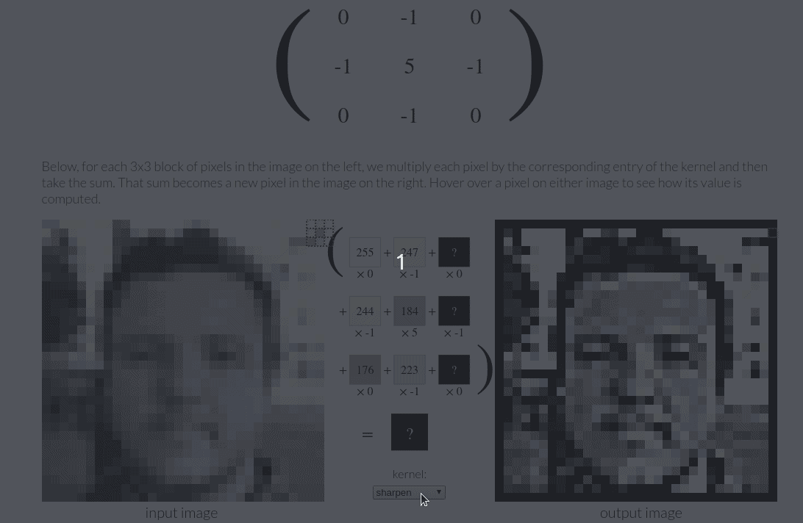
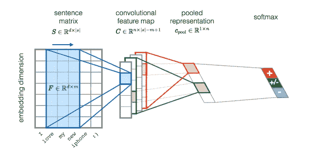
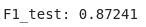

# 自然语言处理中的卷积神经网络

> 原文：<https://towardsdatascience.com/convolutional-neural-network-in-natural-language-processing-96d67f91275c?source=collection_archive---------12----------------------->

## 什么是卷积神经网络，如何利用它进行情感分析？

# 什么是卷积神经网络？

神经网络是一套用于识别模式的算法。这些模式是包含在向量中的数字，这些向量是从现实世界的数据(如图像、声音、文本或时间序列)转换而来的。卷积神经网络是**将卷积层应用于局部特征的神经网络。**

要理解一个小内核如何转换大量的输入数据，请看下面的 gif。


从[堆栈交换中检索](https://stats.stackexchange.com/questions/199702/1d-convolution-in-neural-networks)

正如我们所看到的，每个内核在空间上都很小(沿宽度和高度)，但会延伸到输入体积的整个深度，并在滑动时转换输入数据。

但是如果我们想要不同的输出呢？没问题。我们只需要应用不同的过滤器。



在 [Setosa.io](https://setosa.io/ev/image-kernels/) 中探索 CNN

这些过滤器也可以应用于多维输出。下面的图像以 3D 方式输入，图像大小为 7x7，最后一个维度表示 3 个颜色通道(红、蓝、绿)。这使得输入大小为 7x7x3。然后我们应用 2 个滤波器`w0`和`w1,`，每个滤波器的大小为 3x3x3，以匹配输入大小。对于输出的维度，我们应该期待什么？3x3x2 与`2`滤镜的数量。


从 [gitbook](https://leonardoaraujosantos.gitbooks.io/artificial-inteligence/content/convolution.html) 中检索

# 自然语言处理中的卷积神经网络

因此，我们了解了什么是卷积神经网络，并了解了 CNN 如何应用于图像。但是 CNN 在 NLP 中到底是怎么运作的呢？例如，如果我们有一个句子“我爱我的新 iphone ”,我们如何使用 CNN 来分类这个句子是负面的，正面的，还是中性的？



从[堆栈交换中检索到的图像](https://stats.stackexchange.com/questions/256056/how-can-these-filters-be-found-for-such-a-convolutional-neural-network)

上图从左至右的简短说明:

*   输入是单词。每个单词由一个大小为 7 的向量表示。
*   对单词向量应用 4 种不同的过滤器来创建卷积特征图
*   为合并表示选择每个过滤器向量的最大结果值
*   应用 softmax 将大小为 1x4 的向量转换为大小为 1x3 的向量以进行分类

# 通过实例学习:使用 PyTorch 进行情感分析

[PyTorch](https://pytorch.org/) 是一个 Python 程序库，有助于构建深度学习项目。如果你不知道 PyTorch，可以看看我的文章:

[](/what-is-pytorch-a84e4559f0e3) [## PyTorch 是什么？

### 想想 Numpy，但是有强大的 GPU 加速

towardsdatascience.com](/what-is-pytorch-a84e4559f0e3) 

如果你的机器没有 GPU，我鼓励你使用 [Google Colab](https://colab.research.google.com/) 来尝试代码。我们将使用这个库对 Kera 的 IMDb 电影评论数据集进行情感分析。我们的任务是分类评论是正面的还是负面的。

为了建立模型，我们用`nn.Conv2d(in_channels, out_channels, kernel_size)`做 2D 卷积，用`nn.Linear(in_channels, out_channels).`做一层线性神经网络进行分类

培训步骤

想象我们的损失函数

```
import matplotlib.pyplot as pltplt.plot(LOSS)
```


```
print("F1_test: %.5f"%(get_f1(X_test, y_test)))
```



厉害！我们的 CNN 模型给了我们 0.87 的 F1 分！

# 结论

恭喜你！你已经学习了什么是卷积神经网络，如何用 PyTorch 申请自然语言处理。我希望这能让你对 CNN 有一个大致的了解，并有动力在你的深度学习项目中利用这种方法。如果你想更好地了解 CNN，维克多·鲍威尔的网站提供了一个很酷的互动视觉效果，展示了当使用 CNN 的滤镜时，图像是如何变化的。你可以在这里试用一下这篇文章[的代码。](https://colab.research.google.com/github/MarioGzSl/SharedKM/blob/master/CNN_for_text.ipynb)

在[这个 Github repo](https://github.com/khuyentran1401/Data-science/blob/master/nlp/convolutional_neural_network.ipynb) 中，您可以随意使用本文的代码。

我喜欢写一些基本的数据科学概念，并尝试不同的算法和数据科学工具。你可以在 LinkedIn 和 Twitter 上与我联系。

如果你想查看我写的所有文章的代码，请点击这里。在 Medium 上关注我，了解我的最新数据科学文章，例如:

[](/what-graphical-excellence-is-and-how-to-create-it-db02043e0b37) [## 什么是卓越的图形以及如何创建它

### 作为一名数据科学家，了解如何制作重要的图表至关重要

towardsdatascience.com](/what-graphical-excellence-is-and-how-to-create-it-db02043e0b37) [](/how-to-visualize-social-network-with-graph-theory-4b2dc0c8a99f) [## 如何用图论可视化社交网络

### 找出《权力的游戏》中的影响者

towardsdatascience.com](/how-to-visualize-social-network-with-graph-theory-4b2dc0c8a99f) [](/convex-hull-an-innovative-approach-to-gift-wrap-your-data-899992881efc) [## 凸包:包装数据的创新方法

### 如何利用包装算法实现数据可视化

towardsdatascience.com](/convex-hull-an-innovative-approach-to-gift-wrap-your-data-899992881efc) [](/how-to-turn-a-dinosaur-dataset-into-a-circle-dataset-with-the-same-statistics-64136c2e2ca0) [## 恐龙和圆圈的数据集可以有相同的统计数据吗？

### 它们有相同的中位数和标准差，但它们是两个明显不同的数据集！

towardsdatascience.com](/how-to-turn-a-dinosaur-dataset-into-a-circle-dataset-with-the-same-statistics-64136c2e2ca0) [](/step-by-step-tutorial-web-scraping-wikipedia-with-beautifulsoup-48d7f2dfa52d) [## 用美丽的声音抓取维基百科

### 关于如何使用 Beautiful Soup 的分步教程，这是一个用于 web 抓取的简单易用的 Python 库

towardsdatascience.com](/step-by-step-tutorial-web-scraping-wikipedia-with-beautifulsoup-48d7f2dfa52d)