# 卷积神经网络

> 原文：<https://towardsdatascience.com/convolutional-neural-networks-357b9b2d75bd?source=collection_archive---------13----------------------->

## 简介和卷积

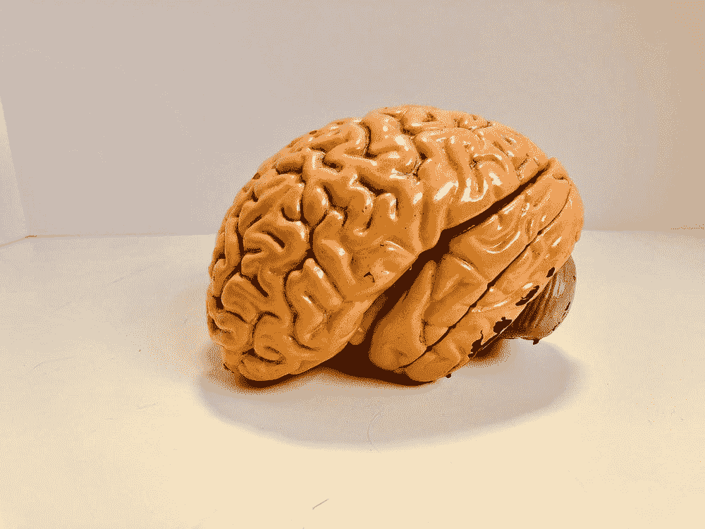

图片来自 [Unsplash](https://unsplash.com/photos/aCU6AJnT-8g)

本文的目标是探索以下概念:

*   卷积神经网络导论。用例及例子。
*   回旋。Python 中的示例
*   CNN。
*   局部连接的层

# 卷积神经网络简介

你可以在这里找到，神经网络是一个通用的函数逼近器。这意味着，从本质上讲，神经网络通过试图找到一个函数的最佳近似来解决问题，该函数允许我们解决我们的问题。

为此，我们有一系列参数(权重和偏差)，我们使用基于下降梯度的反向传播算法来更新这些参数。

多亏了我们的标签，我们可以在每次迭代中计算误差，并修改权重以逐步减少误差。

什么是卷积神经网络？或者更重要的是，它解决了什么问题？

简而言之，卷积神经网络可以解决所有可以用图像形式表达的问题。

例如，当你试图在你的脸书照片中给某人贴标签时，就要考虑到这一点。你有没有注意到它暗示了这个人的侧面？那是一个 convnet！

或者你可能听说过自动驾驶汽车，它可以“阅读”交通标志，识别其他汽车，甚至检测一个人是否正在过马路。功能也是基于 convnets 的！

CNN 是解决医学成像问题的最新技术。这些只是几个例子，但还有更多。

它们在最近几年变得如此受欢迎的原因是因为它们可以自己找到正确的特征，以便以后正确地对图像进行分类。他们以一种非常有效的方式做到这一点。

**但是 CNN 到底是什么？**

CNN 是一种神经网络，其中引入了新类型的层，其中最重要的是卷积层。

什么是卷积？

# 盘旋

严格来说，卷积主要用于信号处理，是一种允许两个信号合并的数学运算。

在数字信号处理中，卷积是用来知道一个信号“通过”某个设备后会发生什么。

例如，要了解我们的声音通过手机麦克风后的变化，我们可以计算我们的声音与麦克风脉冲响应的卷积。

卷积神经网络因其检测模式并进行分类的能力而闻名。那些模式检测器是卷积。

让我们看看计算机是如何理解图像的:

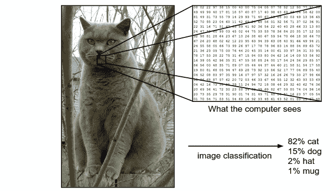

[http://cs231n.github.io/classification/](http://cs231n.github.io/classification/)

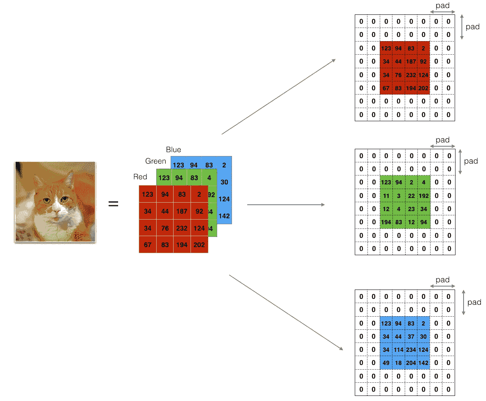

[https://data science-发烧级. com/DL/Convolution _ model _ Step _ by _ Step v2 . html](https://datascience-enthusiast.com/DL/Convolution_model_Step_by_Stepv2.html)

正如你所看到的，彩色图像被表示为一个三维矩阵:宽 x 高 x 通道。

有几种方法来表示图像，但最常用的是使用 RGB 颜色空间。这意味着计算机最终会看到 3 个重量 x 高度的矩阵，其中第一个告诉你图像中红色的数量，第二个告诉你绿色的数量，第三个告诉你蓝色的数量。

如果图像是灰度的，计算机会将其视为一个二维的重量 x 高度矩阵。

最后，矩阵元素的取值取决于所用变量的类型。最常见的有:

*   如果我们使用 8 位整数:它们可以从 0 到 255
*   如果我们使用浮点数:0 到 1

知道了图像是一个矩阵，卷积所做的就是定义一个滤波器或内核，通过它来乘以图像矩阵。如果我们看下一张图片:

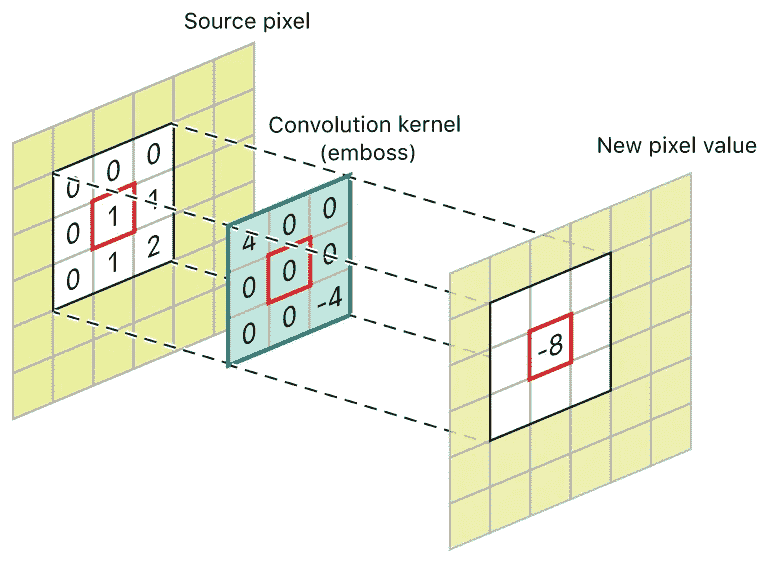

[https://developer . apple . com/documentation/accelerate/blurring _ an _ image](https://developer.apple.com/documentation/accelerate/blurring_an_image)

你定义一个内核，3x3 像素，然后乘以 input_image。会发生什么？内核比图像小得多，所以要乘以整个图像，首先我们将内核放在第一个 3x3 像素上，然后向右移动一个，再一个，再一个…然后我们计算内核的每个元素乘以图像的每个对应像素的乘积之和。如您所见，该操作的结果存储在输出图像中。

在这里你可以看得更清楚:

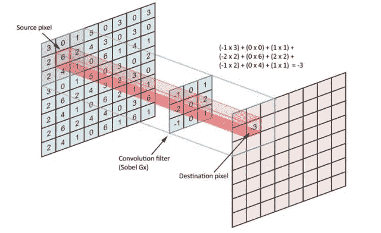

[https://www . research gate . net/publication/334974839 _ 毕业论文 _ 实现 _ 优化 _ 神经网络 _ 使用 _ 提拉米苏/figures？lo=1](https://www.researchgate.net/publication/334974839_Graduation_Thesis_Implementing_and_Optimizing_Neural_Networks_using_Tiramisu/figures?lo=1)

## Python 中的示例

让我们看一些例子，看看当我们做这些乘法和加法时会发生什么，以及它们如何帮助检测模式和做出预测。

```
import numpy as np
from scipy import signal
from scipy import misc
ascent = misc.ascent()
kernel = np.array([[-1, 0, +1],
                   [-1, 0, +1],
                   [-1, 0, +1]])
grad = signal.convolve2d(ascent, kernel, boundary='symm', mode='same')import matplotlib.pyplot as plt# function to show two pictures together
def plot_two(img_orig, img_conv):
  fig, (ax_orig, ax_mag) = plt.subplots(1, 2, figsize=(20, 50))
  ax_orig.imshow(img_orig, cmap='gray')
  ax_orig.set_title('Original')
  ax_orig.set_axis_off()
  ax_mag.imshow((img_conv), cmap='gray')
  ax_mag.set_title('Gradient')
  ax_mag.set_axis_off()plot_two(ascent, grad)
```

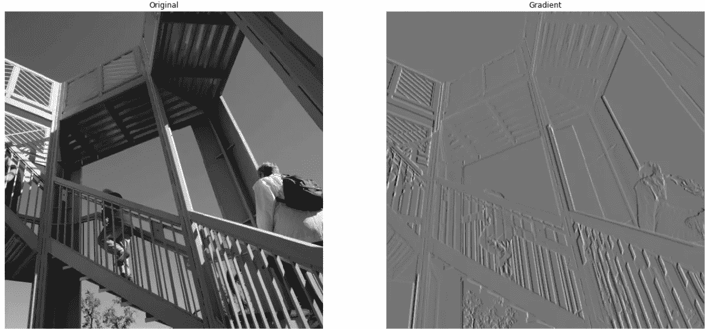

这是一个垂直线检测器。让我们定义并使用水平线检测器。

```
kernel = np.array([[-1, -1, -1],
                   [ 0,  0,  0],
                   [+1, +1, +1]])
grad_v = signal.convolve2d(ascent, kernel, boundary='symm', mode='same')
plot_two(ascent, grad_v)
```

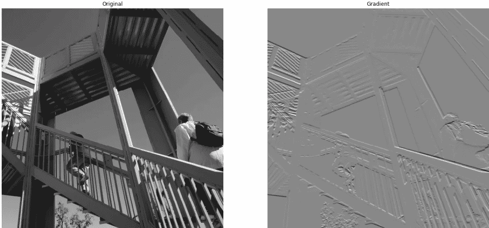

让我们看看传统卷积中最常用的一些内核

让我们先打印一张未经修改的图片:

```
# load and show the original picture
url_img = '[https://upload.wikimedia.org/wikipedia/commons/5/50/Vd-Orig.png'](https://upload.wikimedia.org/wikipedia/commons/5/50/Vd-Orig.png')
from urllib.request import urlopen 
from io import BytesIO
from PIL import Image
file = BytesIO(urlopen(url_img).read()) 
img = np.asarray(Image.open(file), dtype='uint8')
plt.imshow(img)
plt.axis('off')
```

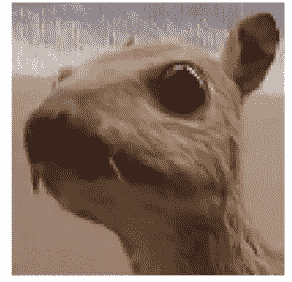

```
def convolve3d(img, kernel):
  img_out = np.zeros(img.shape)
  for i in range(img.shape[-1]):
     img_out[:,:,i] = signal.convolve2d(img[:,:,i], kernel, boundary='symm', mode='same')
  return img_out.astype('uint8')
```

**身份内核**

```
# Let's try with the Identity Kernel
kernel = [[0, 0, 0],
         [0, 1, 0],
         [0, 0, 0]]
img_ki = convolve3d(img, kernel)
plot_two(img, img_ki)
```

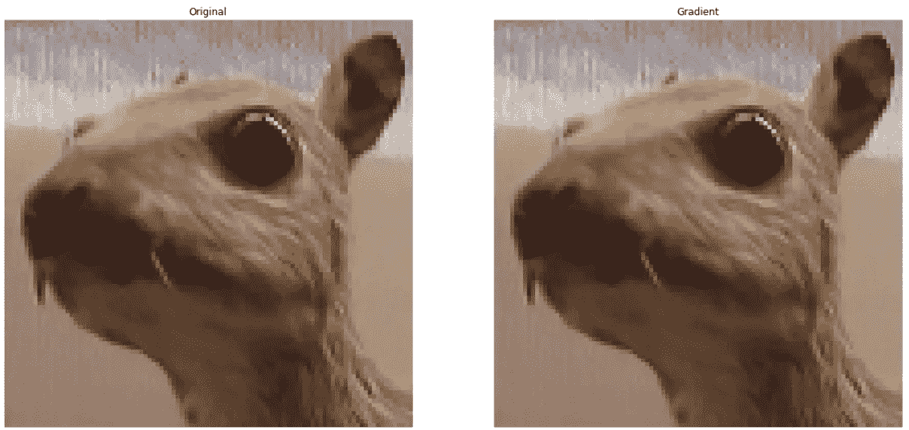

其他最常用的内核(及其输出)有:

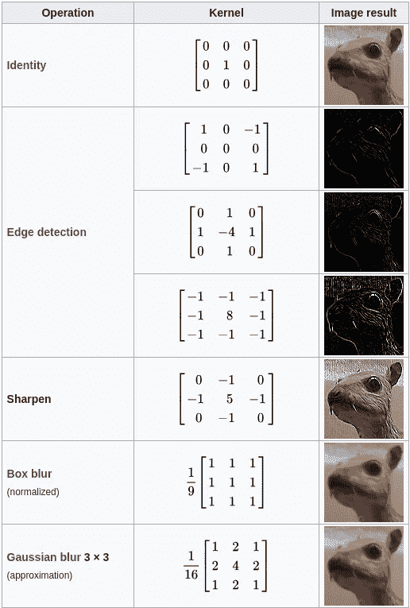

所有这些都非常有用…但是卷积是如何检测模式的呢？

## 模式检测示例

假设我们有这样一个过滤器:

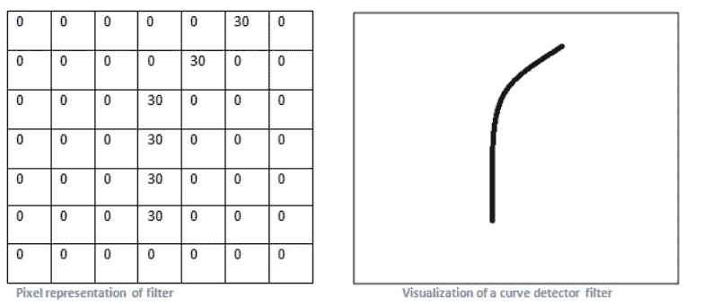

[https://adeshpande 3 . github . io/A-初学者% 27s-理解指南-卷积神经网络/](https://adeshpande3.github.io/A-Beginner%27s-Guide-To-Understanding-Convolutional-Neural-Networks/)

和下面的图像

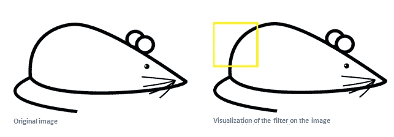

[https://adeshpande 3 . github . io/A-初学者% 27s-理解指南-卷积神经网络/](https://adeshpande3.github.io/A-Beginner%27s-Guide-To-Understanding-Convolutional-Neural-Networks/)

如果过滤器放在老鼠的背上会发生什么？

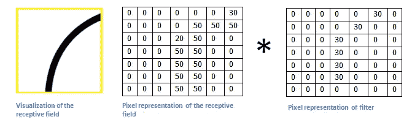

[https://adeshpande 3 . github . io/A-初学者% 27s-理解指南-卷积神经网络/](https://adeshpande3.github.io/A-Beginner%27s-Guide-To-Understanding-Convolutional-Neural-Networks/)

结果将是:

30·0 + 30·50 + 30·20 + 30·50 + 30·50 + 30·50=6600

这是一个很高的数字，表明我们已经找到了一条曲线。

如果过滤器放在老鼠的头上会发生什么？

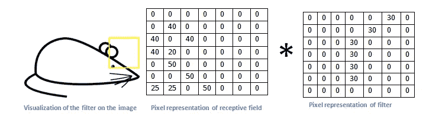

[https://adeshpande 3 . github . io/A-初学者% 27s-理解指南-卷积神经网络/](https://adeshpande3.github.io/A-Beginner%27s-Guide-To-Understanding-Convolutional-Neural-Networks/)

结果将是:

30·0 + 30·0 + 30·0 + 30·0 + 30·0 + 30·0=0

# CNN

现在我们已经介绍了卷积的概念，让我们来研究什么是卷积神经网络以及它们是如何工作的。


[https://adeshpande 3 . github . io/A-初学者% 27s-理解指南-卷积神经网络/](https://adeshpande3.github.io/A-Beginner%27s-Guide-To-Understanding-Convolutional-Neural-Networks/)

在这些图像中，我们可以看到卷积神经网络的典型架构。这无非就是一个 W x H x 3 的矩阵(因为是 RGB)。然后“卷积块”开始。

这些块通常由以下部分组成:

*   卷积层
*   汇集层，抽取卷积层输出的内容

在我们已经知道卷积是如何工作的之前:我们定义一个内核或过滤器，用来突出图像中的某些结构。

但是我如何定义一个允许我发现输入图像中有一只黑猫的过滤器呢？

那是 CNN 魔术！我们不需要定义任何过滤器，由于反向传播，网络会自动学习它们！

我们的细胞神经网络有两个阶段:特征提取器和分类器。

特征提取阶段从一般的模式或结构到细节:

*   第一卷积层检测不同方向的线
*   下一组检测形状和颜色
*   下一个更复杂的模式
*   …

所以最后，我们拥有的是一个可以自己学习的网络，所以我们不必担心我们选择哪些特征进行分类，因为它是自己选择的。

它是如何学习的？和传统的神经网络一样。

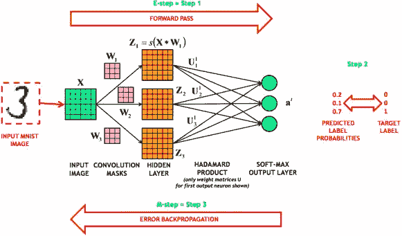

[https://www . science direct . com/science/article/ABS/pii/s 0893608015001896](https://www.sciencedirect.com/science/article/abs/pii/S0893608015001896)

第二阶段，即分类器，由密集层组成，这是传统神经网络中使用的层。

因此，CNN 最终可以理解为一组耦合到传统神经网络的卷积级，传统神经网络对卷积提取的模式进行分类，并返回每个类别的一些概率。

## CNN 中的层类型

**卷积**

这些层负责将卷积应用于我们的输入图像，以找到稍后允许我们对其进行分类的模式:

*   应用于图像的过滤器/内核的数量:输入图像将通过其进行卷积的矩阵的数量
*   这些滤镜的大小:99%的时候都是正方形，3×3，5×5 等等。

这里你可以看到一般的方案，其中你可以看到一个给定的输入图像是如何被每个滤波器卷积，输出是 2D 激活图。这意味着，如果输入图像是 RGB，它将有 3 个通道。因此，我们将对每个通道的每个滤波器进行卷积，然后将结果相加，以将 3 个通道减少到仅 1:

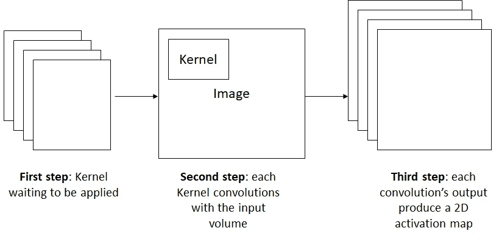

由于输入有 3 个通道，R、G 和 B，这意味着我们的输入图像被定义为 3 个二维数组，每个通道一个。

因此，卷积层所做的是将卷积分别应用于每个通道，获得每个通道的结果，然后将它们相加以获得单个 2D 矩阵，称为激活图。

在此链接中，您可以看到更多详细信息:

【http://cs231n.github.io/assets/conv-demo/index.html 

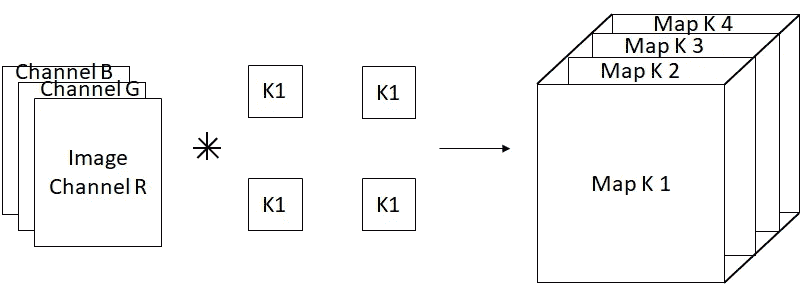

除了滤波器的数量和尺寸之外，卷积层还有一个我们应该考虑的重要参数:步幅。

这是一个单位步幅的例子:


[https://arxiv.org/abs/1603.07285](https://arxiv.org/abs/1603.07285)

这是一个 2 单位步幅卷积的例子:


[https://arxiv.org/abs/1603.07285](https://arxiv.org/abs/1603.07285)

您可以看出差别在于内核在每次迭代中的步长。

**感受野**

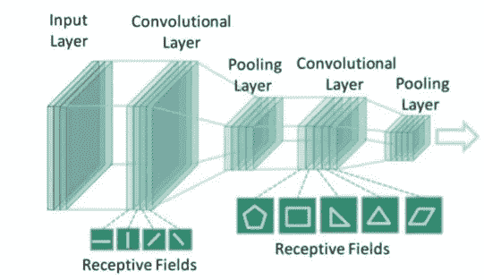

[https://www . slide share . net/ssuser 06 e0c 5/convolutionary-neural-networks-135496264](https://www.slideshare.net/ssuser06e0c5/convolutional-neural-networks-135496264)

在卷积层的情况下，输出神经元只连接到输入图像的一个局部区域。

可以理解为“网络所见”。对于致密层，情况正好相反，所有的神经元都与所有先前的元素相连。然而，神经元的功能仍然相同，唯一的事情是在入口处它们“看到”整个图像，而不是图像的一个区域。

正如你可以在这篇[伟大的文章](/intuitively-understanding-convolutions-for-deep-learning-1f6f42faee1)中发现的:

> 感受野决定了原始输入在整个网络中的哪个区域能被输出看到。

**统筹**

池层用于减少我们的激活图的大小，否则，在许多 GPU 上运行它们是不可能的。两种最常见的池类型是:

*   最大池:计算元素的最大值
*   平均池:计算要素的平均值

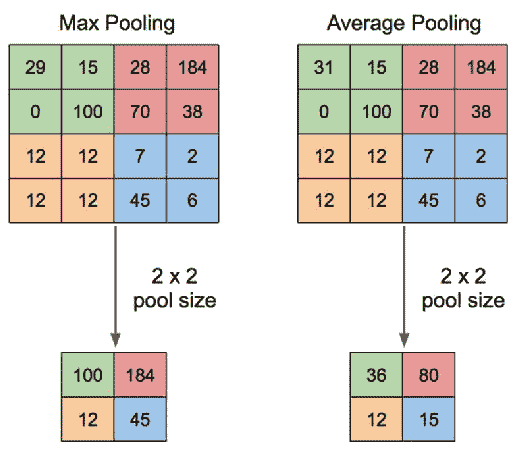

[https://www . quora . com/What-is-max-pooling-in-convolutionary-neural-networks](https://www.quora.com/What-is-max-pooling-in-convolutional-neural-networks)

必须考虑到，这是针对我们的体积的每个激活图进行的，也就是说，深度维度根本不介入计算。

让我们看一个不同步长的最大池的例子:

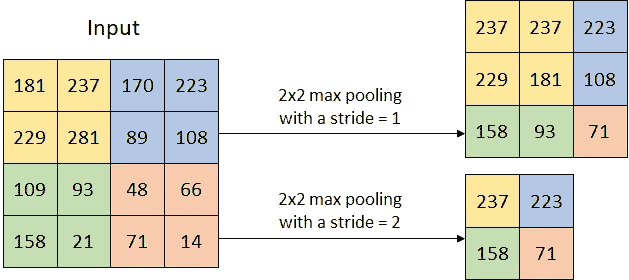

## 局部连接的层

假设我们有一个 32x32 的输入图像，我们的网络有 5 个卷积层，每个卷积层有 5 个大小为 3x3 的滤波器。这是因为过滤器贯穿图像。

这是基于这样的假设:如果某个滤波器擅长检测图像的位置(x，y)中的某个东西，那么它也应该适合位置(x2，y2)。

这个假设几乎总是有效的，因为通常我们不知道我们的特征在图像中的位置，但是例如，如果我们有一个数据集，其中人脸出现在图像的中心，我们可能希望眼睛区域的过滤器与鼻子或嘴的过滤器不同，对吗？

在这种情况下，如果我们知道要素的位置，那么为每个区域设置一个过滤器会更有意义。

之前，我们必须学习每层 5 个 3×3 的过滤器，这给了我们总共:5⋅3⋅3=45 参数，现在我们必须学习:32⋅32⋅5⋅3=46080 参数。

这是一个巨大的差异。因此，除非我们知道我们要在哪里寻找模式，它们将是不同的，并且总是在相同的位置，否则值得使用卷积层，而不是局部连接层。

对了，看下图:参数最多的层就是密层！这是有意义的，在它们中，所有的神经元都与下一层的所有神经元相互连接。

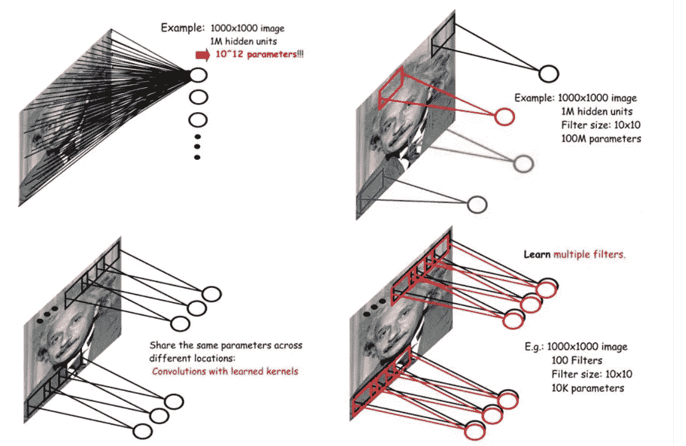

[https://Leonardo araujosantos . git books . io/artificial-intelligence/content/convolatile _ neural _ networks . html](https://leonardoaraujosantos.gitbooks.io/artificial-inteligence/content/convolutional_neural_networks.html)

# 最后的话

一如既往，我希望你喜欢这篇文章，并获得了关于卷积神经网络的直觉！

*如果你喜欢这篇帖子，那么你可以看看我在数据科学和机器学习方面的其他帖子*[](https://medium.com/@rromanss23)**。**

**如果你想了解更多关于机器学习、数据科学和人工智能的知识* ***在 Medium 上关注我*** *，敬请关注我的下一篇帖子！**