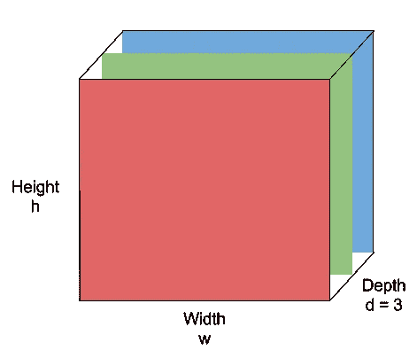
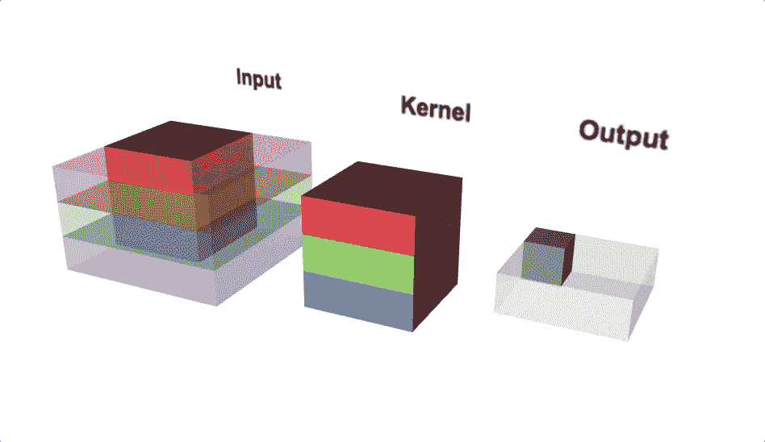
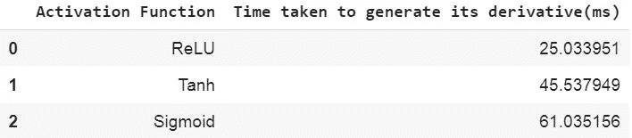
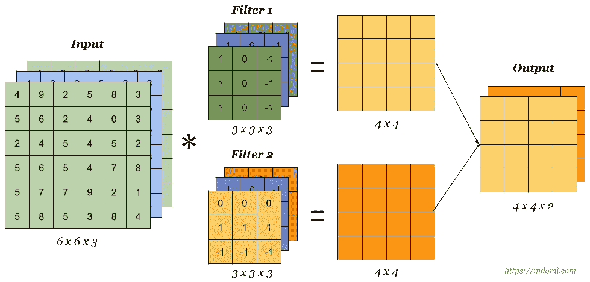
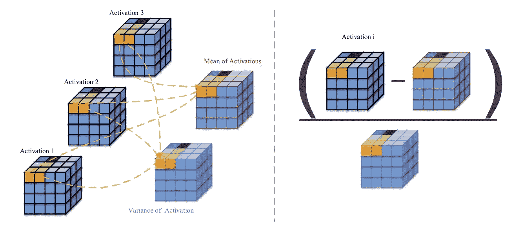
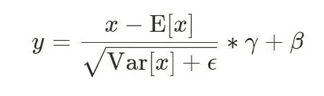
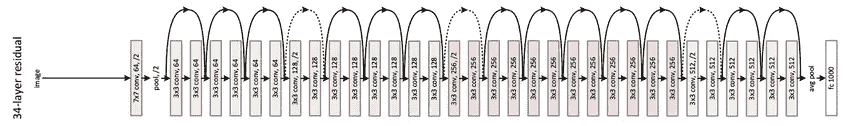
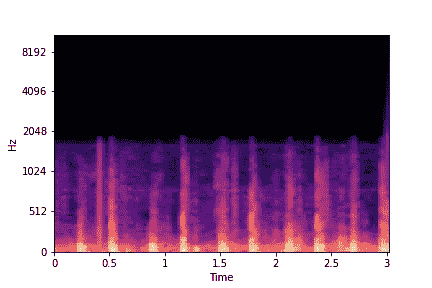
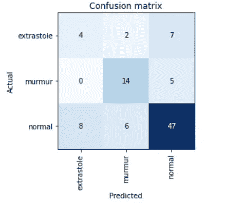

# 卷积神经网络(CNN)——实用的观点

> 原文：<https://towardsdatascience.com/convolutional-neural-networks-cnns-a-practical-perspective-c7b3b2091aa8?source=collection_archive---------22----------------------->

## 深入了解卷积神经网络的主要操作，并使用 Mel 光谱图和迁移学习对心跳进行分类。

弗兰基·查马基在 [Unsplash](https://unsplash.com?utm_source=medium&utm_medium=referral) 上拍摄的照片

大家好，

希望每个人都平安无事。在这篇博客中，我们将探讨 CNN 的一些图像分类概念，这些概念经常被初学者(包括我在内)忽略或误解。这个博客要求读者对 CNN 的工作有一些基本的了解。然而，我们将涵盖 CNN 的重要方面，然后再深入到高级主题。

在这之后，我们将研究一种称为迁移学习的机器学习技术，以及它如何在深度学习框架上用较少的数据训练模型。我们将在 Resnet34 架构之上训练一个图像分类模型，使用包含以音频形式数字记录的人类心跳的数据。wav)文件。在这个过程中，我们将使用一个流行的 python 音频库 Librosa 将这些音频文件转换成光谱图，从而将它们转换成图像。最后，我们将使用流行的误差度量来检验该模型，并检查其性能。

# CNN 的图像分类:

具有 1 次以上卷积运算的神经网络称为卷积神经网络(CNN)。CNN 的输入包含图像，每个像素中的数值沿着宽度、高度和深度(通道)在空间上排列。总体架构的目标是通过从这些空间排列的数值中学习来获得属于某一类的图像的概率分数。在这个过程中，我们对这些数值执行诸如汇集和卷积之类的操作，以沿着深度挤压和拉伸它们。

图像通常包含三层，即 RGB(红、绿、蓝)。

图片由 [Purit Punyawiwat](https://blog.datawow.io/@punyawiwat2) 提供，来源: [Datawow](https://blog.datawow.io/interns-explain-cnn-8a669d053f8b)

# **CNN 的主要操作**

**卷积运算**

卷积运算( *w.x+b)* 应用于输入体积中所有不同的空间位置。使用更多数量的卷积运算有助于学习特定的形状，即使它在图像中的位置发生了变化。

例子:通常云出现在风景图片的顶部。如果一个反转的图像被输入 CNN，更多的卷积运算可以确保模型识别云的部分，即使它是反转的。

数学表达式:***x _ new = w . x+b****其中 *w* 是滤波器/内核， *b* 是偏差， *x* 是隐藏层输出的一部分。对于应用于不同隐藏层的每个卷积运算，w*和 b*都是不同的。*

**

*卷积运算(来源:第 22 讲-EECS251，inst.eecs.berkley.edu)*

***联营***

*汇集减少了每个激活图(卷积运算后的输出)的空间维度，同时聚集了局部化的空间信息。池化有助于沿着高度和宽度挤压隐藏层的输出。如果我们考虑非重叠子区域内的最大值，那么它被称为最大池。最大池也增加了模型的非线性。*

***激活功能***

*对于 CNN 而言，ReLU 是优选的激活函数，因为与其他激活函数如 tanh 和 sigmoid 相比，它具有简单的可微性和快速性。ReLU 通常跟在卷积运算之后。*

*让我们检查一下计算每个激活函数的梯度所用的时间:*

**

*每个模型生成其导数所用的时间*

*从上表可以看出，与其他激活函数相比，ReLU 计算其导数所需的时间要少得多。*

*有时，当图像的边缘构成可能有助于训练模型的重要方面时，填充也用于这些操作之间。它还可以用于抑制由于汇集等操作而导致的高度和宽度方向的收缩。*

*一般来说，隐藏层的**深度**比**高**，因为卷积运算中使用的**数量的滤波器**比**高**数量。随着每个过滤器学习新的特征或新的形状，过滤器的数量保持较高。*

*示例:*

**

*多滤镜卷积运算，源码: [Indoml](https://indoml.com/2018/03/07/student-notes-convolutional-neural-networks-cnn-introduction/)*

*这里，我们使用了两个滤波器来执行卷积运算，并且输出的深度也是 2。假设，如果我们使用 3 个过滤器/内核，一个内核可能会学习识别垂直边缘，因为初始层不能学习大于过滤器大小(此处为 3*3)的特征。第二滤波器可以学习识别水平边缘，第三滤波器可以学习识别图像中的弯曲边缘。*

***反向传播***

*使用反向传播来更新每个卷积运算的权重(w)。**反向传播**涉及梯度的计算，这反过来帮助 w 达到错误率(或任何其他损失度量)非常小的理想状态。在 Pytorch 中，使用 torch.backward 函数执行反向传播。从数学上来说，我们可以说这个函数类似于 J.v 操作，其中 J 是雅可比矩阵，v 是损耗 w.r.t 下一层的梯度。雅可比矩阵由偏导数组成，可以认为是局部梯度。*

*对于一个函数，y = f(x)其中 y 和 x 是向量，J.v 是*

**

*图片来源:Pytorch.org*

*其中 ***l*** 为损失函数。*

***批量归一化***

*执行批量标准化(BN)是为了解决内部协变量移位(ICF)的问题。由于每次操作中权重的分布不同，隐藏层需要更多的时间来适应这些变化。批量标准化技术使得由神经网络**学习的较深层的权重较少依赖于在较浅层学习的权重**，从而避免 ICF。*

*它在隐藏层输出的**像素级**执行。下图是批量大小= 3，隐藏层大小为 4*4 的示例。最初，批处理规范化据说是在应用 ReLU(激活函数)之前**执行的，但是后来的结果发现，当它在激活步骤之后执行时，模型执行得更好。***

**

*图片由 [Aqeel Anwar](https://towardsdatascience.com/@aqeel.anwar) 提供，来源:[走向数据科学](/difference-between-local-response-normalization-and-batch-normalization-272308c034ac)*

*Pytorch，在训练期间，一批隐藏层保持运行其计算的平均值和方差的估计，这些估计稍后在该特定层中的评估/测试期间用于归一化。*

**

*批量标准化，来源: [Pytorch 文档](https://pytorch.org/docs/stable/nn.html)*

*默认情况下，γ 的元素设置为 1，β的元素设置为 0*

***正规化***

*引入正则化是为了检查权重矩阵(w)中的元素，并避免 **过拟合**。通常，我们在 CNN 中执行 L2 正则化。**丢弃**也有助于正则化隐藏层的输出，只需以一定的概率 p 丢弃一些完全连接的层连接。Pytorch 通过在一个隐藏层中批量随机分配零到整个通道来实现这一点。*

***小批量***

*一组图像(批次)(通常是 2 的幂，如 8、16、32)通过使用 GPU 的能力在这些图像上独立但并行地运行模型而被传递到架构中。小批量有助于我们最大限度地减少更新权重向量的次数，而不会影响结果。微型批处理有助于实现更快的收敛。*

***小批量梯度下降***

*使用小批量梯度下降在每次批量后更新重量向量。我们取像素级的所有梯度的**平均值，并将其从权重向量中减去，以在每个时期后得到更新的权重向量。***

*也有一些梯度优化技术，使这一进程更快。 **ADAM** 就是一种常用的梯度下降优化技术。这里，我们将使用 ADAM 优化技术(尽管在下面的代码中没有具体提到)。*

# ***迁移学习***

*迁移学习是一种机器学习技术，其中模型使用在大型数据集上训练的预训练参数/权重。迁移学习减少了收集更多数据的需求，有助于在小数据集上运行深度学习模型。*

*如前所述，CNN 的初始层擅长捕捉简单和通用的特征(如边缘、曲线等)。)而更深层次的则擅长复杂特征。因此，只训练较深层的参数(权重)而不更新其他层的参数更有意义。我们将在 ResNet-34 模型上使用这种技术，并检查其性能。*

***ResNet-34 架构:***

**

*图片来自[euler.stat.yale.edu](http://euler.stat.yale.edu/~tba3/stat665/lectures/lec18/img/resNet.jpg)*

***了解数据:***

*给定的数据包含 313 个音频文件的数字记录的人类心跳。wav 格式。set_b.csv 文件中提供了这些音频文件的标签。为了使用 CNN 的，我们必须将这些音频文件转换成图像格式。*

*应用于音频信号的傅立叶变换将信号从时域转换到频域。频谱图是应用傅立叶变换后信号的直观表示。Mel 光谱图是以 Mel 标度为 y 轴的光谱图。*

*音频文件:*

*以上音频文件的 Mel 声谱图表示:*

**

*梅尔光谱图*

***代码:***

> *为此任务导入必要的模块*

> *创建一个 python 函数，该函数创建每个音频文件的 mel-spectrogram，并将其保存在一个目录中*

> *查看标签数据*

> *准备用于分类的数据，并将每个图像转换为 512*512。数据以 70:30 的比例分为训练和验证。批处理大小 4 用于在 GPU 中并行化任务。*

> *选择要使用的架构*

> *定义模型并将“错误率”设置为错误度量。'误差 _ 率'是(***1-精度)****

> *为我们的模型选择正确的学习率*

> *在选择了正确的学习速率后，我们可以选择使用 learn.freeze()命令使用预训练的参数/权重来训练模型*

> *使用循环学习率更新模型 5 次(即，5 个时期)*

> *一批已验证集合的结果。在这一批中，我们所有的预测都是正确的。*

> *绘制混淆矩阵*

**

*最终预测的混淆矩阵*

*我们的模型在识别杂音和正常心跳方面表现非常好。模型的最终**精度**大约为 **70%** (对角线元素的总和/混淆矩阵中所有元素的总和)，这在这种情况下非常好，因为给定的数据在某些情况下是不平衡的和有噪声的。你可以在这里找到完整的代码。*

***结论:***

*在这篇博客中，我们已经学习了卷积神经网络(CNN)的构建模块的实际方面以及为什么使用它们。我们使用这些概念并建立了一个图像分类模型，将 Mel 频谱图分为 3 类(杂音、期前收缩和正常)。最后，我们用混淆矩阵对性能进行了分析。*

*如果你发现这个博客有任何帮助，请分享并在这里鼓掌。它鼓励我写更多这样的博客。*

*谢谢大家！！！*