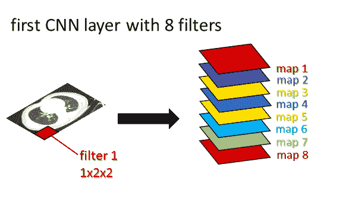
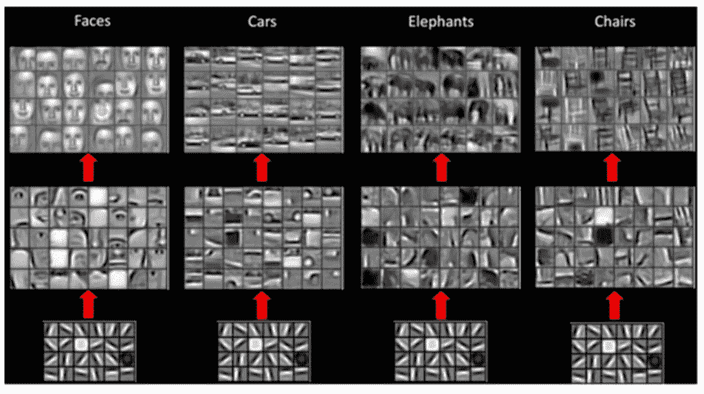
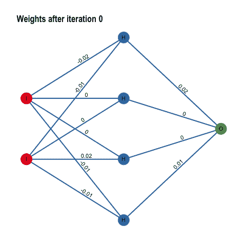

# 卷积神经网络(CNN)在 5 分钟内

> 原文：<https://towardsdatascience.com/convolutional-neural-networks-cnns-in-5-minutes-dc86d0e27e1e?source=collection_archive---------60----------------------->

## 任务，CNN 如何工作，学习，AUROC

卷积神经网络(CNN)是用于图像和视频分析的最流行的机器学习模型。

# **示例任务**

以下是可以使用 CNN 执行的一些任务示例:

*   二元分类:给定来自医学扫描的输入图像，确定患者是否有肺结节(1)或没有(0)
*   多标记分类:给定来自医学扫描的输入图像，确定患者是否没有、部分或全部以下症状:肺部阴影、结节、肿块、肺不张、心脏扩大、气胸

# **CNN 如何工作**

在 CNN 中，卷积滤波器滑过图像以产生特征图(下图中标为“卷积特征”):

卷积滤镜(黄色)滑过图像(绿色)产生特征图(粉红色，标记为“卷积特征”)的动画。来源: [giphy](https://glassboxmedicine.com/2020/08/03/convolutional-neural-networks-cnns-in-5-minutes/image/png;base64,iVBORw0KGgoAAAANSUhEUgAAAQcAAADACAMAAAA+71YtAAABjFBMVEX///+S0FD/wACV1VIAAABagDGdnZ3/xACddwCioKT9sbFTfiOdoKWdcwBTgTSidgD/yQCcaWmZ2lSchwDYigB8lTQ3Tx5ZkkP/wgBfhzQrRwCI1FP/zQCqqqqkfABhSQBTU1PU1NSRkZFKSkpbW1uZmZl7rEGFxE4pVS8AFRF0r0aEukdMiz+YzUYAMSM3HQAAABJCMABVYBYTAAAHRihbbR10vU8tAAAAPSYAABpJQgWdAACvPABbQAA7PhBssUw1CQAtJgBMaSmGAAB6nDQcEgBlnUDp6elzc3MvLy/hqQDlnAAtEwCXVgCdigCwegAAMwDXfgCzbgDgsQDATQD7sgBQWGrGxsaQvEEAPADKXgDliwDurACDpTe5ubk9PT3GbgDUlADEgQDJawDMmQBIUAAAHwBgOACFfgBlGgBzLABcCQAAJgDKrgBJAACgZADnwACBPQBQKACFYgC3kwBbNjYiIiLooqL/qpqGQyLnj3qPbXIAGEC+b1e5lqc4R2QDKTyHV1C5jJIkJCThoRDeAAALWElEQVR4nO2djX/bxBnHFesqNfTFileKE6wQOXb3wso2AttY6MboqJyEAWnaeYPObpsytsFYGSMtY2Ow/uO7506S9XIX3cVy7qTe79NPbD9WwPf1vTx6fjnJsoyMjIyMjIyMjIyMjIyMjIyMjIyMjIyMdFfgnGdqeVk2LicnVN3yrJyP2hcYal+7JhlfO8fUGi/uqG55VufbnsuQt74uF29f7NgMdVZX2fFzy6pbntX5C26LIffsWbl4+6K9xJB95gw7bjjUgEO3y26vQDzNwbbZHNJxjTm47m6ry2ivUHzGwbavXPlup8ghG9eXg7f3NvqOW2yvWDzhYP8GYX2vk+eQi2vLwf0t/piM9grGEw6/R9//wYu/RD+0cxxycW05eOidPVZ7BeMxB/tV9Cvbvope6mQ55OPacmh53iV2/xeKxxw6P/rx8/jnT9DzWQ75uL4cWi67vWLxhMMb8I3bLxc45OKN57D1SoeMgp/mOOTijefws5/T9ub7Qy7eeA5vvIbb2/lFcVxk403nYJOWdorrRS6uLwevdwm90/NIq7rpdSGJd/GJJSsOxyccnsW5UufVQv6Qj2vLwUNEf8AN6+1303lCHHf37t7zGHFy/Cyf/DWEXyrmkzQev9KWg/vuOuif+Dvf3j5I5Y1J/Pb1e9u768U4OT51frH65ps3khep84tMXFsOLVJOef9ma/th6/0Uh1n87v3e/s31YpwcnzrfhDrLUpFDNq4vB9q4W9d3cesO8nUG79b1g/373gcpDtnjG1V/aHVvb79+E9rlZTmQ+H62P2SPbxYH93C3d+vg0uv372Q5kPje9b3U/JA7vvYcCnVaz9vf37+Tq8d6Hv63d7jXY8Xh+LrXaZevrZ9N6cIF/APWgRdeyMSJGPHZ8ZdXzzC0epkTX+NwCJ2KJOmPsDhA01gcjo1XxMH5YoWpLwbs5g448Q1Jf0Q3/8JZeYapFZ9zPKe9vDiXg2Z1ey4HyfYaDnNzwKdR1fgXPA4i/oV6Dq774MGBx2ivpH+xZC+9yOIg5l9kOTw6fQ7uPTgf/NArtFfSv1jqXHkrPrs+gX+R5vAYod+dNofubfSnB3c+Qn92c+2V9S/sl3H8uSIHQf8izeFLBRzcv6O/uW4Lvefl2ivpXyxdRc/9kcFB1L9IcfgX+ur0OXh/QZiA91f0sND/pfwLPC46zzI4iPoXKQ6f/vuxAg4ff+KRzl7gIFefXCIlOAYHQf9ixuE/6GsVHLagwgajo7sYDoL+RcLhMfrvMyo4fPoe5fBwQRwE/YuEw5evPVLC4WMyP3y2uHEh5l/EHB6jb1a++hZ98+2jU+bwGfQEb+uT/HpREQdR/2LG4WhrawsvwV+f8rp5H33Y690k+cNxPgXP18itFx07z0HQv8jkkwrGRcv9B+R7ZNE4zqfg+RoJhw6Nv5L/OxBB/0I5h6777uefr+NTreN9Cp6vMcsnz6yCbuQ5EP9itdS/yJ5frPzv1DkQQ6Lcp+D6Gqm/E7NnToW0f6H+fJOox/EpcHy3y/A14PhDcnxz6g8tEZ+C62s0ioO7z/Ep9jm+RnJ87etRuTqt53q9D+4WfAqer+HGvkbd67S5uj3PpyiPa1a3H1TAgeFTlPsaVXEY+Kxm+dz2VsQhNy66kv5Fq3L/oqJ5oPZ1e8NBFw48/0LI12gOB55/IeZrZP4uiOlfZH0NbTnw/AtBX6PUv8jFdeXA8y9EfY1S/yIX15UDz78Q9TXK/IulTjauKweefyHqa5T5F/m4thw4/oWor1FWn8zHteXA8S9EfY3GcOD4F6K+RmM4cPwLUV+jMRw4/gWJd91SX6MpHNL+RdqnIHGv3Nco8y9o/EYS15VDyr/I+hSCvkYqf2D7F7m4thyof+Hhr9bL+BSzOMvXaBf2X/D8i1xcWw4z/yLnU6R8DY/paxxk91/w/ItsXGMOoB5n/wXEDzm+RqX7L1RziE6gT7L/olvl/gvVHKK+nvcpuqn4sb5G7Tm02fspknpsN4n3kv0X3UzcO6xw/4UqDsvX2gVRn4IVb7fZ8fV2dXV7yfp8Vf7F2kWmLl+Wjdecwzm5/lxVXLtxcU5ufqsqbjjoz0Hkuk/zcBDaf6Gcg9h1n3h+RHlccP+Fag6C133K+hHMeiw7Lrr/QjUHwes+8fyI0rjo/gvFHESv+8TzI8riwvsvFHMQve4Tz48oiwvvv1DNQfC6T7x6Y1lceP+Fag6C1306MQfR/ReqOQhe9+nEHET3X6jmIHjdp5OPC8H9F6rXC8HrPp2Ug/D+C9UcBK/7lFsXOD7FHPsvVOdRgtd9SuUJbJ+iZP+F9vnksdd9Wi3GBX0K2etHqecgdt0nnh9RHhfcf6GeQ1pPdf3BcDAcTJ024rAmV2+vKs6t229UU7eXvW6SbhwCdrPkFUhy0GxcqJJu86QqGQ5UIv6FbHvreP+Lcv9iPp9C1r9QpVL/Yk6fQta/UKVS/2JOn0LWv1ClMv9iXp9C1r9QpTL/Yl6fQta/UKUy/2JJuh5bz/tfxByuLsinkPUvVKnMv5DmUNP7X5T5F/Ljop73vyjzL2Q51PX+F2X+heh+ijK/Q/f7X+T9i0J77fl8Cln/QpVK/YsT+RQMv0Pw+lGqVO5fRJUT4Xg9739h6g9UhgOV4UBl6rRUy7L3m64qrhmHQPYG5FVJ0l8wenoViN7TJUCcq85ZFtqo5rMoU7gJ+fdI6NjjOGxW9onUCDMYj0dI6NgGc+ijPjyM4UcwjgdIOM4dFpBpFjiE+aBFBlbdOaCkJwQwPqb4yfRohJ9NrA0UHzCAt3zCISTcJsihx8MLBz8Oas4hTGaGEKEx7h0YxAZ+hhtp+dB0aPcAHxQ8QQHpDwQcHkch2gzxO2Mc3AnGqOYcAjosLBgg0MsHKMQccN/38UuA4uAXZC0IAAbmMITj0AA/wm/hXyeBsDEcNkm7oPlkPMATmD3x1x/NjrilZH7Av+GTUTPCIr0lerfWQk+iJxsRh/GMwwSmAyfhMKXPMBlo+gZyhljjeBqpOwcUTfr0a+2TcWFRDrhxPn4d9ZloXOCRAkPESpbaUSM4TAiIMQp8POZxpz+yUhz6dAFBMGEM8FigPQPBjIoPgBkWr5jkyUbdOVgjWv/FyyV5DKOZAgYILI3QcLJCAibKYUrXWpyH4n+OZR3BuzvTxXw8yds4zvN/cobOBJ74wz75478J/AzIjSSjv4oMnf5wTB4D8hYdShN8PMm3HPx7k8liPp1gxt94JevZU66IA03042w/TuiTxH58esNHkYADTfTDEZ2gQzJbBfG0RZZwOrE1WcABtxMyd5rtW/50jNe3TUh9QjxnQ7rnQ3Kv+pMuVpRDCOtaALlLFJ5CquvDshYNHUesclBbUQ4W5DIWbTasT0PoGFE2F6ApTvCnTx0HPDhGfcIB7ezgrCZAA5zhO0PVn3SxKnIgJwAD6AdDBxIfOAVqvooc4BVeM/AZwcj3/TBK+60F5XG6CDhsJhxgNvRJPk/GBa2I4YGy8wTNOT8MUVxey0u4mr9QDYM40R/GP8bD/jh06BmQtYNo2s8tIAuqj/yJ77PMLt1XZNJB8Elelf81ojg5DSkVcsqdOd+jPUSXHBZnVqMR1JMrUcIhTk779BybJq34AfokdI3p0UCzHDZwRiOnqo8Sc0iSU+RAGTrAuHeCcVx52SQA8DhtbA5Lvn4ox6eTU1qH3IyfRRxguDQ2h+0jx/edMJWcjp3+iMmBvGxqDhuNi1lyuomO+gM+h6bmsBGHJDklvl1IOGxYBQ7NzWHjeTJOTnHWDtm7HzmfIUUQc2huDttPpsYoOaVZq08L2aQqTYvR1O+qJIfVUUHc0ZPkFKrPpCLtDB3yckiK0RMne5iRkZGRkZGRkZGR0anp/94Y4OJU7vGQAAAAAElFTkSuQmCC)

过滤器检测模式。

当过滤器经过包含图案的图像区域时，输出特征图中会产生高值。

不同的过滤器检测不同的模式。

滤镜检测到的模式类型由滤镜的权重决定，在上面的动画中显示为红色数字。

滤波器权重与相应的像素值相乘，然后将这些相乘的结果相加，以产生进入特征图的输出值。

卷积神经网络包括用许多不同的滤波器多次应用这种卷积运算。

该图显示了 CNN 的第一层:

图片由作者提供(带 CT 切片源[无线媒体](https://prod-images-static.radiopaedia.org/images/29750156/e41805727ab19df1a8cb0b0b0c2c78_big_gallery.jpeg)

在上图中，CT 扫描切片是 CNN 的输入。标有“滤波器 1”的卷积滤波器以红色显示。该过滤器在输入 CT 切片上滑动以产生特征图，显示为红色的“图 1”

然后，检测不同模式的称为“滤波器 2”(未明确示出)的不同滤波器滑过输入 CT 切片，以产生特征图 2，以紫色示出为“图 2”

对过滤器 3(产生黄色的地图 3)、过滤器 4(产生蓝色的地图 4)等等重复该过程，直到过滤器 8(产生红色的地图 8)。

这是 CNN 的“第一层”。因此，第一层的输出是一个 3D 数字块，在这个例子中由 8 个不同的 2D 特征地图组成。

作者图片

接下来我们进入 CNN 的第二层，如上图所示。我们采用我们的 3D 表示(8 个特征图),并对此应用一个称为“过滤器 a”的过滤器。“过滤器 a”(灰色)是 CNN 第二层的一部分。请注意，“过滤器 a”实际上是三维的，因为它在 8 个不同的特征图上各有一个 2×2 平方的权重。因此“过滤器 a”的大小是 8×2×2。一般来说，“2D”CNN 中的滤波器是 3D 的，而“3D”CNN 中的滤波器是 4D 的。

我们在表示中滑动过滤器 a 以产生地图 a，以灰色显示。然后，我们滑动过滤器 b 得到地图 b，滑动过滤器 c 得到地图 c，以此类推。这就完成了 CNN 的第二层。

然后我们可以继续到第三层、第四层等等。然而，需要多层 CNN。CNN 可以有很多层。例如，ResNet-18 CNN 架构有 18 层。

下图，来自[krijevsky 等人](https://papers.nips.cc/paper/4824-imagenet-classification-with-deep-convolutional-neural-networks.pdf)。，显示了 CNN 早期各层的示例过滤器。CNN 早期的过滤器检测简单的图案，如边缘和特定方向的线条，或简单的颜色组合。

下图来自 [Siegel et al.](https://ieeexplore.ieee.org/abstract/document/7840668) 改编自 [Lee et al.](https://web.eecs.umich.edu/~honglak/icml09-ConvolutionalDeepBeliefNetworks.pdf) ，显示了底部的早期层过滤器、中间的中间层过滤器和顶部的后期层过滤器的示例。

早期层过滤器再次检测简单的图案，如沿特定方向的线条，而中间层过滤器检测更复杂的图案，如面部、汽车、大象和椅子的部分。后面的图层过滤器检测更复杂的图案，如整张脸、整辆车等。在这种可视化中，每个后面的层过滤器被可视化为前一层过滤器的加权线性组合。

# **如何学习滤镜**

我们如何知道在每个滤波器中使用什么特征值？我们从数据中学习特征值。这是“机器学习”或“深度学习”的“学习”部分。

步骤:

1.  随机初始化特征值(权重)。在这个阶段，模型产生了垃圾——它的预测完全是随机的，与输入无关。
2.  对一堆训练示例重复以下步骤:(a)向模型输入一个训练示例(b)使用损失函数计算模型的错误程度(c)使用反向传播算法对特征值(权重)进行微小调整，以便下次模型的错误程度会更小。随着模型在每个训练示例中的错误越来越少，它将在训练结束时学习如何很好地执行任务。
3.  在从未见过的测试示例上评估模型。测试示例是被搁置在一边并且没有在训练中使用的图像。如果模型在测试例子中表现良好，那么它学习了可概括的原则，是一个有用的模型。如果模型在测试示例中表现不佳，那么它记住了训练数据，是一个无用的模型。

下面这个由塔玛斯·齐拉吉创作的动画展示了一个神经网络模型学习。动画显示的是前馈神经网络，而不是卷积神经网络，但学习原理是相同的。在这个动画中，每条线代表一个重量。线旁边显示的数字是重量值。权重值随着模型的学习而变化。

# **测量性能:AUROC**

作者图片

CNN 的一个流行性能指标是 AUROC，即接收机工作特性下的面积。此性能指标指示模型是否能正确地对示例进行排序。AUROC 是随机选择的正面例子比随机选择的负面例子具有更高的正面预测概率的概率。0.5 的 AUROC 对应于抛硬币或无用模型，而 1.0 的 AUROC 对应于完美模型。

# **补充阅读**

有关 CNN 的更多详细信息，请参阅:

*   [计算机如何看待:卷积神经网络简介](https://glassboxmedicine.com/2019/05/05/how-computers-see-intro-to-convolutional-neural-networks/)
*   [卷积神经网络的历史](https://glassboxmedicine.com/2019/04/13/a-short-history-of-convolutional-neural-networks/)
*   [卷积与互相关](https://glassboxmedicine.com/2019/07/26/convolution-vs-cross-correlation/)

有关神经网络如何学习的更多细节，请参见[神经网络介绍](https://glassboxmedicine.com/2019/01/17/introduction-to-neural-networks/)。

最后，有关 AUROC 的更多详细信息，请参见:

*   [衡量业绩:AUC (AUROC)](https://glassboxmedicine.com/2019/02/23/measuring-performance-auc-auroc/)
*   [AUC 和平均精度完全指南:模拟和可视化](https://glassboxmedicine.com/2020/07/14/the-complete-guide-to-auc-and-average-precision-simulations-and-visualizations/)

*原载于 2020 年 8 月 3 日 http://glassboxmedicine.com***。**