# 卷积神经网络，解释

> 原文：<https://towardsdatascience.com/convolutional-neural-networks-explained-9cc5188c4939?source=collection_archive---------0----------------------->


克里斯托夫·高尔在 [Unsplash](https://unsplash.com?utm_source=medium&utm_medium=referral) 上拍摄的照片

卷积神经网络，也称为 CNN 或 ConvNet，是一类[神经网络](https://datascience.hubs.vidyard.com/watch/CYfbzzj57RPfCwoMnEHD4M)，专门处理具有网格状拓扑结构的数据，如图像。数字图像是视觉数据的二进制表示。它包含一系列以类似网格的方式排列的像素，这些像素包含表示每个像素的亮度和颜色的像素值。

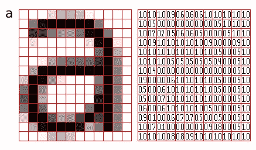

*图 1:以像素网格表示的图像(* [*来源*](http://pippin.gimp.org/image_processing/images/sample_grid_a_square.png) *)*

当我们看到一幅图像时，人类的大脑会处理大量的信息。每个神经元都在自己的感受野中工作，并以覆盖整个视野的方式与其他神经元相连。正如在生物视觉系统中，每个神经元只对视野中称为感受野的有限区域的刺激做出反应，CNN 中的每个神经元也只在其感受野中处理数据。这些层以这样的方式排列，使得它们首先检测较简单的图案(直线、曲线等)。)和更复杂的图案(人脸、物体等)。)再往前。通过使用美国有线电视新闻网，人们可以[让视觉进入电脑](https://www.datascience.com/blog/computer-vision-in-artificial-intelligence)。

# 卷积神经网络体系结构

CNN 通常有三层:卷积层、池层和全连接层。

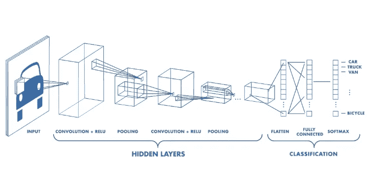

*图 2:一个 CNN 的架构(* [*来源*](https://www.mathworks.com/videos/introduction-to-deep-learning-what-are-convolutional-neural-networks--1489512765771.html) *)*

# 卷积层

卷积层是 CNN 的核心构件。它承担了网络计算负载的主要部分。

这一层执行两个矩阵之间的点积，其中一个矩阵是一组可学习的参数，也称为核，另一个矩阵是感受野的受限部分。内核在空间上比图像小，但更有深度。这意味着，如果图像由三个(RGB)通道组成，则内核的高度和宽度在空间上很小，但深度会延伸到所有三个通道。


卷积运算图解([来源](https://miro.medium.com/max/2340/1*Fw-ehcNBR9byHtho-Rxbtw.gif)

在向前传递的过程中，内核在图像的高度和宽度上滑动，产生该接收区域的图像表示。这产生了被称为激活图的图像的二维表示，该激活图给出了图像的每个空间位置处的内核的响应。内核的滑动大小称为步幅。

如果我们有一个大小为 W x W x D 的输入，空间大小为 F 的 Dout 个核，步长为 S，填充量为 P，则输出音量的大小可由以下公式确定:

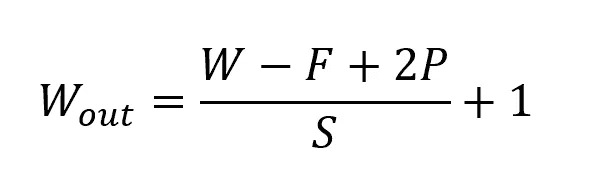

卷积层公式

这将产生大小为*Wout*x*Wou*t x*Dout*的输出量。

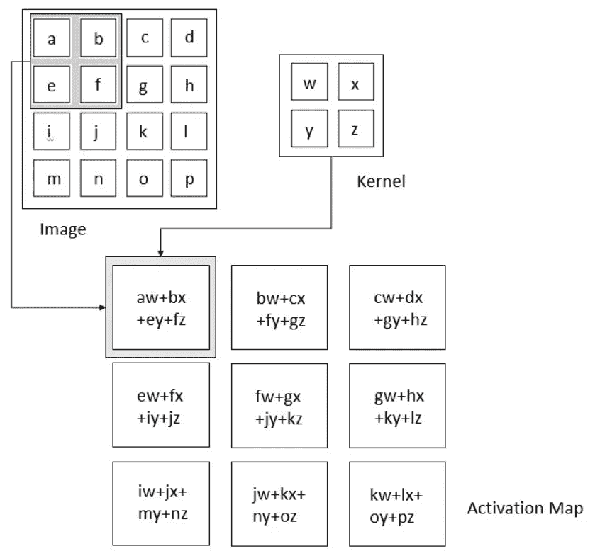

*图 3:卷积运算(来源:伊恩·古德菲勒、约舒阿·本吉奥和亚伦·库维尔的深度学习)*

**卷积背后的动机**

卷积利用了激励计算机视觉研究人员的三个重要思想:稀疏交互、参数共享和等变表示。让我们详细描述一下它们中的每一个。

普通的神经网络层使用描述输入和输出单元之间交互的参数矩阵的矩阵乘法。这意味着每个输出单元都与每个输入单元相互作用。但是卷积神经网络有*稀疏交互。*这是通过使内核小于输入实现的，例如，一幅图像可能有数百万或数千个像素，但在使用内核处理它时，我们可以检测到数十或数百个像素的有意义信息。这意味着我们需要存储更少的参数，这不仅降低了模型的内存需求，而且提高了模型的统计效率。

如果在空间点(x1，y1)计算一个特征是有用的，那么它在其他空间点(比如说(x2，y2))也应该是有用的。这意味着对于单个二维切片，即，为了创建一个激活图，神经元被约束为使用相同的一组权重。在传统的神经网络中，权重矩阵的每个元素都被使用一次，然后就不再被重新访问，而卷积网络有*个共享参数*，即，为了获得输出，应用于一个输入的权重与应用于其他地方的权重相同。

由于参数共享，卷积神经网络的层将具有与平移等变的*特性。它说如果我们以某种方式改变输入，输出也会以同样的方式改变。*

# 汇集层

汇集层通过导出附近输出的汇总统计来替换特定位置的网络输出。这有助于减少表示的空间大小，从而减少所需的计算量和权重。在表示的每个切片上单独处理池化操作。

有几种汇集函数，如矩形邻域的平均值、矩形邻域的 L2 范数以及基于与中心像素的距离的加权平均值。然而，最流行的过程是最大池化，它报告邻域的最大输出。

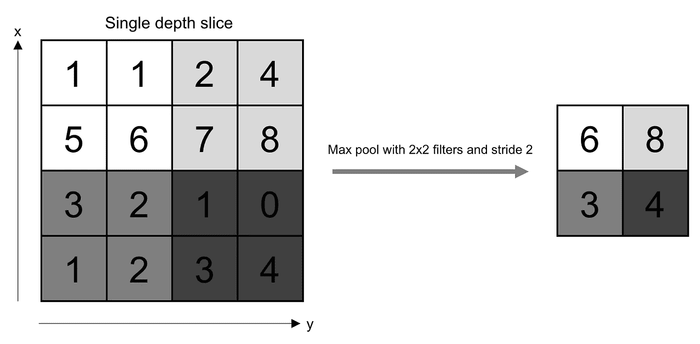

*图 4:汇集操作(来源:奥莱利媒体)*

如果我们有一个大小为 *W* x *W* x *D* 的激活图，一个空间大小为 *F* 的池化内核，以及步长 *S* ，那么输出量的大小可以由以下公式确定:

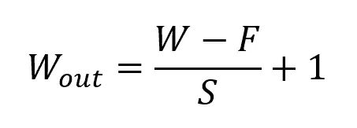

填充层的配方

这将产生大小为*Wout*x*Wout*x*D*的输出量。

在所有情况下，池提供了一些平移不变性，这意味着无论对象出现在帧的什么位置，它都是可识别的。

# 全连接层

这一层中的神经元与前一层和后一层中的所有神经元完全连接，如在常规 FCNN 中所见。这就是为什么它可以像往常一样通过矩阵乘法后跟一个偏置效应来计算。

FC 层有助于映射输入和输出之间的表示。

# 非线性层

由于卷积是线性操作，并且图像远不是线性的，所以非线性层通常直接放置在卷积层之后，以将非线性引入激活图。

非线性操作有几种类型，常见的有:

**1。乙状结肠**

sigmoid 非线性的数学形式为σ(κ) = 1/(1+e κ)。它接受一个实数值，并将其“压缩”到 0 到 1 之间的范围内。

然而，sigmoid 的一个非常不理想的性质是，当激活在任一尾部时，梯度几乎变为零。如果局部梯度变得非常小，那么在反向传播中，它将有效地“杀死”梯度。此外，如果进入神经元的数据总是正的，那么 sigmoid 的输出将要么全是正的，要么全是负的，导致权重梯度更新的之字形动态。

**2。坦恩**

Tanh 将一个实数值压缩到[-1，1]范围内。像乙状结肠一样，激活会饱和，但与乙状结肠神经元不同，它的输出以零为中心。

**3。ReLU**

整流线性单元(ReLU)在最近几年变得非常流行。它计算函数ф(κ)= max(0，κ)。换句话说，激活只是阈值为零。

与 sigmoid 和 tanh 相比，ReLU 更可靠，收敛速度提高了 6 倍。

不幸的是，ReLU 在训练中很脆弱。流经它的大梯度可以以这样的方式更新它，即神经元永远不会进一步更新。然而，我们可以通过设定适当的学习速度来解决这个问题。

# 设计卷积神经网络

现在，我们已经了解了各种组件，我们可以构建一个卷积神经网络。我们将使用时尚 MNIST，这是 Zalando 文章图像的数据集，由 60，000 个样本的训练集和 10，000 个样本的测试集组成。每个示例都是 28x28 灰度图像，与 10 个类别的标签相关联。数据集可以从[这里](https://www.researchgate.net/publication/319312259_Fashion-MNIST_a_Novel_Image_Dataset_for_Benchmarking_Machine_Learning_Algorithms)下载。

我们的卷积神经网络具有如下架构:

[输入]

→[conv 1]→[批次定额]→[ReLU]→[池 1]

→[conv 2]→[批次定额]→[ReLU]→[池 2]

→ [FC 层]→[结果]

对于两个 conv 层，我们将使用空间大小为 5 x 5 的核，步长为 1，填充为 2。对于这两个池层，我们将使用最大池操作，内核大小为 2，步幅为 2，填充为零。

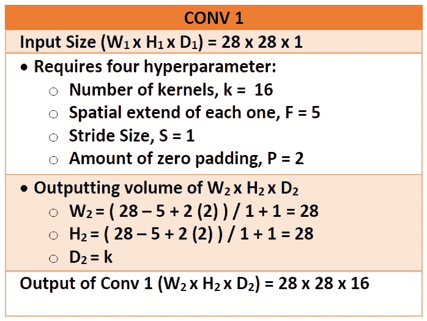

Conv 1 层的计算(图片由作者提供)

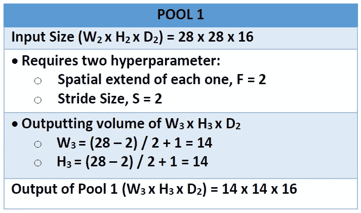

Pool1 图层的计算(图片由作者提供)

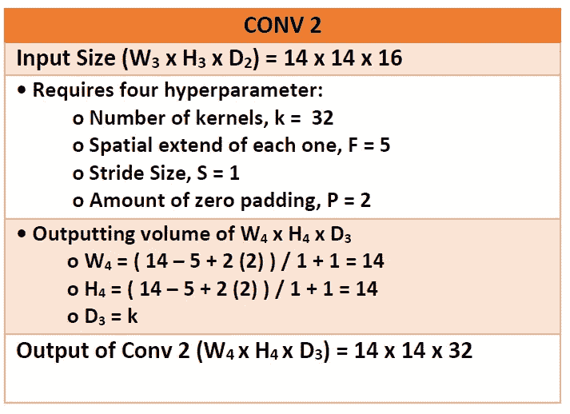

Conv 2 层的计算(图片由作者提供)

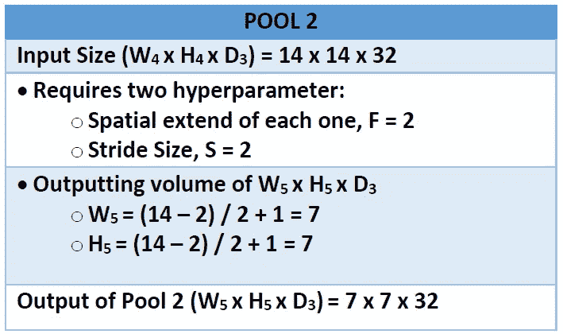

Pool2 层的计算(图片由作者提供)

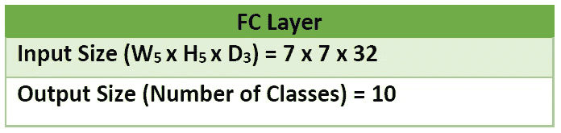

完全连接层的大小(图片由作者提供)

为定义 convnet 而截取的代码

```
**class** **convnet1**(nn.Module):
    **def** __init__(self):
        super(convnet1, self).__init__()

        *# Constraints for layer 1*
        self.conv1 = nn.Conv2d(in_channels=1, out_channels=16, kernel_size=5, stride = 1, padding=2)
        self.batch1 = nn.BatchNorm2d(16)
        self.relu1 = nn.ReLU()
        self.pool1 = nn.MaxPool2d(kernel_size=2) *#default stride is equivalent to the kernel_size*

        *# Constraints for layer 2*
        self.conv2 = nn.Conv2d(in_channels=16, out_channels=32, kernel_size=5, stride = 1, padding=2)
        self.batch2 = nn.BatchNorm2d(32)
        self.relu2 = nn.ReLU()
        self.pool2 = nn.MaxPool2d(kernel_size=2)

        *# Defining the Linear layer*
        self.fc = nn.Linear(32*7*7, 10)

    *# defining the network flow*
    **def** forward(self, x):
        *# Conv 1*
        out = self.conv1(x)
        out = self.batch1(out)
        out = self.relu1(out)

        *# Max Pool 1*
        out = self.pool1(out)

        *# Conv 2*
        out = self.conv2(out)
        out = self.batch2(out)
        out = self.relu2(out)

        *# Max Pool 2*
        out = self.pool2(out)

        out = out.view(out.size(0), -1)
        *# Linear Layer*
        out = self.fc(out)

        **return** out
```

我们还在我们的网络中使用了批量归一化，通过明确地强制网络采用单位高斯分布，避免了权重矩阵的不正确初始化。上述定义的网络代码可在[这里](https://github.com/mayankskb/DL-Times/blob/master/DL-Models/FashionMNIST-classification/Fashion-MNIST%20Classification.ipynb)获得。我们已经使用交叉熵作为我们的损失函数和 Adam 优化器进行了训练，学习率为 0.001。在训练模型之后，我们在测试数据集上实现了 90%的准确率。

# 应用程序

以下是目前使用的卷积神经网络的一些应用:

1.对象检测:有了 CNN，我们现在有了复杂的模型，如 [R-CNN](https://www.cv-foundation.org/openaccess/content_cvpr_2014/papers/Girshick_Rich_Feature_Hierarchies_2014_CVPR_paper.pdf) 、 [Fast R-CNN](https://arxiv.org/pdf/1504.08083.pdf) 和[Fast R-CNN](https://arxiv.org/pdf/1506.01497.pdf)，它们是许多部署在自动驾驶汽车、面部检测等中的对象检测模型的主要渠道。

2.语义分割:2015 年，一群来自香港的研究人员开发了一个基于 CNN 的[深度解析网络](https://arxiv.org/pdf/1509.02634.pdf)，将丰富的信息纳入图像分割模型。来自加州大学伯克利分校的研究人员还建立了[全卷积网络](https://www.cv-foundation.org/openaccess/content_cvpr_2015/papers/Long_Fully_Convolutional_Networks_2015_CVPR_paper.pdf)，改进了最先进的语义分割。

3.图像字幕:CNN 与递归神经网络一起使用，为图像和视频编写字幕。这可以用于许多应用，例如活动识别或为视觉障碍者描述视频和图像。YouTube 已经大量部署了这种技术，以便对定期上传到该平台的大量视频进行分析。

# **参考文献**

1.伊恩·古德菲勒、约舒阿·本吉奥和亚伦·库维尔的深度学习由麻省理工学院出版社于 2016 年出版

2.斯坦福大学的课程— CS231n:视觉识别的卷积神经网络费、、杨小琳教授

3.[https://data science . stack exchange . com/questions/14349/difference-of-activation-functions-in-neural-networks-in-general](https://datascience.stackexchange.com/questions/14349/difference-of-activation-functions-in-neural-networks-in-general)

4.[https://www . code mentor . io/James _ aka _ Yale/convolutionary-neural-networks-the-biological-inspired-model-iq6s 48 zms](https://www.codementor.io/james_aka_yale/convolutional-neural-networks-the-biologically-inspired-model-iq6s48zms)

5.[https://search enterprise ai . tech target . com/definition/卷积神经网络](https://searchenterpriseai.techtarget.com/definition/convolutional-neural-network)