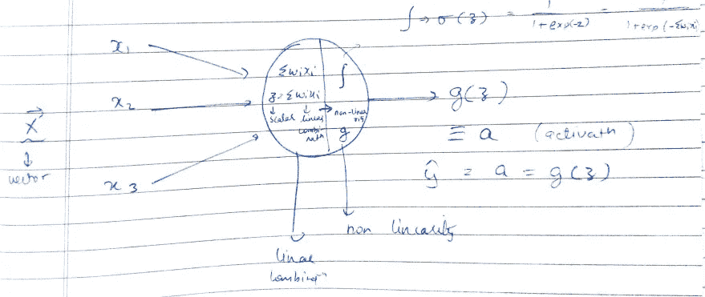
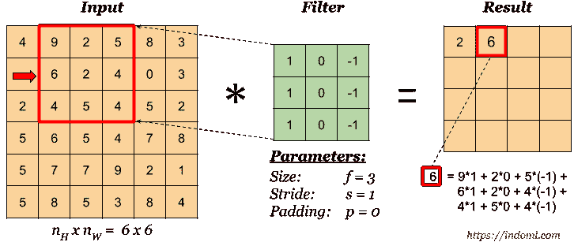
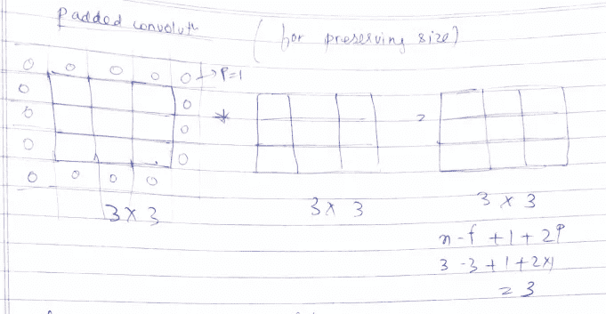
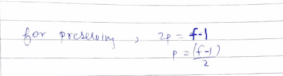
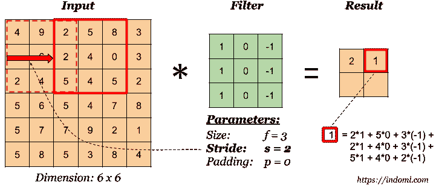
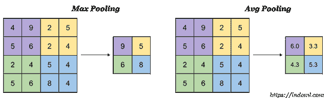
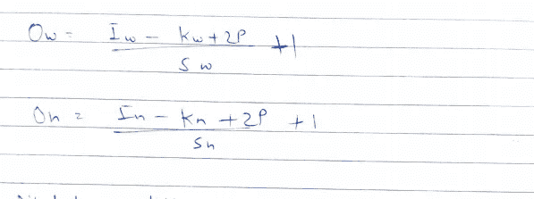
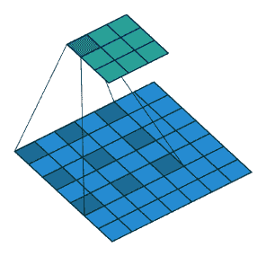
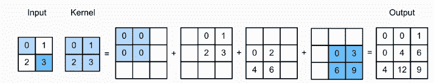

# 卷积神经网络

> 原文：<https://towardsdatascience.com/convolutional-neural-networks-f62dd896a856?source=collection_archive---------16----------------------->

## CNN 的基本原理

CNN 是一种特殊类型的人工神经网络，它接受图像作为输入。以下是人工神经网络的基本神经元的表示，它将 X 向量作为输入。然后，X 向量中的值乘以相应的权重，以形成线性组合。因此，施加非线性函数或激活函数，以便获得最终输出。

神经元表示，图片由作者提供

# 为什么是 CNN？

谈到灰度图像，它们的像素范围从 0 到 255，即 8 位像素值。如果图像的大小是 NxM，那么输入向量的大小将是 N*M。对于 RGB 图像，它将是 N*M*3。考虑一个大小为 30x30 的 RGB 图像。这将需要 2700 个神经元。一幅 256x256 大小的 RGB 图像需要超过 100000 个神经元。ANN 采用输入向量，并给出一个乘积，作为与输入完全关联的另一个隐藏层的向量。224x224x3 的权重、参数数量非常大。输出层中的单个神经元将有 224x224x3 个权重进入其中。这将需要更多的计算、内存和数据。CNN 利用图像的结构导致输入和输出神经元之间的稀疏连接。每一层在 CNN 上执行卷积。CNN 将输入作为 RGB 图像的图像体积。基本上，一幅图像作为输入，我们对图像应用内核/过滤器来获得输出。CNN 还支持输出神经元之间的参数共享，这意味着在图像的一部分有用的特征检测器(例如水平边缘检测器)可能在图像的另一部分有用。

# 回旋

每个输出神经元通过权重矩阵(也称为核或权重矩阵)连接到输入中的小邻域。我们可以为每个卷积层定义多个内核，每个内核产生一个输出。每个滤波器围绕输入图像移动，产生第二输出。对应于每个滤波器的输出被叠加，产生输出量。

卷积运算，通过 indoml 成像

这里，矩阵值与核滤波器的相应值相乘，然后执行求和操作以获得最终输出。核滤波器在输入矩阵上滑动，以获得输出向量。如果输入矩阵的维数为 Nx 和 Ny，而核矩阵的维数为 Fx 和 Fy，那么最终输出的维数将为 Nx-Fx+1 和 Ny-Fy+1。在 CNN 中，权重代表一个内核过滤器。k 内核图会提供 k 内核特性。

# 填料

填充卷积用于保留对我们很重要的输入矩阵的维度，它帮助我们保留图像边界的更多信息。我们已经看到卷积减少了特征图的大小。为了将特征映射的维度保持为输入映射的维度，我们用零填充或附加行和列。

填充，作者图像

在上图中，填充为 1，我们能够保留 3x3 输入的维度。输出特征图的大小是维数 N-F+2P+1。其中 N 是输入映射的大小，F 是内核矩阵的大小，P 是填充的值。为了保持维数，N-F+2P+1 应该等于 N。因此，

按作者保留尺寸、图像的条件

# 进展

步幅指的是内核过滤器将跳过的像素数，即像素/时间。步幅为 2 意味着内核在执行卷积运算之前将跳过 2 个像素。

步幅演示，由 indoml 制作图像

在上图中，内核过滤器通过一次跳过一个像素在输入矩阵上滑动。步幅为 2 将在执行卷积之前执行两次此跳跃操作，如下图所示。

步幅演示，由 indoml 制作图像

这里要观察的是，当步幅从 1 增加到 2 时，输出特征图减小(4 倍)。输出特征图的维数是(N-F+2P)/S + 1。

# 联营

池通过子采样提供平移不变性:减小特征图的大小。两种常用的池技术是最大池和平均池。

最大池操作，图像由 indoml

在上面的操作中，池化操作将 4x4 矩阵分为 4 个 2x2 矩阵，并选取四个矩阵中最大的值(最大池化)和四个矩阵的平均值(平均池化)。这减小了特征图的大小，从而在不丢失重要信息的情况下减少了参数的数量。这里需要注意的一点是，池化操作会减少输入特征图的 Nx 和 Ny 值，但不会减少 Nc(通道数)的值。此外，池操作中涉及的超参数是过滤器维度、步幅和池类型(最大或平均)。梯度下降没有要学习的参数。

# 输出特征地图

输出特征图或体积的大小取决于:

1.  输入要素地图的大小
2.  内核大小(千瓦，Kh)
3.  零填充
4.  步幅(Sw，Sh)

# 朴素卷积

这些是卷积神经网络的构建模块，并且依赖于上述参数。输出特征地图的维度可表示为:

o/p 特征图的尺寸，图片由作者提供

# 扩张卷积

这有一个额外的参数，称为膨胀率。这种技术用于增加卷积中的感受野。这个卷积也称为 atrous 卷积。膨胀率为 2 的 3×3 卷积与简单的 5×5 卷积显示相同的面积，而只有 9 个参数。它可以在相同的计算成本下提供更宽的视野。只有在需要宽视野以及无法承受多重卷积或更大内核的情况下，才应该使用它们。下图描绘了一个扩张的卷积的可接受范围。

放大卷积，图像由[Paul-Louis prve](https://towardsdatascience.com/@pietz?source=post_page-----717013397f4d----------------------)

# 转置卷积

用于增加输出要素地图的大小。它被用在编码器-解码器网络中以增加空间维度。在卷积运算之前，输入图像被适当地填充。

转置卷积，图像由 [Divyanshu Mishra](https://towardsdatascience.com/@mdivyanshu.ai?source=post_page-----84ca81b4baba----------------------)

# 结束了

谢谢，请继续关注更多关于人工智能的博客。