# 初学者使用 Keras & TensorFlow 2 的卷积神经网络

> 原文：<https://towardsdatascience.com/convolutional-neural-networks-for-beginners-using-keras-and-tensorflow-2-c578f7b3bf25?source=collection_archive---------7----------------------->

## 边做边学:包含 GitHub 代码的实用指南

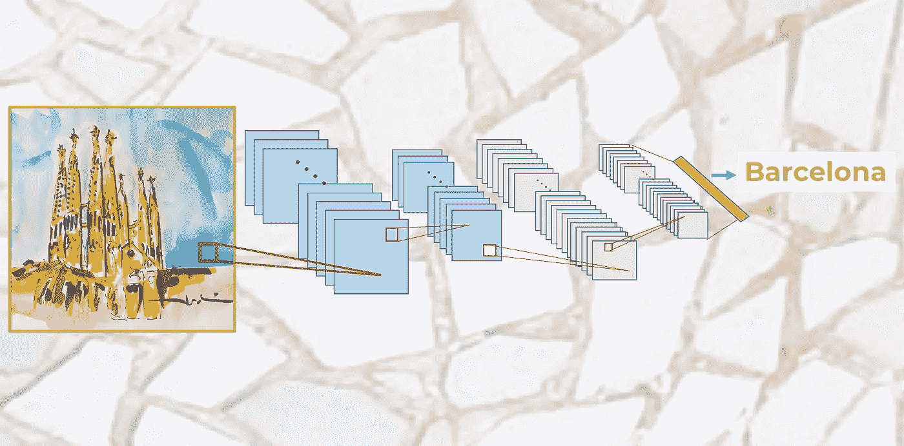

来源: [https://torres.ai](https://torres.ai)

> 这是我在两年前写的**介绍卷积神经网络的前一篇文章的**更新版本**。在这篇文章中，我更新了我们用来解释概念的 Kera 代码。自此，Keras [成为 TensorFlow 构建和训练深度学习模型的高级 API](https://www.tensorflow.org/guide/keras) 。我会用这个更新来改进内容。**

选择性神经元网络广泛应用于计算机视觉任务中。这些网络由一个输入层、一个输出层和几个隐藏层组成，其中一些是卷积的，因此得名。

在本帖中，我们将展示一个具体案例，我们将一步一步地了解这种类型网络的基本概念。具体来说，我们将与读者一起编写一个卷积神经网络来解决上面看到的相同的 MNIST 数字识别问题。

# 卷积神经网络简介

卷积神经网络(缩写为 CNNs 或 ConvNets)是深度学习神经网络的一个具体例子，它在 90 年代末就已经使用，但近年来在图像识别方面取得了非常令人印象深刻的结果，从而极大地影响了计算机视觉领域。

卷积神经网络与本系列前几篇文章中的神经网络非常相似:它们由神经元组成，神经元具有可以学习的权重和偏差形式的参数。但是 CNN 的一个与众不同的特点是，他们明确假设条目是图像，这允许我们在架构中对某些属性进行编码，以识别图像中的特定元素。

为了直观地了解这些神经网络是如何工作的，让我们想想我们是如何识别事物的。例如，如果我们看到一张脸，我们会认出它，因为它有耳朵、眼睛、鼻子、头发等等。然后，为了确定某样东西是不是一张脸，我们就像有一些验证我们正在标记的特征的心理盒子一样去做。有时候一张脸可能因为被毛发覆盖而没有耳朵，但是我们也有一定概率把它归类为脸，因为我们看到了眼睛，鼻子和嘴巴。实际上，我们可以将其视为与帖子“[神经网络的基本概念](/basic-concepts-of-neural-networks-1a18a7aa2bd2)”中介绍的分类器等效的分类器，它预测输入图像是人脸还是没有人脸的概率。

但在现实中，我们必须先知道一只耳朵或一个鼻子是什么样子，才能知道它们是否在一个图像中；也就是说，我们必须事先识别与我们之前见过的包含耳朵或鼻子的线条、边缘、纹理或形状相似的线条、边缘、纹理或形状。这就是卷积神经网络的各层被委托去做的事情。

但是识别这些元素并不足以说某样东西是一张脸。我们还必须能够识别一张脸的各个部分是如何相遇的，相对大小等等。；否则，这张脸就不像我们习惯的样子了。从视觉上看，吴恩达团队的一篇[文章中的这个例子通常能让我们直观地了解分层学习的内容。](https://dl.acm.org/citation.cfm?id=2001295)

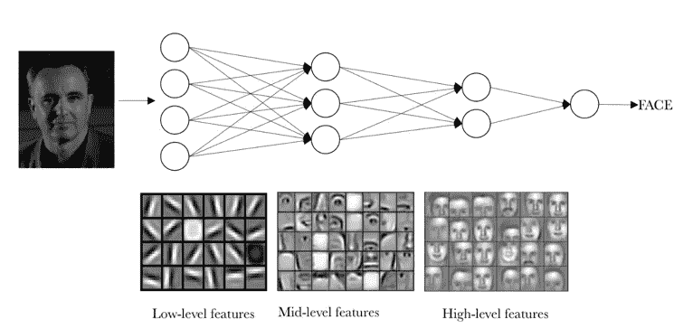

([来源](https://torres.ai/artificial-intelligence-content/deeplearning/)

我们想通过这个视觉例子给出的想法是，在现实中，在卷积神经网络中，每一层都在学习不同的抽象层次。读者可以想象，有了多层网络，就有可能识别输入数据中更复杂的结构。

# 卷积神经网络神经元的基本组件

现在，我们对卷积神经网络如何对图像进行分类有了直观的了解，我们将给出一个识别 MNIST 数字的例子，从中我们将介绍定义卷积网络的两个层，卷积网络可以表示为两个操作中的特定神经元组:卷积和汇集。

## 卷积运算

在卷积运算中，密集连接层和专用层(我们称之为卷积层)的根本区别在于，密集层在其全局输入空间中学习全局模式，而卷积层在二维小窗口中学习局部模式。

以直观的方式，我们可以说卷积层的主要目的是检测图像中的特征或视觉特征，如边缘、线条、颜色下降等。这是一个非常有趣的特性，因为一旦它学习了图像中某个特定点的特征，它就可以在以后的任何部分识别它。相反，在密集连接的神经网络中，如果它出现在图像的新位置，它必须再次学习模式。

另一个重要特征是，卷积层可以通过保留空间关系来学习模式的空间层次。例如，第一卷积层可以学习诸如边的基本元素，第二卷积层可以学习由在前一层中学习的基本元素组成的模式。以此类推，直到它学会非常复杂的模式。这使得卷积神经网络能够有效地学习日益复杂和抽象的视觉概念。

一般来说，卷积层在称为特征图的 3D 张量上操作，具有高度和宽度的两个空间轴，以及也称为深度的通道轴。对于 RGB 彩色图像，深度轴的维度是 3，因为图像具有三个通道:红色、绿色和蓝色。对于黑白图像，例如 MNIST 数字，深度轴维度是 1(灰度级)。

在 MNIST 的例子中，作为我们神经网络的输入，我们可以想象一个 28×28(高= 28，宽= 28，深= 1)的二维神经元空间。连接到我们已经讨论的输入层神经元的第一层隐藏神经元将执行我们刚刚描述的卷积运算。但是正如我们已经解释过的，并不是所有的输入神经元都与这个第一级隐藏神经元的所有神经元相连接，就像密集连接的神经网络的情况一样；这仅仅是通过存储图像像素的输入神经元空间的小的局部区域来完成的。

直观地解释，可以表示为:

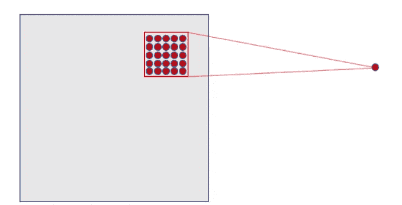

([来源](https://torres.ai/artificial-intelligence-content/deeplearning/))

在我们前面的例子中，隐藏层的每个神经元将连接到输入层(28×28)的 5×5 个神经元(即 25 个神经元)的小区域。直观上，我们可以想象一个 5×5 大小的窗口，它沿着包含图像的整个 28×28 神经元层滑动。对于窗口的每个位置，隐藏层中都有一个神经元处理这些信息。

视觉上，我们从图像左上角的窗口开始，这为隐藏层的第一个神经元提供了必要的信息。然后，我们将窗口向右滑动一个位置，将此窗口中包含的输入层的 5×5 神经元与隐藏层的第二个神经元“连接”。因此，我们从左到右，从上到下，依次遍历输入层的整个空间。

稍微分析一下我们提出的具体情况，我们注意到，如果我们有 28×28 像素的输入和 5×5 的窗口，这在第一隐藏层中定义了 24×24 个神经元的空间，因为在碰到输入图像的右(或下)边界之前，我们只能将窗口向右移动 23 个神经元，向下移动 23 个神经元。

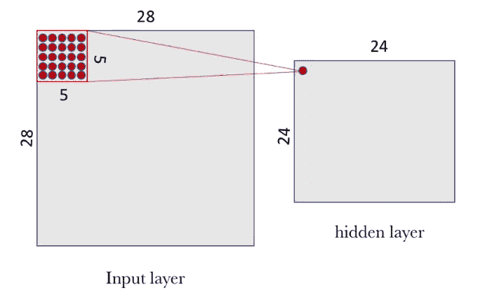

([来源](https://torres.ai/artificial-intelligence-content/deeplearning/)

我们希望向读者指出，我们所做的假设是，当新的一行开始时，窗口水平和垂直地向前移动 1 个像素。因此，在每一步中，除了我们已经前进的这一行像素之外，新窗口与前一个窗口重叠。但是，正如我们将在下一节中看到的，在卷积神经网络中，可以使用不同长度的前进步长(称为步幅的参数)。在卷积神经网络中，你也可以应用在图像边缘填充零的技术来改善滑动窗口的扫描。定义这种技术的参数称为“填充”，我们也将在下一节更详细地介绍它，使用它可以指定填充的大小。

在我们的研究案例中，并遵循之前提出的形式，为了将隐藏层的每个神经元与输入层的 25 个相应神经元“连接”，我们将使用一个偏差值 *b* 和一个*W*-大小为 5×5 的权重矩阵，我们称之为过滤器(或内核)。隐藏层的每个点的值对应于滤波器和输入层的少数 25 个神经元(5×5)之间的标量积。

然而，关于卷积网络的特别和非常重要的事情是，我们对隐藏层中的所有神经元使用相同的滤波器(相同的 *W* 权重矩阵和相同的 *b* 偏差):在我们的例子中，对第一层的 24×24 个神经元(总共 576 个神经元)。读者可以在这个特定的例子中看到，这种共享大大减少了如果我们不这样做时神经网络将拥有的参数数量:它从 14，400 个必须调整的参数(5×5 × 24×24)增加到 25 个(5×5)参数加上偏差 *b* 。

这个共享的 *W* 矩阵和 *b* 偏差，我们已经说过我们在卷积网络的上下文中称之为过滤器，类似于我们用来修饰图像的过滤器，在我们的情况下，过滤器用于在小的条目组中寻找局部特征。我建议查看在 [GIMP 图像编辑器手册](https://docs.gimp.org/2.8/en/plug-in-convmatrix.html)中找到的例子，以获得卷积过程如何工作的视觉和非常直观的想法。

但是由矩阵 *W* 和偏差 *b* 定义的滤波器仅允许检测图像中的特定特征；因此，为了执行图像识别，建议同时使用几个滤波器，每个滤波器用于我们想要检测的一个特征。这就是为什么卷积神经网络中的完整卷积层包括几个滤波器。

下图显示了直观表示该卷积层的一种常用方法，其中隐藏层由几个过滤器组成。在我们的示例中，我们提出了 32 个滤波器，其中每个滤波器都由一个 5×5 的 *W* 矩阵和一个偏差 *b* 定义。

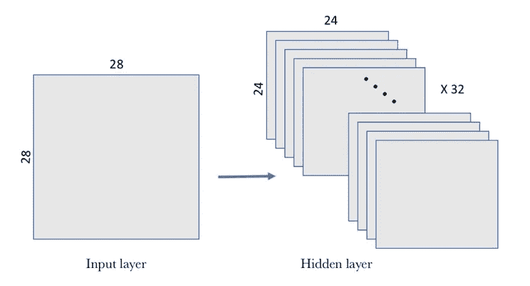

([来源](https://torres.ai/artificial-intelligence-content/deeplearning/))

在该示例中，第一卷积层接收尺寸输入张量(28，28，1)并生成尺寸输出(24，24，32)，该尺寸输出是包含对输入计算 32 个滤波器的 32 个 24×24 像素输出的 3D 张量。

## 联营业务

除了我们刚刚描述的卷积层之外，卷积神经网络还伴随着卷积层和池层，池层通常在卷积层之后立即应用。理解这些层的用途的第一种方法是看到汇集层简化了卷积层收集的信息，并创建了其中包含的信息的压缩版本。

在我们的 MNIST 示例中，我们将选择卷积层的一个 2×2 窗口，并在汇集层的一个点上合成信息。视觉上，可以表达如下:

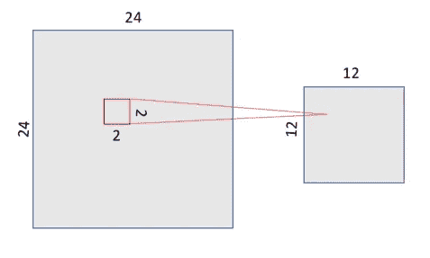

([来源](https://torres.ai/artificial-intelligence-content/deeplearning/))

有几种方法来压缩信息，但我们将在示例中使用的一种常用方法称为 max-pooling，它作为一个值保留了我们示例中 2×2 输入窗口中的最大值。在这种情况下，我们将池层的输出大小除以 4，得到一个 12×12 的图像。

平均池也可以用来代替最大池，其中每组入口点被转换成该组点的平均值而不是其最大值。但总的来说，最大池往往比其他解决方案更好。

有趣的是，随着合用的转变，我们保持了空间关系。为了直观地看到它，以下面一个 12×12 的矩阵为例，其中我们表示了一个“7”(假设我们经过的像素包含 1，其余的为 0；我们没有将其添加到绘图中以简化它)。如果我们应用具有 2×2 窗口的最大池操作(我们在中心矩阵中表示它，该中心矩阵在具有窗口大小的区域的马赛克中划分空间)，我们获得 6×6 矩阵，其中保持了 7 的等价表示(在右图中，0 标记为白色，值为 1 的点标记为黑色):

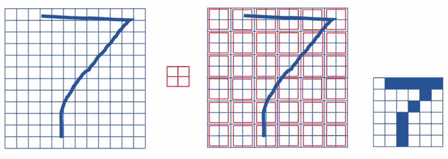

([来源](https://torres.ai/artificial-intelligence-content/deeplearning/))

如上所述，卷积层托管多个过滤器，因此，当我们将最大池分别应用于每个过滤器时，池层将包含与卷积过滤器一样多的池过滤器:

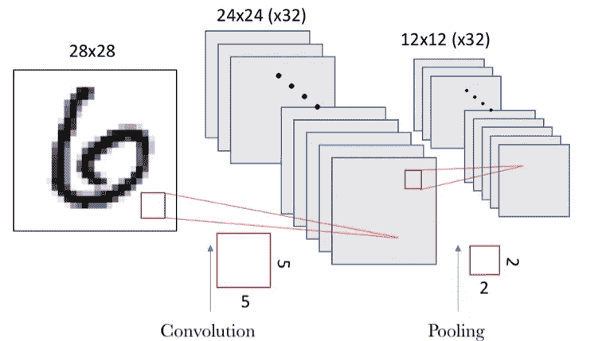

([来源](https://torres.ai/artificial-intelligence-content/deeplearning/))

结果是，因为我们在每个卷积滤波器中有 24×24 个神经元的空间，所以在进行汇集之后，我们有 12×12 个神经元，这对应于划分滤波器空间时出现的 12×12 个区域(每个区域的大小为 2×2)。

# 合作环境

在这篇文章中，我们建议使用 Google 提供的 [*合作实验室*](https://colab.research.google.com/) ，我将在这篇文章中使用的代码可以在我的 GitHub [**这里**](https://github.com/jorditorresBCN/python-deep-learning/blob/master/08_redes_neuronales_convolucionales.ipynb) 中以 Jupyter 笔记本的形式获得，并使用 colab 执行 [**这里**](https://colab.research.google.com/github/jorditorresBCN/python-deep-learning/blob/master/08_redes_neuronales_convolucionales.ipynb) 。

在开始定义我们的神经网络之前，我们需要加载所需的 Python 库:

```
%tensorflow_version 2.x
**import** **tensorflow** **as** **tf**
**from** **tensorflow** **import** keras

**import** **numpy** **as** **np**
**import** **matplotlib.pyplot** **as** **plt** 
```

## 在 Keras 中实现一个基本模型

让我们看看这个卷积神经网络的例子是如何使用 Keras 编程的。正如我们已经说过的，为了参数化卷积和汇集阶段，需要指定几个值。在我们的例子中，我们将使用一个简化的模型，每个维度上的步幅为 1(窗口滑动的步长)，填充为 0(在图像周围填充零)。这两个超参数将在下面介绍。该池将是如上所述的具有 2×2 窗口的最大池。卷积神经网络的基本结构

让我们继续实现我们的第一个卷积神经网络，它将由一个卷积和一个最大池组成。

在我们的例子中，我们将有 32 个滤波器，卷积层使用 5×5 窗口，池层使用 2×2 窗口。我们将使用 ReLU 激活功能。在这种情况下，我们配置卷积神经网络来处理大小为(28，28，1)的输入张量，这是 MNIST 图像的大小(第三个参数是颜色通道，在我们的情况下是深度 1)，我们通过第一层中的参数 *input_shape = (28，28，1)* 的值来指定它:

```
**from** **tensorflow.keras** **import** Sequential
**from** **tensorflow.keras.layers** **import** Conv2D
**from** **tensorflow.keras.layers** **import** MaxPooling2D

model = Sequential()
model.add(Conv2D(32, (5, 5), 
          activation='relu', input_shape=(28, 28, 1)))
model.add(MaxPooling2D((2, 2))) 
```

通过方法 *summary()* 我们可以获得关于我们模型的细节:

```
model.summary()Model: "sequential"
_________________________________________________________________
Layer (type)                 Output Shape              Param #   
=================================================================
conv2d (Conv2D)              (None, 24, 24, 32)        832       
_________________________________________________________________
max_pooling2d (MaxPooling2D) (None, 12, 12, 32)        0         
=================================================================
Total params: 832
Trainable params: 832
Non-trainable params: 0
_________________________________________________________________
```

conv2D 层的参数数量对应于 5×5 的权重矩阵 W，并且每个滤波器的 a *b* 偏差是 832 个参数(32 × (25 + 1))。Max-pooling 不需要参数，因为它是一个寻找最大值的数学运算。

## 简单的模型

为了建立一个“深度”神经网络，我们可以像上一节一样堆叠几层。为了向读者展示如何在我们的示例中做到这一点，我们将创建第二组层，其中有 64 个滤波器，卷积层中有一个 5×5 窗口，池层中有一个 2×2 窗口。在这种情况下，输入通道的数量将采用我们从上一层获得的 32 个特征的值，尽管如我们之前所见，没有必要指定它，因为 Keras 推导出了它:

```
model = models.Sequential()
model.add(layers.Conv2D(32,(5,5),activation=’relu’,
                                input_shape=(28,28,1)))
model.add(layers.MaxPooling2D((2, 2)))
model.add(layers.Conv2D(64, (5, 5), activation=’relu’))
model.add(layers.MaxPooling2D((2, 2)))
```

如果用 *summary()* 方法显示模型的架构，我们可以看到:

```
_________________________________________________________________
Layer (type)                 Output Shape Param    #
=================================================================
conv2d_1 (Conv2D)            (None, 24, 24, 32)    832
_________________________________________________________________
max_pooling2d_1 (MaxPooling2 (None, 12, 12, 32)    0
_________________________________________________________________
conv2d_2 (Conv2D)            (None, 8, 8, 64)      51264
_________________________________________________________________
max_pooling2d_2 (MaxPooling2 (None, 4, 4, 64)      0
=================================================================
Total params: 52,096
Trainable params: 52,096
Non-trainable params: 0
_________________________________________________________________
```

在这种情况下，产生的第二卷积层的大小为 8×8，因为我们现在从 12×12×32 的输入空间和 5×5 的滑动窗口开始，考虑到它的步幅为 1。参数 51，264 的数量对应于第二层将具有 64 个滤波器(如我们在论证中所指定的)的事实，每个滤波器具有 801 个参数(1 对应于偏差，并且 32 个条目中的每一个具有 5×5 的 W 矩阵)。也就是说((5 × 5×32) +1) ×64 = 51264。

读者可以看到， *Conv2D* 和 *MaxPooling2D* 层的输出是一个 3D 形式张量(高度、宽度、通道)。当我们进入神经网络的隐藏层时，宽度和高度维度往往会减小。内核的数量通过传递给 *Conv2D* 层的第一个参数来控制(通常大小为 32 或 64)。

现在我们有 64 个 4x4 过滤器，下一步是添加一个密集连接的层，这将用于填充 softmax 的最后一层，就像在[以前的文章](/basic-concepts-of-neural-networks-1a18a7aa2bd2)中介绍的那样，以进行分类:

```
model.add(layers.Dense(10, activation=’softmax’))
```

在这个例子中，我们必须调整张量以适应密集层的输入，如 softmax，它是一个 1D 张量，而前一个张量的输出是一个 3D 张量。这就是为什么我们必须首先将 3D 张量展平为 1D 之一。在应用 Softmax 之前，我们的输出(4，4，64)必须展平为向量(1024)。

在这种情况下，softmax 层的参数数量为 10 × 1024 + 10，向量的输出为 10，如前一篇文章中的示例[所示:](/basic-concepts-of-neural-networks-1a18a7aa2bd2)

```
model = models.Sequential()model.add(layers.Conv2D(32,(5,5),activation=’relu’, 
                                 input_shape=(28,28,1)))
model.add(layers.MaxPooling2D((2, 2)))model.add(layers.Conv2D(64, (5, 5), activation=’relu’))
model.add(layers.MaxPooling2D((2, 2)))model.add(layers.Flatten())
model.add(layers.Dense(10, activation=’softmax’))
```

使用 *summary()* 方法，我们可以看到关于每一层的参数和每一层的输出张量的形状的信息:

```
_________________________________________________________________
Layer (type) Output Shape Param #
=================================================================
conv2d_1 (Conv2D) (None, 24, 24, 32) 832
_________________________________________________________________
max_pooling2d_1 (MaxPooling2 (None, 12, 12, 32) 0
_________________________________________________________________
conv2d_2 (Conv2D) (None, 8, 8, 64) 51264
_________________________________________________________________
max_pooling2d_2 (MaxPooling2 (None, 4, 4, 64) 0
_________________________________________________________________
flatten_1 (Flatten) (None, 1024) 0
_________________________________________________________________
dense_1 (Dense) (None, 10) 10250
=================================================================
Total params: 62,346
Trainable params: 62,346
Non-trainable params: 0
_________________________________________________________________
```

观察该概述，很容易理解，在卷积层中需要更多的存储器，因此需要更多的计算来存储数据。相比之下，在 softmax 的密集连接层中，需要很少的存储空间，但是相比之下，该模型需要必须学习的大量参数。了解数据和参数的大小很重要，因为当我们有基于卷积神经网络的模型时，它们有许多层，正如我们将在后面看到的那样，这些值可能会呈指数增长。

下图更直观地展示了上述信息，其中我们看到了在各层及其连接之间传递的张量形状的图形表示:

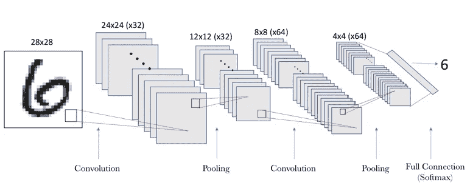

([来源](https://torres.ai/artificial-intelligence-content/deeplearning/))

## 模型的训练和评估

一旦定义了神经网络模型，我们就准备训练模型，也就是调整所有卷积层的参数。从这里开始，为了知道我们的模型做得有多好，我们必须像我们在以前的帖子“初学者的深度学习:Python 和 Keras 的实用指南”中的 Keras 例子一样做。出于这个原因，并且为了避免重复，我们将重用上面已经给出的代码:

```
**from** **tensorflow.keras.utils** **import** to_categorical

mnist = tf.keras.datasets.mnist
(train_images, train_labels), (test_images, test_labels) = mnist.load_data()

print (train_images.shape)
print (train_labels.shape)
train_images = train_images.reshape((60000, 28, 28, 1))
train_images = train_images.astype('float32') / 255

test_images = test_images.reshape((10000, 28, 28, 1))
test_images = test_images.astype('float32') / 255

train_labels = to_categorical(train_labels)
test_labels = to_categorical(test_labels)model.compile(loss='categorical_crossentropy',
              optimizer='sgd',
              metrics=['accuracy'])

model.fit(train_images, train_labels,
          batch_size=100,
          epochs=5,
          verbose=1)

test_loss, test_acc = model.evaluate(test_images, test_labels)

print('Test accuracy:', test_acc)
```

该代码的结果将是:

```
Train on 60000 samples
Epoch 1/5
60000/60000 [==============================] - 4s 59us/sample - loss: 0.9310 - accuracy: 0.7577
Epoch 2/5
60000/60000 [==============================] - 2s 34us/sample - loss: 0.2706 - accuracy: 0.9194
Epoch 3/5
60000/60000 [==============================] - 2s 34us/sample - loss: 0.1943 - accuracy: 0.9421
Epoch 4/5
60000/60000 [==============================] - 2s 34us/sample - loss: 0.1529 - accuracy: 0.9553
Epoch 5/5
60000/60000 [==============================] - 2s 34us/sample - loss: 0.1284 - accuracy: 0.9626
10000/10000 [==============================] - 1s 76us/sample - loss: 0.1070 - accuracy: 0.9700 Test accuracy: 0.9704
```

请记住，代码可以在我的 GitHub 中找到[，读者可以验证这个代码提供了大约 97%的准确性。](https://github.com/jorditorresBCN/python-deep-learning/blob/master/08_redes_neuronales_convolucionales.ipynb)

# 卷积层的超参数

目前尚未见到的卷积神经网络的主要超参数是:滤波器窗口的大小、滤波器的数量、步长和填充。

## 过滤器的尺寸和数量

窗口(*window _ height*×*window _ width*)的大小通常为 3×3 或 5×5，用于保存空间上接近的像素的信息。告诉我们想要处理的特征数量(output_depth)的过滤器数量通常是 32 或 64。在 Keras 的 Conv2D 层中，这些超参数是我们按以下顺序传递的参数:

**Conv2D(输出深度，(窗口高度，窗口宽度))**

# 填料

为了解释填充的概念，让我们用一个例子。让我们假设一个 5×5 像素的图像。如果我们选择一个 3×3 的窗口来执行卷积，我们会看到运算产生的张量大小为 3×3。也就是说，它缩小了一点:在本例中，每个维度正好缩小了两个像素。下图直观地显示了这一点。假设左边的图形是 5×5 的图像。在其中，我们对像素进行了编号，以便更容易地看到 3×3 液滴如何移动来计算过滤器的元素。在中间，表示 3×3 窗口如何在图像中移动，向右移动两个位置，向下移动两个位置。应用卷积运算的结果返回我们在左边表示的过滤器。该过滤器的每个元素都标有一个字母，该字母将其与用来计算其值的滑动窗口的内容相关联。

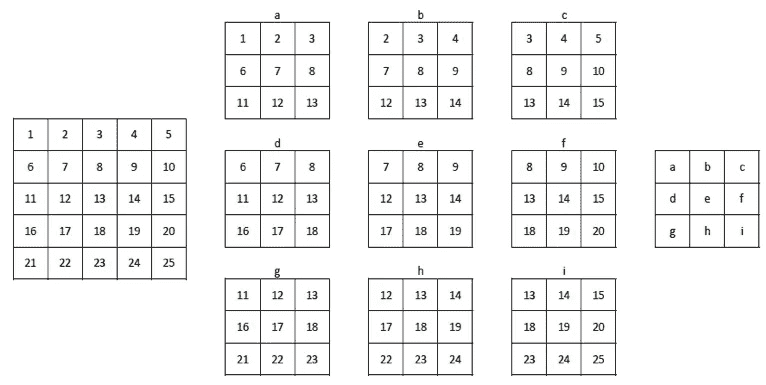

([来源](https://torres.ai/artificial-intelligence-content/deeplearning/))

在本帖中我们创建的卷积神经网络的例子中可以观察到同样的效果。我们从 28×28 像素的输入图像开始，并且在第一卷积层之后得到的滤波器是 24×24。在第二个卷积层中，我们从 12×12 张紧器变为 8×8 张紧器。

但有时我们希望获得与输入尺寸相同的输出图像，我们可以在卷积层中使用超参数填充。通过填充，我们可以在滑动窗口之前在输入图像周围添加零。在上图的例子中，为了使输出滤波器与输入图像具有相同的大小，我们可以在零输入图像的右边添加一列，左边添加一列，上面一行，下面一行。从下图中可以看出:

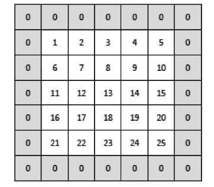

([来源](https://torres.ai/artificial-intelligence-content/deeplearning/)

如果我们现在滑动 3×3 窗口，我们会看到它可以向右移动 4 个位置，向下移动 4 个位置，产生 25 个窗口，从而产生 5×5 的滤波器大小。

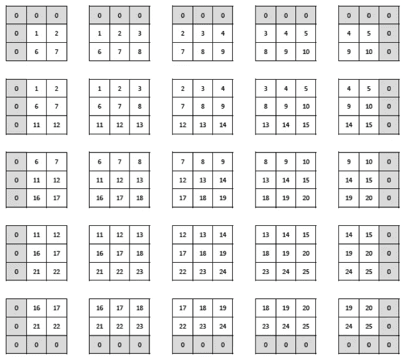

([来源](https://torres.ai/artificial-intelligence-content/deeplearning/))

在 Keras 中，Conv2D 层中的填充是用 padding 参数配置的，它可以有两个值:“same”，表示根据需要添加尽可能多的零的行和列，以使输出与条目具有相同的维数；以及“valid”，表示没有填充(这是 Keras 中该参数的默认值)。

## 进展

我们可以在卷积层中指定的另一个超参数是步幅，它表示滤波器窗口移动的步数(在上例中，步幅为 1)。

大跨距值会减小将传递给下一层的信息的大小。在下图中，我们可以看到与前面相同的示例，但现在跨距值为 2:

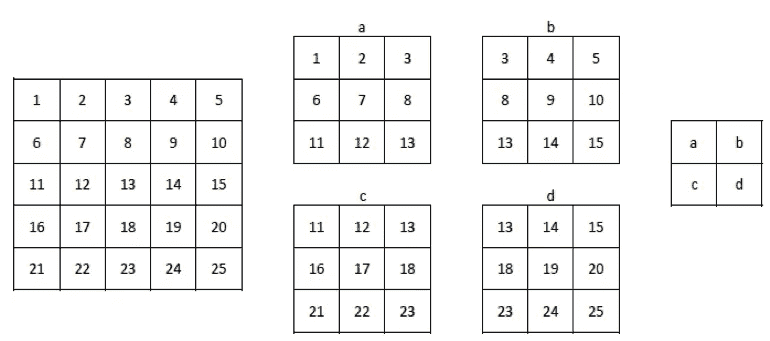

([来源](https://torres.ai/artificial-intelligence-content/deeplearning/))

正如我们所看到的，5×5 图像变成了一个较小的 2×2 过滤器。但在现实中，减少尺寸的卷积步长在实践中很少使用；为此，使用了我们之前介绍过的池操作。在 Keras 中，Conv2D 层中的步距由步距参数配置，默认为*步距=(1，1)* 值，分别表示两个维度中的进度。

# 奖金模式:时尚-MNIST

现在你可以把这篇文章中学到的层用到另一个例子中。你准备好了吗？让我向你推荐另一个数据集，你可以在上面练习并直接应用学到的 CNN 概念。

为此，我们将使用`[Fashion-MNIST](https://github.com/zalandoresearch/fashion-mnist)` [数据集](https://github.com/zalandoresearch/fashion-mnist)，该数据集由 [Zalando research](https://research.zalando.com/) 发布，包含 10 种不同类型的时尚产品。该数据集由 60，000 个示例的训练集和 10，000 个示例的测试集组成。每个示例都是 28x28 灰度图像，与 10 个类别的标签相关联。它与前一个示例共享图像大小、颜色和项目数量。然后，我们可以开始应用我们在前面的例子中使用的相同的模型。

首先，我建议应用之前数据集使用的相同模型。我们将观察到获得的准确度是 85.93%。[转到 colab 并执行下面的代码](https://colab.research.google.com/github/jorditorresBCN/python-deep-learning/blob/master/08_redes_neuronales_convolucionales.ipynb)来验证它:

```
fashion_mnist = keras.datasets.fashion_mnist

(train_images, train_labels), (test_images, test_labels) = fashion_mnist.load_data() class_names = ['T-shirt/top', 'Trouser', 'Pullover', 'Dress', 'Coat', 'Sandal', 'Shirt', 'Sneaker', 'Bag', 'Ankle boot']train_images = train_images.reshape((60000, 28, 28, 1))
train_images = train_images.astype('float32') / 255

test_images = test_images.reshape((10000, 28, 28, 1))
test_images = test_images.astype('float32') / 255 model = Sequential()
model.add(Conv2D(32, (5, 5), activation='relu', 
          input_shape=(28, 28, 1)))
model.add(MaxPooling2D((2, 2)))
model.add(Conv2D(64, (5, 5), activation='relu'))
model.add(MaxPooling2D((2, 2)))
model.add(Flatten())
model.add(Dense(10, activation='softmax')) model.compile(optimizer='sgd',
              loss='sparse_categorical_crossentropy',
              metrics=['accuracy'])

model.fit(train_images, train_labels, epochs=5)
test_loss, test_acc = model.evaluate(test_images,  test_labels)print('Test accuracy:', test_acc)
```

我们能提高精确度吗？当然，我们仍然可以改进我们的模型。然而，改进一个模型意味着什么呢？正如我们在[上一篇文章](/learning-process-of-a-deep-neural-network-5a9768d7a651)中了解到的，这意味着尝试应用不同的(更好的)超参数。例如，我们可以在我们的模型中增加更多的神经元，增加更多的层。让我们试试:

```
model = Sequential()
model.add(Conv2D(64, (7, 7), activation="relu", padding="same",
          input_shape=(28, 28, 1))
model.add(MaxPooling2D(2, 2))
model.add(Conv2D(128, (3, 3), activation="relu", padding="same"))
model.add(MaxPooling2D(2, 2))
model.add(Flatten())
model.add(Dense(64, activation="relu"))
model.add(Dense(10, activation="softmax"))
```

如你所见，如果我们遵循 [colab 代码](https://colab.research.google.com/github/jorditorresBCN/python-deep-learning/blob/master/08_redes_neuronales_convolucionales.ipynb)，我们可以获得 86.28%的准确率。看来我们需要做更多的改进。我建议更换优化器，例如`adam`:

```
model.compile(optimizer='adam',
              loss='sparse_categorical_crossentropy',
              metrics=['accuracy'])
```

如果我们用这个新的 optimizar 再次训练以前的网络(遵循 [colab 代码](https://colab.research.google.com/github/jorditorresBCN/python-deep-learning/blob/master/08_redes_neuronales_convolucionales.ipynb)),获得的准确度是 90.99%。还不错！

我们能改进它吗？是啊！。正如你在建议的 [colab 代码](https://colab.research.google.com/github/jorditorresBCN/python-deep-learning/blob/master/08_redes_neuronales_convolucionales.ipynb)中看到的，我们可以获得 92.56%的精确度，增加一种之前没有引入的新型层:`BathNormalizaton` 和`Dropout`。

最后，我们可以在 [colab 代码](https://colab.research.google.com/github/jorditorresBCN/python-deep-learning/blob/master/08_redes_neuronales_convolucionales.ipynb)中看到，我们可以增加`epochs`的数量，或者使用 Keras 的高级功能作为*回调*，以达到 94.54%的准确率。

这是一个介绍性的帖子，我希望在未来的帖子中解释更多类型的层或 Keras 的额外功能，这些在这里没有介绍，也没有在之前的[帖子中介绍(关于学习过程](/learning-process-of-a-deep-neural-network-5a9768d7a651))。与你分享这个例子的目的是为了表明有许多(和许多)人认为我们仍然需要学习。**我鼓励你继续学习深度学习，这当然是一个令人兴奋的话题，有着美好的未来。**