# 实践中的卷积神经网络

> 原文：<https://towardsdatascience.com/convolutional-neural-networks-in-practice-406426c6c19a?source=collection_archive---------14----------------------->

## 用 Keras 开发和实现你的第一个 CNN！

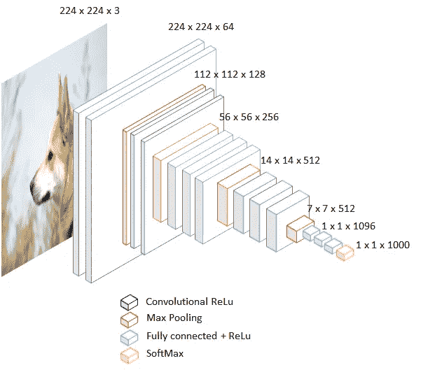

作者图片

# 介绍

本文的目标是成为如何开发卷积神经网络模型的教程。如果你想探索它们的理论基础，我鼓励你去看看这篇文章。

# CIFAR-10 数据集

在第一个例子中，我们将实现一个可以区分 10 种对象的网络。为此，我们将使用 CIFAR-10 数据集。该数据集由 60，000 张彩色图片组成，分辨率为 32x32 像素，分为 10 个不同的类别，可在下图中查看。数据集被分成 50.000 个训练图片和 10.000 个用于测试的图片。

为了开发这个实现，我们将不使用 TensorFlow，而是使用 Keras。Keras 是一个工作在 TF 之上的框架，它带来了灵活性、快速性和易用性。这些是它最近在深度学习开发者中受欢迎程度上升的主要原因。

```
**# Original Dataset:** [**https://www.cs.toronto.edu/~kriz/cifar.html**](https://www.cs.toronto.edu/~kriz/cifar.html) **for more information****# Load of necessary libraries**
import numpy as np
from keras.datasets import cifar10
from keras.models import Sequential
from keras.layers.core import Dense, Flatten
from keras.layers.convolutional import Conv2D
from keras.optimizers import Adam
from keras.layers.pooling import MaxPooling2D
from keras.utils import to_categorical**# to make the example replicable**
np.random.seed(42)**# Load of the dataset**
(X_train, Y_train), (X_test, Y_test) = cifar10.load_data()
```


```
**i**
import matplotlib.pyplot as plt
class_names = ['airplane','automobile','bird','cat','deer',
               'dog','frog','horse','ship','truck']
fig = plt.figure(figsize=(8,3))
for i in range(len(class_names)):
  ax = fig.add_subplot(2, 5, 1 + i, xticks=[], yticks=[])
  idx = np.where(Y_train[:]==i)[0]
  features_idx = X_train[idx,::]
  img_num = np.random.randint(features_idx.shape[0])
  im = features_idx[img_num,::]
  ax.set_title(class_names[i])
  #im = np.transpose(features_idx[img_num,::], (1, 2, 0))
  plt.imshow(im)
plt.show()
```

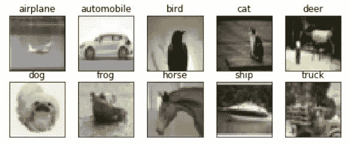

```
**# Initializing the model**
model = Sequential()**# Defining a convolutional layer**
model.add(Conv2D(128, kernel_size=(3, 3), activation='relu', input_shape=(32, 32, 3)))**# Defining a second convolutional layer**
model.add(Conv2D(128, kernel_size=(3, 3), activation='relu'))**# Defining a third convolutional layer**
model.add(Conv2D(128, kernel_size=(3, 3), activation='relu'))**# We add our classificator**
model.add(Flatten())
model.add(Dense(1024, activation='relu'))
model.add(Dense(10, activation='softmax'))**# Compiling the model**
model.compile(loss='categorical_crossentropy',
              optimizer=Adam(lr=0.0001, decay=1e-6),
              metrics=['accuracy'])**# Training of the model**
model.fit(X_train, to_categorical(Y_train),
          batch_size=128,
          shuffle=True,
          epochs=10,
          validation_data=(X_test, to_categorical(Y_test)))**# Evaluation of the model**
scores = model.evaluate(X_test, to_categorical(Y_test))print('Loss: %.3f' % scores[0])
print('Accuracy: %.3f' % scores[1])
```

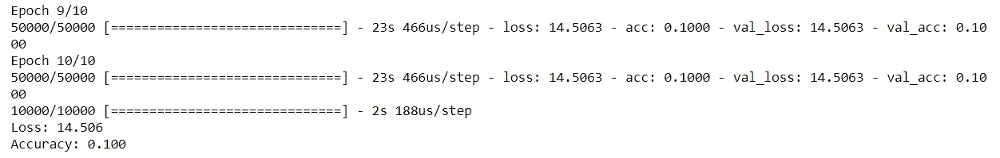

这是怎么回事？只有 10%的准确率？似乎我们的网络预测所有样本的类别相同。意味着某些东西正在失败。这肯定与我们的数据有关。在将它输入模型之前，我们没有对它进行预处理。

## 数据预处理

第一件事是预处理数据，使我们的网络任务尽可能简单。如果我们做不到这一点，因为我们有从 0 到 255 的数据，网络将永远学不到任何东西。

为了进行这种预处理，通常要做两件事:

*   **数据居中**:计算数据集的平均值并减去。处理图像时，您可以计算数据集的整个平均值并直接减去它，也可以计算图像每个通道的平均值并从每个通道中减去它。
*   **标准化数据**:这样做是为了让所有的数据具有大致相同的比例。两种最常见的方法是:

1)在数据居中(减去平均值)后，将每个维度除以其标准偏差

2)归一化，使每个维度的最小值和最大值分别为-1 和 1。只有当我们从不同尺度的数据开始，但我们知道它们应该是相似的，也就是说，它们对算法具有相似的重要性时，这才有意义。在图像的情况下，我们知道可以取的值是从 0 到 255，因此没有必要进行严格的归一化，因为这些值已经处于类似的范围内。

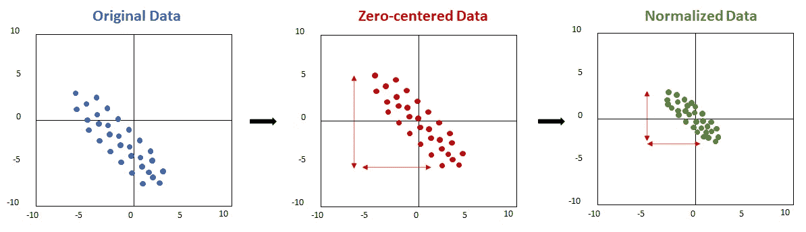

**重要提示！**

必须只对训练集进行规范化。换句话说，我们应该计算训练集的平均值和标准偏差，并将这些值用于验证集和测试集。

```
**# Cenetering the data**
X_train_mean = np.mean(X_train, axis = 0)
X_train_cent = X_train - X_train_mean**# Normalization**
X_train_std = np.std(X_train, axis = 0)
X_train_norm = X_train_cent / X_train_std
```

现在，我们使用训练集的平均值和标准差来准备验证和测试数据。

等等，但是我们没有验证数据！我们将以这种方式实现这个示例，但非常重要的是，当我们进行真正的开发时，我们有三个集合:

1.  **训练集**:更新每批的权重
2.  **验证集**:检查网络在各个时期的泛化能力。它使用在训练期间未见过的样本来测试模型，它用于监控网络的训练以供参考，但是它不干预任何计算！它通常在您想要调整参数时使用，该设置是指示哪些参数最适合使用的设置。验证越准确，我们拥有的参数集就越好。由于这个原因，我们不能依靠这个结果来给出网络泛化能力的概念，因为我们选择了网络配置来给出更高的精度。因此，我们必须有一个额外的集合，让我们现在可以说，我们的网络是否适合我从未见过的样本:测试样本。
3.  **测试集**:它通过对一个从未见过的集(比验证集大)进行归纳，给我们一种我们的网络有多好的直觉。

好了，让我们准备好测试设备:

```
X_test_norm = (X_test - X_train_mean) / X_train_std
```

现在我们准备用标准化数据再次测试我们的网络:

```
**# Initializing the model**
model = Sequential()**# Defining a convolutional layer**
model.add(Conv2D(128, kernel_size=(3, 3), activation='relu', input_shape=(32, 32, 3)))**# Defining a second convolutional layer**
model.add(Conv2D(128, kernel_size=(3, 3), activation='relu'))**# Defining a third convolutional layer**
model.add(Conv2D(128, kernel_size=(3, 3), activation='relu'))**# We add our classificator**
model.add(Flatten())
model.add(Dense(1024, activation='relu'))
model.add(Dense(10, activation='softmax'))**# Compiling the model**
model.compile(loss='categorical_crossentropy',
              optimizer=Adam(lr=0.0001, decay=1e-6),
              metrics=['accuracy'])**# Training of the model**
model.fit(X_train, to_categorical(Y_train),
          batch_size=128,
          shuffle=True,
          epochs=10,
          validation_data=(X_test, to_categorical(Y_test)))**# Evaluation of the model**
scores = model.evaluate(X_test, to_categorical(Y_test))print('Loss: %.3f' % scores[0])
print('Accuracy: %.3f' % scores[1])
```

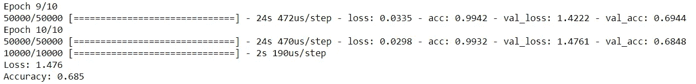

众所周知，这个结果比前一个好。因此，我们可以自豪地说，我们已经训练了第一个 CNN，训练精度约为 0.99，测试精度约为 0.7。

下一个合乎逻辑的问题应该是:

***培训和测试怎么会有这么大的区别？***

正如你们可能已经想到的，深度学习也存在过度拟合，事实上，比其他技术更加明显。

对于那些不记得什么是过度适配的人来说，想想这个:

你有一个网络可以在任何给定的时间检测到哪个角色出现在老友记第 4x08 章。它的工作非常完美，它可以以 99.3%的准确率分辨出哪些角色在舞台上。它非常好用，你可以用 5x01 试试。结果是只有 71.2%的准确率。

嗯，这种现象被称为过度拟合，包括创建一个在我们的数据集中工作得很好的算法，但在推广方面非常糟糕。

在本文中，您可以找到对过度拟合的更深入的探索以及最小化过度拟合的技术。

请看代表基于时间的精度的图表:

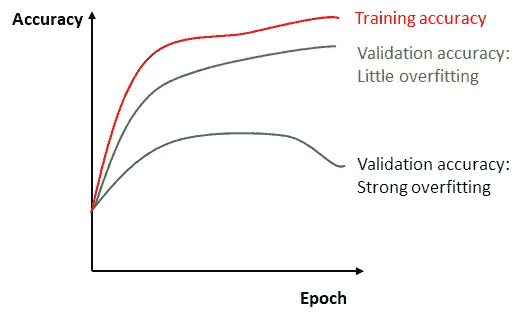

看看这个例子:

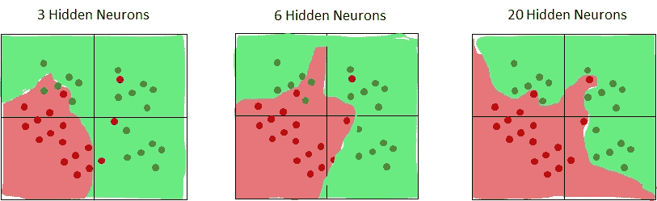

你会选哪一个？

20 层的比 3 层的好用吧？然而，我们通常寻求的是它具有良好的泛化能力(当发现新数据时，它工作得很好)。如果看到新的数据，你觉得哪个效果会更好？

令人惊讶的是，左边的那个。

让我们回到我们的例子。在我们的例子中，我肯定我们都更喜欢 99 对 70，而不是 90 对 85，对吗？

如何才能实现这一点？标准化和规范化的技术。

**重要提示**:实际上，通常对图像进行的唯一预处理是将它们的所有值除以 255。这通常足以使网络正常工作，因此我们不依赖于与我们的训练集相关的任何参数。

# 处理过度拟合

有几种方法可以尽可能地减少过拟合，从而使算法能够更一般化。

## 批量标准化

称为批量标准化的技术是由 Ioffe 和 Szegedy 开发的技术，旨在减少内部协变量的变化或内部协变量移位，这使得网络对不良初始化更加鲁棒。

内部协变量偏移被定义为由于小批量之间输入数据的不同分布而导致的网络激活分布的变化。小批量之间的这种差异越小，到达网络过滤器的数据就越相似，激活图就越相似，网络训练的效果就越好。

这是通过在训练开始时强制网络激活具有单一高斯分布的选定值来实现的。这个过程是可能的，因为规范化是一个可区分的操作。

它通常在激活功能执行之前插入:

```
model.add(Conv2D(128, kernel_size=(3, 3), input_shape=(32, 32, 3))model.add(BatchNormalization())model.add(Activation('relu'))
```

用数学术语来说，我们所做的是用小批量计算的平均值和标准偏差对进入我们网络的每个小批量进行居中和标准化，然后用网络通过训练学习的参数重新调整和偏移数据。

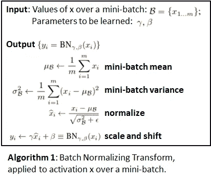

此外，由于我们计算的是每个小批量的平均值和标准偏差，而不是整个数据集的平均值和标准偏差，因此批量定额还会引入一些噪声，这些噪声起到调节器的作用，有助于减少过度拟合。

事实证明，这种技术对于更快地训练网络非常有效。

```
**# We Import Batch Normalizarion layer**
from keras.layers import BatchNormalization, Activation**# Inizializting the model**
model = Sequential()**# Defining a convolutional layer**
model.add(Conv2D(128, kernel_size=(3, 3), input_shape=(32, 32, 3)))
model.add(BatchNormalization())
model.add(Activation('relu'))**# Defining a second convolutional layer**
model.add(Conv2D(128, kernel_size=(3, 3), activation='relu'))
model.add(BatchNormalization())
model.add(Activation('relu'))**# Defining a thirdd convolutional layer**
model.add(Conv2D(128, kernel_size=(3, 3), activation='relu'))
model.add(BatchNormalization())
model.add(Activation('relu'))**# We include our classifier**
model.add(Flatten())
model.add(Dense(1024, activation='relu'))
model.add(Dense(10, activation='softmax'))**# Compiling the model**
model.compile(loss='categorical_crossentropy',
              optimizer=Adam(lr=0.0001, decay=1e-6),
              metrics=['accuracy'])**# Training the model**
model.fit(X_train_norm, to_categorical(Y_train),
          batch_size=128,
          shuffle=True,
          epochs=10,
          validation_data=(X_test_norm, to_categorical(Y_test))) # aquí deberíamos usar un conjunto distinto al de test!!!**# Evaluating the model**
scores = model.evaluate(X_test_norm, to_categorical(Y_test))print('Loss: %.3f' % scores[0])
print('Accuracy: %.3f' % scores[1])
```

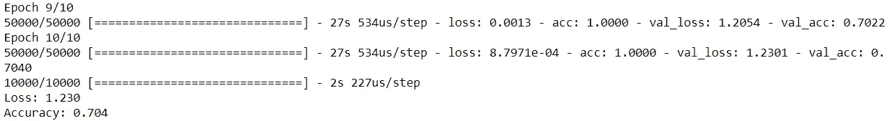

我们可以看到，精度提高了 2%，一旦我们达到高数值，这是一个巨大的进步。但仍有改进的余地。

我们来探讨一下正规化。

## 正规化

正则化包括以某种方式惩罚我们的网络在训练期间做出的预测，以便它不认为训练集是绝对真实的，从而知道当它看到其他数据集时如何更好地进行概括。

看一下这张图表:

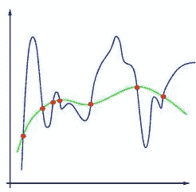

https://commons.wikimedia.org/wiki/File:75hwQ.jpg

在这个图表中，我们可以看到一个过度拟合的例子，另一个欠拟合的例子，以及另一个可以正确概括的例子。

哪个是哪个？

*   蓝色:过度合身
*   绿色:具有概括能力的好模型
*   橙色:不合身

现在，看看这个例子，在这个例子之后，有三个神经元数目不同的网络。我们现在看到的是 20 个神经元组成的网络，具有不同的正则化水平。

您可以在这里使用这些参数:

[https://cs . Stanford . edu/people/kar pathy/convnetjs/demo/classify 2d . html](https://cs.stanford.edu/people/karpathy/convnetjs/demo/classify2d.html)

这里有一个更完整的:

https://playground.tensorflow.org/

最后，有许多层的网并应用正则化比有一个小的网以避免过度拟合要好得多。这是因为小网络是更简单的函数，具有更少的局部最小值，所以梯度下降达到一个或另一个很大程度上取决于初始化，所以实现的损耗通常具有很大的方差，这取决于初始化。

然而，具有许多层的网络是更复杂的函数，具有更多的局部最小值，尽管它们更难达到，但通常具有所有相似的和更好的损耗。

如果你对这个话题感兴趣:【http://cs231n.github.io/neural-networks-1/#arch】T4。

正则化的方法有很多。以下是最常见的几种:

## L2 正则化(拉索正则化)

L2 正则化可能是最常见的。

它包括通过为每个权重添加 1/2 * λ* *W**2* 项来惩罚损失函数，这导致:

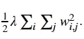

当计算导数时，1/2 只是为了方便，因为这留下了λ* *W* 而不是 2*λ* *W* 。

这意味着我们惩罚非常高或不同的权重，并希望它们都是相似的量级。如果你还记得，权重意味着每个神经元在预测的最终计算中的重要性。因此，通过这样做，我们使所有的神经元或多或少地同等重要，也就是说，网络将使用其所有的神经元来进行预测。

相反，如果某些神经元有非常高的权重，预测的计算就会更多地考虑它们，所以我们最终会得到一个没有用的死神经元网络。

此外，在我们的损失函数中引入 1/2 * λ* *W**2* 项使得我们的权重在梯度下降期间接近于零。随着 W+=-λ⋅W.的线性衰减

让我们看看是否可以通过应用 L2 正则化来改进我们的网络:

```
**# L2 Regularization****# Regularizer layer import**
from keras.regularizers import l2**# Inizializing the model**
model = Sequential()**# Defining a convolutional layer**
model.add(Conv2D(128, kernel_size=(3, 3), activation='relu', input_shape=(32, 32, 3)))**# Defining a second convolutional layer**
model.add(Conv2D(128, kernel_size=(3, 3), activation='relu'))**# Defining a third convolutional layer**
model.add(Conv2D(128, kernel_size=(3, 3), activation='relu'))**# Classifier inclusion**
model.add(Flatten())
model.add(Dense(1024, activation='relu', kernel_regularizer=l2(0.01)))
model.add(Dense(10, activation='softmax'))**# Compiling the model**
model.compile(loss='categorical_crossentropy',
              optimizer=Adam(lr=0.0001, decay=1e-6),
              metrics=['accuracy'])**# Traning the model**
model.fit(X_train_norm, to_categorical(Y_train),
          batch_size=128,
          shuffle=True,
          epochs=10,
          validation_data=(X_test_norm, to_categorical(Y_test)))**# Evaluating the model**
scores = model.evaluate(X_test_norm, to_categorical(Y_test))print('Loss: %.3f' % scores[0])
print('Accuracy: %.3f' % scores[1])
```

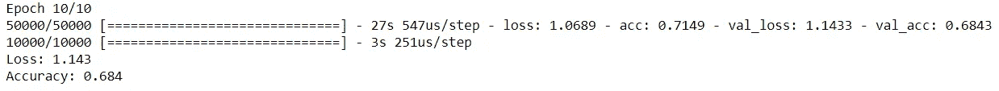

## L1 正则化(脊正则化)

L1 也很常见。这一次，我们在损失函数中加入了λ|w|项。

我们还可以在所谓的**弹性网正则化**中将 L1 正则化与 L2 结合起来:

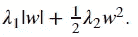

L1 正则化设法将 W 权重矩阵转换成稀疏权重矩阵(非常接近零，除了少数元素)。

这意味着，与 L2 不同，它给予一些神经元比其他神经元更大的重要性，使得网络对可能的噪声更具鲁棒性。

一般来说，L2 通常会给出更好的结果。如果您知道图像中有一定数量的特征可以很好地进行分类，并且您不希望网络被噪声扭曲，则可以使用 L1。

我们试试 L1，然后是 L1+L2:

```
**# L1 Regularization****# Regularizer layer import**
from keras.regularizers import l1**# Inizializing the model**
model = Sequential()**# Defining a convolutional layer**
model.add(Conv2D(128, kernel_size=(3, 3), activation='relu', input_shape=(32, 32, 3)))**# Defining a second convolutional layer**
model.add(Conv2D(128, kernel_size=(3, 3), activation='relu'))**# Defining a third convolutional layer**
model.add(Conv2D(128, kernel_size=(3, 3), activation='relu'))**# Classifier inclusion**
model.add(Flatten())
model.add(Dense(1024, activation='relu', kernel_regularizer=l1(0.01)))
model.add(Dense(10, activation='softmax'))**# Compiling the model**
model.compile(loss='categorical_crossentropy',
              optimizer=Adam(lr=0.0001, decay=1e-6),
              metrics=['accuracy'])**# Traning the model**
model.fit(X_train_norm, to_categorical(Y_train),
          batch_size=128,
          shuffle=True,
          epochs=10,
          validation_data=(X_test_norm, to_categorical(Y_test)))**# Evaluating the model**
scores = model.evaluate(X_test_norm, to_categorical(Y_test))print('Loss: %.3f' % scores[0])
print('Accuracy: %.3f' % scores[1])
```

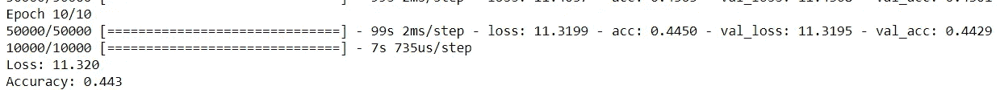

```
**# Elastic Net Regularization (L1 + L2)****# Regularizer layer import**
from keras.regularizers import l1_l2**# Inizializing the model**
model = Sequential()**# Defining a convolutional layer**
model.add(Conv2D(128, kernel_size=(3, 3), activation='relu', input_shape=(32, 32, 3)))**# Defining a second convolutional layer**
model.add(Conv2D(128, kernel_size=(3, 3), activation='relu'))**# Defining a third convolutional layer**
model.add(Conv2D(128, kernel_size=(3, 3), activation='relu'))**# Classifier inclusion**
model.add(Flatten())
model.add(Dense(1024, activation='relu', kernel_regularizer=l1_l2(0.01, 0.01)))
model.add(Dense(10, activation='softmax'))**# Compiling the model**
model.compile(loss='categorical_crossentropy',
              optimizer=Adam(lr=0.0001, decay=1e-6),
              metrics=['accuracy'])**# Traning the model**
model.fit(X_train_norm, to_categorical(Y_train),
          batch_size=128,
          shuffle=True,
          epochs=10,
          validation_data=(X_test_norm, to_categorical(Y_test)))**# Evaluating the model**
scores = model.evaluate(X_test_norm, to_categorical(Y_test))print('Loss: %.3f' % scores[0])
print('Accuracy: %.3f' % scores[1])
```

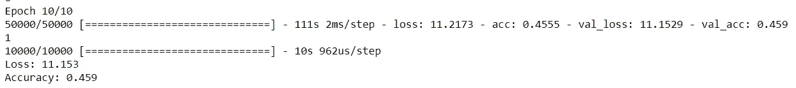

## 最大范数约束

另一种正规化是基于限制的正规化。例如，我们可以设置权重不能超过的最大阈值。

在实践中，这是通过使用下降梯度来计算新的权重值来实现的，正如我们通常所做的那样，但是然后为每个神经元计算每个权重向量的范数 2，并将其作为不能超过 *C* 的条件，即:

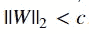

正常情况下， *C* 等于 3 或 4。

我们通过这种标准化实现的是网络不会“爆炸”，也就是说，权重不会过度增长。

让我们看看这种正规化是如何进行的:

```
**# Elastic Net Regularization (L1 + L2)****# Regularizer layer import**
from keras.constraints import max_norm**# Inizializing the model**
model = Sequential()**# Defining a convolutional layer**
model.add(Conv2D(128, kernel_size=(3, 3), activation='relu', input_shape=(32, 32, 3)))**# Defining a second convolutional layer**
model.add(Conv2D(128, kernel_size=(3, 3), activation='relu'))**# Defining a third convolutional layer**
model.add(Conv2D(128, kernel_size=(3, 3), activation='relu'))**# Classifier inclusion**
model.add(Flatten())
model.add(Dense(1024, activation='relu', kernel_costraint=max_norm(3.)))
model.add(Dense(10, activation='softmax'))**# Compiling the model**
model.compile(loss='categorical_crossentropy',
              optimizer=Adam(lr=0.0001, decay=1e-6),
              metrics=['accuracy'])**# Traning the model**
model.fit(X_train_norm, to_categorical(Y_train),
          batch_size=128,
          shuffle=True,
          epochs=10,
          validation_data=(X_test_norm, to_categorical(Y_test)))**# Evaluating the model**
scores = model.evaluate(X_test_norm, to_categorical(Y_test))print('Loss: %.3f' % scores[0])
print('Accuracy: %.3f' % scores[1])
```

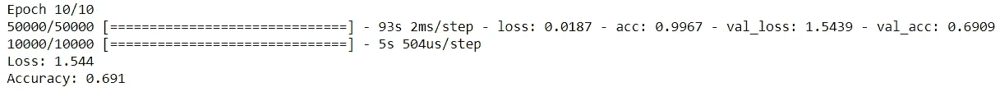

## 辍学正规化

退出正则化是 Srivastava 等人在他们的文章“[退出:防止神经网络过度拟合的简单方法](http://jmlr.org/papers/volume15/srivastava14a.old/srivastava14a.pdf)”中开发的一种技术，补充了其他类型的标准化(L1、L2、maxnorm)。

这是一种非常有效和简单的技术，它包括在训练期间以概率 *p* 保持神经元活跃或将其设置为 0。

我们实现的是在训练时改变网络的架构，这意味着将不会有单个神经元负责被激活到某个模式，但我们将有多个冗余神经元能够对该模式做出反应。

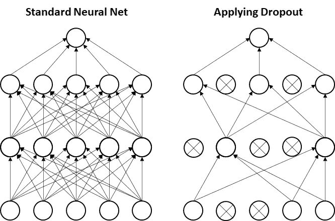

让我们看看应用辍学如何影响我们的结果:

```
**# Dropout****# Dropout layer import**
from keras.layers import Dropout**# Inizializing the model**
model = Sequential()**# Defining a convolutional layer**
model.add(Conv2D(128, kernel_size=(3, 3), activation='relu', input_shape=(32, 32, 3)))
model.add(Dropout(0.25))**# Defining a second convolutional layer**
model.add(Conv2D(128, kernel_size=(3, 3), activation='relu'))
model.add(Dropout(0.25))**# Defining a third convolutional layer**
model.add(Conv2D(128, kernel_size=(3, 3), activation='relu'))
model.add(Dropout(0.25))**# Classifier inclusion**
model.add(Flatten())
model.add(Dense(1024, activation='relu'))
model.add(Dropout(0.5))
model.add(Dense(10, activation='softmax'))**# Compiling the model**
model.compile(loss='categorical_crossentropy',
              optimizer=Adam(lr=0.0001, decay=1e-6),
              metrics=['accuracy'])**# Traning the model**
model.fit(X_train_norm, to_categorical(Y_train),
          batch_size=128,
          shuffle=True,
          epochs=10,
          validation_data=(X_test_norm, to_categorical(Y_test)))**# Evaluating the model**
scores = model.evaluate(X_test_norm, to_categorical(Y_test))print('Loss: %.3f' % scores[0])
print('Accuracy: %.3f' % scores[1])
```

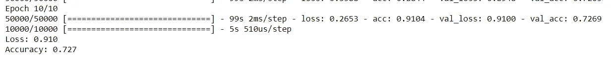

现在，让我们看看 Max norm + Dropout 的影响:

```
**# Dropout & Max Norm****# Dropout & Max Norm layers import**
from keras.layers import Dropout
from keras.constraints import max_norm**# Inizializing the model**
model = Sequential()**# Defining a convolutional layer**
model.add(Conv2D(128, kernel_size=(3, 3), activation='relu', input_shape=(32, 32, 3)))
model.add(Dropout(0.25))**# Defining a second convolutional layer**
model.add(Conv2D(128, kernel_size=(3, 3), activation='relu'))
model.add(Dropout(0.25))**# Defining a third convolutional layer**
model.add(Conv2D(128, kernel_size=(3, 3), activation='relu'))
model.add(Dropout(0.25))**# Classifier inclusion**
model.add(Flatten())
model.add(Dense(1024, activation='relu', kernel_constraint=max_norm(3.)))
model.add(Dropout(0.5))
model.add(Dense(10, activation='softmax'))**# Compiling the model**
model.compile(loss='categorical_crossentropy',
              optimizer=Adam(lr=0.0001, decay=1e-6),
              metrics=['accuracy'])**# Traning the model**
model.fit(X_train_norm, to_categorical(Y_train),
          batch_size=128,
          shuffle=True,
          epochs=10,
          validation_data=(X_test_norm, to_categorical(Y_test)))**# Evaluating the model**
scores = model.evaluate(X_test_norm, to_categorical(Y_test))print('Loss: %.3f' % scores[0])
print('Accuracy: %.3f' % scores[1])
```

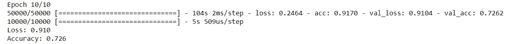

有更多的技术来处理过度拟合，如最大池，改变步幅…等等。在实践中，最好的方法是应用其中的几种，并根据所面临的问题测试哪种组合能提供最好的结果。

# 最后的话

一如既往，我希望你喜欢这篇文章，并且获得了关于如何实现和开发卷积神经网络的直觉！

*如果你喜欢这篇文章，那么你可以看看我关于数据科学和机器学习的其他文章* [*这里*](https://medium.com/@rromanss23) *。*

*如果你想了解更多关于机器学习、数据科学和人工智能的知识* ***请在 Medium*** *上关注我，敬请关注我的下一篇帖子！*