# 卷积神经网络的数学

> 原文：<https://towardsdatascience.com/convolutional-neural-networks-mathematics-1beb3e6447c0?source=collection_archive---------3----------------------->

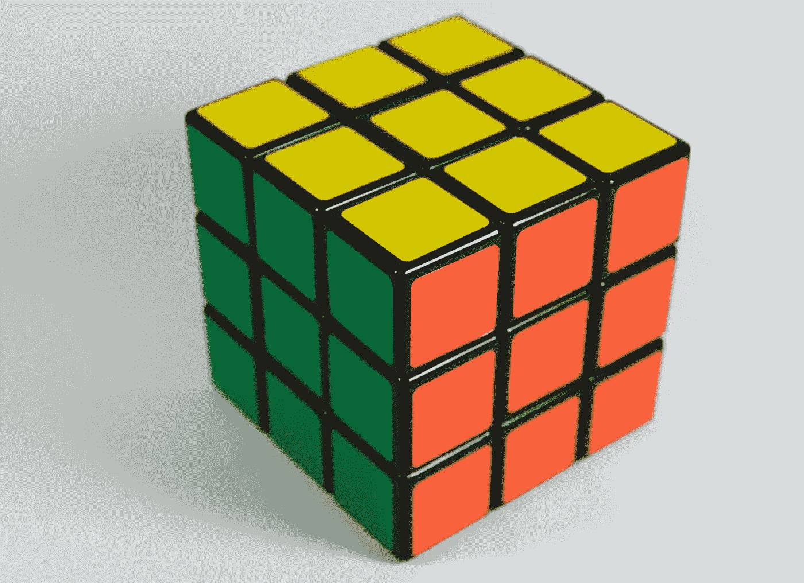

米盖尔·Á的照片。帕德里纳来自[派克斯](https://www.pexels.com/fr-fr/photo/carre-cerveau-colore-couleur-19677/?utm_content=attributionCopyText&utm_medium=referral&utm_source=pexels)

## 卷积神经网络-第 1 部分:深入探究 CNN 的基本原理。

计算机视觉是深度学习的一个子领域，它处理所有尺度的图像。它允许计算机通过自动过程处理和理解大量图片的内容。
计算机视觉背后的主要架构是卷积神经网络，它是前馈神经网络的衍生物。它的应用非常广泛，例如图像分类、物体检测、神经类型转移、人脸识别……如果你没有深度学习的一般背景，我建议你先阅读我关于前馈神经网络的[帖子](https://medium.com/swlh/deep-learnings-mathematics-f52b3c4d2576)。

注意:因为 Medium 不支持 LaTeX，所以数学表达式是作为图像插入的。因此，为了更好的阅读体验，我建议你关闭黑暗模式。

# 目录

> *1。过滤处理
> 2。定义
> 3。基础
> 4。训练 CNN
> 5。常见架构*

# **1-过滤处理**

图像的第一次处理是基于过滤器，例如，使用垂直边缘和水平边缘过滤器的组合来获得图像中对象的边缘。
从数学上讲，垂直边缘滤波器，VEF，如果定义如下:

其中 HEF 代表水平边缘滤波器。

为了简单起见，我们考虑灰度 6×6 图像 A，这是一个 2D 矩阵，其中每个元素的值表示相应像素中的光量。
为了从该图像中提取垂直边缘，我们执行一个**卷积乘积(⋆)** ，它基本上是每个块中元素乘积的总和**:**

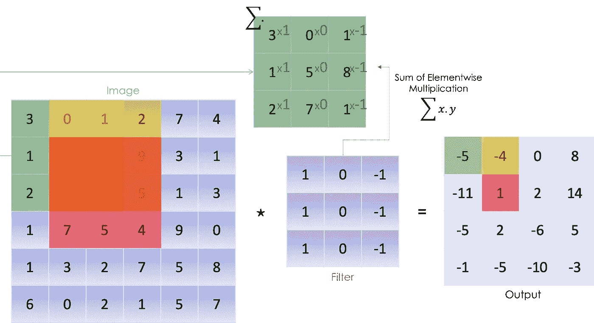

我们对图像的第一个 3x3 块执行元素乘法，然后我们考虑右边的下一个块，并做同样的事情，直到我们覆盖了所有潜在的块。

我们可以把以下过程归纳为:

给定这个例子，我们可以考虑对`any objective`使用相同的过程，其中`filter is learned`由`neural network`执行，如下所示:

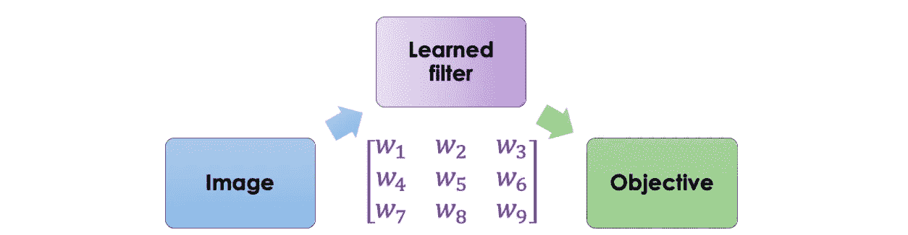

主要的直觉是设置一个[神经网络](https://medium.com/swlh/deep-learnings-mathematics-f52b3c4d2576)，将图像作为输入，输出一个定义好的目标。使用[反向传播](https://medium.com/swlh/deep-learnings-mathematics-f52b3c4d2576)学习参数。

# 2-定义

卷积神经网络是一系列卷积和汇集层，允许从图像中提取最符合最终目标的主要特征。

在下一节中，我们将详细介绍每一块砖及其数学方程。

## 卷积乘积

在我们明确定义卷积积之前，我们将首先定义一些基本操作，如填充和步长。

**填充**

正如我们在使用垂直边缘滤波器的卷积产品中看到的那样，图像角落的像素(2D 矩阵)比图像中间的像素使用得少，这意味着边缘的信息被丢弃了。
为了解决这个问题，我们经常在图像周围添加填充，以便考虑边缘上的像素。按照惯例，我们用`zeros`表示`padde`，用`p`表示填充参数，该参数表示添加到图像四个边中的每一个边上的元素数量。
下图说明了灰度图像(2D 矩阵)的填充，其中`p=1`:

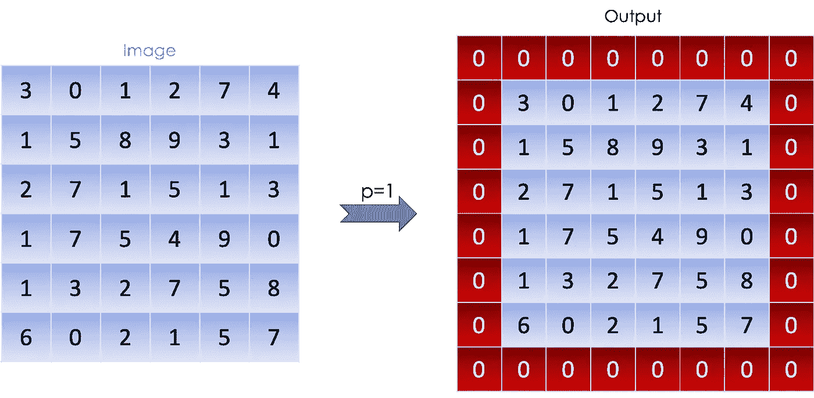

**跨步**

跨距是卷积乘积中的步长。大的步幅允许缩小输出的大小，反之亦然。我们称步幅参数为`s`。
下图显示了带有`s=1`的卷积乘积(每个块的逐元素总和):

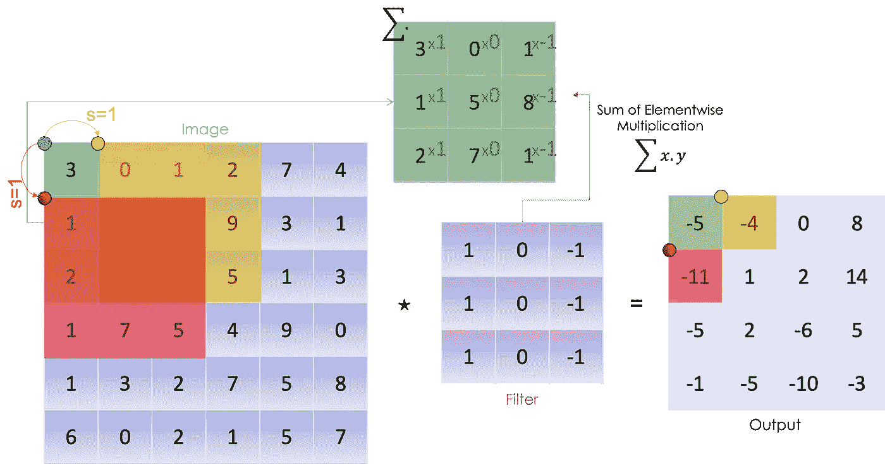

**卷积**

一旦我们定义了步幅和填充，我们就可以定义张量和滤波器之间的卷积积。
在先前定义了 2D 矩阵上的卷积积(是`element-wise product`的和)之后，我们现在可以正式定义体积上的卷积积。
一般来说，图像在数学上可以表示为具有以下维度的张量:

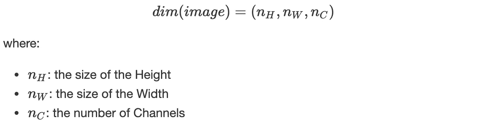

例如，在 RGB 图像的情况下，n_C=3，我们有红色、绿色和蓝色。按照惯例，我们认为滤波器 *K* 为`squared`并且具有表示为 *f，*的`odd dimension`，这允许每个像素在滤波器中居中，从而考虑其周围的所有元素。
当操作卷积乘积时，滤波器/内核 *K* 必须将`same number of channels`作为图像，这样我们对每个通道应用不同的滤波器。因此，过滤器的尺寸如下:

图像和过滤器之间的`convolutional product`是一个`2D matrix`，其中每个元素是立方体(过滤器)和给定图像的子立方体的元素乘法的**和，如下图所示:**

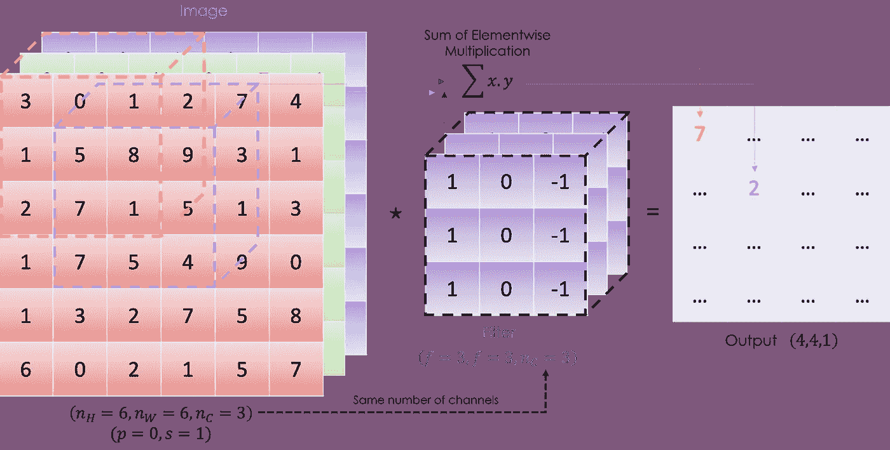

从数学上来说，对于给定的图像和滤波器，我们有:

保持与之前相同的符号，我们有:

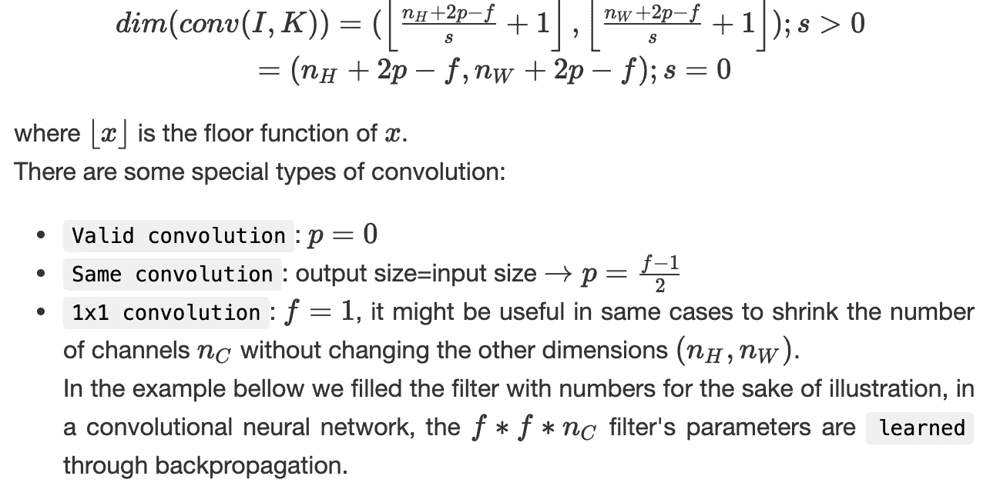

**统筹**

它是通过总结信息对图像的特征进行下采样的步骤。该操作通过每个通道执行，因此它只影响尺寸(n_H，n_W ),并保持 n_C 不变。
给定一幅图像，我们滑动一个过滤器，用`no parameters`来学习，按照一定的步幅，我们对选定的元素应用一个函数。我们有:

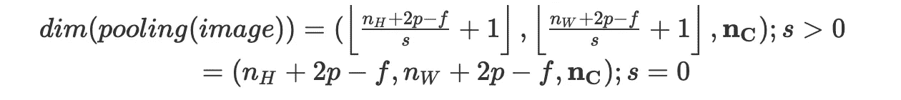

按照惯例，我们考虑大小为 *f* 的平方滤波器，我们通常设置 *f* =2，并考虑 *s* =2。

我们经常应用:

*   `Average pooling`:我们对过滤器上的元素进行平均
*   `Max pooling`:给定过滤器中的所有元素，我们返回最大值

下面是一个平均池的例子:

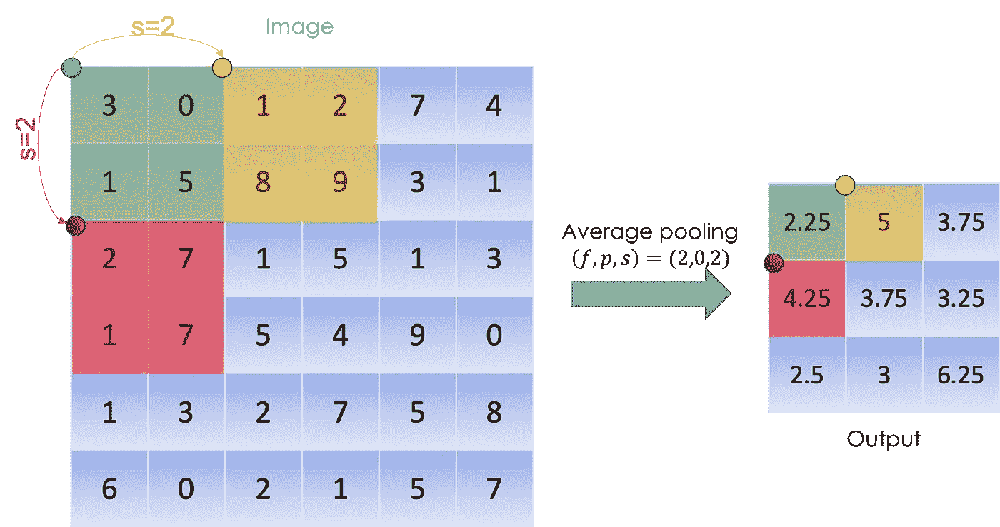

# 3-基础

在这一节中，我们将结合上面定义的所有操作，逐层构建一个卷积神经网络。

# CNN 的一层

卷积神经网络的每一层可以是:

*   `Convolutional layer -CONV-`后面跟着一个`activation function`
*   `Pooling layer -POOL-`如上详述
*   `Fully connected layer -FC-`基本上类似于前馈神经网络的层，

你可以在我之前的[帖子](https://medium.com/swlh/deep-learnings-mathematics-f52b3c4d2576)中看到更多关于激活功能和完全连接层的细节。

## 卷积层

正如我们之前看到的，在卷积层，我们对输入应用卷积乘积 **s** ，这次使用了许多滤波器，然后是激活函数ψ。

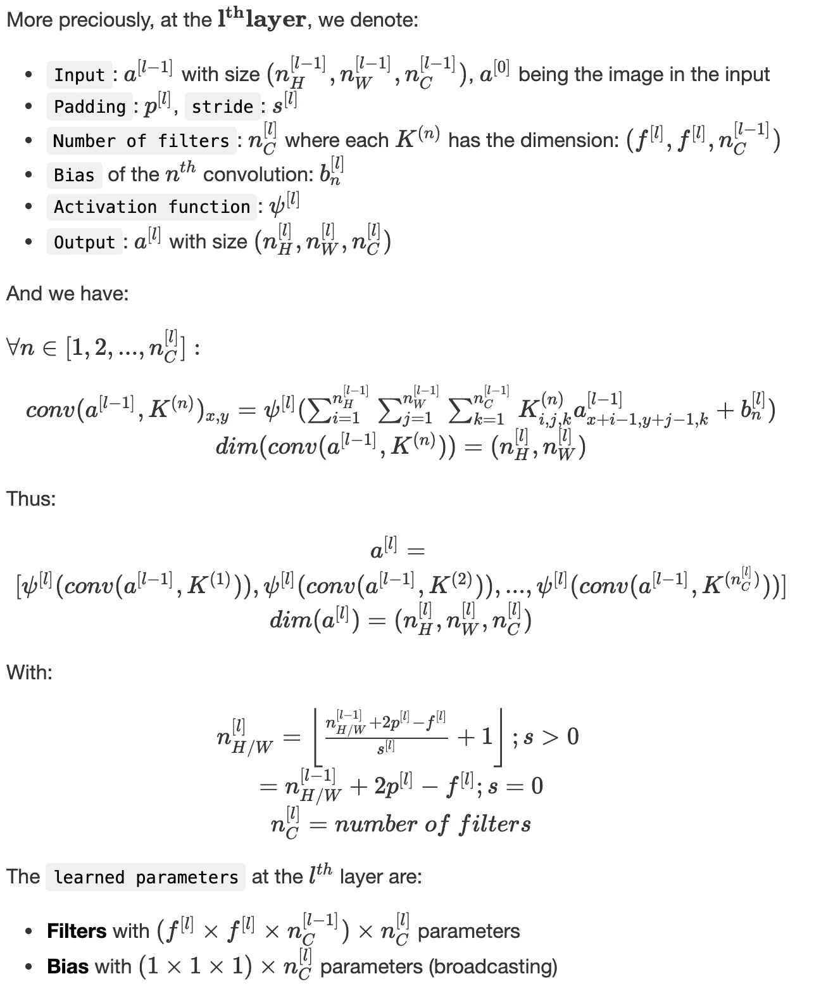

我们可以在下图中总结卷积层:

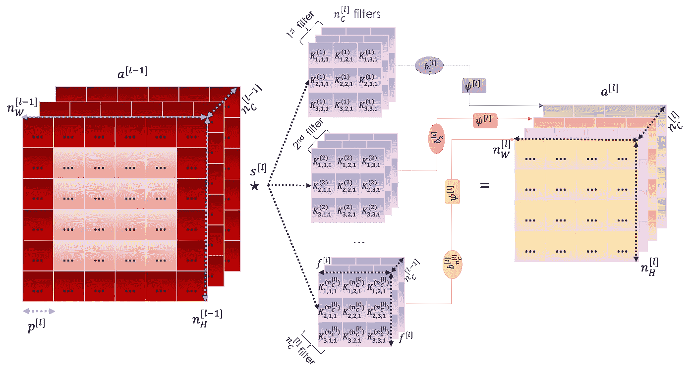

## 汇集层

如前所述，池图层旨在对输入要素进行缩减采样，而不会影响通道的数量。
我们考虑以下符号:

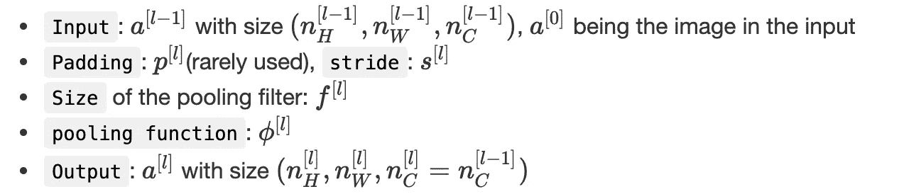

我们可以断言:

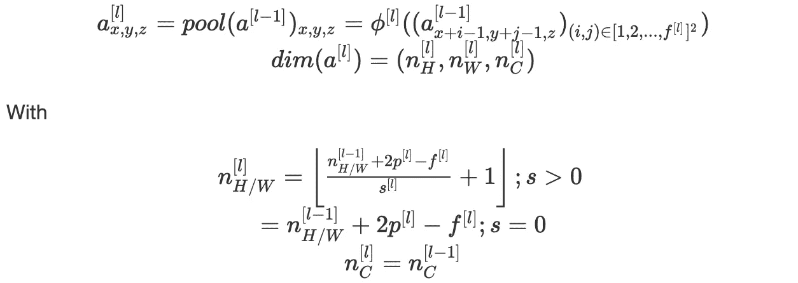

池层有`no parameters`要学习。

我们在下图中总结了前面的操作:

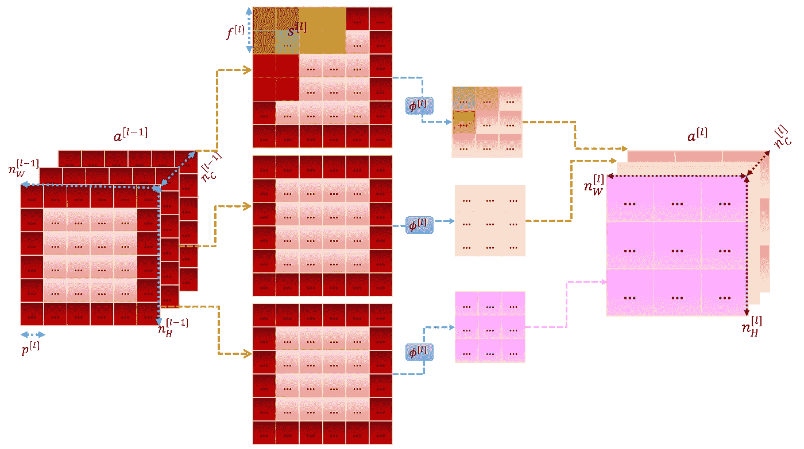

## 全连接层

全连接层是有限数量的神经元，它接受一个向量的输入，并返回另一个向量。

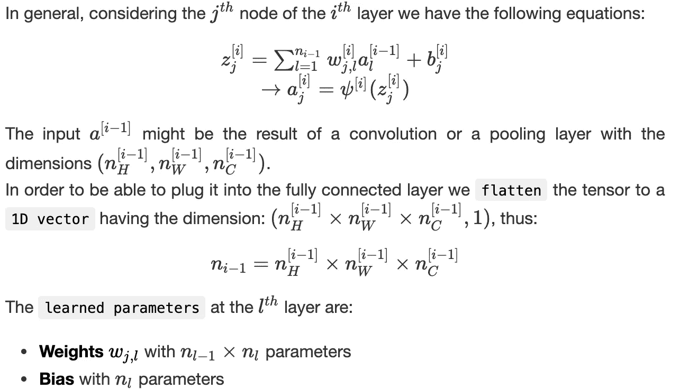

我们在下图中总结了完全连接的层:

更多细节，你可以访问我的关于前馈神经网络的 [p](https://www.ismailmebsout.com/deep-learning/) 上一篇[文章](https://medium.com/swlh/deep-learnings-mathematics-f52b3c4d2576)。

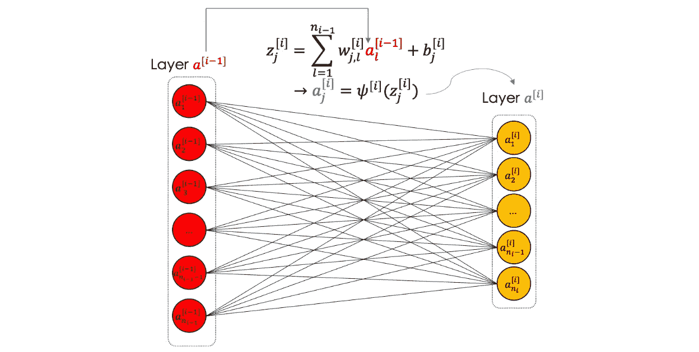

## CNN 总的来说

一般来说，卷积神经网络是上述所有操作的系列，如下所示:

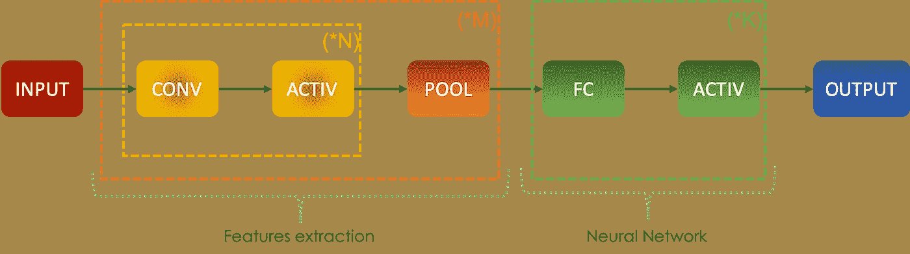

在激活函数之后重复一系列卷积之后，我们应用一个池并重复这个过程一定次数。这些操作允许从将被`fed`的图像`extract features`到由完全连接的层描述的`neural network`，该完全连接的层也有规律地被激活功能跟随。
大意是通过网络更深入时`decrease` n_H & n_W 和`increase` n_C。
在 3D 中，卷积神经网络具有以下形状:

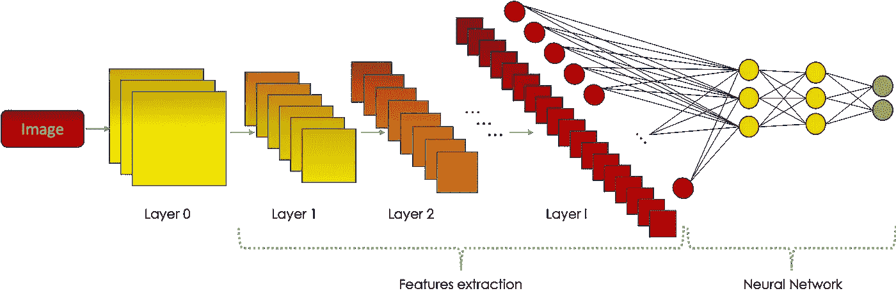

## CNN 为什么工作效率高？

卷积神经网络能够实现图像处理的最新成果有两个主要原因:

*   **参数共享**:卷积层中的特征检测器在图像的一部分有用，在其他部分可能有用
*   **连接的稀疏性**:在每一层中，每个输出值只依赖于少量的输入

# 4-培训 CNN

卷积神经网络是在一组标记图像上训练的。从给定的图像开始，我们通过 CNN 的不同层传播它，并返回所寻找的输出。
在本章中，我们将介绍学习算法以及数据扩充中使用的不同技术。

## 数据预处理

**数据扩充**是增加给定数据集中图像数量的步骤。数据扩充中使用了许多技术，例如:

*   `Crooping`
*   `Rotation`
*   `Flipping`
*   `Noise injection`
*   `Color space transformation`

由于训练集的规模较大，它启用了`better learning`，并允许算法从所讨论的对象的不同`conditions`中学习。
一旦数据集准备好了，我们**就像任何机器学习项目一样把它分成三个部分:**

*   **训练集**:用于训练算法和构造批次
*   **Dev set** :用于微调算法，评估偏差和方差
*   **测试集**:用于概括最终算法的误差/精度

## 学习算法

卷积神经网络是一种专门用于图像的特殊类型的神经网络。一般来说，神经网络中的学习是在几个层中计算上面定义的参数的权重的步骤。
换句话说，我们的目标是从输入图像开始，找到给出真实值的最佳预测/近似的最佳参数。
为此，我们定义了一个目标函数，称为`loss function`，记为`J`，它量化了整个训练集的实际值和预测值之间的距离。
我们通过以下两个主要步骤最小化 J:

*   `**Forward Propagation**`:我们通过网络整体或分批传播数据，并计算这批数据的损失函数，该函数只不过是不同行的预测输出中的误差之和。
*   `**Backpropagation**`:包括计算成本函数相对于不同参数的梯度，然后应用下降算法更新它们。

我们多次重复相同的过程，称为`epoch number`。定义架构后，学习算法编写如下:

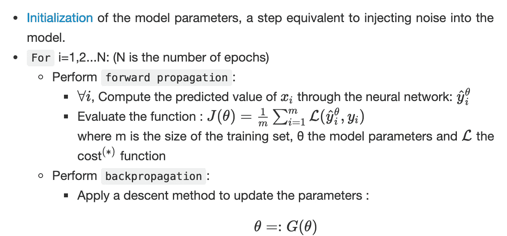

(*)成本函数评估单点的实际值和预测值之间的距离。

更多的细节，你可以访问我的 [p](https://www.ismailmebsout.com/deep-learning/) 上一篇[关于前馈神经网络的文章](https://medium.com/swlh/deep-learnings-mathematics-f52b3c4d2576)。

# 5-通用架构

## 雷斯内特

Resnet、捷径或跳过连接是一个卷积层，它在层 *n* 处考虑了层 *n-2* 。直觉来自于这样一个事实:当神经网络变得非常深入时，输出端的精度变得非常稳定，不会增加。注入前一层的残差有助于解决这个问题。
让我们考虑一个残差块，当`skip connection`为`off`时，我们有以下等式:

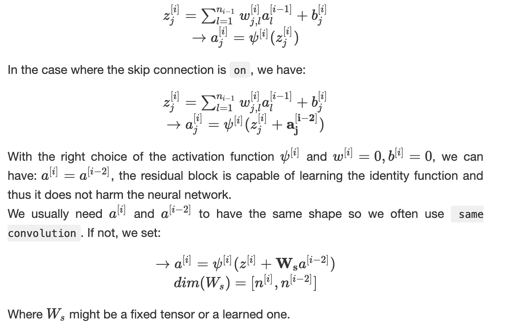

我们可以在下图中对残差块进行求和:

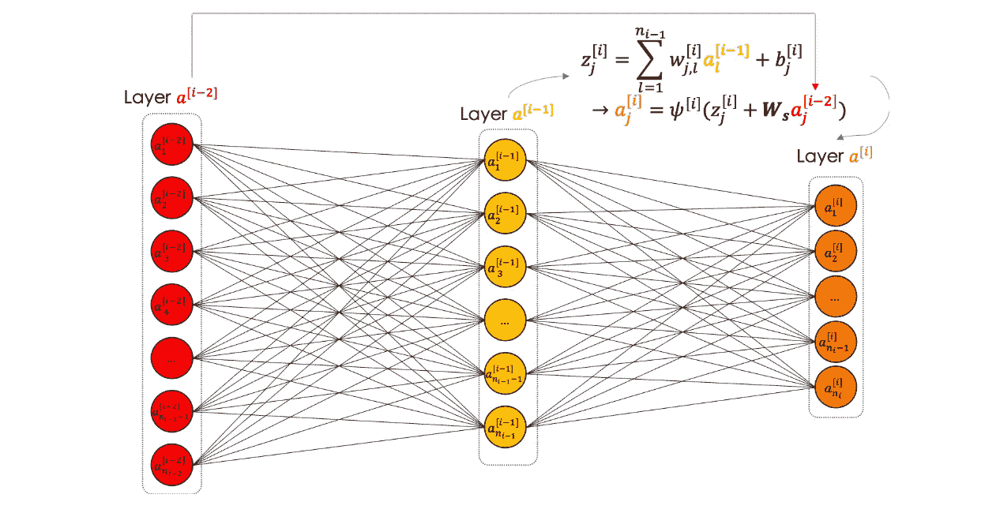

## 初始网络

在设计卷积神经网络时，我们经常要选择层的类型:`CONV`、`POOL`或`FC`。初始层完成了所有的工作。所有操作的结果然后是单个块中的`concatenated`,其将是下一层的输入，如下:

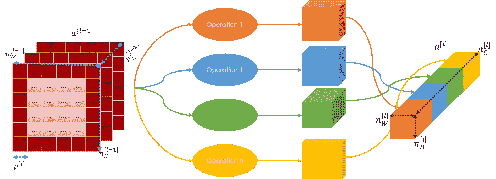

需要注意的是，初始层提出了`computational cost`的问题。供参考，名字`inception`来源于电影！

# 结论

在本文的第一部分中，我们已经看到了从卷积产品、池化/全连接层到训练算法的 CNN 基础。

在[第二部分](/object-detection-face-recognition-algorithms-146fec385205)中，我们将讨论图像处理中使用的一些最著名的架构。

不要犹豫，检查我以前的文章处理:

*   [深度学习的数学](https://medium.com/p/deep-learnings-mathematics-f52b3c4d2576)
*   [物体检测&人脸识别算法](https://medium.com/p/object-detection-face-recognition-algorithms-146fec385205)
*   [递归神经网络](/recurrent-neural-networks-b7719b362c65)

# 参考

*   [深度学习专业化](https://fr.coursera.org/specializations/deep-learning)，Coursera，吴恩达
*   [机器学习](http://deeploria.gforge.inria.fr/cours/cours1.html#/machine-learning-introduction)，洛里亚，克里斯托夫·塞里萨拉

*原载于 2020 年 2 月 24 日*[*https://www.ismailmebsout.com*](https://www.ismailmebsout.com/Convolutional%20Neural%20Network%20-%20Part%201/)*。*