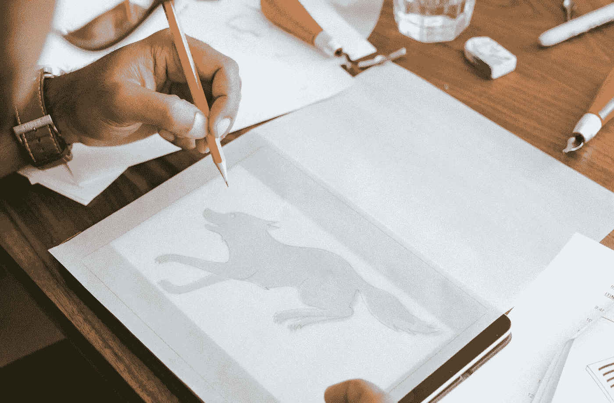
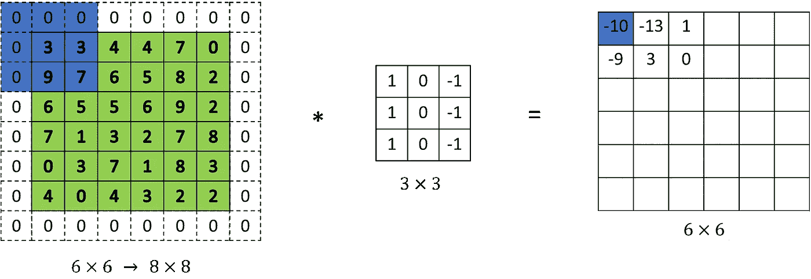
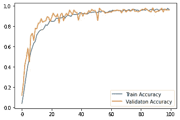
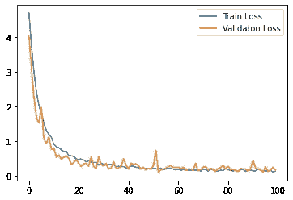
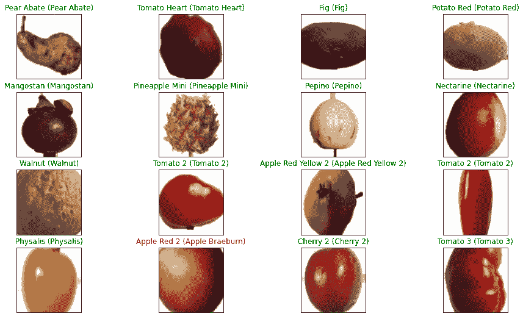

# 卷积神经网络从零开始建模和冻结

> 原文：<https://towardsdatascience.com/convolutional-neural-networks-model-from-scratch-for-object-detection-820893610919?source=collection_archive---------46----------------------->

> 如果你不能简单地解释它，你就理解得不够好- *爱因斯坦，这个人和他的成就*g . j .惠特罗著，多佛出版社 1973 年。

CNN 模型从零开始，使用最流行的 Kaggle 数据集 [Fruits-360](https://www.kaggle.com/moltean/fruits) ，获得 98%的准确率。

**第一步——将数据集从 Kaggle 导入 Google Colab**

登录你的 Kaggle 账户，进入我的账户，点击创建新 API 下载 Kaggle.json 文件。然后在 Google colab 上按照下面的代码要点上传相同的 API

*   直接将整个数据集导入到 google colab 并解压缩

步骤 2-准备训练和测试数据

*   数据已经包含了训练和测试文件夹，里面有水果和蔬菜的图片。我们只需要定义文件夹的路径，

*   现在我们必须将图像的尺寸定义到 NumPy-array 中，这样我们可以在接下来的步骤中进一步将图像缩小到 32x32

*   让我们找出，在训练数据中有多少种水果和蔬菜

在这里，我创建了一个流程来缩小图片的尺寸，并放大一点以获得更好的效果

*   这段代码将显示缩小、缩放图像的最终结果

**步骤 3 CNN 构建和模型调整**

请对像素矩阵、RGB 通道、颜色矩阵和人工神经网络有一个基本的了解，以便进一步阅读

在初学者的术语中，使用 CNN 我们所做的是，在我们的密集层之间添加额外的层，或者换句话说，将我们在 CNN 中定义的矩阵与密集层创建的矩阵相乘，移动到每个像素并填充输出矩阵，因此输出矩阵将具有 Ai 记录图像中一些变化的所有值，如形状或轮廓的变化。这种在每个像素上的乘法和加法被称为卷积，以记录图像中的边缘或形状。

这里实际发生的是，我们使用滤镜矩阵定义了某些颜色像素，它与图像像素中的所有其他颜色进行“卷积”,从而找到图案，想象滤镜是黑色的，我们在一幅画上加阴影，我们在输出中得到的是全黑，但一些深色在黑色上突出显示，给我们提供了形状，这些形状在输出矩阵中注册。


source—[https://stack overflow . com/questions/52067833/how-to-plot-a-animated-matplotlib 中的 matrix](https://stackoverflow.com/questions/52067833/how-to-plot-an-animated-matrix-in-matplotlib)

直观地说，当我们继续将我们的 CNN 滤波器矩阵与图像像素上的密集层矩阵进行卷积时，我们将在曲线、点或一些不同于图像其余部分的形状处获得许多不同的结果/数字，这反过来将帮助 AI 或 ANN 找到形状、边缘、轮廓。
随着我们深入到网络中，添加更多 CNN 层矩阵，做矩阵产品越做越深，



查尔斯·德鲁维奥在 [Unsplash](https://unsplash.com/s/photos/tracing-paper?utm_source=unsplash&utm_medium=referral&utm_content=creditCopyText) 上的照片

结果/数字将发生更大的变化，或者你可以说形状，曲线对人工智能来说将变得更加清晰，人工智能将能够学习苹果和菠萝之间的区别。通俗地说，我们可以说人工智能是通过描摹一幅真实的画来绘制图像，而 CNN 是描摹者或荧光笔。在下面的代码中，32 和 64 是过滤器，CNN 的矩阵大小是 3x3

**为 CNN 选择网络架构**

你可以在已经建立的各种网络架构之间进行交叉验证，并通过数学证明进行研究，如 AlexNet、LeNet-5、VGG，或者尝试创建自己的网络架构，既不会扩大梯度，也不会过度拟合数据。**这里我使用了一个基本的 CNN 架构**，对于更高级的模型，我建议学习网络架构和过滤器/内核构建，具有像角度旋转、水平/垂直过滤器等功能。

**填充**

填充是向像素矩阵添加额外边界的过程，因此在卷积过程中，角上的信息不会丢失，例如在矩阵周围添加 0 的边界。正如您在图像中看到的，如果没有填充，我们将只使用一次带信息的角，但现在有了填充，原始角将在卷积过程中多次使用。



**联营**

在从卷积中获得输出后，我们使用了一层 max pool，max pool 的作用是简单地降低矩阵的维数，或者换句话说，降低卷积输出的输出图像的大小，以实现更快、更精确的过程。

为了对池中发生的事情有一个基本的直觉，我们定义了一个矩阵，例如 2x2 矩阵，它会将输出矩阵划分为 2x2 多个矩阵，并通过计算出特定 2x2 矩阵中的最大值，仅保留看起来有一些形状或对象的点，然后这将进一步帮助减少输出图像的维度，以便更快地处理深入网络


来源-[https://www.youtube.com/watch?v=ZjM_XQa5s6s](https://www.youtube.com/watch?v=ZjM_XQa5s6s)，深渊蜥蜴

**请参考 AndrewNg 的视频，了解 CNN 在添加图层后图像尺寸的变化**

*   现在是时候添加输入和输出层，并调整人工神经网络模型

*   保存模型，在互联网上的随机图像上进行测试，看看您训练的模型是否可以识别水果和蔬菜

```
model.save_weights(“cnn_fruit.h5”)
```

**结果**

通过将 CNN 添加到我们的模型中，我能够达到 98%的准确性，在使这成为您的第一个项目后，我认为您将对 CNN 有一个基本的直观了解，并可以更深入地研究数学部分、基本原理以及网络选择和构建。



cnn_fruit.h5 结果



CNN 定制架构结果

## 冻结用于集成到 web 应用程序中的定制 CNN 模型，

这段代码将把你定制的模型冻结成 Keras 检查点格式，然后你可以为应用程序集成制作推断图

对于完整的 jupyter 笔记本和代码，你可以通过[github.com](https://github.com/Alexamannn/CNN_from_scratch)——[https://github.com/Alexamannn/CNN_from_scratch](https://github.com/Alexamannn/CNN_from_scratch)查看我的知识库