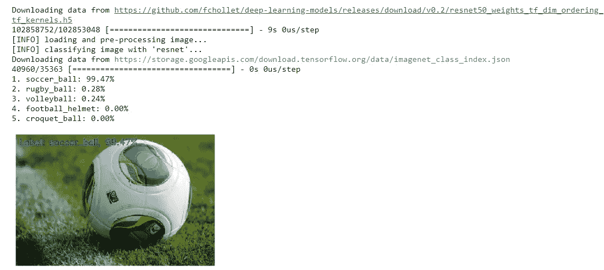

# 最流行的卷积神经网络架构

> 原文：<https://towardsdatascience.com/convolutional-neural-networks-most-common-architectures-6a2b5d22479d?source=collection_archive---------5----------------------->

## 了解它们的结构以及如何实现它们！


图片来自 [Unsplash](https://unsplash.com/photos/41Wuv1xsmGM)

# 介绍

本文的目的是深入探讨以下概念:

*   最流行的 CNN 架构
*   如何用 Keras 实现它们来进行图像分类

# 最常见的架构

有研究团队完全致力于为 CNN 开发深度学习架构，并在庞大的数据集中训练它们，所以我们将利用这一点，并使用它们，而不是每次面临新问题时都创建新的架构。

这将为我们提供稳定性和精确性。

目前 CNN 最常见的深度学习架构有:

*   VGG
*   雷斯内特
*   开始
*   例外

让我们来探索它们。

## VGG16 和 VGG19

这种架构是最早出现的架构之一，由 Simonyan 和 Zisserman 在 2014 年发表的题为“用于大规模图像识别的非常深的卷积网络”的论文中介绍。本文可从这里获得:【https://arxiv.org/abs/1409.1556】T2。


按作者分列的数字

这是一种简单的架构，仅使用由递增数量的卷积层组成的块，具有 3×3 大小的滤波器。此外，为了减少获得的激活图的大小，最大池块被散布在卷积块之间，从而将这些激活图的大小减少一半。最后，使用一个分类块，由两个各有 4096 个神经元的密集层和最后一层(1000 个神经元的输出层)组成。

16 和 19 是指每个网络拥有的加权层数(卷积层和密集层，池层不计算在内)。它们对应于下表中的 D 列和 E 列。


截图来自 [wiki.math](http://very Deep Convoloutional Networks for Large-Scale Image Recognition)

表中的其余架构都在那里，因为当时 Simonyan 和 Zisserman 很难训练他们的架构进行融合。由于他们无法做到这一点，他们想出的是先用更简单的架构训练网络，一旦这些网络收敛并被训练，他们就利用自己的权重来初始化下一个稍微复杂一点的网络，以此类推，直到他们到达 VGG19。这个过程被称为“预训练”。

然而，这是在那些时候，现在它不再做，因为它需要太多的时间。现在我们可以使用 Xavier/Glorot 或 he 等人的初始化来实现同样的事情。

然而，这个网络有几个缺点:

*   训练时间太长了
*   它有非常多的参数

## 雷斯内特

由何等人在 2015 年开发的 ResNet 架构(你可以在这里看到他们名为“图像识别的深度剩余学习”的论文:[、](https://arxiv.org/abs/1512.03385))是引入基于“模块”的奇异类型架构的里程碑，或者正如现在所知的，“网络中的网络”。

这些网络引入了“剩余连接”的概念，如下图所示:


按作者分列的数字

这些块允许到达先前激活图的层 l+1l+1 部分而无需修改，并且被属于层 L1 的块部分修改，正如你在上面的图像中所看到的。

2016 年，他们改进了这种架构，在这些残余块中加入了更多层，如下图所示:


按作者分列的数字

ResNet 有各种不同的层数，但使用最多的是 ResNet50，它由 50 个带权重的层组成。

值得注意的是，虽然它的图层比 VGG 多得多，但它需要的内存却少得多，几乎只有原来的五分之一。这是因为该网络不是在分类阶段使用密集层，而是使用一种称为 GlobalAveragePooling 的层，它将特征提取阶段最后一层的 2D 活动图转换为 class 向量，用于计算属于每个类的概率。

## 盗梦空间 V3

这种类型的架构是 2014 年由 Szegedy 等人在他们的论文“用卷积走得更深”(【https://arxiv.org/abs/1409.4842】)中介绍的，它使用带有不同大小滤波器的块，然后将这些块连接起来，以提取不同尺度的特征。看图片:


按作者分列的数字

为了帮助您理解这一点，inception 块的目标是使用 1x1、3x3 和 5x5 卷积计算激活图，以提取不同比例的特征。然后，您只需将所有这些激活映射连接成一个。

这种体系结构需要的内存甚至比 VGG 和 ResNet 还要少。

## 例外

这种架构是由 Fran ois Chollet(Keras 的创造者)提出的，他给《盗梦空间》带来的唯一东西是他优化了回旋，使它们花费更少的时间。这是通过将 2D 卷积分成两个 1D 卷积来实现的。如果你有兴趣了解更多，这里有论文:《异常:深度学习与深度可分卷积》，【https://arxiv.org/abs/1610.02357】T4。

在内存方面，它与 Xception 非常相似，这是其架构的轮廓:


来自[exception-Open Access Paper](http://openaccess.thecvf.com/content_cvpr_2017/papers/Chollet_Xception_Deep_Learning_CVPR_2017_paper.pdf)的截图

## 挤压网

这个网络非常轻(例如，与 VGG 的 500MB 或 Inception 的 100MB 相比，它的重量是 5MB ),并且使用 ImageNet 实现了大约 57%的 rank-1 或大约 80%的 rank-5 的准确性。

rank-1 和 rank-5 或者 top-1 和 top-5 是什么意思？

*   等级 1 精度:我们比较根据我们的网络具有最高概率的类是否匹配真实的标签
*   等级-5 准确度:我们比较根据我们的网络具有较高试用的 5 个类别中的一个是否与真实标签匹配

这个网络是如何做到占用空间如此之小却又如此精确的呢？它通过使用“压缩”数据然后扩展数据的体系结构来实现这一点，如下图所示:


按作者分列的数字


按作者分列的数字


按作者分列的数字

有无限的架构，但这些是目前使用最多的。通常，当我们遇到问题时，我们不会定义我们的架构，但我们会使用之前的一个架构。

好了，现在您已经看到了它们，让我们看看如何在 Keras 中实现它们

## VGG，ResNet，Inception & Xception Keras 实现

像往常一样，我们会打开一个谷歌合作笔记本。选择在 GPU 上运行的代码，提高速度，执行下面的代码。

```
!pip install imageio
```


```
**# Import the necessary libraries**
from keras.applications import ResNet50
from keras.applications import InceptionV3
from keras.applications import Xception # solo con el backend de TensorFlow
from keras.applications import VGG16
from keras.applications import VGG19
from keras.applications import imagenet_utils
from keras.applications.inception_v3 import preprocess_input
from keras.preprocessing.image import img_to_array
from keras.preprocessing.image import load_img
import numpy as np
import urllib
import cv2
import matplotlib.pyplot as plt
import imageio as iodef predict_image(model_name, image_source):

 **# We define a dictionary that maps the network name with the Keras imported model** MODELS = {
    "vgg16": VGG16,
    "vgg19": VGG19,
    "inception": InceptionV3,
    "xception": Xception, # TensorFlow solo!
    "resnet": ResNet50
  }# **We stablish the input size and image preprocessing function**
  input_shape = (224, 224)
  preprocess = imagenet_utils.preprocess_input# **If we use InceptionV3 or Xception, we need to stablish a different input image size (299x299) and use a different preprocessing function**
  if model_name in ("inception", "xception"):
    input_shape = (299, 299)
    preprocess = preprocess_inputprint("[INFO] loading {}...".format(model_name))
  Network = MODELS[model_name]
  model = Network(weights="imagenet") **# We load the network with the weights already trained with the ImageNet, the first time we execute keras it will lead the weights, which size is about 500MB, so it will last a bit** # **We load the image and make sure it is in the appropiate size**
  print("[INFO] loading and pre-processing image...")
  if type(image_source) == str:
    image = load_img(image_source, target_size=input_shape)
    image = np.resize(image, (input_shape[0], input_shape[1], 3))
    image = img_to_array(image)
  else:
    image = np.resize(image_source, (input_shape[0], input_shape[1], 3))
    image = img_to_array(image)# **The image is represented as an array of size: (inputShape[0], inputShape[1], 3) and we need: (1, inputShape[0]. inputShape[1], 3), so we expand the dimensions**
  image = np.expand_dims(image, axis=0)**# we preprocess the image**
  image = preprocess(image)**# We predict the class of the image**
  print("[INFO] classifying image with '{}'...".format(model_name))
  preds = model.predict(image)
  P = imagenet_utils.decode_predictions(preds)**# We show the predictions rank-5 and their likelihood**
  for (i, (imagenetID, label, prob)) in enumerate(P[0]):
    print("{}. {}: {:.2f}%".format(i + 1, label, prob * 100))img = io.imread(image_source)
  (imagenetID, label, prob) = P[0][0]
  cv2.putText(img, "Label: {}, {:.2f}%".format(label, prob * 100), (10, 30), cv2.FONT_HERSHEY_SIMPLEX, 0.8, (0, 0, 255), 2)
  plt.imshow(img)
  plt.axis('off')

  return model
```


```
# download images
!wget [https://image.ibb.co/cuw6pd/soccer_ball.jpg](https://image.ibb.co/cuw6pd/soccer_ball.jpg)
!wget [https://image.ibb.co/hdoVFJ/bmw.png](https://image.ibb.co/hdoVFJ/bmw.png)
!wget [https://image.ibb.co/h0B6pd/boat.png](https://image.ibb.co/h0B6pd/boat.png)
!wget [https://image.ibb.co/eCyVFJ/clint_eastwood.jpg](https://image.ibb.co/eCyVFJ/clint_eastwood.jpg)
```


```
!ls -la *.*
```


```
model = predict_image('resnet', 'soccer_ball.jpg')
```



```
model = predict_image('vgg16', 'bmw.png')
```


```
model.summary()
```


```
model = predidct_image('inception', 'clint_eastwood.jpg')
```


```
model.summary()
```

网络架构的结果太大了，这里不适合:


# 最后的话

一如既往，我希望你喜欢这篇文章，并且获得了关于如何实现和开发卷积神经网络的直觉！

*如果你喜欢这篇帖子，那么你可以看看我在数据科学和机器学习方面的其他帖子* [*这里*](https://medium.com/@rromanss23) *。*

*如果你想了解更多关于机器学习、数据科学和人工智能的知识* ***请在 Medium*** *上关注我，敬请关注我的下一篇帖子！*