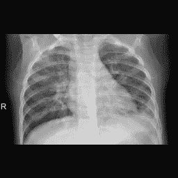
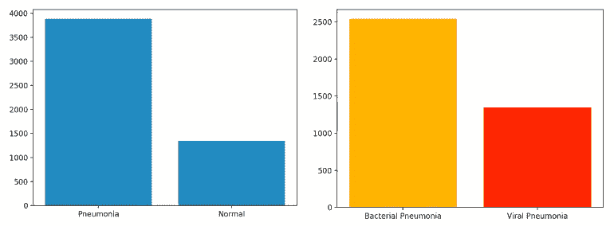
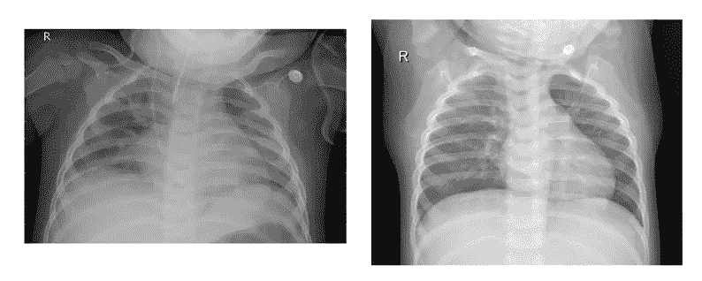
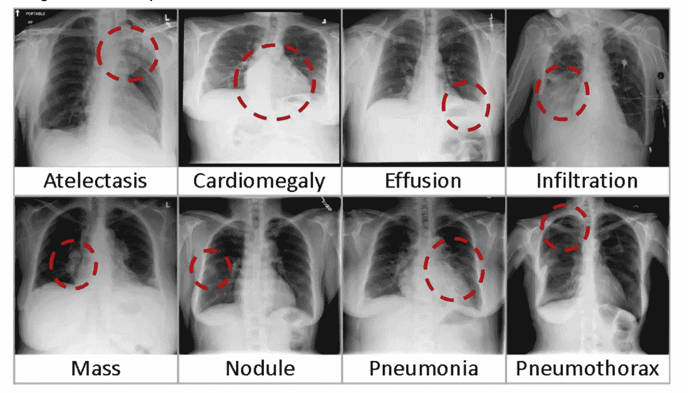
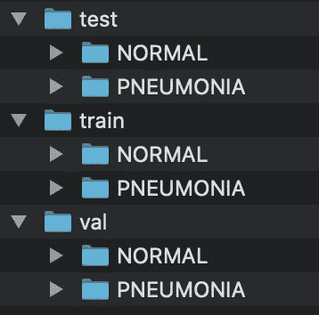
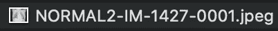

# CNN 简介(第一部分):理解和组织图像数据集

> 原文：<https://towardsdatascience.com/convolutional-neural-networks-understanding-and-organizing-your-data-set-ba3e8b4086cb?source=collection_archive---------47----------------------->

## 了解机器如何学习第一部分

## 使用 Python、Keras 和 PlaidML 或 TensorFlow 的卷积神经网络实用介绍

由 [Pixabay](https://pixabay.com/illustrations/man-think-laying-brain-icon-mind-3254076/) 上 [mohamed_hassan](https://pixabay.com/users/mohamed_hassan-5229782/) 拍摄的照片

# 介绍

现代技术已经使卷积神经网络(CNN)成为一系列问题的可行解决方案，包括从识别和定位营销材料中的品牌位置到诊断肺部 CT 中的癌症等等。[如果你喜欢，你甚至可以用 CNN 来分类乐高积木。](https://medium.com/@pacogarcia3/tensorflow-on-raspbery-pi-lego-sorter-ab60019dcf32)尽管越来越受欢迎，但许多第一次了解 CNN 的开发人员很难超越对该主题的表面介绍。

在这一系列文章中，我将以一种易于理解和实用的方式介绍卷积神经网络:通过创建一个可以在肺部 X 射线中检测肺炎的 CNN。 *******

这四篇文章系列包括以下部分，每一部分都致力于开发过程的一个逻辑块:

***第一部分:问题介绍+理解和组织你的数据集(你在这里)***

*第二部分:用相关扰动塑造和扩充您的数据集(即将推出)*

*第三部分:调整神经网络超参数(即将推出)*

*第四部分:训练神经网络并解释结果(即将推出)*

虽然本系列讨论的是与医学成像相关的主题，但这些技术实际上可以应用于任何 2D 卷积神经网络。虽然本系列不可能涵盖为每个可能的问题实现 CNN 的每一个细微差别，但是作为读者，我们的目标是让您在完成本系列时，具备从头开始实现、排除故障和调整您自己的 2D CNN 的整体能力。我打算讨论构建神经网络的许多基本细微差别，这些差别是大多数介绍性文章或操作指南往往会忽略的。重要的时候，我会关注*为什么*和*如何*，而不仅仅是*如何。我也尽量避免那些会让神经网络新手感到困惑的术语。*

本系列的第一篇文章将花时间介绍关于主题和底层数据集的关键概念，这些概念是本系列其余部分的基础。建议您仔细阅读第一篇文章，因为它提供了我们在第二部分开始编码时需要的大量信息。

***先决条件:*** 本系列面向至少对 Python 有所了解并对 CNN 有所了解的读者，但您无需成为专家也能理解。你至少应该知道如何设置 Python 环境，导入 Python 库，并编写一些基本代码。

如果你是一个绝对的初学者(也就是说，不知道 CNN 是什么)，我建议你在开始这个项目之前阅读这篇文章:

 [## 卷积神经网络的直观解释

### 什么是卷积神经网络，为什么它们很重要？卷积神经网络是…

ujjwalkarn.me](https://ujjwalkarn.me/2016/08/11/intuitive-explanation-convnets/) 

****免责声明:*** 这不是医疗器械，不是 FDA 许可或批准的，你不应该使用这些文章中的代码来诊断真实的患者——我不希望 FDA 给我写信！

这个人得了肺炎——你能看出来吗？[来源:胸部 x 光图像(肺炎)](https://www.kaggle.com/paultimothymooney/chest-xray-pneumonia)

# 让我们(简单地)谈谈肺炎

我们不再讨论一个已经被讨论了一百万次的话题(比如臭名昭著的 [MNIST 问题](https://www.tensorflow.org/tutorials/quickstart/beginner))，而是解决一个更实质性但更容易解决的问题:检测肺炎。在开始任何项目之前，对该主题有一些领域知识是至关重要的。虽然您可以开发一个具有一些表面功能的神经网络，而无需真正理解手头的问题，但创建功能性的、生产就绪的神经网络的关键是理解问题域和环境。

肺炎是一种每年影响 300 多万人并可能危及生命的疾病，尤其是对年轻人和老年人。世界卫生组织一直将肺炎列为“全球儿童死亡的最大传染性原因”。 [ 1]肺炎通常部分通过分析胸部 X 射线图像来诊断。这种 X 射线图像是用主观的和不一致的标准来解释的，而且“在肺炎患者中，对胸部 X 射线的解释，尤其是最小的细节，完全取决于读者。” [ 2】随着现代计算能力的发展，神经网络已经变得更容易使用，也更吸引研究人员去解决这类问题。

分析 X 射线是卷积神经网络非常适合解决的一类问题:主观性和不确定性是重要因素的模式识别问题。

现在我们已经*对问题域有了一些*的了解，让我们开始吧。我们将在工作中增加我们的领域知识。

# 了解数据集

我们在本文中使用的数据集可在[这里](https://www.kaggle.com/paultimothymooney/chest-xray-pneumonia)获得。[3]数据集的原始发布是这里的【4】出于好奇，数据的官方存储库是这里的。[5]

该数据集包含 5，863 幅图像，分为三大块:训练、验证和测试。每个块被进一步分成“正常”图像(没有肺炎的图像)和“肺炎”图像(被分类为患有细菌性或病毒性肺炎的图像)。数据集中的图像细分如下:

正常图像与肺炎图像的分布以及细菌性与病毒性肺炎的分布来源:作者提供的图像

注意肺炎与正常图像的不平衡。对于每一个正常图像，该数据集包含大约三个肺炎图像。这对于医学图像数据是典型的；因为患者每次接受 X 射线检查时都暴露在可能危险的电离辐射中，所以医生只有在怀疑有问题时才会让患者接受 X 射线检查(通常情况下，他们是对的)。当我们在项目的后期增加数据集时，我们将通过增加正常 X 射线的数量来解决这个问题。

## 识别图像特征和变化

下面是数据集内的两个图像示例:一个被分类为具有细菌性肺炎迹象，另一个被分类为正常。

包含细菌性肺炎感染肺(左)和正常肺(未感染，右)的放射照片示例。[来源:胸部 x 光图像(肺炎)](https://www.kaggle.com/paultimothymooney/chest-xray-pneumonia)

虽然您可能无法确定哪张 x 光片包含肺炎，但您应该能够**在 x 光片中寻找其他差异。**它们具有不同的曝光水平、不同的对比度水平、解剖结构的不同部分在视图中居中、分辨率和尺寸不同、噪声水平不同等等。**这是一个关键概念。**

除了分类目标(即“肺炎”或“非肺炎”)之外，查看您的数据集和图像变化也至关重要，因为它会告诉您在生产环境中可以预期的变化种类。这种多样性表明了我们稍后需要应用的*扰动的类型，以 ***扩充*** 数据集。扰动是我们对集合中的许多图像进行的轻微改变，以便使数据集更大并模拟真实世界的条件，例如添加人工噪声或稍微旋转一些图像。一般来说，数据集扩充是机器学习的一个关键方面，尤其是当您处理相对较小的数据集时，比如这个数据集。*

## *识别数据集偏差和假设*

*你也应该在你的数据集中寻找**偏差**。在这种特殊情况下，该数据集中的所有图像都是*的子图像*。这意味着数据集不适用于大部分人群:*成年人*！如果我没有指出这个关键的细节，你可能会认为我们在处理成人的图像。在选择或创建训练数据集时，要非常小心地理解所做的假设。那些潜在的假设应该反映你试图用你的神经网络模型解决的用例。在这种情况下，我们不能用这个数据集来训练一个神经网络模型来检测成人肺部的 x 光片中的肺炎，因为它不包含成人肺部的 x 光片！*

*偏见的另一个更明显的例子是经典的“校车”识别问题。如果你正在编写一个将检测美国校车的神经网络，数据集需要包括什么？默认的假设可能类似于“它需要包括校车和城市公交车，可能还包括包租的公交车。”真正的答案是:它可能需要包括几乎所有品牌和型号的许多类型车辆的代表性样本，因为它需要明确了解什么不是校车。**始终考虑你的神经网络将分析哪些*可能的*图像，而不仅仅是神经网络的预期目标。***

*在这种情况下，假设我们的神经网络将分析肺部 x 光片是公平的，但什么是*是*肺部 x 光片？肺部 x 光片可能还包括哪些内容？*

*有许多肺部疾病，很有可能有些会表现出肺炎的迹象，但实际上是其他疾病。不要认为真实世界的数据会像“肺炎”和“非肺炎”一样枯燥无味。***例如，肺不张、浸润和某些类型的肿块可能会依靠未经训练的神经网络将其识别为肺炎，只是因为它们不正常！****

**

*八肺病。请注意，如果没有上下文，像肺不张和浸润这样的情况可能会混淆只在分类为“肺炎”和“正常”的图像上训练的神经网络。[来源:NIH 胸部 x 光数据集](https://www.kaggle.com/nih-chest-xrays/data/data)*

*假设“肺炎”和“非肺炎”数据集就足够了，可能会阻碍现实生活中的项目。学会识别和思考你的数据集假设是一项重要的技能。*

*考虑到我们在这里处理的数据集是有缺陷的，如果我们的目标是检测肺炎，我们将继续前进。在现实生活中，您需要识别这种困境，并在您的数据集中解决它。*

## *标签的重要性*

*最后，你应该在你的数据集中寻找高质量的标签。在这个项目中，我们将假设基础数据标签是好的，但是如果您正在构建一个将投入生产的神经网络模型，坏的标签会对您的精度上限产生重大影响。例如，在这种情况下，我们正在执行**二元分类**，因为 x 光片*要么包含肺炎* (1)，要么是*正常* (0)。如果其数据被用于数据集中的医生没有验证他们对这些患者的诊断(例如，用血液测试、痰测试等再次检查他们的诊断)。)，那么我们可能有潜在的标签问题。也有可能是医生诊断病人的时间太早，以致于痰检呈阳性，但是肺部 x 光检查并没有显示出肺炎的迹象，仍然被标记为阳性。这可能会影响训练。理解问题域将引导你寻找标签的问题。如果你不了解问题域，找一个了解的人来帮助你建立数据集。*

*在这种情况下，我们将(可能没有足够的理由)假设标签是好的。您可以阅读与数据集相关的出版物，以了解更多关于其标注过程的信息(链接在本节的顶部)，并自行决定这一假设是否合理。*

**注:也可以使用更多的海量数据集，如美国国家卫生研究院的* [*胸部 X 射线数据集*](https://www.kaggle.com/nih-chest-xrays/data/data) *，它包含 112，000 多张 X 射线，代表许多不同的肺部疾病，但对于本简介，我们应该使用更易于管理的大小和范围的数据集。训练和操作一个巨大的数据集对于入门来说太复杂了，而且由于需要的处理能力，可能需要很长时间来调整和训练。**

# *组织您的数据集*

*在组织你的数据集时没有硬性的规则——这取决于个人偏好。但是，有些事情您可能需要考虑:*

1.  ***在扩充和训练神经网络模型时，您打算如何读取数据集？***

*这一点很重要，因为如果您的数据以一种有助于您以后如何读取和使用数据的方式进行组织，您将最终编写更少的代码，并最终获得更干净的解决方案。例如，如果您打算将 Keras 的内置[image _ dataset _ from _ directory()方法与 ImageDataGenerator](https://keras.io/api/preprocessing/image/) 一起使用，那么您希望以一种更容易的方式组织数据。恰好这个特定的数据集已经以这样的方式建立:*

**

*这个数据集的组织*

*在肺炎文件夹中，图像标记如下:*

**{随机患者 id } _ {细菌或病毒} _ {序列编号}。jpeg**

*举个例子，*

**

*肺炎图像如何标记的示例*

*正常图像标记如下:*

*normal 2-{ random _ patient _ id }-{ image _ number _ by _ patient }。联合图象专家组*

*例如:*

**

*如何标记普通图像的示例*

*当我们在下一篇文章中开始塑造、读取和扩充数据时，我们将更多地讨论 image_dataset_from_directory()和 ImageDataGenerator。现在，只需要知道这种结构使得使用 Keras 内置的特性变得容易。*

***2。每张图片需要多少标签？***

*另一个考虑是你需要记录多少标签。如果可能的话，我更喜欢在文件名中保留标签。在许多情况下，这是不可能的(例如，如果您正在处理分割，并且需要读取每个图像的几个坐标和相关标签，我将在将来的某个时候写一篇关于分割的类似文章)。*

*那么当你有*很多*标签的时候你会怎么做呢？大多数人使用 CSV 文件，或者对于非常大或复杂的数据集，使用数据库来跟踪它们的标签。*

*对于这个问题，所有必要的标签都包含在文件名中。*

***3。你将如何划分你的数据？***

*每个数据集都应该分为三类:训练、测试和验证。*

**训练:**

*训练数据集用来训练模型。这是神经网络看到并从中学习的数据。这个数据集应该*理想地*代表神经网络在生产环境中可能遇到的每个类别和特征。*

**验证:**

*验证数据集用于在每个训练时期检查您的训练进度。它将通过神经网络模型重复运行，并用于调整您的神经网络超参数。说该数据集不影响您的模型是不正确的，因为它不用于训练-在其超参数由验证集调整的任何模型中都存在隐式偏差。作为神经网络开发人员，您本质上是在精心制作一个可以在这个集合中很好执行的模型。因此，验证集*也应该*代表神经网络在生产环境中可能遇到的每个类别和特征。如果它是*而不是*代表，那么你的神经网络在验证集上的表现将无法与其现实世界的表现相提并论。*

**测试:**

*该数据集用于测试最终的神经网络模型，并评估其功能，就像您在现实生活中一样。由于验证数据集的隐含偏差，使用该数据集来评估最终的神经网络模型是一种不好的做法。该数据集可以小于其他两个数据集，但仍必须具有统计显著性(即:它应该充分代表神经网络在生产环境中可能遇到的每个类别和特征——您注意到这里的趋势了吗？).*

*现在我们知道了每一套是用来做什么的，让我们来谈谈数字。理想情况下，所有这些集合都将尽可能大。对于每个数据集应该有多大，没有硬性规定。话虽如此，我有一个经验法则，我喜欢用于这样的数据集，它至少有几千个样本，并且很简单(即二进制分类):70%训练，20%验证，10%测试。如果遇到训练集太小的问题，可以根据需要进行调整以优化性能。*

*在你有一个更复杂的问题的情况下(例如，有许多类的分类)，那么问题变得更加微妙。你需要设计你的数据集来反映你的目标。在这种情况下，我的经验法则是每个类应该分成 70%用于训练，20%用于验证，10%用于测试，并根据需要进行进一步的调整。*

*同样，这些是松散的指导方针，以我的经验来看，它们是起始值，并不是真正的规则。在许多情况下，如果不是大多数情况，您将需要重新平衡您的数据集分布几次，以真正优化结果。*

*在这种情况下，X 射线数据集被分割成 Kaggle 的原始形式的差配置，具有:*

*   *测试集中 10.6%的数据*
*   *验证集中的 0.3%*
*   *90%在训练集中*

*因此，我们将根据我上面的规则随机分割数据集来处理这个问题，在训练集中留下 4，104 张图像，在验证集中留下 1，172 张图像，在测试集中留下 587 张图像。*

# *第一部分结论*

*在本文中，我们讨论了理解问题域的重要性，如何识别数据集中的内部偏差和与数据集相关的假设，以及如何将数据集组织成训练、验证和测试组。既然我们对数据集及其局限性有了明确的理解，并且已经组织好了数据集，我们就可以开始编码了。*

*在下一篇文章中，我们将讨论:*

1.  *在训练神经网络之前，使用带有 image_dataset_from_directory()的 Keras ImageDataGenerator 来形成、加载和扩充我们的数据集*
2.  *解释为什么这可能不是最佳解决方案(尽管它易于实现并被广泛使用)*
3.  *展示一种更强大、更可定制的数据整形和扩充方法*
4.  *向您展示一个优秀、简单的技巧，让**快速加速**您的超参数调整和训练过程*

*本系列的下一篇文章将于 2020 年 6 月 14 日发布。*

## *参考资料:*

*[1]世界卫生组织， [P](/post-for-writers-2-ebd32d1fac21) neumonia (2019)，[https://www.who.int/news-room/fact-sheets/detail/pneumonia](https://www.who.int/news-room/fact-sheets/detail/pneumonia)*

*[2] D. Moncada 等人，社区获得性肺炎成人胸部 X 线片的解读(2011)，[https://pubmed.ncbi.nlm.nih.gov/22218512/](https://pubmed.ncbi.nlm.nih.gov/22218512/)*

*[3] P. Mooney 等人，胸部 x 光数据集(肺炎)(2017 年)，[https://www . ka ggle . com/paultimothymiooney/胸部 x 光-肺炎](https://www.kaggle.com/paultimothymooney/chest-xray-pneumonia)*

*[4] D. Kermany 等人，通过基于图像的深度学习识别医学诊断和可治疗疾病(2018)，[https://www . cell . com/cell/full text/s 0092-8674(18)30154-5](https://www.cell.com/cell/fulltext/S0092-8674(18)30154-5)*

*[5] D. Kermany 等人，标记光学相干断层扫描(OCT)和胸部 X 射线图像的大数据集(2018)，[https://data.mendeley.com/datasets/rscbjbr9sj/3](https://data.mendeley.com/datasets/rscbjbr9sj/3)*