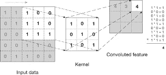

# 卷积神经网络:为什么它们对图像相关学习如此有用？

> 原文：<https://towardsdatascience.com/convolutional-neural-networks-why-are-they-so-good-for-image-related-learning-2b202a25d757?source=collection_archive---------15----------------------->

(权利:自己的形象)

> 快速解释为什么 CNN 现在几乎总是被用于计算机视觉任务。

在其发展几年后，CNN 已经赢得了它的第一个图像识别竞赛(2011 年)，第二年，在 2012 年，四个图像识别竞赛的获胜者正在使用 CNN 作为基础架构！即使是现在，有线电视新闻网仍然是计算机视觉的女王！

让我们从以下内容开始解释:

## 我们在计算机视觉中做什么？

我们在这里处理的是图像，而不是表格数据和编码文本数据中的矢量特征。图像不一定有标签，子标签为区域，因此，特征应该被提取，或智能地减少。为了说明以下内容，让我们举一个简单的例子:假设任务是根据一幅图像来决定某人的年龄，那么我们应该提取正确的特征用于推断。这些特征可以是皱纹、白发等的存在。作为本部分的结尾词:特征提取！

## 如何从图像中提取特征？

假设您想要提取皱纹，我们应该如何在图像中找到皱纹(显然不是手动的)？嗯，皱纹(图 1)或多或少看起来像这样(图 2)

图 1、图 2(权利:[来源](https://www.fortheageless.com/blogs/ageless-buzz/smooth-from-within-essential-skin-supplements))

为了从图像中捕捉这些线，一个直观的解决方案是使用矩阵滤波。参见以下示例(图 3):

图 3(权利:[来源](http://www.davidsbatista.net/blog/2018/03/31/SentenceClassificationConvNets/)

这里，滤波器是一个 3×3 矩阵，其对角线上的值为 1，其他地方为 0。因此，此滤镜将用作十字形区域或全暗区域的遮罩。在逐条目矩阵乘法之后输出高值意味着滤波器形状和所分析的区域匹配。请注意，用于过滤的矩阵不必总是取值为 0 和 1，它也可以有-1，以便进行严格的形状搜索。对皱纹进行同样的处理，我们可以使用以下过滤器(图 4)。

图 4(权利:自己的形象)

我们可以将这些过滤器应用于原始图像，并简单地保持较高的值，以显示形状已被检测到。这样我们就可以知道从原始图像中提取的特征在哪里以及是什么。(注:这一步被称为卷积层步骤，但我们将避免过多窥探，因为将会有另一篇文章详细解释 CNN 的层)

## 过滤器？但是我通常应该使用哪种过滤器呢？

与我们之前所做的不同，对于一般的任务特征提取，过滤器可以具有不同的大小，当达到太大的大小时，枚举它们或猜测这些不同的过滤器变得太困难。另外，大多数时候我们自己忽略了我们应该为分类提取什么特征。你猜怎么着？CNN 不要求我们猜测应该使用什么样的过滤器。实际上，CNN 的训练就是对这些过滤器的训练，这些过滤器是网络的权重。因此，CNN 可以完全揭示人类永远不会注意到的细节，例如确定照片上某人的年龄。这就是 CNN 的优势。(到目前为止，我们只使用了几个在同一步骤中应用的滤波器，但是通常会使用更多不同大小的滤波器，并且具有时间延迟。

非常感谢您的阅读！请继续关注我的下一篇文章，在那里我将正式阐述这里解释的概念。

 [## 一步一步实现:Keras 中的 3D 卷积神经网络

### 了解如何实现您自己的 3D CNN

towardsdatascience.com](/step-by-step-implementation-3d-convolutional-neural-network-in-keras-12efbdd7b130)