# 具有异构元数据的卷积神经网络

> 原文：<https://towardsdatascience.com/convolutional-neural-networks-with-heterogeneous-metadata-2af9241218a9?source=collection_archive---------10----------------------->

更新:

*   2020/02/21:为图形添加像素

在自动驾驶中，卷积神经网络是各种感知任务的首选工具。尽管 CNN 擅长从相机图像(或以视频剪辑形式出现的一系列图像)中提取信息，但我经常会遇到各种不适合卷积神经网络的元数据。

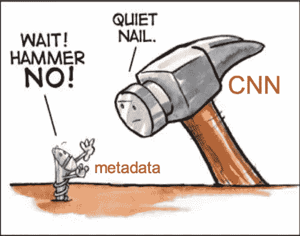

直接在元数据上使用 CNN 可能是个坏主意(改编自[来源](https://cek.io/blog/2016/02/08/javascript-hammer/)

根据传统定义，元数据是指用于描述其他数据的一组数据。在这篇文章中，通过**元数据**，我们的意思是

*   **异构的、非结构化的或无序的数据**伴随摄像机图像数据作为**辅助**信息。在传统定义的意义上，这些数据“描述”了摄像机数据。
*   **元数据的大小通常比摄像机图像数据小得多**，从每幅图像几个数字到最多几百个数字不等。
*   并且与图像数据不同，**元数据** **无法用规则网格表示，每张图像的元数据长度可能不是常数**。

所有这些属性使得 CNN 很难直接消费元数据，因为 CNN 假设数据表示在规则间隔的网格上，并且网格上的相邻数据也具有更紧密的空间或语义关系。

我遇到的元数据类型可以分为以下几组:

*   可能影响传感器观察的传感器参数:摄像机内部/外部
*   不同类型的传感器数据:雷达针或激光雷达点云
*   两组数据之间的对应/关联

> 一个特例是**激光雷达点云数据**。激光雷达点云的一个典型帧通常具有成千上万个点，伴随着一帧或几帧相机图像。激光雷达点云信息丰富，它们本身可以形成与相机感知并行的独立感知管道的基础。因此，很少将它视为相机数据的辅助信息，也不是这里考虑的典型元数据类型。对于点云数据，人们已经开发了特定的神经网络架构，如 PointNet，或[图形神经网络(GNN)](https://github.com/nnzhan/Awesome-Graph-Neural-Networks) 来直接消费点云数据，不在本帖讨论范围之内。

下面我们回顾最近文献中提出的使用卷积神经网络消费元数据的不同方法。

# 相机参数

深度学习在 SLAM 的很多方面都取得了重大进展，其中之一就是单目深度估计。单目深度估计本质上是不适定的，并且由于单目图像中缺乏尺度，在一个数据集上训练的模型通常不能很好地推广到其他数据集。这与一般的对象检测形成了鲜明的对比，在一般的对象检测中，对象检测器的性能不依赖于特定的相机型号(需要知道哪些相机型号拍摄了 COCO 数据集中成千上万的图像将是一场噩梦)。

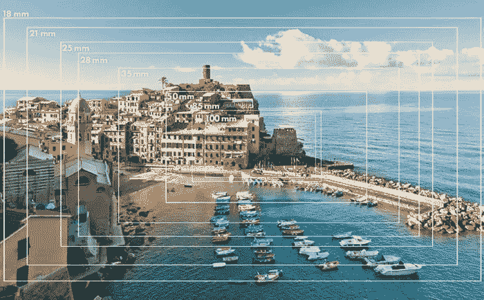

用[不同焦距](https://expertphotography.com/35mm-vs-50mm-prime-lens/)的镜头拍摄同一场景

相机的内在特性，尤其是镜头的焦距决定了单目图像所缺乏的比例因子。一般来说，无法分辨一幅图像是用焦距更长的相机从同一位置拍摄的，还是用同一台相机在更靠近物体的位置拍摄的。

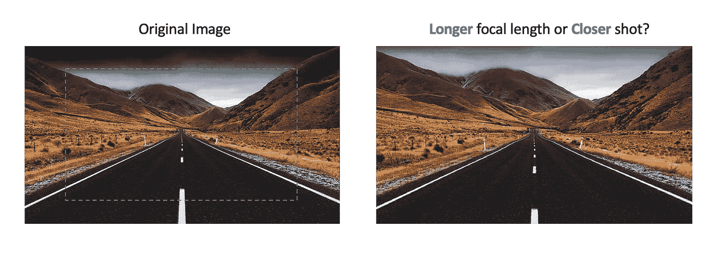

单目图像中的尺度模糊([来源](https://www.pickpik.com/street-road-infinity-straight-endless-perspective-4269)

由于这个原因，深度估计训练和推断通常是在用相同相机(或者至少用相同传感器和镜头规格的相机)收集的一个数据集上进行的。如果您更改相机模型，您必须收集一个全新的数据集，并标注距离以再次训练您的模型。

幸运的是，在自动驾驶和其他工业应用中，内部电路很容易从相机制造商处获得，并且在相机的整个生命周期中相对固定。我们能把这种内在机制运用到单目深度预测网络中吗？

Camera intrinsics 有四个自由度(不包括镜头失真——参见这个简明的 [openCV 文档](https://docs.opencv.org/2.4/modules/calib3d/doc/camera_calibration_and_3d_reconstruction.htm)),其特征在于由像素大小归一化的行和列方向上的焦距 fx 和 fy，以及主点的像素位置 cx 和 cy。我能想到的一个简单的解决方案是将深度解码器的这四个数字融合在一个特征图的顶部，并且可能添加一个**全连接层**来将这四个数字融合到深度中。 [**CAM-Convs** :针对单视图深度的相机感知多尺度卷积](https://arxiv.org/abs/1904.02028) (CVPR 2019)通过将内部函数工作到**伪图像**中，提出了一个更加聪明的解决方案。

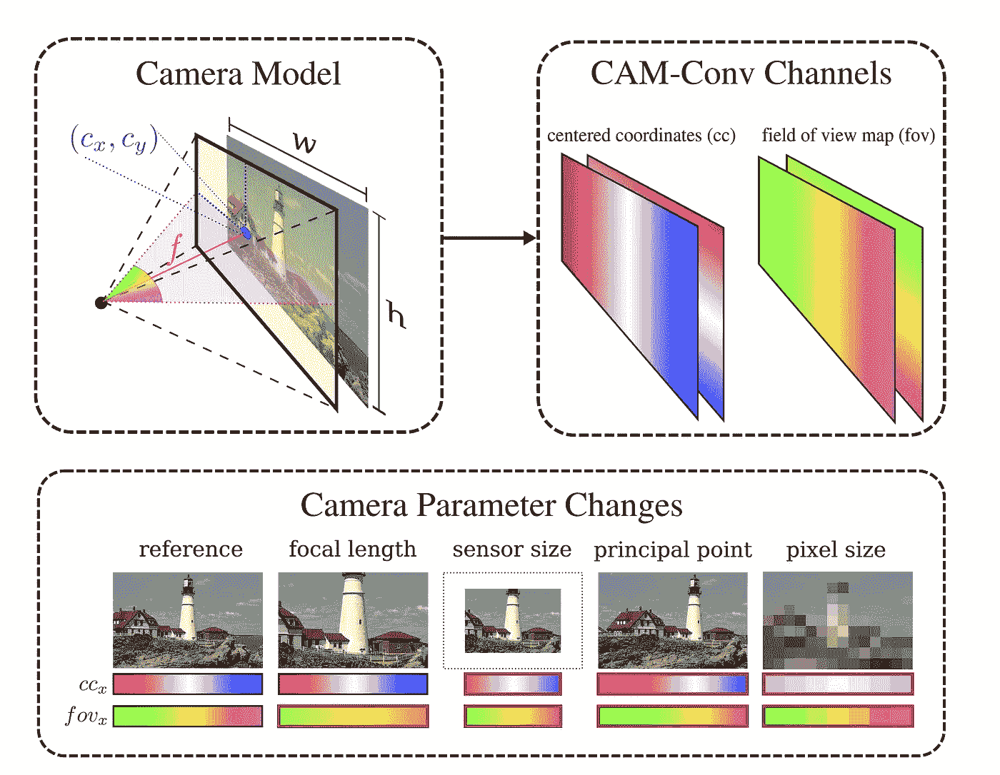

[CAM-Convs](https://arxiv.org/abs/1904.02028) :摄像头感知多尺度卷积

卡姆-Conv 从优步的 [CoordConv](https://arxiv.org/abs/1807.03247) 中获得了很多灵感(卷积神经网络和 CoordConv 解决方案的一个有趣的失败， **NeurIPS 2018** )。CoordConv 将两个[网格通道](https://docs.scipy.org/doc/numpy/reference/generated/numpy.meshgrid.html)连接到原始图像和/或中间特征图，以编码位置信息。在坐标转换的基础上，卡姆-Conv 首先将坐标转换的原点从左上角移动到主点，创建两个**居中坐标** (cc)地图。这两个通道编码主要点信息。然后**视场** (fov)图通过将 cc 通道除以相机焦距 f 并取反正切来计算，这基本上计算每个像素的方位角和仰角。这两个通道编码焦距信息。最后，**归一化坐标** (nc)图也连接到特征图(本质上是一个归一化坐标)。

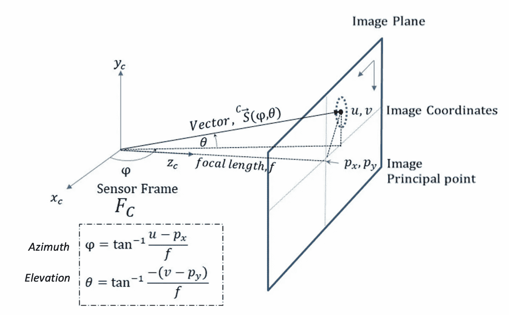

图像中像素的方位角和仰角(改编自 [src](https://pdfs.semanticscholar.org/88fe/8195729910b71a20da1c61809bba2a3cfece.pdf)

> 实际上 **CoordConv** 本身可以看作是将坐标信息编码到卷积神经网络的一种情况。它为卷积神经网络提供了具有**平移方差**的选项，并有助于学习位置敏感数据分布。

## 另一种方法:归一化焦距和归一化像面

在坎-Conv 论文中还有一点值得一提。如上所述，无法判断图像是用较长焦距的相机拍摄的还是近距离拍摄的。从另一个角度来看，由两个不同焦距的相机从同一相机位置成像的同一物体将呈现不同的外观，即使它们具有相同的 3D 距离。

Cam-Conv 的一个替代方案是使用标称焦距。所有地面真实距离根据标称焦距进行缩放，并用于训练模型。然后，在推断过程中，通过考虑相机的实际焦距，将预测距离按比例调整回实际距离。当然，以上讨论是基于同一图像传感器的假设。如果传感器的物理像素尺寸也发生变化，我们可以使用相同的想法，采用**标称像素尺寸，**假设窄视场(图像尺寸< <焦距)。相比之下，凸轮 Conv 是一个更有原则的方式，以适应各种相机型号。

这与[mono loco](https://arxiv.org/pdf/1906.06059.pdf)(**ICCV 2019**)用于行人距离估算的方法密切相关。在找到图像上的关键点之后，在馈入 MLP 之前，图像坐标被投影到单位深度 Z=1 处的归一化图像平面。这有助于防止模型过度适应任何特定的相机。这基本上考虑了焦距和传感器像素大小对表观物体大小的影响。

# 非相机传感器数据

在自动驾驶中，除了相机图像之外的传感器数据通常可用于增加传感器冗余和系统鲁棒性。在当今的 ADAS 传感器套件中，一种无处不在的传感器(除了无处不在的摄像机之外)是雷达。

迄今为止，大多数商用雷达产生的雷达点极其稀少(每帧数量不同，根据不同的雷达型号，每帧最多 32 到 128 个点)。这比激光雷达传感器每次扫描数十万个点要小三到四个数量级。**因此，将雷达数据(或雷达图钉)视为补充和描述相机图像的一种元数据是很自然的。**下面是同一场景下雷达和激光雷达数据典型密度的直观对比，在自动驾驶中颇具代表性。

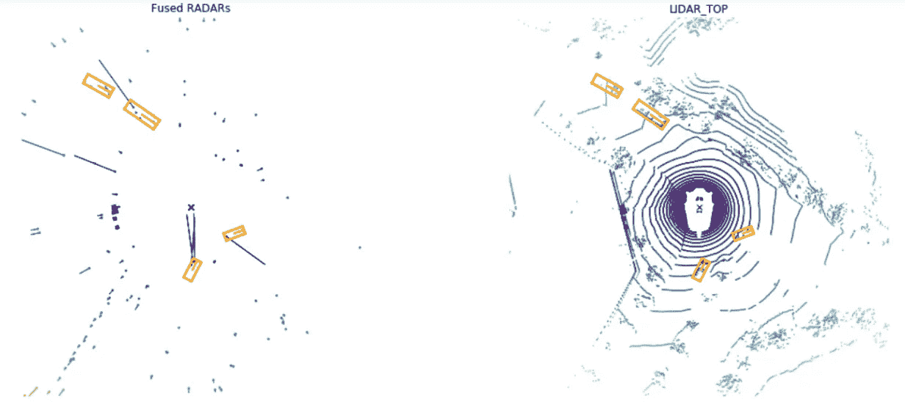

相同场景的雷达和激光雷达点云的比较(来自 [nuScenes 数据集](https://www.nuscenes.org/)

> 注意:有更先进的雷达系统，每帧输出数百或数千个点，但这些所谓的高分辨率“成像雷达”(如 Astyx 的[这一个)的商业可用性有限，成本比传统雷达高得多。](https://www.astyx.com/development/astyx-hires2019-dataset.html)

关于单独对激光雷达数据或融合激光雷达和相机数据进行三维目标检测的文献有很多(如[平截头体点网](https://github.com/patrick-llgc/Learning-Deep-Learning/blob/master/paper_notes/frustum_pointnet.md)、 [AVOD](https://github.com/patrick-llgc/Learning-Deep-Learning/blob/master/paper_notes/avod.md) 、 [MV3D](https://github.com/patrick-llgc/Learning-Deep-Learning/blob/master/paper_notes/mv3d.md) 等)。基于稀疏雷达针和相机的早期融合的文献很少。这部分是因为缺少雷达数据的公共数据集，部分是因为雷达数据的噪声性质和缺少高程信息。因此，我希望 nuScenes 数据集的发布能够为这一关键但研究不足的领域带来更多的关注。

融合雷达和图像数据的主流方法是想办法将雷达数据“加密”成图像。在**远程检测** : [使用雷达和视觉的远程车辆检测](https://arxiv.org/pdf/1901.10951.pdf) (ICRA 2019)中，每帧不同数量的雷达引脚被编码成具有相同相机图像空间大小的双通道图像，一个通道编码距离(距离测量)，另一个编码距离变化率(径向速度)。每个雷达针被标记为一个**圆**而不是一个像素，以增加训练过程中每个点的影响，并反映雷达测量在方位和高度上的噪声性质。使用从雷达到摄像机的**外部**校准和摄像机的**内部**校准将雷达引脚投影到摄像机图像上。融合网络相对简单，我将跳过这里，因为我们的重点是 CNN 的雷达数据表示。

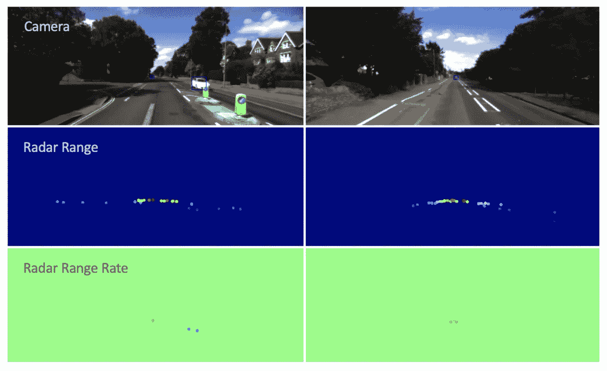

**远距离探测**使用双通道伪图像对雷达信息进行编码

**在 RVNet** : [用于挑战性环境中基于图像的障碍物检测的单目摄像机和雷达的深度传感器融合](https://www.researchgate.net/profile/Vijay_John3/publication/335833918_RVNet_Deep_Sensor_Fusion_of_Monocular_Camera_and_Radar_for_Image-based_Obstacle_Detection_in_Challenging_Environments/links/5d7f164e92851c87c38b09f1/RVNet-Deep-Sensor-Fusion-of-Monocular-Camera-and-Radar-for-Image-based-Obstacle-Detection-in-Challenging-Environments.pdf) (PSIVT 2019)，雷达 pin 也被投影到摄像机图像平面并形成稀疏的雷达图像。这次它有三个通道，深度、横向速度和纵向速度。注意，这里的速度**由自我车辆的速度**补偿，因此不能由单一通道的距离变化率来表示。(作者还提出了一种密集雷达图像编码方法，这种方法对我来说没有意义，因此在此省略。)

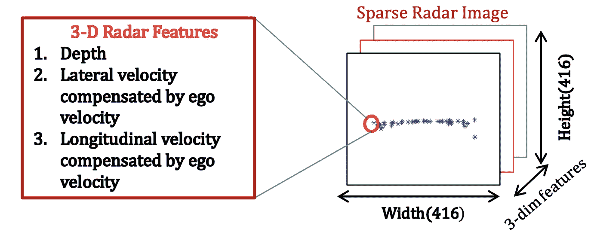

**RVNet** 使用自我运动补偿速度

在上述两种方法中，雷达销被投影到摄像机图像上。投影点或者用作单个像素，或者给定一个恒定的空间范围。一种可能的改进方法是根据距离使用各种大小的磁盘，如 **RRPN** ( [雷达区域提议网络](https://arxiv.org/abs/1905.00526)，ICIP 2019)使用的磁盘。这更好地反映了雷达针的空间不确定性，因为理论上，近距离雷达针的投影比远距离雷达针的投影具有更大的横向空间不确定性。

**CRF-Net** : [一种基于深度学习的雷达和相机传感器融合架构用于物体检测](https://ieeexplore.ieee.org/abstract/document/8916629/) (SDF 2019)将雷达点绘制成一条垂直线。这些线条从地面开始，延伸 3 米，因此不是均匀地垂直绘制的。[从线解析几何](https://arxiv.org/abs/1611.02174) (ICRA，2017 年)也使用类似的技术将单线激光雷达测量结果增密为密集参考深度框架。这个雷达图像实际上与[这个演示](https://vimeo.com/459876432)中显示的非常相似。

用垂直线加密雷达针( [CRF-Net](https://ieeexplore.ieee.org/abstract/document/8916629/) ，2019)

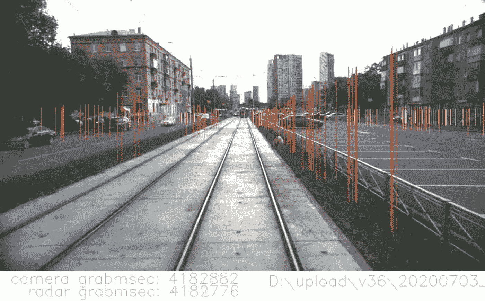

ADAS 的演示:Tram Radar Western

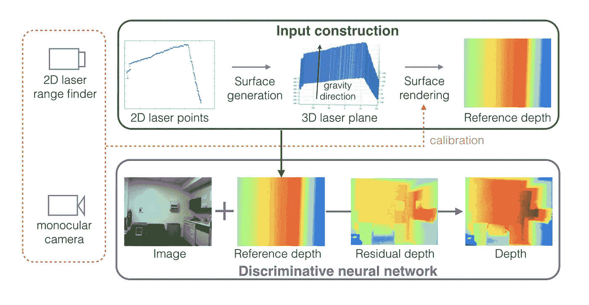

增密单线激光雷达测量([从一条线解析几何](https://arxiv.org/abs/1611.02174)，ICRA 2017 年)

此外，上述 RRPN(雷达区域提议网络)还提出了一种使用雷达生成区域提议的有趣方式。这是基于这样的观察，即 nuScenes 数据集中的几乎每个对象都具有相应的雷达 pin，因此雷达数据可以用作稳健的区域提议方法。为了适应雷达测量的空间不确定性，锚不总是居中。

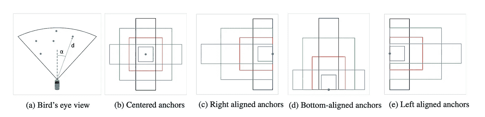

RRPN 使用噪声雷达数据和移动锚进行目标探测

综上所述，以上所有方法(RRPN 除外)都是将雷达 pin 转换成一个伪图像，用 CNN 提取更高层的信息。

## 激光雷达点云

如上所述，由于点云的密集特性，可以在激光雷达数据之上直接执行对象检测。因此，将激光雷达数据视为相机图像的元数据可能不合适。然而，从点云数据具有**变化数量**的**无序**点**而不是均匀分布在规则网格**上的意义上来说，激光雷达数据就像雷达数据一样是非结构化的。

在将激光雷达数据和图像数据输入神经网络之前，人们已经做出了许多努力来执行激光雷达数据和图像数据的早期融合。 **MV3D** : [用于自动驾驶的多视角 3D 物体检测网络](https://arxiv.org/abs/1611.07759) (CVPR 2017)将激光雷达点转换为两种类型的伪图像，鸟瞰视图(BEV)和前视图(FV)。BEV 贴图是 0.1 m 分辨率的离散化网格，有多个高度贴图和一个密度贴图和一个强度贴图。FV 遵循 **VeloFCN** : [使用全卷积网络从 3D 激光雷达检测车辆](https://arxiv.org/abs/1608.07916) (RSS 2016)的约定，注意这不同于将激光雷达的点投影到摄像机图像。然后，三个不同的网络从 BEV 图像、FV 图像和 RGB 图像中提取特征，然后将这些特征连接起来进行融合。

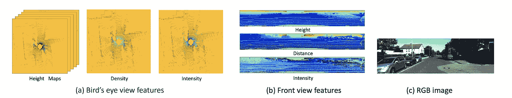

MV3D 中激光雷达点的输入表示

**LaserNet** : [一种用于自动驾驶的高效概率 3D 物体探测器](https://arxiv.org/abs/1903.08701) (Arxiv，2019)提出了一种不同的方法来编码激光雷达点。RV(范围视图)通过将激光器 id 直接映射到行并将方位角离散化为列来生成。这种表示的一个优点是它本身是紧凑的。它有五个通道:范围(距离)、高度、方位角、强度和一个指示单元格是否包含点的标志。

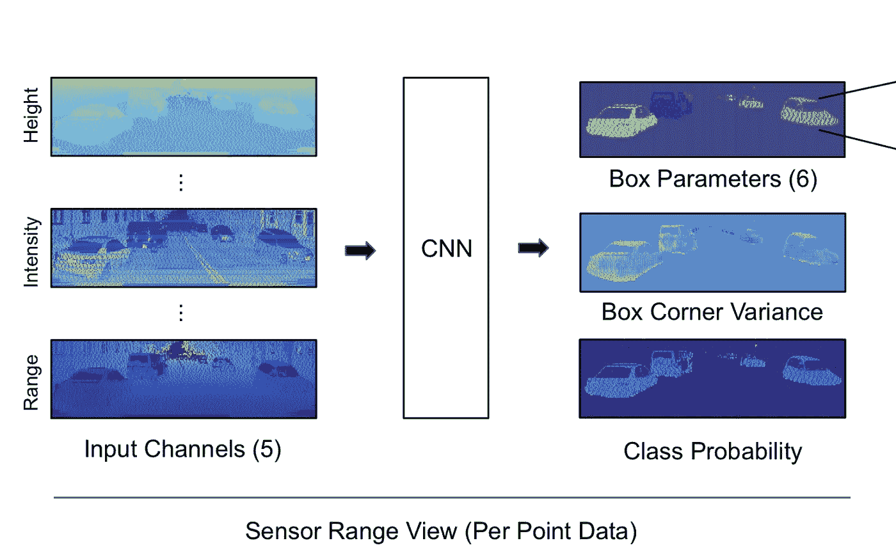

激光雷达点的 LaserNet 表示

总之，尽管密度比雷达针高，激光雷达点也可以打包成伪图像供 CNN 使用。类似于使用全连接图层消费稀疏元数据的替代方法，我们也可以使用[点网](https://github.com/patrick-llgc/Learning-Deep-Learning/blob/master/paper_notes/pointnet.md) (CVPR 2017)直接消费无序的点云数据。

# 通信/关联数据

另一种类型的元数据是关联数据，例如交通灯到车道的关联。**元数据融合:** [交通灯到车道分配的深度元数据融合](https://ieeexplore.ieee.org/stamp/stamp.jsp?arnumber=8613841) (IEEE RA-L 2019)提出了一种数据融合方法，融合来自交通灯、车道箭头和车道标线检测结果的异构元数据。元数据以**元数据特征图(MFM)** 的形式编码，并与来自相机图像的中间特征图融合。mfm 本质上是二元注意力地图。关联基础事实和预测也被编码成表示横向空间位置的一维向量。

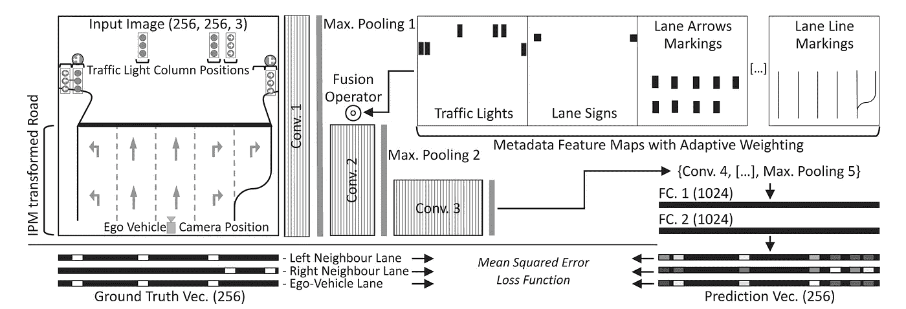

**元数据特征地图(MFM)** 将元数据与相机图像融合

在此工作中，元数据要素地图(MFM)按元素乘以第一个 F=12 层。事实证明，这比直接将 MFM 与影像特征地图连接在一起要好一些。

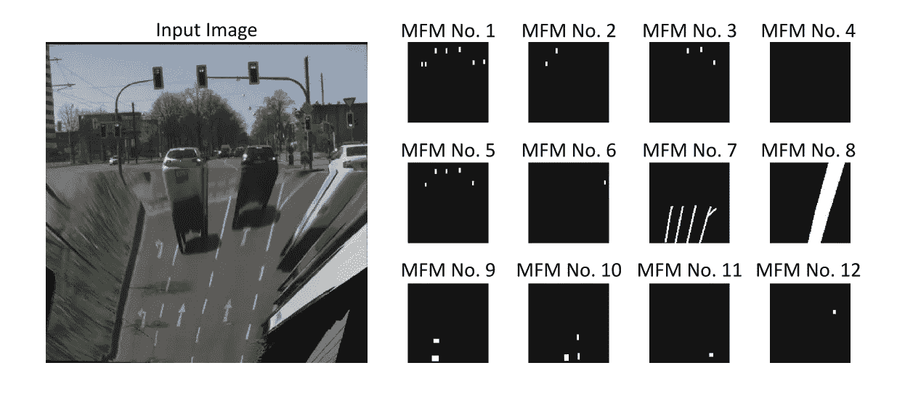

示例**元数据特征地图(MFM)** 带 IPM 摄像机图像

# 先前对象检测结果

有时，将对象检测边界框提供给其他学习管道是有用的。然而，边界框的数量不是恒定的-从这个角度来看，它们也可以被视为元数据。一种方法是将边界框转换为**热图**。在**:[用于视觉对象跟踪的空间监督递归卷积神经网络](https://arxiv.org/abs/1607.05781)中，对象检测结果被转换为热图，以指导学习在空间和时间上一致的特征，用于视频对象检测和跟踪。**

**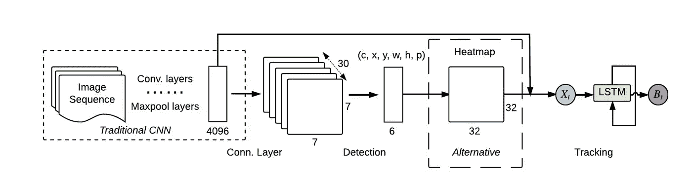**

**[**ROLO**](https://arxiv.org/abs/1607.05781) 将物体检测结果(只有一个物体)转换为热图**

**在通过关联嵌入将 [**像素转换为图形**](https://arxiv.org/abs/1706.07365)(NIPS 2017)中，可通过将对象检测格式化为双通道输入来合并先前检测，其中一个通道由边界框中心的一键激活组成，另一个通道提供框的二进制掩码。可以在这两个通道上显示多个框，第二个表示它们的掩码的联合。如果有太多的边界框，遮罩通道变得太拥挤，那么通过边界框锚点分离遮罩，并将它们放入不同的通道。**

**为了降低计算成本，这些额外的输入不在输入层中集成，而是在几层卷积和汇集之后合并。**

# **外卖食品**

*   **元数据通常是无序的，不在规则的网格上。每个图像的元数据的数量通常不是恒定的，这使得很难使用具有固定输入维度的固定神经网络结构。**
*   **如果每个相机图像的元数据是固定长度的，则可以使用完全连接的结构来将这些元数据与相机特征地图融合。**
*   **如果元数据是无序的，例如雷达或激光雷达点云数据，另一种方法是使用点网结构，它对输入顺序的排列是不变的。**
*   **使用 CNN 消费元数据的最通用方法是将元数据转换成某种形式的具有规则网格间距的**伪图像**。伪图像应该是最好的，或者可以被变换到与图像数据相同的空间域。**

# **参考**

*   ****CoordConv:** [卷积神经网络的一个耐人寻味的失败和 CoordConv 解决方案](https://arxiv.org/abs/1807.03247)，NeurIPS 2018**
*   **[**CAM-Convs** :相机感知的单视角深度多尺度卷积](https://arxiv.org/abs/1904.02028)，CVPR 2019**
*   **[**单轨列车**:单目 3D 行人定位及不确定性估计](https://arxiv.org/abs/1906.06059)，ICCV 2019**
*   ****远距离检测** : [利用雷达和视觉的远距离车辆检测](https://arxiv.org/pdf/1901.10951.pdf)，ICRA 2019**
*   ****RVNet** : [单目摄像机和雷达的深度传感器融合，用于挑战性环境中基于图像的障碍物检测](https://www.researchgate.net/profile/Vijay_John3/publication/335833918_RVNet_Deep_Sensor_Fusion_of_Monocular_Camera_and_Radar_for_Image-based_Obstacle_Detection_in_Challenging_Environments/links/5d7f164e92851c87c38b09f1/RVNet-Deep-Sensor-Fusion-of-Monocular-Camera-and-Radar-for-Image-based-Obstacle-Detection-in-Challenging-Environments.pdf) (PSIVT 2019)**
*   ****CRF-Net** : [一种基于深度学习的雷达和相机传感器融合的目标检测架构](https://ieeexplore.ieee.org/abstract/document/8916629/)，SDF 2019**
*   ****RRPN** : [雷达区域建议网](https://arxiv.org/abs/1905.00526)，ICIP 2019**
*   **[**从线解析几何**:从线解析几何:利用部分激光观测的单目深度估计](https://arxiv.org/abs/1611.02174)，ICRA 2017**
*   ****LaserNet** : [一种用于自动驾驶的高效概率 3D 物体检测器](https://arxiv.org/abs/1903.08701)，Arxiv 2019**
*   ****VeloFCN** : [使用全卷积网络从 3D 激光雷达检测车辆](https://arxiv.org/abs/1608.07916)，RSS 2016**
*   ****MV3D** : [用于自动驾驶的多视角三维物体检测网络](https://arxiv.org/abs/1611.07759)，CVPR 2017**
*   ****元数据融合:** [交通灯到车道分配的深度元数据融合](https://ieeexplore.ieee.org/stamp/stamp.jsp?arnumber=8613841)，IEEE RA-L 2019**
*   ****ROLO** : [用于视觉目标跟踪的空间监督递归卷积神经网络](https://arxiv.org/abs/1607.05781)，ISCAS 2016**
*   **[**像素到图形**通过关联嵌入](https://arxiv.org/abs/1706.07365)，NIPS 2017**