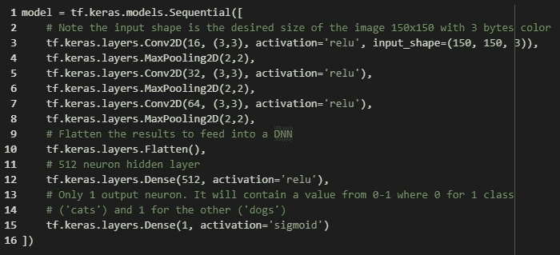
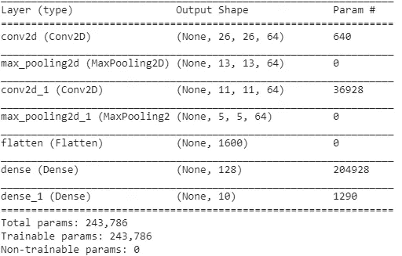

# 张量流卷积神经网络

> 原文：<https://towardsdatascience.com/convolutional-neural-networks-with-tensorflow-2d0d41382d32?source=collection_archive---------21----------------------->


丹尼尔·库切列夫在 [Unsplash](https://unsplash.com?utm_source=medium&utm_medium=referral) 上拍摄的照片

嘿大家好！在这篇文章中，我试图总结 Deeplearning.ai 在 TensorFlow 中关于[卷积神经网络的课程](https://www.coursera.org/learn/convolutional-neural-networks-tensorflow)

C 可选神经网络(ConvNets)是一种特殊类型的神经网络，用于分析和处理图像。它的名字来源于它用作过滤器的'**卷积层**。这将过滤提供给它的特定特征的图像，然后被激活。因此，通过使图像通过这些过滤器来检测特定特征、其在图像中的位置以及其与类别相关的强度，从而生成特征图。

这种神经网络的创新之处在于它能够学习自动开发这些过滤器，从输入图像中捕获一组特定的特征，并根据捕获的特征对图像进行分类。

这些网络在图像分类、推荐系统、图像和视频识别等方面有着广泛的应用。

ConvNets 通常是具有非线性激活函数的卷积的交替层和最大池层的组合，之后是完全连接的密集层。

为了给这些网络的架构一个概念，这里有一张图片。


让我们通过钻研课程来理解这一点！

我们将从分类猫和狗图像的基本模型开始。

我们将数据集放在一个名为*‘cats _ and _ dogs _ filtered . zip’*的压缩文件夹中。为了提取它，我们必须实现下面的代码。


这将提取基础目录'*/tmp/cats _ and _ dogs _ filtered*'中的内容，该目录包含训练和验证子目录，这些子目录又包含 cats 和 dogs 子目录。

你会注意到，我们并没有明确地将这些图像标记为猫和狗。我们将在本文的后面讨论**图像生成器**。 **ImageGenerator** 可以直接从子目录中读取图像，并根据子目录的名称为您标注。

例如，您有一个“火车”目录，其中还包含“猫”和“狗”目录。图像生成器会对这些子目录中的图像进行适当的标记。

我们定义了每个目录。


我们可以使用下面的代码查看这些目录中的猫和狗的文件名。


我们得到这样的输出…


根据我们的数据集，我们总共有:


我们可以通过实现下面的代码来查看我们的图像

首先，我们配置 matplotlib 参数。


我们加载一批 8 只猫和狗的图片。


# **建立模型**

数据集中的图像有多种形状和大小。对于要在这些图像上训练的神经网络，我们需要它们具有特定的形状。

对于灰度图像，我们有一个 1 字节的色深，即 8 位。对于我们数据集中的图像集，颜色深度为 3 字节，即 24 位，因为它们是 RGB 格式。

我们最初在模型中添加一些卷积层，然后在发送到密集连接的层之前将其展平。

由于这是一个二元分类模型，我们可以在最后一层添加一个**‘Sigmoid’**函数。



我们现在将配置参数来训练和编译我们的模型。我们将使用**二元交叉熵**损失，因为这是一个二元分类问题，并且我们在最后一层中有一个范围为 0 到 1 的 **sigmoid** 激活函数。

我们将使用 **RMSprop 优化算法**而不是**随机梯度下降(SGD)** ，因为 RMSprop 为我们自动调整了学习速率。


# **为什么要实现 Conv2D 和 MaxPooling2D？**

实现卷积层的想法是减少图像，以便只考虑突出的特征和决定输出的特征。换句话说，卷积压缩图像。

*****池层*** 有效压缩图像，使其更易于管理，并选择突出的特征。**


上面一行代码将训练图像重塑为一个 ***28x28 像素的图像*** ， ***60000 代表图像数量*** ， ***1 代表通道数量*** 。由于上述图像是灰度图像，因此只有 1 个通道与之相关联。


再次像前面的代码片段一样，***【Conv2D】***图层的 ***input_shape*** 是 ***28x28 像素*** 和 *1 通道* 与每个图像相关联，作为其灰度图像。 ***64*** 卷积存在，并且每个卷积是形状 ***3x3*** 的矩阵。

***MaxPooling2D*** 层有一个形状为 ***2x2*** 的池矩阵。

***【Conv2D】***将 ***第一个参数*** 作为 ***第 64 个*** 来表示 ***滤镜*** 的数量。网络中的初始过滤器负责检测边缘和斑点。在初始层中使用**太多的滤波器**是不需要的**，因为从原始输入层提取的信息只有这么多，并且**大多数滤波器将是冗余的**。**

**初始层使用 16 或 32。**

模型的总结给了我们这样一个输出。



上面的代码片段为我们提供了整个模型的概要。

第一个 ***Conv2D*** 层的输出形状为 ***26x26。*** 这不是一个小故障，让我们了解一下原因:-


图— 1


图-2，*让我们把水平方向上的九个像素分别命名为 pix1，pix2，pix3…*

***Conv2D*** 图层的 ***滤镜大小为 3x3*** 。这意味着它需要选择具有 a(上面或下面的像素)和(左边或右边的像素)的像素。图-2 展示了满足图-1 左上角标准的第一个可能的竞争者的像素。

我们可以看到，在 pix1、pix2、pix3 之上不存在任何像素。类似地，在像素 1、像素 4、像素 7 的左边不存在任何像素。因此，我们需要选择 pix5 作为第一个像素。类似地，在左下角，我们必须相应地选择一个像素。因此我们省略了顶部的一个像素行和底部的一个像素行；左侧一个像素列和右侧一个像素列。


**行方向的 2 个像素和列方向的 2 个像素被省略。因此，28x28 的图片已经减少到 26x26。**

***MaxPooling2D*** 有一个 ***滤镜大小为 2x2*** 。它将**滑过 26x26 的图片**并**选择具有最大值的像素**。这有效地**将图像大小减半** *。*因此 **26x26 的 pic 变成了 13x13** 的 pic 大小。

同样的过程继续，直到我们到达层 ***max_pooling2d_1。*** 这里我们有一个尺寸为 5×5 的 ***卷积窗和一个 ***64 卷积*** 。现在，在后续层中，卷积变平。因此，我们有一个展平层的输出形状为 1600**(5x5x 64 = 25x 64 = 1600)**。这 1600 个要素现在以矢量的形式存在，随后可以输入到后续图层的密集网络中。***

# **了解图像生成器**

我们将从马与人分类器的代码片段开始。


这里我们有一个' ***重缩放'*** 参数。由参数**指定的**值是图像的每个像素值乘以的因子**。例如- ***一个像素的值为 223*** 。223 乘以 1/255， ***原来的 223 被结果 0.87 代替(223x 1/255 = 0.87)*** *。***

**数据生成器**然后可以与 Keras 模型一起使用**以**接受数据生成器作为输入** : ***拟合 _ 生成器*** ， ***评估 _ 生成器*** ， ***预测 _ 生成器*** 。**


使用验证集时，还必须指定验证集的目录。


参考上面的代码，我们可以分析模型的训练和验证趋势。

让我们对现有的“猫和狗”数据集尝试遵循相同的过程。


我们通过使用训练集中的**‘fit _ generator’**方法来训练我们的模型。


下面的代码允许用户在 google colab 中上传文件，然后通过模型运行它，试图预测图像是猫还是狗。


# **查看各层的输出**

让我们试着理解我们的卷积神经网络是如何试图预测图像的类别的。要做到这一点，我们需要了解我们的 ConvNet 在图片中关注的是什么特征。

我们可以通过确定哪个特征在通过卷积层时变得突出来分析这一点。

```
import numpy as npimport randomfrom   tensorflow.keras.preprocessing.image import img_to_array, load_img# Let's define a new Model that will take an image as input, and will output# intermediate representations for all layers in the previous model after# the first.successive_outputs = [layer.output for layer in model.layers[1:]]#visualization_model = Model(img_input, successive_outputs)visualization_model = tf.keras.models.Model(inputs = model.input, outputs = successive_outputs)# Let's prepare a random input image of a cat or dog from the training set.cat_img_files = [os.path.join(train_cats_dir, f) for f in train_cat_fnames]dog_img_files = [os.path.join(train_dogs_dir, f) for f in train_dog_fnames]img_path = random.choice(cat_img_files + dog_img_files)img = load_img(img_path, target_size=(150, 150))  # this is a PIL imagex   = img_to_array(img)                           # Numpy array with shape (150, 150, 3)x   = x.reshape((1,) + x.shape)                   # Numpy array with shape (1, 150, 150, 3)# Rescale by 1/255x /= 255.0# Let's run our image through our network, thus obtaining all# intermediate representations for this image.successive_feature_maps = visualization_model.predict(x)# These are the names of the layers, so can have them as part of our plotlayer_names = [layer.name for layer in model.layers]# -----------------------------------------------------------------------# Now let's display our representations# -----------------------------------------------------------------------for layer_name, feature_map in zip(layer_names, successive_feature_maps):if len(feature_map.shape) == 4:#-------------------------------------------# Just do this for the conv / maxpool layers, not the fully-connected layers#-------------------------------------------n_features = feature_map.shape[-1]  # number of features in the feature mapsize       = feature_map.shape[ 1]  # feature map shape (1, size, size, n_features)# We will tile our images in this matrixdisplay_grid = np.zeros((size, size * n_features))#-------------------------------------------------# Postprocess the feature to be visually palatable#-------------------------------------------------for i in range(n_features):x  = feature_map[0, :, :, i]x -= x.mean()x /= x.std ()x *=  64x += 128x  = np.clip(x, 0, 255).astype('uint8')display_grid[:, i * size : (i + 1) * size] = x # Tile each filter into a horizontal grid#-----------------# Display the grid#-----------------scale = 20\. / n_featuresplt.figure( figsize=(scale * n_features, scale) )plt.title ( layer_name )plt.grid  ( False )plt.imshow( display_grid, aspect='auto', cmap='viridis' )
```


正如我们所看到的，我们从一组可以清楚地看到猫的像素转移到同一幅图像越来越紧凑和抽象的表现。当我们向下游走的时候，我们观察到网络开始突出网络所关注的内容。可以观察到图像中较少的特征被突出显示。图像中的大多数特征被设置为“零”。这被称为'**稀疏性**，这是深度学习的一个关键特征。

随着我们向下游发展，该表示携带的关于图像原始像素的信息越来越少，但是关于图像类别的信息越来越精确。它类似于一个蒸馏系统，在这种情况下可以称为“信息蒸馏系统”。

# **可视化精度趋势**


蓝色线表示模型在训练数据上的表现，橙色线表示模型在验证数据上的表现。我们观察到，我们的训练准确率达到了大约 100%，而我们的验证准确率停留在 70%左右。同样，我们的培训损失稳步下降，而我们的验证损失继续稳步上升。

这是**过度拟合**的经典例子。当一个模型暴露于少量的例子时，过度拟合就会发生，在这个例子中只有 2000 个例子。当在小的训练数据集上训练时，模型倾向于学习不相关的特征，这些特征不概括数据。例如，当给人类一小组伐木工人和水手的照片并且假设照片中只有伐木工人戴帽子时，人类可能错误地将帽子与伐木工人联系起来，即人类现在可能开始认为所有伐木工人都戴帽子，而不是水手。

为了克服这个问题，我们可以简单地增加图像，即我们简单地调整图像来改变它一点。

# **图像增强**


现在，除了 ImageDataGenerator 的 **rescale** 特性，我们还实现了图像放大。

图像增强有助于处理过度拟合。如果图像被增强，它可以创建新的图像集来训练模型，而无需显式地获得新的图像。它试图修改现有的图像，从而在其中创建更多的功能。因此，在绘制和比较训练和测试的准确性时，损失较小。

然而，在不利方面，如果测试图像集缺乏多样性，并且与训练集更相似，我们可能会遇到图像增强不能反映我们克服过拟合问题的情况。因此，我们还必须在测试集中有各种各样的图像。

可供我们选择的方案有:

**rotation_range** —我们可以旋转图片的度数。在 0 度到 180 度之间变化。

**width_shift 和 height_shift** —总宽度或高度的一部分，在此范围内随机垂直或水平平移图片。

**shear_range** —随机应用剪切变换。

**zoom_range** —随机放大图片。

**horizontal_flip** —随机水平翻转一半图像。与现实世界的图片相关。一幅风景，从一边看或水平翻转后，似乎仍然是一幅自然的画。

**fill_mode** —用于填充新创建像素的策略，可在旋转或宽度高度移动后出现。

# **迁移学习**

迁移学习是机器学习中的一种技术，它专注于存储从解决一种类型的问题中学到的知识，并实现对一些其他相关类型的问题的解决方案。

我们可以在 Keras 中使用**层** API 来实现这一点，这些 API 可以帮助我们查看预训练模型的层。这有助于我们确定我们希望使用哪些层，以及我们希望重新培训哪些层。

使用预训练模型的快照。稍后可以将参数加载到预训练神经网络的这个骨架模型中，以转变成训练模型。

Keras 已经内置了初始模型的模型定义。我们可以实例化模型并指定数据的输入形状。 **InceptionV3** 顶部有一个全连接层。通过指定 **include_top = False** ，我们告诉模型忽略完全连接的层，直接进入卷积。通过将**权重**参数分配给**无**，我们指定我们不需要模型的内置权重。我们可以稍后通过 **load_weights** 方法分配我们想要的权重，并将下载的权重加载到模型中。


我们现在已经准备好了我们的预训练模型。我们可以遍历模型层并锁定它们，换句话说，我们指定这些层是否是可训练的。


模型中的所有层都有名称，因此我们可以查看特定的层。我们可以从预先训练好的模型中抽取任何一层，并获取它的输出。


我们现在将获取该输出，并将其与密集层连接，因为我们在实例化模型时忽略了完全连接的层。然后，我们将通过创建一个模型并向其传递输入和层定义来整合所有层。**然后，通过指定优化器、损失函数和我们需要的指标来编译模型**。


一旦完成，我们将遵循和以前一样的程序。

我们将创建一个图像数据生成器并增强我们的图像。


然后，我们可以指定包含训练图像的目录，并让它流经生成器，以便对来自训练目录的图像应用所有的增强。


然后像以前一样，通过将模型传递给 **fit_generator** 方法来训练模型。这里，模型被训练 100 个时期。


上图是准确度与训练和验证集的对比图。该模型开始很好，但随后开始偏离训练。因此，我们最终处于一种不同的过度拟合状态。

为了理解这一点，让我们假设下图是我们的神经网络。这种错误背后的想法是，当我们的模型试图预测导致过度拟合的数据时，神经网络中的**层有时可能最终具有相似的权重，并可能相互影响**。我们经常在大型复杂网络中看到这种错误。


通过实施**【辍学】**，我们有效地使我们的模型看起来像这样。


结果是邻居不会太多地相互影响，因此我们可以潜在地克服过度拟合。

我们可以通过添加 **Dropout** 层在代码中实现这一点。该参数可以是 0 到 1 之间的任何值。这里我们给定参数为 0.2，这意味着我们将丢失 20%的神经元。


**当我们开始观察验证准确性偏离我们的训练准确性时，这个问题就成了实施退出的一个很好的候选对象**。

这是实现辍学后的图表。


# **多类分类**

到目前为止，我们已经解决了二元分类问题，我们试图将图像分为两类。我们现在将开始“多类分类”,我们试图将图像分为两个以上的类别。


在这里，我们试图将图像分为 3 类，即石头，纸和剪刀。以上是我们需要维护的文件结构，以便实现我们所学的二进制分类，就像我们维护猫狗分类问题的文件结构一样。


与前面的问题类似，我们将创建一个图像数据生成器，而不是将类模式设置为'**二进制**'，我们将把它设置为'**交叉熵**'。


接下来，我们将更改模型定义。


对于二进制分类问题，我们将在最后一层使用具有' **Sigmoid** '激活函数的单个神经元，因为这将是 0 或 1，取决于模型的预测。


这里，我们的输出层中有 3 个神经元，激活函数为' **Softmax** ' 。

在有 3 个神经元的 **Softmax** 函数的情况下，当给出类似下图的输入时，其中一个神经元将会点亮。请注意，所有值的总和等于 1。我们可以称这些值为每一类的概率。该图像很可能属于具有最高概率的类别，因此该神经元将被点亮。


我们还将实施一项更改。对于二进制分类问题，我们有了'**二进制 _ 交叉熵** ' 损失函数。


对于多类分类问题，我们将使用'**分类交叉熵**'


由于在之前的“猫和狗”分类问题中，我们只有两个类别来对数据进行分类，因此我们使用了“**二元 _ 交叉熵**”损失函数。这次我们将数据分为三类，因此使用了'**categorial _ cross entropy**'**函数。一般来说，所有多类分类问题，即具有两个以上类的问题，将使用该损失函数。**

**至此，我们结束了本课程的记录。在这篇文章中，我们学习了如何为图像分类构建卷积神经网络，实现数据扩充和迁移学习，以及如何实现多类分类器。然而，我们仅仅触及了**计算机视觉**所提供的大量应用的表面。这些计算机视觉应用中有几个结合了复杂的架构和策略，这些架构和策略源自我们在本课程中看到的卷积神经网络的基本结构。这个领域的可能性是无穷无尽的，探索这些可能性的追求推动了深度学习社区和研究更深入地研究这个主题。**

**我希望这能激励你参加这个课程，并开始自己实验、探索和实现这些错综复杂的卷积神经网络。**

**感谢你阅读这篇博客。我希望听到你对此的想法。**