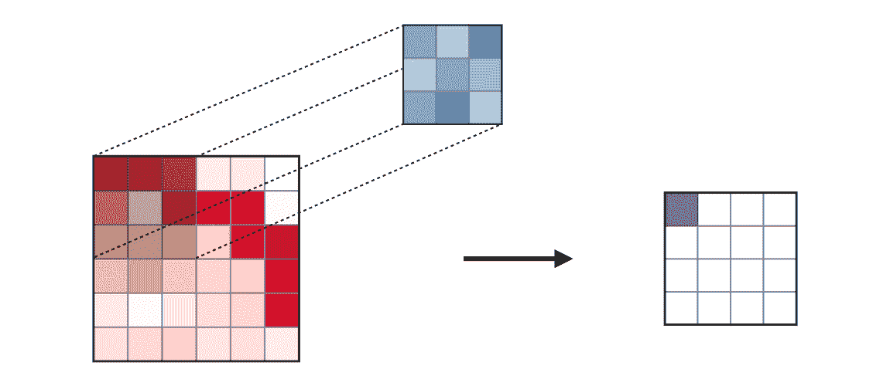
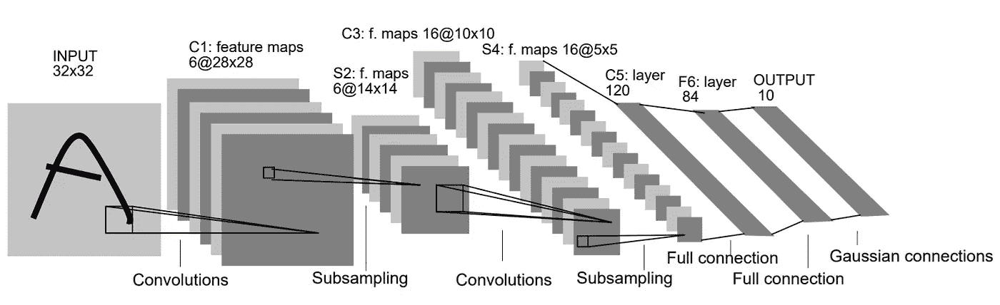
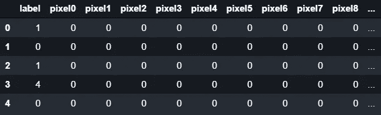
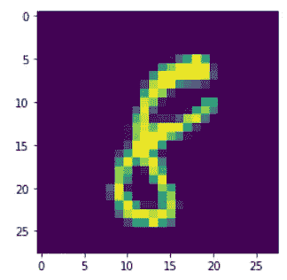
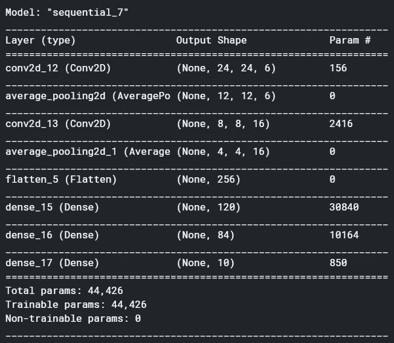
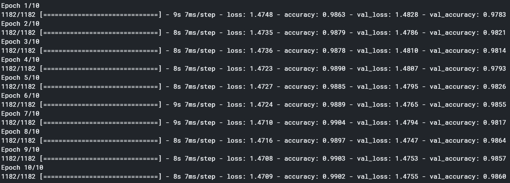
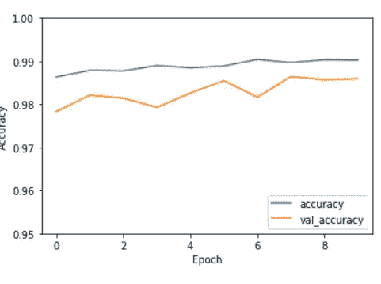

# 张量流卷积神经网络

> 原文：<https://towardsdatascience.com/convolutional-neural-networks-with-tensorflow-8c980d206330?source=collection_archive---------66----------------------->


尼克·希利尔在 [Unsplash](https://unsplash.com/s/photos/numbers?utm_source=unsplash&utm_medium=referral&utm_content=creditCopyText) 上的照片

## 实现 LeNet 5 架构来对 MNIST 数据集上的数字进行分类。

这个世界充满了非结构化数据，而不是结构化数据。它包括图像、文本、图表等等。这些数据很难分析，直到深度学习再次开始存在。深度学习是机器学习的一个分支，它受到大脑工作机制的启发，特别是对神经元的影响。人工神经元结合在一起形成一种叫做神经网络的东西。

深度学习取得了有影响力的进展，尤其是在图像数据上。图像数据非常复杂，因为它没有表格格式，而且有大量的参数，尤其是像素。假设当你使用 SVM 和逻辑回归等机器学习模型时，你想预测哪个图像代表猫，哪个图像代表狗，你必须自己确定猫和狗的区别。

区分猫和狗的特征是什么？嗯，你可以通过它的鼻子、眼睛、耳朵等等来说。要捕捉这些特征，您可以使用卷积运算来捕捉这些特征。但是如果要提取特征，就存在一些问题。而是这些图像彼此之间的形式不同。因此，我们应该有一种方法，可以自己学习从图像中提取特征的参数。

我们必须处理两个任务，提取特征和预测图像。我们可以使用卷积神经网络(CNN)来解决我们的问题。

与传统的机器学习相比，它的特别之处在于它可以捕捉数据的非线性。像支持向量机(SVM)和逻辑回归这样的算法仅从数据中估计线性函数来将它们分类。另一方面，由于激活函数，神经网络可以估计一个非线性函数，该函数将数据划分到它们的类别中。

神经网络如此强大的另一个原因是，该模型可以自己设计特征，并且由于反向传播的能力，它可以学习捕捉特征并正确预测数据。因此，神经网络是从非结构化数据中发现知识的完美模型。

本文将通过 Yann LeCun 的 LeNet 5 架构(第一个 CNN 架构)向您展示如何使用卷积神经网络解决图像分类问题。然后，我们将使用 Python 中的 TensorFlow 库实现它。本文的目标将是这样的，

*   **了解卷积神经网络的构建模块，**
*   **了解 CNN 架构，尤其是 LeNet 5 架构，最后**
*   **可以用 Python 中的 TensorFlow 实现架构**

# **基本面**

在我们开始实施之前，为了确保您不会感到困惑，我将向您展示卷积神经网络的基础知识。它由卷积层、子采样(池化)层和全连接层组成。

## **卷积层**



摘自[斯坦福 CS230 课程备忘单](https://stanford.edu/~shervine/teaching/cs-230/cheatsheet-convolutional-neural-networks)

卷积层是使用卷积过滤器捕捉图像特征的层。如前所述，卷积是一种用给定的过滤器计算像素的操作，通过逐元素相乘，然后将它们作为一个数字相加。

过滤器将减少数据的维度，但维度的数量会随着时间的推移而增加。如果我们想保持图像的尺寸，我们可以设置填充。填充在图像的边界添加缺失的像素。因此，它将具有与前一个相同的维度。

或者在做卷积的时候想避免像素重叠，可以用 stride。步幅是一种操作，其中卷积过程将随着其给定的数字而跳跃。利用这一点，它可以按照给定的数目跳几级。

该图层将学习适合数据的参数，因此可以准确预测图像。此外，因为它希望捕捉图像的非线性，该层包含一个名为整流线性单元(ReLU)的激活，它将负值设置为 0，否则将是值本身。因此，通过使用这一层，我们不必手动提取特征。

## **汇集层**


来自 [GeeksForGeeks](https://www.geeksforgeeks.org/cnn-introduction-to-pooling-layer/)

池层基本上是一个降低数据维度的层。该层的机制类似于卷积层，只是它不应用任何滤镜。池层的例子是最大池层。它将取图像对应的每个区域的最大值，正如我们可以看到上面的图像。通过获取图像每个区域的最大值，图层可用于汇总图像。

## **全连接层**

在卷积和池层之后，现在图像进入完全连接的层。该图层将处理预测结果。它类似于人工神经网络(ANN)图层，因为它包含节点，对于预测已缩减像素采样的图像非常有用，并且其特征已经被检索。该机制也类似于人工神经网络，但它增加了卷积层，以自动进行特征提取。

# **LeNet 5 架构**

在我们知道 CNN 的构建模块之后，我们如何实现它呢？我们可以参考现有的对它的研究，可以用它的架构作为我们的参考来构建自己的 CNN 模型。对于本文，我们将使用现有的第一个 CNN 架构。它来自 Yann LeCun 和他的团队在 1998 年发表的一篇名为“基于梯度的学习应用于文档识别”的论文。他们提出了一个名为 LeNet 5 的架构。它看起来像这样，



摘自 Yann LeCun 关于 LeNet 5 的论文

一般来说，架构由几层组成。流程看起来像这样，

> Conv = >池=> Conv = >池= >全连接层= >输出

它将执行两个常规步骤。它们是特征提取(Conv = >池序列)和用于预测值的全连接层。如果我们观察细节，每一层至少重复两次。这就是为什么它被称为深度学习，因为它比现有的机器学习模型更深入地学习数据。

在我们了解架构之后，我们可以直接进入实现。为了实现这一点，我们将使用 TensorFlow 及其 Keras API 来实现。我们将使用来自 Keras 的高级 API，因此您可以更容易地实现模型，而不是使用低级 API。

# 行动（或活动、袭击）计划

在我们实现这一点之前，我将向您概述一下我们将如何使用 TensorFlow 实现这一架构，

1.  准备数据
2.  构建模型并设置优化器
3.  拟合模型并用数据验证集进行验证

# 实施

## 准备数据

在我们实现模型之前，我们必须准备数据。首先，我们将导入数据。它的来源是 Kaggle 上的数字识别竞赛。它由 60000 行组成。然后，它分成 42000 个观察值用于训练数据，其余的用于模型的测试数据。在我们导入数据后，数据最初看起来是这样的，



数据集仍为表格格式。列表示标签和对应于图像的像素。因此，我们必须重塑数据集。但在此之前，请确保首先对图像进行归一化，然后对数据集进行整形。最后，我们将训练数据分成两部分，模型的训练和验证数据集。

这样做的代码看起来像这样，

```
**# Import The Libraries**
import numpy as np
import pandas as pd
import matplotlib.pyplot as plt
import tensorflow as tf
from tensorflow.keras import layers, models
from sklearn.model_selection import train_test_split**# Import The Dataset**
train = pd.read_csv('../input/digit-recognizer/train.csv')
test = pd.read_csv('../input/digit-recognizer/test.csv')**# Prepare the training set**
train_image = train.drop('label', axis=1)
train_label = train['label']**# Normalize the data**
train_image = train_image / 255.0
test_image = test / 255.0**# Reshaping the image**
train_image = train_image.values.reshape(-1, 28, 28, 1)
test_image = test_image.values.reshape(-1, 28, 28, 1)**# Split into training and validation dataset**
X_train, X_val, y_train, y_val = train_test_split(train_image, train_label, test_size=0.1, random_state=42)
```

对于数据的预览，它看起来像这样，



图像的预览

## 建立模型

准备好数据后，我们就可以建立模型了。我们将基于架构构建模型，并使用我们的数据集进行调整，因为数据与原始纸张的维度不同，即 28 x 28 x 1。正如我们之前所说的，模型的流程看起来像这样，

> Conv = >池=> Conv = >池= >完全连接

这是构建它的代码，

```
model = models.Sequential()
**# Feature Extraction Section (The Convolution and The Pooling Layer)**
model.add(layers.Conv2D(filters=6, kernel_size=(5, 5), activation='relu', input_shape=(28, 28, 1)))
model.add(layers.AveragePooling2D())
model.add(layers.Conv2D(filters=16, kernel_size=(5, 5), activation='relu'))
model.add(layers.AveragePooling2D())
**# Reshape the image into one-dimensional vector**
model.add(layers.Flatten())
**# Classification Section (The Fully Connected Layer)**
model.add(layers.Dense(120, activation='relu'))
model.add(layers.Dense(84, activation='relu'))
model.add(layers.Dense(10, activation='softmax'))
**# Show summary of the model**
model.summary()
```

在我们建立模型之后，摘要将会是这样的，



模型的总结

正如我们所看到的，我们可以看到图像的尺寸减少了，但过滤器的数量增加了。在我们提取特征后，我们将图像整形为一维向量来预测它。此外，我们可以看到，除了池层之外，每一层都有一定数量的参数。在这种情况下，模型要学习 44426 层。该模型将学习这些参数，以实现预测图像的更高精度。

为了适应和优化这个模型，代码应该是这样的，

```
**# Compile The Model**
model.compile(optimizer='adam',loss=tf.keras.losses.SparseCategoricalCrossentropy(from_logits=True),metrics=['accuracy'])**# Fit And Evaluate The Model Using Validation Dataset**
history = model.fit(X_train, y_train, epochs=10, validation_data=(X_val, y_val))**# Evaluate The Model Using Plot** plt.plot(history.history['accuracy'], label='accuracy')
plt.plot(history.history['val_accuracy'], label = 'val_accuracy')
plt.xlabel('Epoch')
plt.ylabel('Accuracy')
plt.ylim([0.95, 1])
plt.legend(loc='lower right')
```

之后，模型拟合数据，并根据历元数重复几次。为了评价，模型达到这样的精度，



拟合过程



带精度结果的历元线图

正如我们可以看到的，我们得出的结论是，5 的历元数比任何历元数都要稍好一些。因此，我们可以只使用 5 个时期来建立模型，并且我们可以使用它来预测值。

# 最终想法

我们已经使用 LeNet 5 架构在 MNIST 数据集上建立了模型。我们模型的精确度已经很高了，但我们还可以进一步改进模型。为了改进模型，我们可以增加数据，微调模型，添加更多的过滤器和模型的深度，等等。

存在许多 CNN 架构，例如 VGG-16、ResNet、AlexNet 等等。我必须告诉你这只是开始。关于计算机视觉，我们可以学到很多东西。我希望这篇文章将是你开始计算机视觉之旅的一个很好的开端，我也希望你可以使用 CNN 或其他方式开发一个很好的应用程序。

## 参考

[1]马丁·阿巴迪等人。艾尔。 *TensorFlow:异构系统上的大规模机器学习* (2015)。tensorflow.org 提供的软件。
[2]扬·勒存等。艾尔。*基于梯度的学习应用于文档识别。*IEEE 会报，第 86 卷，第 11 期，第 2278-2324 页，1998 年 11 月，doi: 10.1109/5.726791。
[3] Yann LeCun 等。艾尔。*深度学习* (2015)。《自然》, 521(7553)，第 436-444 页。

## 感谢您阅读我的文章，您也可以在下面查看我以前的文章:

[](/time-series-forecasting-with-arima-model-in-r-77f4e2ae7abb) [## R 中 ARIMA 模型的时间序列预测

### 从勘探到预测 1970 年至 2015 年的二氧化碳排放数据。

towardsdatascience.com](/time-series-forecasting-with-arima-model-in-r-77f4e2ae7abb) [](/introduction-to-time-series-analysis-with-r-a2f97650baa3) [## R 时间序列分析导论

### 从探索，到预测。使用印度尼西亚 2002 年 12 月至 2020 年 4 月的消费者价格指数(CPI)数据

towardsdatascience.com](/introduction-to-time-series-analysis-with-r-a2f97650baa3) [](/data-science-and-competitive-programming-2887300207c0) [## 数据科学和竞争性编程

### 他们在解决问题，但方法不同。

towardsdatascience.com](/data-science-and-competitive-programming-2887300207c0)