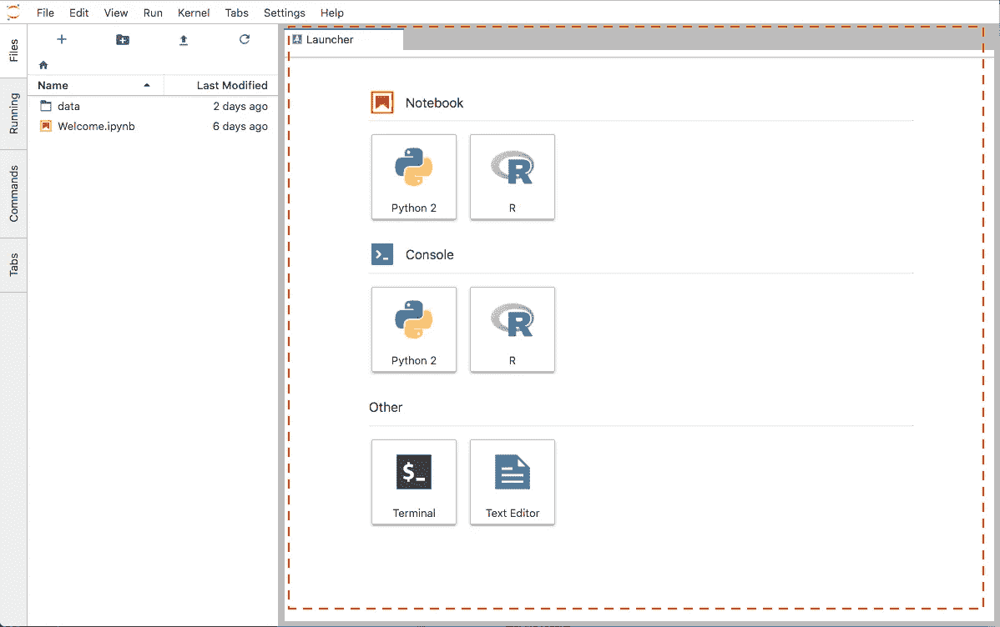

# 面向数据科学的项目管理 Jupyter 扩展

> 原文：<https://towardsdatascience.com/cookiecutter-plugin-for-jupyter-easily-organise-your-data-science-environment-a56f83140f72?source=collection_archive---------24----------------------->

## 数据科学、编程、项目管理

## 这是一个 Cookiecutter Jupyter 扩展，可以在没有终端的情况下轻松组织项目文件夹


格伦·卡斯滕斯-彼得斯在 [Unsplash](https://unsplash.com?utm_source=medium&utm_medium=referral) 上拍摄的照片

# 开始之前

在这篇博客中，我们将讨论我的一个个人资料库:

> Jupyter Launcher 中的一个类似 Cookiecutter 的扩展

**在博客的末尾可以找到知识库的链接。**


快速演示

# Cookiecutter 如何提高 Jupyter？

毫无疑问，Jupyter 是数据科学/机器学习环境的一个组成部分，无论是笔记本电脑、实验室还是中枢。它们每个都有自己的好处，笔记本是最友好的定制插件，Jupyter Lab 使多台笔记本工作变得容易，而 Jupyter Hub 支持多用户和更多。

> 然而，Jupyter 的一个弱点是它没有组织项目的工具。

这就是厨师的用武之地。对于以前使用过它的人，单击此处的[跳过这一部分。另外， **cookiecutter 是一个 python 包，它允许我们只用几行代码**就创建一个标准的文件夹结构。最棒的是，你不需要遵循 cookiecutter 的标准。看看这里的](#c94a)[其他格式的](https://cookiecutter.readthedocs.io/en/latest/readme.html?highlight=package#cookiecutter-specials)！

```
$ pip install cookiecutter$ cd path_to_my_project_folder# pick your own flavour of cookie
$ cookiecutter https://github.com/drivendata/cookiecutter-data-science
```

瞧啊。你现在应该有一个**标准文件夹结构**准备好了。在我的例子中，目录看起来像:

```
├── README.md          <- Front page of the project. Let everyone 
│                         know the major points.
│
├── models             <- Trained and serialized models, model
│                         predictions, or model summaries.
│
├── notebooks          <- Jupyter notebooks. Use set naming
│                         E.g. `1.2-rd-data-exploration`.
│
├── reports            <- HTML, PDF, and LaTeX.
│   └── figures        <- Generated figures.
│
├── requirements.txt   <- File for reproducing the environment
│                         `$ pip freeze > requirements.txt`
├── data
│   ├── external       <- Third party sources.
│   ├── interim        <- In-progress intermediate data.
│   ├── processed      <- The final data sets for modelling.
│   └── raw            <- The original, immutable data.
│
└── src                <- Source code for use in this project.
    ├── __init__.py    <- Makes src a Python module. 
    │
    ├── custom_func.py <- Various custom functions to import.
    │
    ├── data           <- Scripts to download or generate data.
    │   └── make_dataset.py
    │
    ├── features       <- Scripts raw data into features for
    │   │                 modeling.
    │   └── build_features.py
    │
    ├── models         <- Scripts to train models and then use
    │   │                 trained models to make predictions.
    │   │                 
    │   ├── predict_model.py
    │   └── train_model.py
    │
    └── viz            <- Scripts to create visualizations.            
        └── viz.py
```

# 为什么我们需要一个库克式的 Jupyter 扩展？

想象一下，如果你正在 JupyterLab 做一个项目。

灵感来袭；你想开始一个新项目。你是做什么的？

> A.启动一个终端；通过 Cookiecutter 创建另一个标准文件夹目录；在端口 8890 启动另一个 JupyterLab 来处理这个项目，因为您已经有 8888 和 8889 运行两个不同的 JupyterLab 会话。
> 
> B.在同一个 JupyterLab 会话中，开始处理 Untitled29.ipynb
> 
> C.算了吧；开始另一个项目太麻烦了，哼！

我们都知道答案，不是 B，就是 c。

那么 Cookiecutter 有什么问题呢？

> Cookiecutter 是一个非常非常非常训练有素的数据科学家开始一个新项目的惊人的组织工具

**换句话说，在你和你下一个定义良好的标准文件结构的项目之间有太多的点击。**

# JupyterLab 和 JupyterHub 的 Cookiecutter 插件

如果 Jupyter Launcher 中有一个神奇的按钮可以在当前文件夹中创建一个 Cookiecutter 文件结构呢？

## Jupyter Cookiecutter 扩展简介:



典型的 JupyterLab / JupyterHub 发射器。信用: [Ellip](https://www.google.com/url?sa=i&url=https%3A%2F%2Fdocs.terradue.com%2Fellip%2Fsolutions%2Fnotebooks%2Fstart%2Finterface.html&psig=AOvVaw3vB7IdW1DMNDhwCP9FTW4m&ust=1604590664977000&source=images&cd=vfe&ved=0CAIQjRxqFwoTCPDFk5ec6ewCFQAAAAAdAAAAABA7)


一个神奇的 JupyterLab / JupyterHub 发射器！致谢:[陈奕迅](https://gitlab.com/louis.chanloyuet/jupyter-cookiecutter-extension)

首先，我们将使用[官方 JupyterLab 服务示例](https://github.com/jupyterlab/jupyterlab/blob/869ed91e60f08e7e1c6787da27ec87255ced00bf/packages/services/examples/browser/src/contents.ts)，它已经附带了在[类型脚本](https://www.typescriptlang.org/)中定制扩展的必要组件。这个博客将关注这个插件如何改进我们的工作流程，另外，你可以访问这个库，所以我们不会深入代码。但是如果你有任何问题，请随时给我留言！

本质上，这个插件所做的就是首先跟踪你当前的文件夹。假设我们创建了一个名为`example_project`的新文件夹，双击进入它，你应该可以在你的启动器的笔记本部分看到`example_project`。

一旦你点击了 Cookiecutter 模板按钮，它就会创建一个如下所示的文件夹结构。给它几秒钟，如果什么都没有出现，刷新它；魔法需要时间。

```
├── README.md          <- The top-level README for 
│                         developers using this project.
│
├── data
│   ├── external       <- Third party sources.
│   │   └── .gitkeep
│   ├── interim        <- In-progress intermediate data.
│   │   └── .gitkeep
│   ├── processed      <- The final data sets for modelling.
│   │   └── .gitkeep
│   └── raw            <- The original, immutable data.
│       └── .gitkeep
│
├── docs               <- A default Sphinx project; see 
│   │                     sphinx-doc.org for details
│   └── .gitkeep
│
├── environment.yml    <- Conda environment file
│
├── logs               <- Folder for storing logging outputs
│   └── .gitkeep
│
├── models             <- Trained and serialized models, model 
│   │                     predictions, or model summaries
│   └── .gitkeep
│
├── notebooks          <- Jupyter notebooks. Naming convention 
│   │                     is a number (for ordering), the
│   │                     creator's initials, and a short `-` 
│   │                     delimited description, e.g.
│   │                     `1.0-jqp-initial-data-exploration`.
│   └── .gitkeep
│
├── references         <- Data dictionaries, manuals, and all 
│   │                    other explanatory materials.
│   └── .gitkeep
│
├── reports            <- HTML, PDF, and LaTeX.
│   └── figures        <- Generated figures.
│       └── .gitkeep
│
├── requirements.txt   <- The requirements file for reproducing 
│                         the analysis environment, e.g.
│                         generated with `pip freeze > 
│                         requirements.txt` or `pipreqs src`
│
├── setup.py           <- Fill in the file to make this project 
│                         pip installable with `pip install -e`
│
├── sql                <- SQL scripts, stored procedures etc.
│   └── .gitkeep
│
├── src                <- Source code for use in this project.
│   └── __init__.py    <- Makes src a Python module
│
├── tests              <- Scripts for unit testing
│   └── .gitkeep
│
└── .gitignore
```

这种特定的文件夹结构有几个关键特性:

1.  基于 [Cookiecutter 数据科学模板](https://drivendata.github.io/cookiecutter-data-science/#directory-structure)的扩展文件结构，增加了类似`tests`的文件夹，用于促进测试驱动开发，`sql`用于鼓励在`pickle`上使用数据库(感谢我的同事坚持将这个`sql`子文件夹放在适当的位置！)，`logs`文件夹，用于跟踪所有的日志输出等。
2.  带有`.gitkeep`文件，以确保所有的文件夹都会被 git 跟踪，即使你没有任何文件在`tests`文件夹下(记住，默认情况下 git 不会跟踪空文件夹)
3.  自带一个默认的 Python `[.gitignore](https://github.com/github/gitignore/blob/master/Python.gitignore)`，所以你不需要自己去获取它

**以上所有，在一个按钮内！**

现在你没有任何借口不开始整理你的项目文件夹了！(至少在项目的最开始)

# 限制和注意事项

1.  这个插件只在`JupyterLab >= 2.0.0`和`JupyterHub >= 1.2.0`上测试过。
2.  再说一次，魔法需要时间。因此，在所有文件和文件夹生成之前，尽量不要创建空文件。
3.  如果文件/文件夹已经存在，将出现`Invalid response: 409 Conflict`错误。你最终会得到一个`Untitled Folder`或者`Untitled.py`。
4.  这个插件现在有一个硬编码的文件结构。如果你需要不同的结构，你需要在安装插件之前更新`jupyter-cookiecutter-extension/src/index.ts`。
5.  这是一个类似于 Cookiecutter**的插件，它没有 aws、s3、许可证等其他配置。**
6.  **当您在所有项目的父目录中启动 Jupyter Lab 或 Jupyter Hub 时，这个插件工作得最好。例如，我的项目文件夹的本地父目录是`/projects`，这意味着我应该在`/projects`启动 Jupyter，而不是实际的项目目录。**
7.  **该存储库附带了 Docker 安装指南。如果你想把它作为你的 Docker 开发环境，Docker 文件应该会包含你！**

# **贮藏室ˌ仓库**

```
$ git clone https://gitlab.com/louis.chanloyuet/jupyter-cookiecutter-extension
$ cd jupyter-cookiecutter-extension
$ git fetch && git checkout 1.0.0
```

**[](https://gitlab.com/louis.chanloyuet/jupyter-cookiecutter-extension) [## Louis Chan / Jupyter Cookiecutter 扩展

### 一个最小的 JupyterLab / JupyterHub 扩展，用于从 Jupyter Launcher 创建 cookiecutter 模板。

gitlab.com](https://gitlab.com/louis.chanloyuet/jupyter-cookiecutter-extension) 

# 你可能也喜欢这个

[](/efficient-implementation-of-conditional-logic-on-pandas-dataframes-4afa61eb7fce) [## 熊猫数据帧上的高效条件逻辑

### 是时候停止过于依赖。iterrows()和。应用()

towardsdatascience.com](/efficient-implementation-of-conditional-logic-on-pandas-dataframes-4afa61eb7fce) [](/mastering-root-searching-algorithms-in-python-7120c335a2a8) [## Python 中高效的根搜索算法

### 在 Python 中实现高效的寻根和优化搜索算法

towardsdatascience.com](/mastering-root-searching-algorithms-in-python-7120c335a2a8) 

# 在你走之前

感谢阅读这篇博客！成为一名训练有素的数据科学家绝非易事；我必须承认我自己从来就不是一个人( ***道歉*** )。希望这个插件能降低每个人养成一些好习惯的门槛，让我们的代码库更有条理，更易维护。如果你从这里学到了新的东西，请告诉我！欢迎在评论中留下你的评论和问题。直到下一次，保持安全，继续编码，并成为我的客人分叉库。

再见！

 [## Louis Chan—FTI Consulting | LinkedIn 数据科学总监

### 雄心勃勃的，好奇的和有创造力的个人，对分支知识和知识之间的相互联系有强烈的信念

www.linkedin.com](https://www.linkedin.com/in/louis-chan-b55b9287/)**