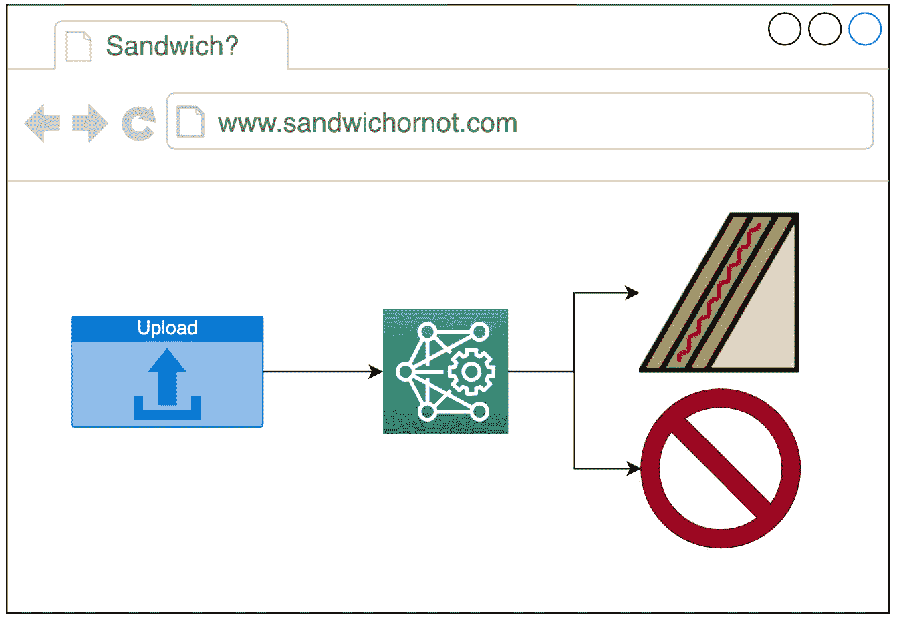

# 数据科学的烹饪方法

> 原文：<https://towardsdatascience.com/cooking-s-recipe-for-data-science-7f1ebf9828a5?source=collection_archive---------46----------------------->

马丁·范·登·霍维尔在 [Unsplash](https://unsplash.com?utm_source=medium&utm_medium=referral) 上的照片

## 如何将现场可靠性工程(SRE)整合到您的数据科学团队、产品和服务中

> D 记者:所有表达的观点都是我个人的。为一些非常有品味的烹饪双关语做好准备！

在这篇文章中，我*从[站点可靠性工程中提炼出关键思想:谷歌如何运行生产系统](https://landing.google.com/sre/sre-book/toc/) & [站点可靠性工作手册](https://landing.google.com/sre/workbook/toc/)和*将它们与数据科学融合*。我为为什么实施站点可靠性工程(SRE)实践不仅会增强您的数据科学产品的可靠性，而且还会提高您的数据科学团队的整体效率提出了一个论点。然后，我将详细介绍如何将 SRE 集成到数据科学团队、产品和服务中。*

当我鼓励你通读整篇文章的时候，你可以随意地从这个想法的*拼盘*中*取样*！以下是*菜单上的内容:*

## 菜单

0.[**设置表:运行示例**](#738c)

1.  [**前菜/开胃菜:起始题**](#4149)
    1.1[SRE 是什么？](#80ba)
    1.2 [为什么我希望 SRE 加入我的数据科学产品生命周期？](#e1ce)
    1.3 [我能在不雇佣专门的现场可靠性工程师的情况下实施 SRE 吗？](#92cc)
2.  [**关键成分:关键成分 SRE**](#e034)
    2.1 [服务水平目标(SLOs)](#9283)
    2.2 [服务水平指标(SLIs)](#2759)
    2.3 [错误预算](#d8a5)
    2.4 [错误预算策略](#f539)
    2.5 [监控](#0538)
    2.6 [告警](#1271)
    2.7
3.  [**穿上你的思维“无拘无束”:SRE 指导原则要牢记**](#aa39)3.1[有些 SRE 总比没有 SRE 好](#8e78)
    3.2 [事情会出乱子，我们所能做的就是准备！](#d6ad)
    3.3 [SRE 指标不是玩指责游戏的工具](#15bd)
4.  [**在没有厨师的情况下经营厨房:在没有专职现场可靠性工程师的情况下实施 SRE**](#6c10)4.1[从简单做起，从小做起](#bdc8)
    4.2 [采用分担责任模式](#ed34)
    4.3 [从一开始就通过自动化消除辛劳](#2abe)
5.  [**要点:一些最终想法**](#8ea8)

# 0.摆桌子

**一个运行实例**

为了说明关键思想，我将使用下面的运行示例:

由作者使用 draw.io 创建

你是一个网站的自豪的产品所有者，该网站允许用户上传食品的图像，并使用你最先进的深度学习模型来确定食品是否是三明治。您希望将 SRE 集成到三明治分类服务的产品生命周期中。对于本文，我们将忽略前端相关的 SRE，而专注于服务于机器学习模型的后端。

# 1.开胃菜/开胃品

T **何出题**

安吉拉·贝利在 [Unsplash](https://unsplash.com?utm_source=medium&utm_medium=referral) 上拍摄的照片

## 1.1 什么是 SRE？

SRE 是一个相当宽泛的概念，因此，如果你尝试谷歌搜索“SRE”，你可能会失望地发现，并没有一个明确的公认的功能定义。那么，让我给你我的定义，一个我们可以马上开始工作的定义:

> 站点可靠性工程是指原则、实践和过程的框架，主要目标是提高(数字)产品和服务的可靠性。

## 1.2 为什么我希望 SRE 出现在我的数据科学产品生命周期中？

*   **为了提高数据科学产品的可靠性和稳健性** 通过实施可靠的 SRE 原则和实践，您可以采取更有条理和更主动的方法来提高产品的稳健性，而不是在出现问题时采取混乱和被动的方法。
*   **在维护旧东西和开发新东西之间划分优先级** SRE 是一种非常数字化和数据驱动的软件运营方法。使用 SLO、错误预算、错误预算政策、监控和警报，您可以有非常明确的标准来确定您的团队是否应该投入更多时间来维护和改进三明治分类器，或者他们是否应该开发一种用于分类其他类型食品的新功能。
*   **为了提高产品开发过程的质量** 我认为，当你将 SRE 文化灌输到你的团队中时，你的团队的开发实践和文化就会得到改善。随着开发人员变得更加“SRE 意识”，他们将倾向于围绕构建健壮可靠的数据科学产品来优化他们的开发实践，一直到编写代码、进行代码评审和提出 QA 测试案例的微观层面。

## 1.3 我可以在不雇佣专门的站点可靠性工程师的情况下实施 SRE 吗？

简答:有！
长回答:看第 4 节(经营没有厨师的厨房)但先通读第 2 节。

# 2.关键成分

**SRE 的关键部件**

照片由 [Calum Lewis](https://unsplash.com/@calumlewis?utm_source=medium&utm_medium=referral) 在 [Unsplash](https://unsplash.com?utm_source=medium&utm_medium=referral) 上拍摄

以下是您需要了解的关键概念/组件

## 2.1 服务水平目标(SLO)

SLO 可以说是 SRE 最重要的概念。SLO 为您的服务可靠性指定了一个目标水平，通常定义了一个隐含的时间段。SLO 是以客户为中心的阈值，量化客户对您的数据科学产品满意的可靠性水平。例如，在三明治分类服务的情况下，我们可能在 1 个月的时间内有以下 2 个 SLO:

*   可用性:99.9%的可用性
*   延迟:99%的请求延迟 500 毫秒

## 2.2 服务水平指标(SLIs)

sli 是帮助量化 SLO 的特定指标。SLI 通常是两个数字的比值:

(好事发生次数)/(总件发生次数)

对于三明治分类器，我们的 sli 应该是这样的:

*   可用性:非 5XX API 请求占总请求的比率
*   延迟:快于 500 毫秒的请求占总请求的比率

这样的度量标准是很好的 sli，因为它们很直观——0%表示一切正常，100%表示一切正常。

## 2.3 误差预算

误差预算= 100%-SLO。对于三明治分类器，这意味着假定每月可用性 SLO 为 99.9%，误差预算为 0.1% (43 分 12 秒)。错误预算是我们将围绕其设置警报和错误预算策略的指标。误差预算在其他方面也很有用。例如，我们可以根据事故消耗了多少月度错误预算来量化停电事故的严重程度。

## 2.4 错误预算政策

根据站点可靠性工作手册，错误预算政策定义了一旦错误预算耗尽或接近耗尽时各种利益相关者将采取的具体步骤。对于我们的三明治分类器示例，误差预算策略中的一些关键动作可能包括以下内容:

*   开发模型的数据科学家/机器学习工程师将优先修复生产错误，直到服务在预算内，而不是开发新的模型来对披萨进行分类
*   将强制执行代码冻结，以停止对生产部署的任何进一步更改，从而最大限度地降低进一步的风险。只有当有足够的误差预算时，才允许进行更改。

## 2.5 监控

监控通常包括仪表板，以人类可读的时间序列形式显示关于关键指标的信息。在发生事故时，监控仪表板应该能够帮助您回答 3 个主要问题——发生了什么，什么时候发生的，为什么会发生？以下是您应该监控的指标/组件列表:

*   **SLIs 和错误预算**:对于我们的三明治分类器，我们应该有仪表板来显示按状态代码(2XX、4XX、5XX)、p99 延迟和当月剩余错误预算分组的请求数量。
*   **模型性能度量**:对于我们的三明治分类器，我们应该监控被分类为三明治与非三明治的图像的比率。这将有助于检查模型是否过拟合/欠拟合，以及是否需要在更好的数据集上重新训练或替换模型。(对于像欺诈检测这样的用例来说，这绝对至关重要！)
*   **依赖关系**:如果三明治分类器依赖于一个外部数据库，仪表板应该监控这个数据库的健康和性能。
*   **预期变化**:如果三明治分类模型已经被重新训练，将热狗分类为三明治，那么我们应该通过仪表板上的图表捕获并确认这一变化的成功部署。
*   **流量&资源使用:**仪表板应该捕获流量、吞吐量和资源使用，比如 CPU 和内存。这是为了确保在使用量增加的情况下(典型的新数据科学产品就是这种情况),资源能够迅速扩展以处理更大的流量。如果您想采用某种形式的自动缩放，流量仪表盘也有助于识别流量模式。

## 2.6 警报

事件触发警报，警报触发操作。警报的目的是在重大事件发生时通知正确的人正确的事情。例如，如果在部署一个新的三明治分类模型后，延迟突然达到峰值并持续半个小时，则需要提醒相关人员采取缓解措施。警报依赖于监控和阈值来确定何时、向谁和向什么发出警报。

## 2.7 支持流程

最大化其他 SRE 组件的效用产量通常需要 3 个关键过程:

*   **事故升级协议:**对于如何处理生产事故，最好有一个周密的计划。该协议应该包括诸如谁(开发人员、技术负责人还是产品所有者？)应该在(10%，25% 50%的误差预算用尽时采取行动？)以及应该采取哪些具体行动。在我看来，这些信息也应该纳入错误预算策略，并且应该与警报紧密联系在一起。
*   **事后分析:**无可指责的事后分析对于从事故中吸取教训至关重要，从而提高未来的可靠性和稳健性。在将 SRE 集成到您的数据科学产品生命周期的早期阶段，如何进行事后分析将在设定基调方面发挥至关重要的作用。
*   **SLO & SLI 修订:**根据您的项目生命周期的速度和 SRE 框架的成熟度，将需要定期修订您的 SLO 目标和 SLI，以确保 SRE 以可持续的方式实施，因为您的用户和利益相关者的要求会随着时间的推移而变化。

一旦你脱离了建立一些粗略的 SRE 实践的初始阶段，第四个隐含但关键的过程/组件是一个经过深思熟虑的随叫随到的设置。用 SRE 工作手册的话说，

> …随叫随到意味着在设定的时间段内随时可用，并且在这段时间内随时准备以适当的紧急程度响应生产事故。

您可能希望一些员工在工作时间之外随叫随到，以确保您服务的可靠性。您团队中的这些随叫随到的成员应该有一个详细的分步指南，以随叫随到的行动手册的形式说明在发生事故时应该做什么，并且应该可以访问相关的技术文档、错误预算政策和上报协议。你可以在这里阅读更多相关信息[。](https://landing.google.com/sre/workbook/chapters/on-call/)

# 3.穿上你的思维“无沿帽”

**牢记 SRE 指导原则**

照片由[юліядубина](https://unsplash.com/@yulia_dubyna?utm_source=medium&utm_medium=referral)在 [Unsplash](https://unsplash.com?utm_source=medium&utm_medium=referral)

## **3.1 有 SRE 总比没有 SRE 好**

我认为部分实施 SRE 总比什么都没有好。例如，对于三明治分类服务，您可能没有制定出精确的错误预算政策，但通过一些基本的 SLO、监控和警报，至少您将能够在网站关闭时主动修复问题，而不是被大量用户投诉所通知。最好是定义一个理想的 SRE 实现的愿景，然后迭代地、逐步地向它前进。

## **3.2 事情会出错，我们能做的就是准备！**

一个或多个组件在某个时间点发生故障导致可用性低于 100%的概率不为零。如果你设法为你的顾客创造了一个 100%可靠的体验，并希望保持这种可靠性水平，你就永远无法更新或改进你的服务。因此，100%的可靠性是错误的目标。另一个警告是，当你从 99%到 99.9%再到 99.99%的可靠性时，每增加 9 个可靠性就会增加成本，但是对你的客户来说边际效用稳定地趋近于零。

## **3.3 SRE 指标不是玩指责游戏的工具**

通过将员工的绩效 KPI 与这些指标挂钩，可以很容易地利用 SRE 的数字数据驱动方法。然而，从长远来看，这确实是有害的。它会延续一种适得其反的相互指责的文化。你想要的是一种责任共担的文化，通过系统地实施 SRE 原则、实践和流程来减少和消除事故和错误。

# 4.经营一个没有厨师的厨房

**在没有专职现场可靠性工程师的情况下实施 SRE**

[shruti dadwal](https://unsplash.com/@shruti_dadwal?utm_source=medium&utm_medium=referral) 在 [Unsplash](https://unsplash.com?utm_source=medium&utm_medium=referral) 上拍摄的照片

## 4.1 从简单开始，从小处着手

*   从对您的客户最重要的 1 到 3 个基本 SLO 开始，如可用性和延迟。随着时间的推移，可以添加几个 SLO 来提高整个产品的健壮性。
*   设定合理的目标，比如 90%，而不是像 99.9999%这样非常严格的目标。随着时间的推移，这些目标可以逐步细化和收紧。
*   为您的 SLO 设置一些简单的控制面板，并提供基本的警报来捕捉事件和关键趋势。大多数云提供商都有便捷的监控和警报解决方案。如果没有，设置一个简单的 Grafana-Prometheus-alert manager 堆栈并不是一件非常繁琐的任务。随着时间的推移，可以添加更多的监控和警报。
*   不要马上正式采用 SRE 的实践，先试运行一段时间，也许是一个季度，让你的团队尝试模仿理想的升级、事后分析和 SLO 修订。

## 4.2 采用分担责任模式

虽然 SLO 通常需要由产品所有者(例如:CTO 或产品经理)负责，但 SRE 不能集成到您的产品生命周期中，除非每个人都参与进来。“每个人”包括所有的利益相关者——数据科学家、机器学习工程师、DevOps、QA、产品经理、业务请求者等。让每个人都参与到理解和规划将 SRE 集成到您的数据科学产品生命周期中。分阶段推出你的 SRE。将生产系统划分为组件(例如:前端、机器学习模型、后端、基础架构)，并让负责这些组件的不同人员通过事件升级协议一起工作。进行上报演习和事后分析，以加强团队中的 SRE 文化。

## 4.3 从一开始就通过自动化消除辛劳

SRE 的一个重要概念是消除辛劳。辛劳指的是重复的、平凡的维护类任务，很少或根本不需要创造性的解决问题。在我看来，从一开始就应该优先考虑消除劳累。在 SRE 实施流程中寻找可能实现自动化的机会。把它们写下来！虽然最初可能需要更长的时间来自动化一项任务，但这是一项可行的投资，因为随着 SRE 集成在您的团队、产品和服务中的扩展，这种辛劳可能会成为一项巨大的负债。

# 5.外卖食品

**一些最后的想法**

安布尔·恩格尔在 [Unsplash](https://unsplash.com?utm_source=medium&utm_medium=referral) 上拍摄的照片

当谈到理解和实现 SRE 时，有许多问题需要解决。在数据科学领域，深度学习模型等黑盒模型带来的不确定性增加了如何定义 SLO、警报和升级策略的复杂性。我的建议是不要焦虑，开始行动吧！就像你的机器学习模型一样，你和你的团队也会随着经验的增加而变得更好。

# 见见厨师！

艾西瓦娅·普拉巴特

嗨！我是艾西。我名字的前两个字母是“AI”，AI 和机器学习是我热爱的。我目前是新加坡的高级数据科学家，也是 GeorgiaTech 的硕士生。你可以通过 [LinkedIn](https://www.linkedin.com/in/aishwaryaprabhat) 联系我。