# 有 Pi 的酷项目

> 原文：<https://towardsdatascience.com/cool-projects-with-a-pi-7bd4792c6e90?source=collection_archive---------12----------------------->

## 树莓派入门

Raspberry Pi 是一系列低成本的单板计算机，和你的信用卡一样小。自 2012 年第一个版本问世以来，它们在世界各地的爱好者和制造商中非常受欢迎。同年，Raspberry Pi 赢得了 T3 的年度创新奖。

> 截至 2019 年底，已售出约 3000 万个树莓 Pis。— [询问者](https://www.theinquirer.net/inquirer/news/3084677/raspberry-pi-30-million-sales)

在 8 年的时间里，树莓派经历了大量的迭代和改进。下面是一个表格，显示了到今天为止已经发布的不同型号的树莓 Pi。

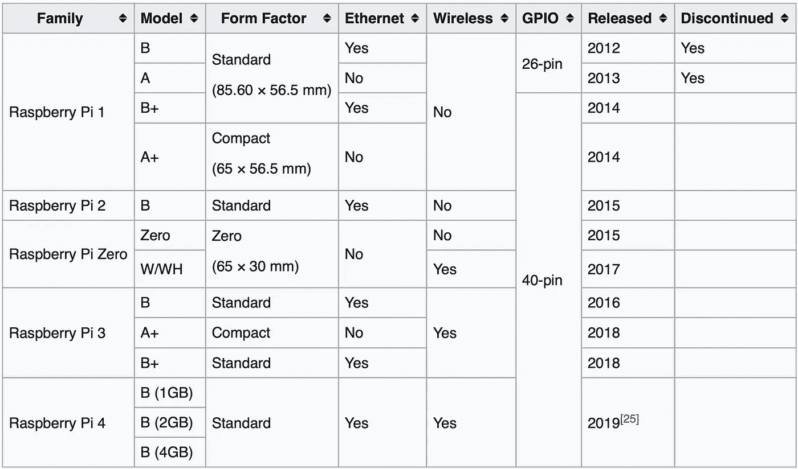

几代发布的树莓 Pi 模型([来源](https://en.wikipedia.org/wiki/Raspberry_Pi#Generations_of_released_models)

## 使用 Raspberry Pi 的项目

这里列出了一些使用 Raspberry Pi 的有趣项目，让您了解人们是如何使用它的:

[家庭自动化](https://www.geeky-gadgets.com/raspberry-pi-home-automation-20-01-2020/)

[基本物体和运动检测](https://www.hackster.io/BnBe_Club/basic-object-motion-detection-using-a-raspberry-pi-265887)

[仪表板摄像头](https://www.hackster.io/BnBe_Club/making-a-dashcam-using-the-raspberry-pi-zero-pt-1-9dd3ad)

[流媒体服务器](https://www.makeuseof.com/tag/4-ways-set-up-raspberry-pi-media-server/)

[带有红外近程传感器的 WhatsApp 监控摄像机](https://www.hackster.io/kutluhan-aktar/whatsapp-surveillance-video-camera-with-ir-proximity-sensor-04c4aa#toc-step-3--setting-up-raspberry-pi-3)

在这篇文章中，我将向你展示如何建立你的 ***树莓派 3B+*** 模型，这样你就可以开始使用它来创建你自己的项目。

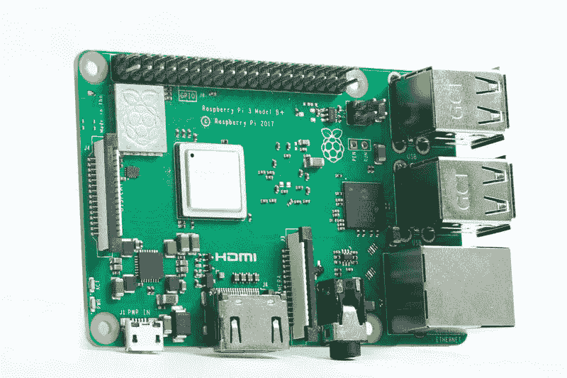

树莓派 3B+ ( [图片来源](https://www.raspberrypi.org/homepage-9df4b/static/e41ca1779e93cac6ff1f1329348e8864/a0db7/443787196e2356de4f11ba8537b38540d6dc209f_770a5614.jpg))

## [树莓派 3B+规格](https://static.raspberrypi.org/files/product-briefs/Raspberry-Pi-Model-Bplus-Product-Brief.pdf)

覆盆子 Pi 3B+是覆盆子 Pi 3 系列的最终版本。

**处理器:** Broadcom BCM2837B0、Cortex-A53 64 位 SoC @ 1.4 GHz
内存: 1GB LPDDR2 SDRAM
**联网:**千兆以太网 over USB 2.0(最大吞吐量 300 Mbps)、2.4GHz 和 5GHz IEEE 802.11.b/g/n/ac 无线局域网
**蓝牙:**蓝牙 4.2、蓝牙低能耗(BLE)【中 相机串行接口(CSI)、显示器串行接口(DSI)
**尺寸:** 82mm x 56mm x 19.5mm，50g
**工作温度:**0–50°C
**生产寿命:**将至少持续生产到 2023 年 1 月

## 您将需要的东西:

1.  树莓派 3B+
2.  sd 卡
3.  SD 读卡器
4.  以太网电缆

## 您需要下载的操作系统:

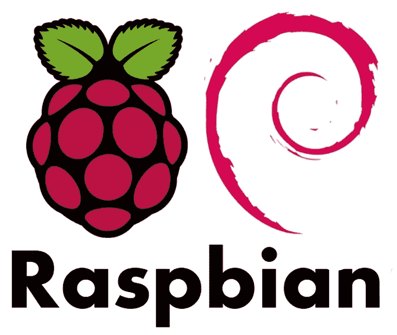

[图像来源](https://marcofranssen.nl/images/0e350b88681038426b58029609f83255ea869af5.png)

1.  Raspbian Buster :这是我们将要安装在树莓派 3B+上的操作系统。请下载 [Raspbian Buster 带桌面和推荐软件](https://downloads.raspberrypi.org/raspbian_full_latest)。

## 您需要下载的软件:

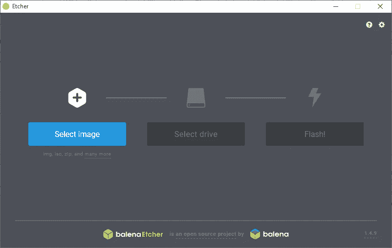

蚀刻机软件([图像源](https://upload.wikimedia.org/wikipedia/commons/c/c2/Etcher_1.4.9_running_on_Windows_10.png))

1.  Etcher 是一个免费的开源工具，用于编写图像文件。iso 和。img 到存储介质上，以创建动态 SD 卡和 USB 闪存驱动器。


VNC 浏览器([图片来源](https://is3-ssl.mzstatic.com/image/thumb/Purple118/v4/0d/16/6d/0d166dbf-d7b7-b969-c0d6-9e2b5ca45988/AppIcon-1x_U007emarketing-85-220-0-5.png/1200x630wa.png))

2. [VNC 浏览器:](https://www.realvnc.com/download/viewer/) VNC 浏览器是一款允许远程访问和控制启用了 VNC 服务器的设备的软件。

## 步骤:

1.  使用 SD 读卡器将 SD 卡插入您的 PC/笔记本电脑。
2.  格式化 SD 卡。
3.  使用 Etcher 软件将 Raspbian buster 图像文件刻录到 SD 卡。

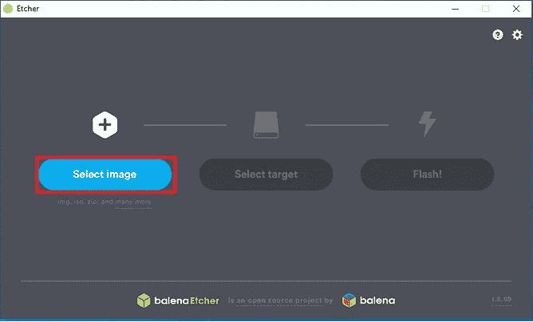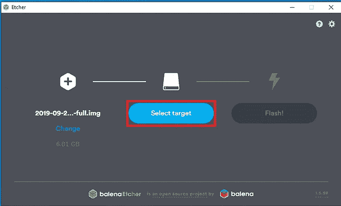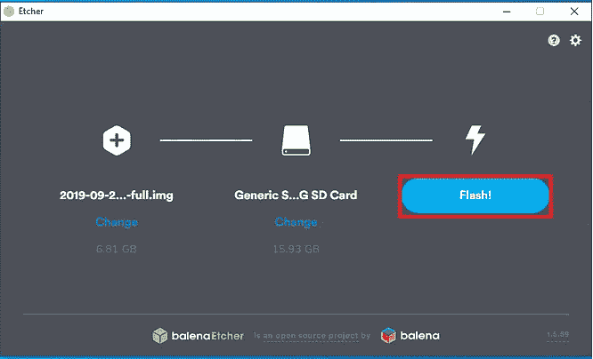

使用蚀刻机将 Raspbian 刻录到 SD 卡

4.通过在 SD 卡的根目录下创建一个名为 ssh 的空白文件，启用 ssh 以便您可以远程访问它。

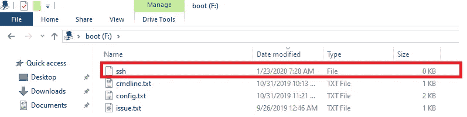

将 ssh 文件添加到 SD 卡的根目录

5.从 PC/笔记本电脑中弹出 SD 卡，将其插入 Raspberry Pi，接通电源打开 Raspberry Pi。

6.使用以太网电缆将 Raspberry Pi 连接到 PC/笔记本电脑。

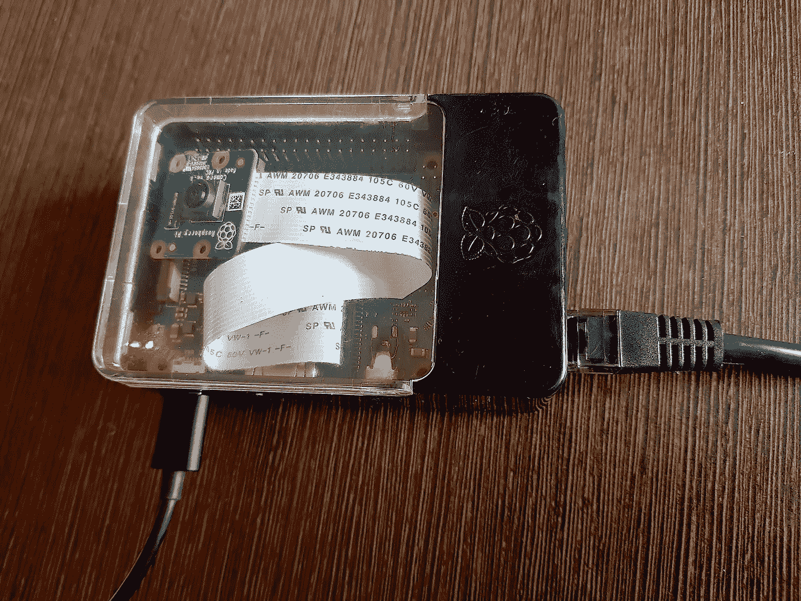

树莓派 3B+与以太网电缆和电源电缆连接

7.使用终端从您的 SSH 到 Pi。输入以下命令:

```
ssh pi@raspberrypi.local
```

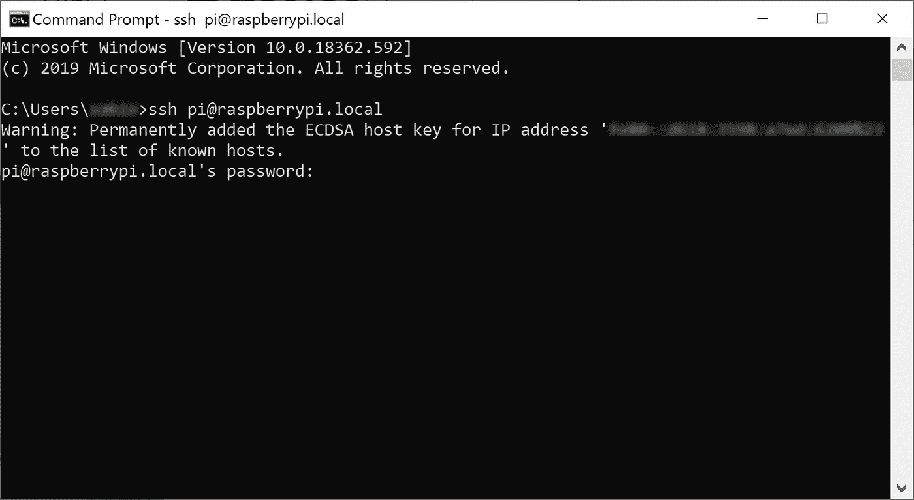

8.系统将提示您输入密码。输入默认密码(raspberry)。

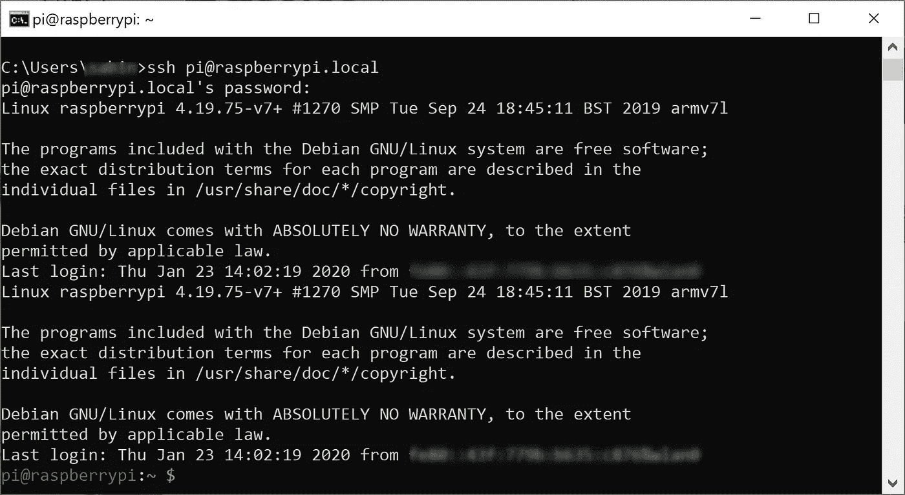

9.现在，使用以下命令在 Raspberry Pi 上启用 vncserver:

```
vncserver
```

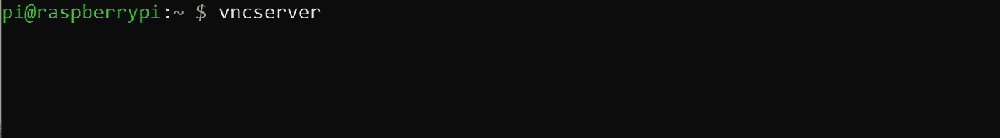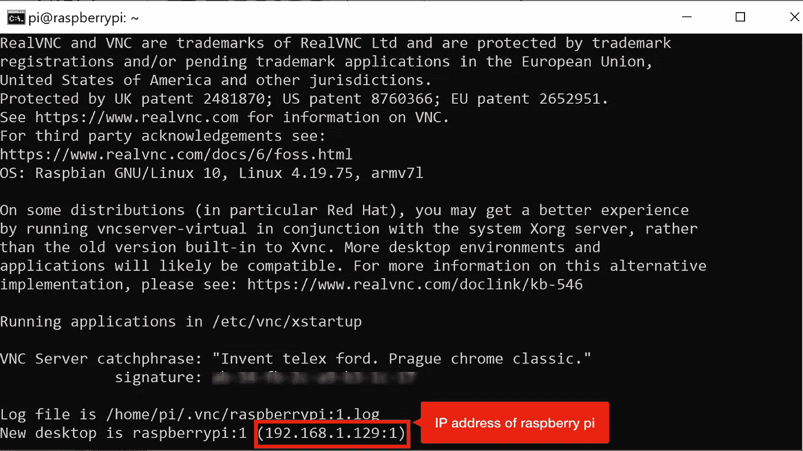

10.从您的 PC 上，打开 VNC 浏览器，并添加树莓 Pi 的 ip 地址，以远程连接到它。

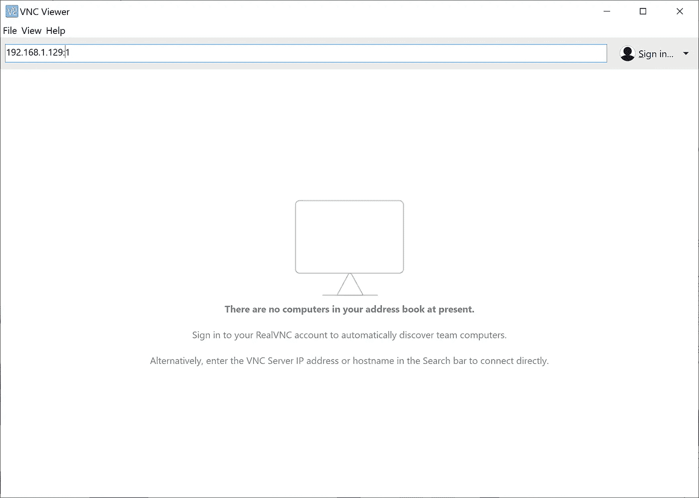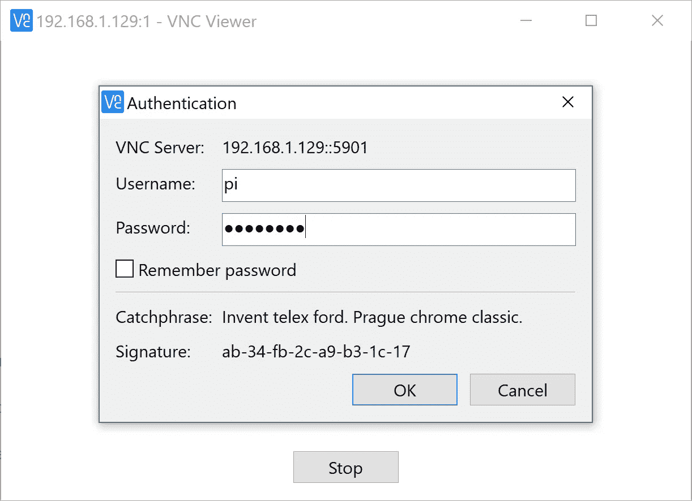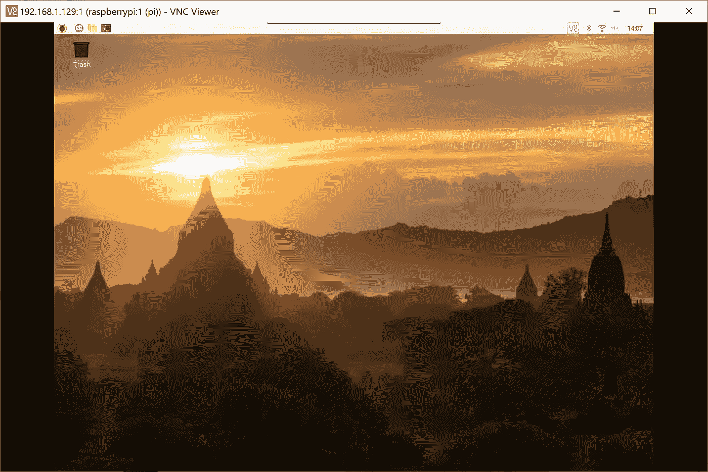

11.现在从远程访问，连接到 wifi，这样您就可以访问它，而不必使用以太网电缆连接到 PC。

全部完成！您的覆盆子 Pi 3B+现在可以使用了。

***觉得这个帖子有帮助？*** *在下面留下你的想法作为评论。*

最初发表于[www.xailient.com/blog](https://www.xailient.com/post/projects-with-raspberry-pi)

希望在树莓派上实现实时人脸检测？看看这篇[帖子](https://www.xailient.com/post/real-time-face-detection-on-raspberry-pi)。

想在树莓派上实现实时人脸跟踪吗？看看这个[帖子](https://www.xailient.com/post/face-tracking-python-dlib)。

*更多故事:*

[*在你的 App 上集成人脸检测*](https://www.xailient.com/post/integrate-face-detection-in-your-app)

[*在计算能力有限的设备上运行深度学习计算机视觉的挑战*](https://www.xailient.com/post/challenges-of-running-deep-learning-computer-vision-on-computationally-limited-devices)

[*你现在需要从云计算转向边缘计算！*](https://www.xailient.com/post/cloud-computing-to-edge-computing)

***关于作者***

Sabina Pokhrel 在 Xailient 工作，这是一家计算机视觉初创公司，已经建立了世界上最快的边缘优化对象检测器。