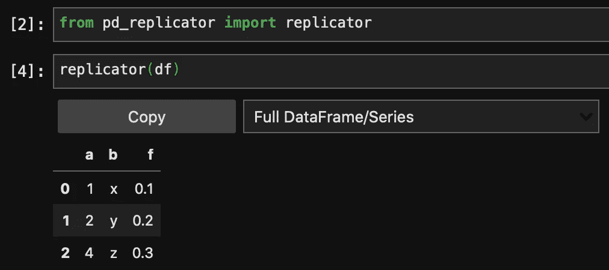
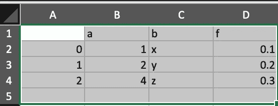

# 使用 pd-replicator 复制/粘贴数据帧

> 原文：<https://towardsdatascience.com/copy-paste-a-dataframe-with-pd-replicator-24e625fc9d53?source=collection_archive---------87----------------------->

## 数据科学可能涉及在不同平台之间移动大量数据。pd-replicator 试图使(部分)操作尽可能简单！

数据科学是非常迭代的。这些迭代可能涉及不同平台之间的大量来回数据。也许你从你的 BI 工具中提取一些数据，在 Jupyter 中运行一些分析，然后将输出转移到电子表格中与你的队友分享。然后，你发现你需要修复的东西，并最终再次运行整个事情。

问题是，当你摆弄这些数据的时候，你在一些本质上无聊的事情上失去了精神能量/健康。我构建了 [pd-replicator](https://github.com/scwilkinson/pd-replicator) 来帮助尽可能简单地将数据从 Jupyter 转移到电子表格中，这通常是我发现数据处理中最痛苦的部分。

# 概观

`pd-replicator`在 Jupyter 的数据帧输出中添加一个复制按钮，允许你将数据帧复制到你的剪贴板中，并允许它直接粘贴到电子表格中。

这是一个简单的`pip`包，只需要很少的设置就可以工作。它适用于所有类型的 Jupyter，包括 classic Jupyter、JupyterLab 和 Google Colaboratory。它也适用于本地和远程托管的设置，如 AWS SageMaker 或 JupyterHub！

下面是一个实际应用的例子:



复制数据帧后，将其粘贴到电子表格中就像选择一个单元格并点击粘贴一样简单:



一旦它被安装和设置好，使用它就像用`replicator()`包装你选择的数据帧一样简单，向输出添加一个复制按钮。copy button 小部件还有一个下拉菜单，可让您准确选择要从数据帧中复制的内容。

我在下面提供了一些说明，但它们也可以在[自述文件](https://github.com/scwilkinson/pd-replicator)中找到。

# 装置

可以通过`pip`进行安装:

```
> pip install pd-replicator
```

`ipywidgets`必须设置，以便按钮/下拉菜单正确显示:

```
> pip install ipywidgets 
> jupyter nbextension enable --py widgetsnbextension
```

要使用 JupyterLab，还需要一个额外的步骤:

```
> jupyter labextension install @jupyter-widgets/jupyterlab-manager
```

# 使用

将`replicator()`环绕任何`pandas`数据帧/系列，以在数据帧/系列上方显示复制器复制按钮:

```
from pd_replicator import replicatorreplicator(df)
```

对于远程托管的实例，`native`选项应该设置为`False`:

```
from pd_replicator import replicatorreplicator(df, native=False)
```

这使用 JavaScript 通过你的浏览器复制到剪贴板，而不是`pandas.to_clipboard()`使用的系统复制方法。

# 反馈

如果您对`pd-replicator`有任何无法解决的问题，请在这里随意在 GitHub [上创建一个问题！](https://github.com/scwilkinson/pd-replicator/issues)