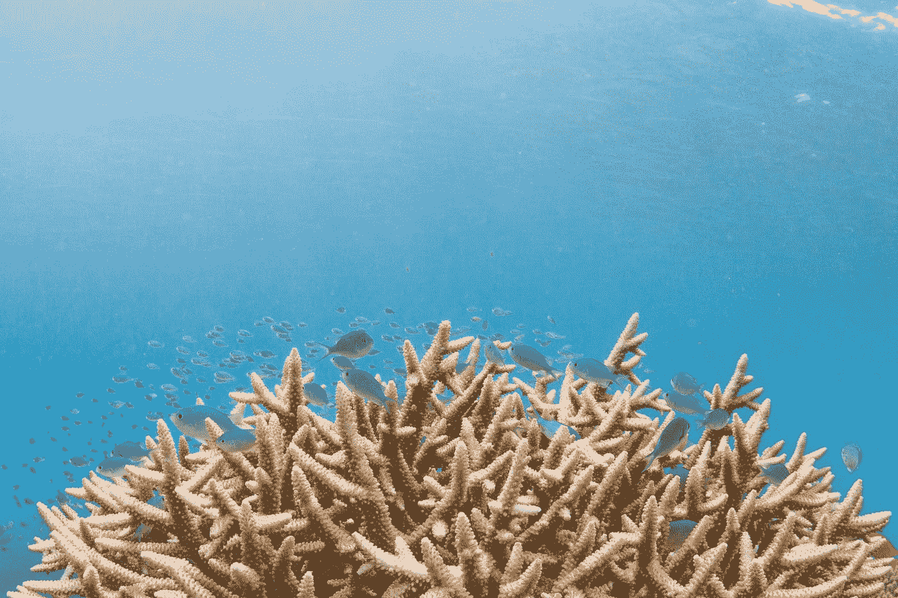
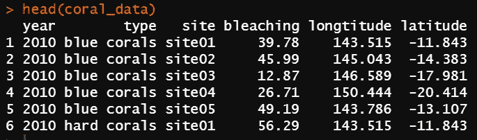
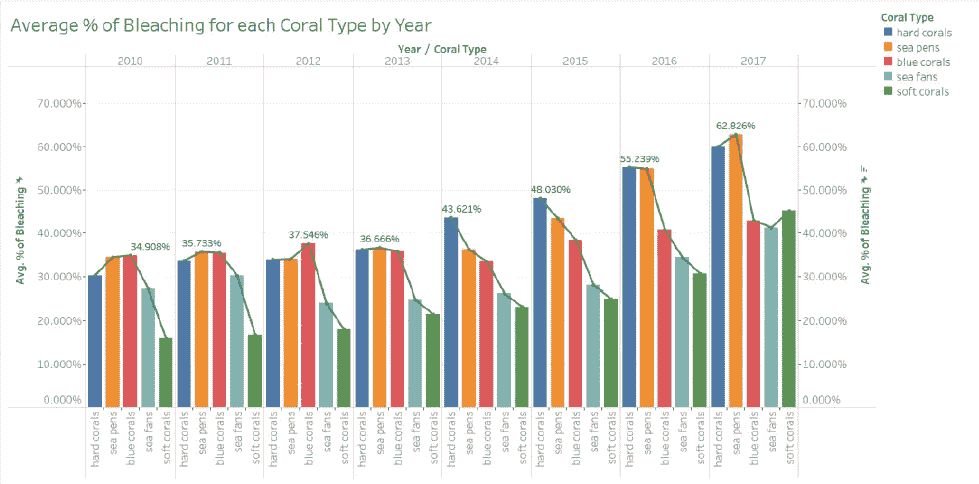
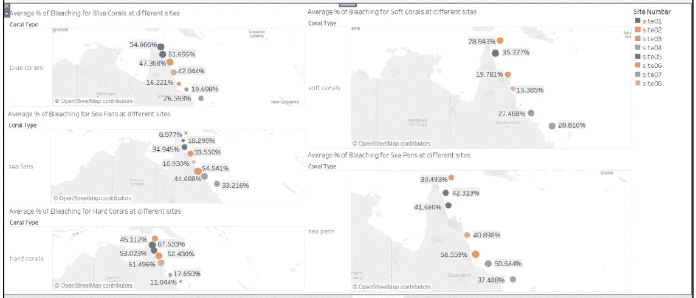
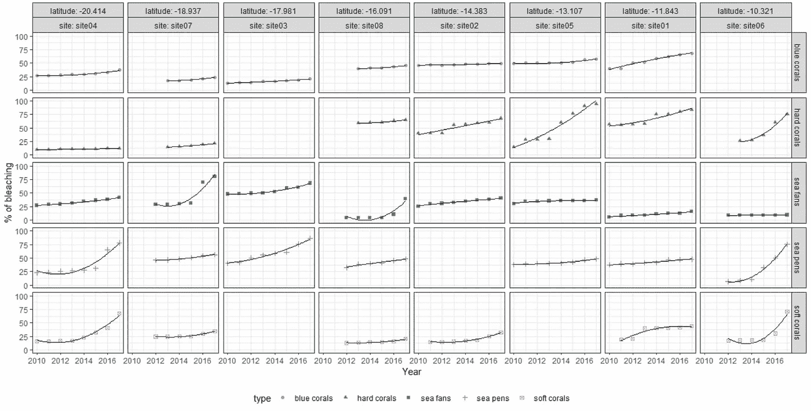

# 珊瑚漂白分析可视化——Tableau 还是 R ggplot？

> 原文：<https://towardsdatascience.com/coral-bleaching-analysis-visualisation-tableau-or-r-ggplot-43e657c1cdbe?source=collection_archive---------49----------------------->

## 比较 Tableau 和 R ggplot 在珊瑚漂白分析中传递关键信息的有效性



在 [Unsplash](https://unsplash.com?utm_source=medium&utm_medium=referral) 上 [Bawah Reserve](https://unsplash.com/@bawahreserve?utm_source=medium&utm_medium=referral) 拍摄的照片

Tableau 和 R 是两种常见的数据可视化工具，前者因其简单和初学者友好的功能而闻名，后者因其广泛的用户交互可能性而闻名。我们如何决定哪种可视化工具更容易实现，或者在向相关利益相关者传达关键见解时更有效？这篇文章将探讨这个问题，并希望达成一个共同的共识。

# 资料组

我们将使用的数据集包含 2010 年至 2017 年大堡礁珊瑚白化的百分比。总共有 5 种不同的珊瑚类型，主要是*蓝珊瑚、硬珊瑚、海扇、海笔*和*软珊瑚*。提供了位于大堡礁的 8 个不同地点/位置及其纬度和经度。



按作者分类的图像-数据集中前 6 条记录的输出

# 关键消息

在我们构建的每一个数据可视化中，都必须有一个我们希望传递给相关利益相关者的关键信息，以便在这些数据洞察的支持下采取适当的行动。在该数据集中，我们希望解决以下问题:

> 1.从 2010 年到 2017 年，哪一年哪一种珊瑚漂白最严重？
> 
> 2.该地点的位置如何影响不同珊瑚类型的白化现象？

# 画面可视化

在确定了我们希望通过数据可视化传递的关键信息后，我们可以开始尝试可用的可视化类型，看看哪一种将更有效地传递信息，或者我们可以使用更正式的方法，如我之前在这里写的[五张设计表(FDS)方法，来设计更好地满足需求的可视化。我喜欢 Tableau 的一点是，只需几个拖放操作，就能轻松构建不同的视觉效果。](/five-design-sheet-methodology-approach-to-data-visualisation-603d760f2418)

对于我们的第一个关键信息，由于我们试图确定一个时间段(即哪一年)和一种特定类型(即珊瑚漂白的类型)，我们可以使用一个彩色条形图，其中 x 轴可以是我们的年周期，y 轴是我们的衡量标准(即漂白的百分比)，第三维的颜色代表珊瑚的类型。



作者图片—第一条关键信息的可视化表格

通过这种观想，我们知道以下几点:

在 2010 年的**年，**蓝珊瑚**的平均脱色率最差，为**的 34.90%** 。**

在 2011 年的**年，**海笔**的平均漂白度最差，为 **35.733%** 。**

在 2012 年**到 2013 年**，**蓝珊瑚**的平均褪色率最差，为 **37.546%** 。

在 2013 年**和 2013 年**中，**海蓬子**的平均漂白度最差，为 **36.666%** 。

在 **2014** 年，**硬珊瑚**的平均脱色率最差，为 **43.621%** 。

对于 2015 年的**年，**硬珊瑚**的平均脱色率最差，为 **48.030%** 。**

对于 2016 年**和 2016 年**，**硬珊瑚**的平均脱色率最差，为 **55.239%** 。

对于 **2017** 年度，**海笔**的平均漂白度最差，为 **62.826%** 。

现在，让我们尝试为我们的第二个关键信息提供见解。由于我们需要确定每个珊瑚点如何影响漂白的百分比，我们可以使用地图以及提供的纬度和经度来可视化。



作者图片—第二条关键信息的可视化表格

请注意，我们只能绘制二维可视化图(即，地图上圆圈的大小代表漂白百分比，圆圈的颜色代表不同的地点)，结果总共绘制了 5 幅地图来代表我们的第三维，即珊瑚类型。通过这种观想，我们可以推断出以下几点:

对于**蓝珊瑚**，最差的平均白化发生在**01**站点 **54.666%** ，而**03**站点 **16.221%** 受影响最小。

对于**海扇**，最差的平均漂白发生在**站点 03** 处 **54.541%** ，而**站点 06** 处受影响最小 **8.977%** 。

对于**硬珊瑚**来说，最差的平均白化发生在**站点 01** 处 **67.533%** ，而**站点 04** 处受影响最小 **11.044%** 。

对于**软珊瑚**，最差的平均白化发生在**01 号站点**的 **35.377%** ，而**08 号站点**受影响最小的 **15.385%** 。

对于**海围栏**，最差的平均白化出现在**站点 03** 处 **58.559%** ，而**站点 06** 处受影响最小 **30.493%** 。

# R 图可视化

在 R ggplot 中构建可视化不那么简单，对初学者也不太友好，因为现在涉及到了编码。然而，它允许更多的可视化可能性，因为用户可以定制他们想要的图形类型。让我们试着在 R ggplot 中建立一个可以同时回答这两个关键信息的可视化。

```
# load library
library (ggplot2)# read data into R
coral_data<-read.csv("data.csv")
# rename the headers in data
names(coral_data)<-c("year","type","site","bleaching","longtitude","latitude")
# change the column "bleaching" to numeric form instead of % form
coral_data$bleaching<-as.numeric(sub("%","",coral_data$bleaching))# plot the graph
p<-ggplot(coral_data,aes(year,bleaching)) +
geom_point(aes(shape=type,color=type)) +
facet_grid(type~latitude+site,labeller=label_context)# adding smoother of polynomial type
q<-p+
geom_smooth(method="lm",color="black",size=0.2,formula=y~poly(x,2),se=FALSE)# adding theme to polynomial smoother graph
r<-q+
  theme_bw()+
  ylab('% of bleaching')+
  xlab('Year')+
  theme(legend.position = "bottom", legend.direction = "horizontal")r
```



按作者分类的图像—两个关键信息的 R ggplot 可视化

我们绘制了一个多面板(分面网格), x 轴为一年中的两个关键维度，y 轴为漂白百分比。珊瑚色，颜色增加了立体感。多面板允许我们引入第四维度，即站点的位置。

对于我们的第一个关键信息，我们能够**粗略地**识别出每年漂白率最差的珊瑚类型。当然，我们无法按照我们的第一个可视化表格来描述平均漂白百分比。

对于我们的第二个关键信息，我们也能够**大致**确定每个地点哪种珊瑚的漂白率最差。同样，我们也无法描述第二个可视化表格中的平均漂白百分比。

# 最后的想法

我们用两种不同的工具绘制了两种不同的可视化。毫无疑问，使用每种工具都有利弊，如果我要选择哪种工具能够更好地向利益相关者传达关键信息，获胜者必须是 **Tableau** 。尽管我们不得不建立两个独立的可视化来分别传递关键信息，Tableau 能够描述百分比，我认为这在我们向利益相关者传递见解时至关重要，因为它们是由数字支持的。另一方面，R ggplot 是对两个关键信息的简单的一页概述，但不幸的是，在详细检查图表后，只能粗略地识别关键信息。当然，在 Tableau 和 R ggplot 中，这个数据集有 101 种不同的可能性，也许我的方法不是最有效的，不能发挥每个工具的最佳性能。然而，我希望这篇文章能够给你们提供另一个视角来考虑在决定使用哪种可视化工具来表达问题陈述/关键信息时，数据可视化爱好者们欢呼吧！

[](https://www.buymeacoffee.com/tankahwang)