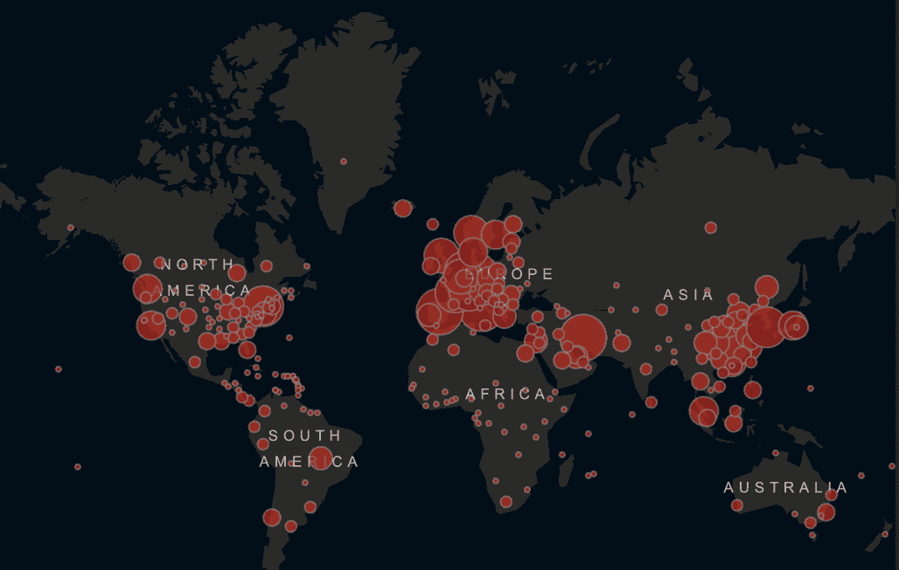
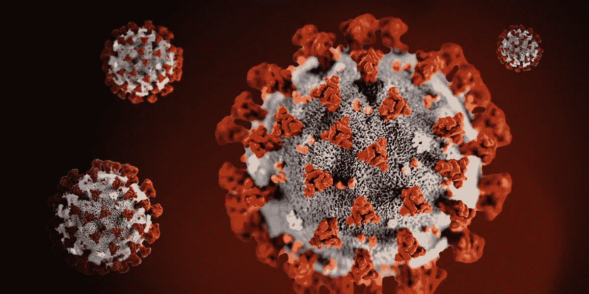

# CORD-19:数据科学对新冠肺炎的回应

> 原文：<https://towardsdatascience.com/cord-19-the-data-science-response-to-covid-19-46d57ab811f3?source=collection_archive---------39----------------------->

## 通过 CORD-19，白宫呼吁数据科学界提供来自 NLP 和其他机器学习算法的见解。

新冠肺炎病例地图[ [来源](https://www.arcgis.com/apps/opsdashboard/index.html)

目前，全世界团结一致，共同对抗一个共同的对手:新冠肺炎病毒，这种病毒也被简称为冠状病毒。仅仅几周时间，这种病毒就以指数级的速度在全世界传播开来(咄，这就是它的工作方式)。因为数据科学社区的许多成员现在大部分时间都呆在家里，不知道如何利用他们的技能来帮助根除病毒。有许多方法，但有一个特别有意义的方法直接来自白宫本身:CORD-19。

# 动机

在此之前，让我们后退一步，确保我们都熟悉病毒是如何一次又一次地传播的。

[MeltingAsphalt](https://meltingasphalt.com/) 的凯文·西姆勒制作了一个很棒的[系列互动图](https://meltingasphalt.com/interactive/outbreak/)，展示了任何病毒是如何传播的*(代码[这里是](https://github.com/kevinsimler/outbreak))。*

约翰·霍普金斯大学(JHU)已经挺身而出，在全球范围内提供对大量分析的持续跟踪。点击下面的链接，浏览他们的图表，这些图表显示了一段时间内的全球病例、死亡和恢复情况。

 [## 追踪者

### 新冠肺炎（新型冠状病毒肺炎）

shiny.john-coene.com](https://shiny.john-coene.com/coronavirus-embed?data=jhu&amp;chart=cases-added&amp;cumulative=false) 

他们还创建了一个令人惊叹的仪表盘，其中包括确诊病例的 ArcGIS 地图。地图两边的表格列出了按国家分列的病例和死亡情况。对于美国的读者，请注意欧洲病例的密度。专家说，美国没有做足够的工作来防止这种密度在 1-2 周内发生。点击下面的链接浏览数字。要查看这篇没有媒体编辑器的 iframe 限制的文章，请在这里查看。

 [## 使用 ArcGIS 的新冠肺炎仪表盘

### 新冠肺炎（新型冠状病毒肺炎）

www.arcgis.com](https://www.arcgis.com/apps/opsdashboard/index.html#/bda7594740fd40299423467b48e9ecf6) 

好了，回到病毒。我们都很清楚它们是如何通过指数增长传播的(学究式地说，这实际上是逻辑增长)。要想直观地了解新冠肺炎的这一过程，只需看看格兰特·桑德森精彩的 [3Blue1Brown](https://www.youtube.com/channel/UCYO_jab_esuFRV4b17AJtAw) 频道:

格兰特·桑德龙对新冠肺炎突围赛的讨论

# CORD-19 概述

新冠肺炎分子[ [来源](https://www.live5news.com/resizer/ARYUWY8X0-zLdZ_-jFrLwFPa3Tk=/1200x600/arc-anglerfish-arc2-prod-raycom.s3.amazonaws.com/public/RKIWEAUBM5BUXM3HDFT362KQWY.png)

我想你现在有足够的动力了。那些没有的人可能还在玩上面的地图。不管怎样，我很高兴你有动力，因为我们现在有工作要做。

白宫向技术界发出了[行动号召](https://www.whitehouse.gov/briefings-statements/call-action-tech-community-new-machine-readable-covid-19-dataset/)，从大量冠状病毒文献中获取真知灼见。数据(CORD-19)多为关于各种冠状病毒的文字文章。因此，它强烈呼吁自然语言处理(NLP)社区提供见解。各位，准备好迎接即将到来的以[芝麻街为主题的](https://www.theverge.com/2019/12/11/20993407/ai-language-models-muppets-sesame-street-muppetware-elmo-bert-ernie)模特名字:CORDBERT、BERTID19、CoronaBERT 等。

在这一点上，许多数据科学资深人士会嘲笑和抱怨他们的大部分时间是如何花费在准备数据上，而不是使用数据。我有个好消息:CORD-19 开箱即可机读。

> *今天，来自艾伦人工智能研究所、Chan Zuckerberg Initiative (CZI)、乔治城大学安全和新兴技术中心(CSET)、微软和美国国立卫生研究院国家医学图书馆(NLM)的研究人员和领导人发布了关于新冠肺炎、新型冠状病毒和冠状病毒群的学术文献的*新冠肺炎开放研究数据集(CORD-19) *。*
> 
> *应白宫科学与技术政策办公室的要求，该数据集代表了迄今为止可用于数据和文本挖掘的最广泛的机器可读冠状病毒文献集合，包含超过 29，000 篇文章，其中超过 13，000 篇具有全文。*
> 
> [*whitehouse.gov*](https://www.whitehouse.gov/briefings-statements/call-action-tech-community-new-machine-readable-covid-19-dataset/)

# 加入战斗

Kaggle 是一个数据科学社区，现在在谷歌的保护伞下，已经形成了正式的挑战，从呼吁行动。下面是您的逐步启动和运行流程:

1.  阅读[主页](https://pages.semanticscholar.org/coronavirus-research)获取 CORD-19 数据。
2.  查看主 Kaggle 挑战的[任务](https://www.kaggle.com/allen-institute-for-ai/CORD-19-research-challenge/tasks)。
3.  查看其他用户所做的[现有分析](https://www.kaggle.com/allen-institute-for-ai/CORD-19-research-challenge/kernels)。
4.  [与其他用户讨论](https://www.kaggle.com/allen-institute-for-ai/CORD-19-research-challenge/discussion)调查结果。
5.  参加[第 1 周预测挑战](https://www.kaggle.com/c/covid19-global-forecasting-week-1)。考虑使用 [DeepNote](https://lifewithdata.org/deepnote-sets-course-to-become-the-jupyter-killer/) 笔记本进行分析，或者使用 [AutoML](https://lifewithdata.org/with-autogluon-aws-brings-automl-to-their-platform/) 自动训练模型。

# 保持最新状态

学术界和工业界的事情发生得非常快！通过一般的 [LifeWithData 博客](https://lifewithdata.org/blog/)和 [ML UTD 时事通讯](https://lifewithdata.org/tag/ml-utd/)让自己保持最新状态。

如果你不是收件箱时事通讯的粉丝，但仍然想参与其中，考虑将这个 URL 添加到一个聚合设置中。

*原载于 2020 年 3 月 19 日 https://lifewithdata.org**的* [*。*](https://lifewithdata.org/cord-19/)