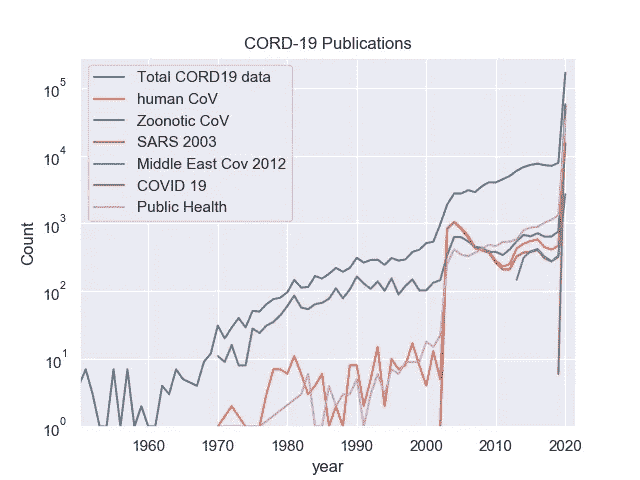
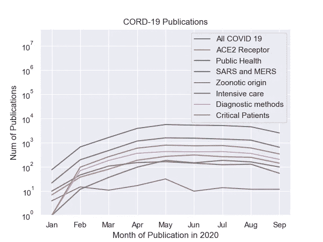
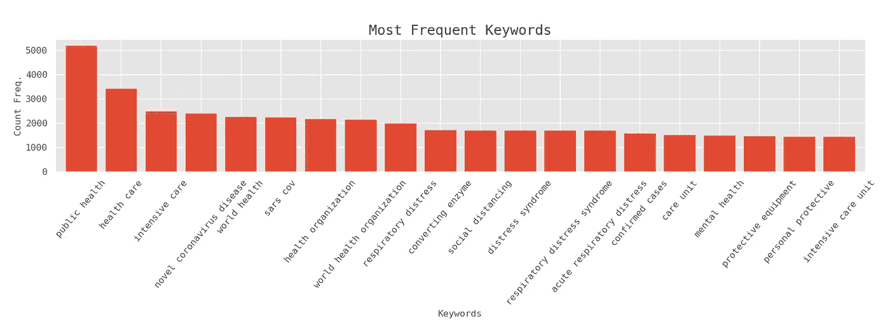
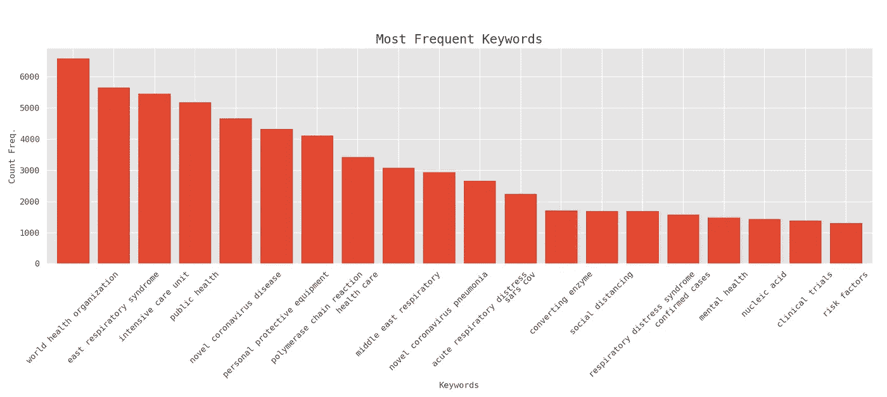
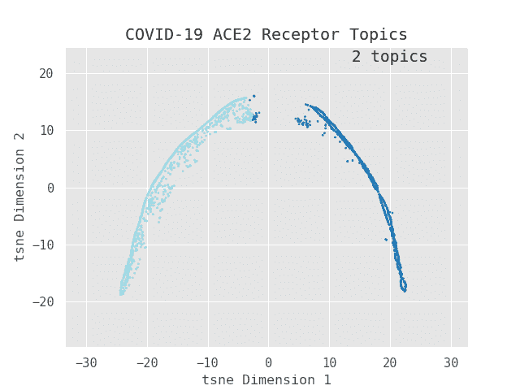
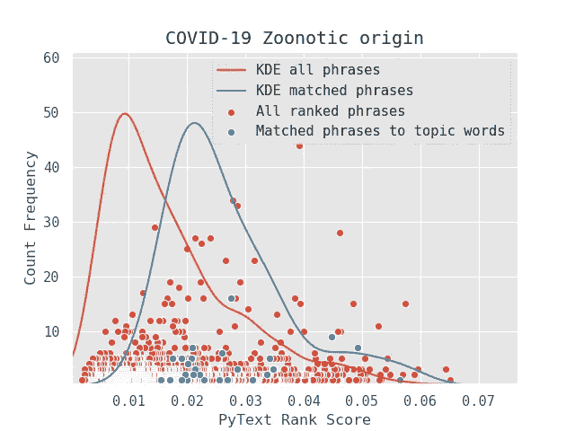
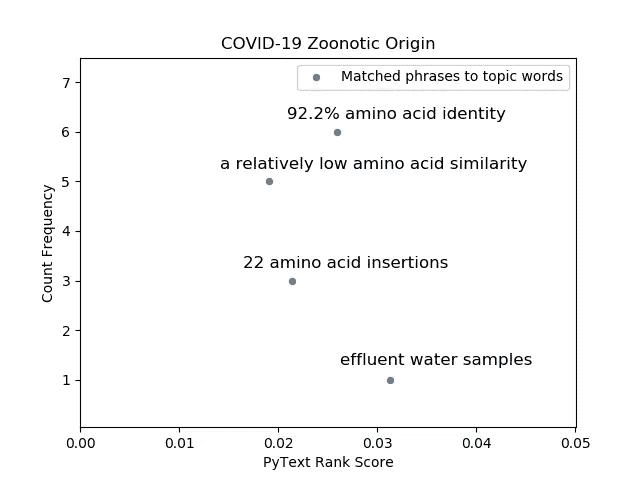

# CORD Crusher:将新冠肺炎数据分割成摘要

> 原文：<https://towardsdatascience.com/cord-crusher-slicing-the-cord-19-data-into-summaries-ca5d8f95e276?source=collection_archive---------40----------------------->

## 我第一次使用自然语言处理深入研究文本数据

在 12 月新冠肺炎疫情爆发的早期，我和妻子在舒适的被窝里等待我们儿子的出生。在他出生后，很明显，新冠肺炎病毒的爆发控制了世界。1985 年底，也就是 1986 年 4 月切尔诺贝利灾难的前几个月，我开始更多地思考自己的出生。似乎在一个不断发展的世界里，新的生活和新的挑战总是相伴而生。所以每当儿子睡觉的时候(没有我本来想的那么多)，我就悄悄拿起电脑开始涉水，然后游泳，最后一头扎进 python 中的自然语言处理(NLP)。

2020 年 3 月，[白宫科技政策办公室](https://www.whitehouse.gov/briefings-statements/call-action-tech-community-new-machine-readable-covid-19-dataset/)发布了 CORD 19 数据集和行动呼吁:

> “呼吁国家人工智能专家开发新的文本和数据挖掘技术，帮助科学界回答与新冠肺炎相关的高优先级科学问题”


由 [Caleb Perez](https://unsplash.com/@caleblaz?utm_source=medium&utm_medium=referral) 在 [Unsplash](https://unsplash.com?utm_source=medium&utm_medium=referral) 上拍摄的照片

CORD 19 是开发代码以找到关于新型冠状病毒的相关和及时信息的绝佳机会。可用的 NLP 包和技术的数量多得令人应接不暇(例如 [RoBERTa](https://medium.com/analytics-vidhya/6-steps-to-build-roberta-a-robustly-optimised-bert-pretraining-approach-e508ebe78b96) ，这也是我岳母的名字，她向我们宣布了新病毒的消息)，并且这个列表还在扩展。在本文中，我将演示如何将这些 NLP 包放在一起构建一个名为 CORD crusher 的摘要代码。我将放大我的 NLP 代码的组件，解释它们的功能，并展示它们是如何组合在一起的。五个主要步骤是:

1.  按出版年份将数据划分为时间范围

2.根据广泛的主题提取关键词和分组论文

3.从每个主题的关键词建立主题

4.将关键词提炼为更具体的主题短语

5.搜索代码 19 文本并按相似性排序

## 粗略但快速提取的关键字

我发现 [RAKE](https://www.researchgate.net/publication/227988510_Automatic_Keyword_Extraction_from_Individual_Documents) (快速自动关键词提取)既是一种快速的算法，也是一种直观的算法。像“新型冠状病毒”这样的关键词将包含多个单词，每个文档可能使用不同的术语:“新型冠状病毒”、“COVID 19”、“2019-nCoV”。RAKE 只考虑单个文档中的关键字，而不是所有的 CORD 19 出版物。这有助于根据单个出版物的术语查找关键字。

RAKE 关键字评分是基于词频和与其他词共现的图表。直观上，这可以理解为单词相关矩阵，其中对角线是词频，其他条目是一个单词与另一个单词相邻的概率。这种简单的方法降低了计算成本，是提高算法速度的关键(120 个单词不到 1 毫秒)。

由于关键字强烈地代表了文档的上下文，我希望出版物的标题和摘要是查找关键字的主要位置。出版物的这些部分是为了给读者提供所有内容的概要。

```
**Full abstract and title
Are pangolins the intermediate host of the 2019 novel coronavirus (SARS-CoV-2)?**
The outbreak of a novel corona Virus Disease 2019 (COVID-19) in the city of Wuhan, China has resulted in more than 1.7 million laboratory confirmed cases all over the world. Recent studies showed that SARS-CoV-2 was likely originated from bats, but its intermediate hosts are still largely unknown. In this study, we assembled the complete genome of a coronavirus identified in 3 sick Malayan pangolins. The molecular and phylogenetic analyses showed that this pangolin coronavirus (pangolin-CoV-2020) is genetically related to the SARS-CoV-2 as well as a group of bat coronaviruses but do not support the SARS-CoV-2 emerged directly from the pangolin-CoV-2020\. Our study suggests that pangolins are natural hosts of Betacoronaviruses. Large surveillance of coronaviruses in pangolins could improve our understanding of the spectrum of coronaviruses in pangolins. In addition to conservation of wildlife, minimizing the exposures of humans to wildlife will be important to reduce the spillover risks of coronaviruses from wild animals to humans.**Top 20 Rake keywords:** million laboratory confirmed cases novel corona virus disease sick **malayan pangolins** **novel coronavirus** unknown recent studies showed **phylogenetic analyses** showed pangolins improve emerged coronavirus identified wild animals risks natural hosts originated large surveillance **intermediate hosts** intermediate host related **complete genome**
```

在上面的例子中，180 个单词的全文被浓缩为 40 个单词，其中关键词包含的信息足以识别该文章是关于新冠肺炎的，关键词是“新型冠状病毒”，并且是关于“系统发育分析”中穿山甲的潜在中间宿主。算法还成功配对了“马来亚”和“穿山甲”。这 40 个单词并不概括摘要，而是标记出可以用来标记出版物主题的最多的关键词，并将其与提到相同单词的其他关键词进行分组。

上述示例还表明，许多关键词仍然过于笼统，例如“最近的研究”或“实验室确诊病例”，但这些将在稍后阶段使用*术语频率逆文档频率权重* (TFIDF)进行处理，以找到更具体的罕见关键词。

## 几十年来的 CORD 19 数据

作为物理学家，时间维度一直是衡量系统演化的一个重要特征。此外，将 CORD-19 的元数据 csv 文件划分为时间范围是管理代码的内存和 CPU 使用的一种有用技术。选择正确的时间范围还可以根据下图中的特征对出版物进行大致分组。



(作者图片)出版年份与 CORD-19 数据集中的出版物数量。

CORD 19 的出版物可以追溯到 1870 年，但是早期的出版物通常没有机器可读的全文。到 1970 年，只有少数出版物可用于文本挖掘，其中大多数是关于动物中的冠状病毒(人畜共患冠状病毒)。关于人类冠状病毒株(如 229E 和 OC43)的出版物数量也很少，因为这些病毒导致轻微症状而不是流行病。出版物的大幅增长出现在 2002 年 SARS 流行期间，导致了 2002 年至 2005 年红线内出版物的峰值。在 2012 年中东呼吸综合征疫情期间，紫色线也出现了一个较小的峰值。正如预期的那样，数据集中的大多数出版物都是 2019 年至 2020 年新冠肺炎疫情期间的出版物。

元数据按照这些趋势分为时间范围:1970-1990 年，1990-2002 年，2002-2005 年，2005-2012 年，2012-2019 年，2019 年至今。元数据可以作为 pandas 数据帧被加载，并且“publish_time”列被转换为 datetime64:

```
##For a given path to the CORD 19 data and a range [startyear, endyear]
df=pd.read_csv(‘%s/metadata.csv’%PATH)
df[“publish_time”] = df[“publish_time”].astype(“datetime64”)
df=df[(df[‘publish_time’]<’%d-1–1' %endyear) & (df[‘publish_time’]>=’%d-1–1' %startyear)]
```

对于每个时间范围，我们预计某些关键词会更流行，如公共卫生是 2002 年 SARS 爆发后更常见的关键词。在 2002 年之前，我们预计大多数关键词都与动物冠状病毒有关，而不是人类病毒株。2019 年后，大部分出版物都以新冠肺炎术语为关键词。这种时间切片利用了 SARS、MERS 和新冠肺炎(大约相隔 10 年)等不同冠状病毒爆发之间的明显差异。

空间为我的代码提供了主干。SpaCy 提供了一个管道，可以自动将文本分解成标记，分配词性，并根据单词之间的相互依赖关系分配标签。它还将 PyTextRank 和 RAKE 等包集成到处理管道中，以提高速度和一致性。选择特定的空间模型可以改善结果，对于 CORD 19，有一个针对生物医学数据进行训练的[科学空间](https://allenai.github.io/scispacy/)。

SpaCy 也是将关键字匹配到 CORD 19 文本的强大工具。在每个出版物的摘要中找到的匹配关键词被用于根据主题(例如，公共卫生、重症监护、诊断技术)来标记该出版物。匹配[的两种主要方式是短语匹配](https://spacy.io/usage/rule-based-matching#phrasematcher)(用于寻找更精确的术语)和基于[规则的匹配](https://spacy.io/usage/rule-based-matching#matcher)(寻找更多样的术语)。短语匹配往往运行得很快，因为字符串存储为哈希值(以节省内存)，并且使用词汇字典在哈希值和字符串之间进行转换。“重症监护室”下面的模式既用作分配为匹配模式的主题“ICU”的关键字:

```
##Simple Phrase matchingmatcher = PhraseMatcher(nlp.vocab, attr='LOWER')
patterns=[nlp.make_doc(‘intensive care unit’)]### Don't need full spacy pipeline only need the text
 matcher.add(“ICU”, None, *patterns)### store string as a hash valuefor doc in docs:#### for a list of docs
        #print(doc.text)
        matches=matcher(doc)### Return matched values
        FoundMatches=[]
        for match_id, start, end in matches:
            FoundMatches.append(nlpsci.vocab.strings[match_id])### convert hash value to string and store it in a list
```

基于规则的匹配依赖于知道产生给定术语的可能记号、记号的顺序或标点符号的分隔。下面的代码匹配一个术语“计算机断层扫描”(CT)。下面基于规则的模式使用带有“IN”属性的列表作为逻辑 OR，用于列表中的任何单词。逻辑运算“+”要求列表中的每个单词至少匹配一次。这就产生了一组 ct 术语，如“胸部扫描”、“ct 扫描”、“胸部发现”和“CT 发现”。也可以通过“+”操作找到类似“胸部 ct 扫描”的模式。在这种情况下，使用几个关键字来匹配主题 ct，而不是主题 ICU，在 ICU 中只有一个字符串“重症监护室”。(关于空间匹配模式和代码练习的更多信息，请查看 Ines Montani 的[教程](https://course.spacy.io/en)

```
#### Rule based matching
matcher = Matcher(nlp.vocab)
CT=[{“LOWER”:{“IN”:[“chest”,”ct”]},”OP”:”+”}
, {“LOWER”:{“IN”:[“scans”,”findings”, “ct”]}, “OP”:”+”}]
 matcher.add(“CT”,None,CT)
```



(作者拍摄的照片)2020 年的月份与出版物数量的对比，分为以新冠肺炎为关键词的总出版物和包括更具体关键词的出版物。(最新 CORD 19 更新于 2020 年 9 月 20 日)

在上面的图中，我只使用找到新冠肺炎匹配模式的出版物，并查看最常见的关联模式。查看出版物数量最多的 2020 年，您可以看到每月出版物主题的细分:

*   最常发表的主题是公共卫生、识别易受感染的病人和诊断方法。
*   新冠肺炎与 SARS 和 MERS 一起被提及，以吸取以往疫情的经验。ACE2 这个词每月都频繁出现，就像与新冠肺炎相关的 SARS 和 MERS 一样。这可能是由于 SARS 病毒和新冠肺炎病毒与相同的人类 ACE2 细胞受体结合。
*   重症监护的主题在 3 月前爆发的早期更为罕见，但随后由于有更多的病例数据，每月都有数百篇出版物。
*   最罕见的关键词是与新冠肺炎一起被提及的冠状病毒动物毒株。在数以千计被贴上新冠肺炎标签的出版物中，每月只有大约 10 种。

## 将关键字组合成二元模型和三元模型

N-gram 是 N 个单词的序列，对于将单个标记组合成更具描述性的特征非常有用。一些术语，如“计算机断层摄影”是有用的二元模型(N=2 ),用于研究诊断主题。三元模型(N=3)也经常出现在 CORD 19 数据中，如“世界卫生组织”、“重症监护病房”或“急性呼吸窘迫”。为了查看不同 N-gram 的频率，我使用了类似 CountVectorizer 的 [sklearn 特征提取工具](https://scikit-learn.org/stable/modules/generated/sklearn.feature_extraction.text.CountVectorizer.html)，该工具还设置了序列的最小和最大范围:

```
tf_vectorizer = CountVectorizer(ngram_range=(2,3)) ### Uses only bigrams up to trigrams
tf=tf_vectorizer.fit_transform(skl_texts)####transform and learn the vocab from the list of keywords in skl_texts
```

上面给出了二元模型和三元模型计数(tf)的矩阵，可以将其转换为一系列用于绘图:

```
d = pd.Series(tf.toarray().sum(axis=0),index = features).sort_values(ascending=False)
 ax = d[:no_most_frequent].plot(kind=’bar’, figsize=(8,8), width=.8, fontsize=12, rot=50,title=’Most Frequent Keywords’) #### plot the top no_most_frequent 
```

以新冠肺炎和公共卫生为例，我得到了下面的直方图:



(作者照片)关于新冠肺炎和公共卫生的出版物中倾斜关键词的计数(在将二元模型合并到三元模型之前)



(作者图片)基于 Levenshtein 距离将二元模型合并为三元模型后倾斜关键词的计数。

尽管一些关键词看起来很有用(如“社会距离”、“重症监护室”)，但一些三元组被错误地拆分，如“世界卫生”和“卫生组织”应拼凑成“世界卫生组织”。为了进行这种关联，我使用了[模糊字符串匹配](https://medium.com/nlpgurukool/fuzzy-matching-1baac719aa25)，并基于 [Levenshtein 距离](/fuzzywuzzy-how-to-measure-string-distance-on-python-4e8852d7c18f)给出了二元模型与三元模型相似程度的比率窗口。我存储了一个二元模型字典，其中三元模型的 Levenshtein 距离在 64 到 100 之间。这说明“世界卫生组织”是出现频率最高的词。像“个人防护装备”这样的三元组在从“个人防护”拼凑回来时也变得更加频繁。这种与模糊字符串匹配的合并显示了对特征的更精确的计数，这些特征可以被输入到代码的下一阶段以用于主题构建。

## 从主题构建主题

上述主题仅给出了一个宽泛的主题类型，将论文粗略地划分为几组特征。计数直方图已经显示了一个特征趋势:不太频繁的词往往是关于更具体的主题，如“社交距离”，而非常频繁的词过于笼统，会匹配大量的文本，如“世界卫生组织”。

说明这种趋势的一个好方法是将关键词表示为[术语-频率逆文档频率](/tf-term-frequency-idf-inverse-document-frequency-from-scratch-in-python-6c2b61b78558) (TF-IDF)矩阵。术语频率是文档中关键字的计数除以总字数。逆文档频率是文档总数除以所有文档的特征计数。该比率的对数允许计算大量文档的 TF-IDF 分数。TF-IDF 分数是通过将两个术语相乘来计算的:术语频率和逆文档频率。对于在所选数据中频繁出现的词，如“世界卫生组织”或“公共卫生”，得分较低。与所有文档相比，在一个文档中频繁出现的单词的 TF-IDF 得分较高，如“社交距离”。特征的这种表示根据它们作为有用搜索词的相关性对它们进行适当的加权。

```
##### Can also use only the top TF scored features (set with max_features) and require them to have a more than 5000 for their document frequency (set with max_df)
tfidf_vectorizer = TfidfVectorizer(max_features=no_features,ngram_range=(2,3),max_df=5000)####Create the TF-IDF matrix and score the list of features in skl_texts 
tfidf = tfidf_vectorizer.fit_transform(skl_texts)
```

如何处理特征的 TF-IDF 值矩阵？答案是将其分解成更小的矩阵，这些矩阵的乘积近似等于原始矩阵。我们可以利用 TF-IDF 矩阵是一个非负矩形矩阵的事实(维数为 *N* 个文档和 *M* 个关键词)所以[它可以近似地被两个非负矩阵](https://en.wikipedia.org/wiki/Nonnegative_matrix)分解。因子的矩形矩阵( *WH* )需要有一个指定的参数，即主题或聚类的数量:

> **V[行:列]=V [文档:术语]=W(文档:主题)H(主题:**术语 **)**

使用成本函数找到这些因素，一个简单的成本函数如 *||V-WH||* (误差平方和)产生了[K-均值聚类算法](/k-means-clustering-with-scikit-learn-6b47a369a83c)。对于我的代码，我使用了用于[潜在语义分析的相同成本函数](/latent-semantic-analysis-sentiment-classification-with-python-5f657346f6a3)[kul back-lei bler 成本函数](https://medium.com/@cotra.marko/making-sense-of-the-kullback-leibler-kl-divergence-b0d57ee10e0a)，它基于对数似然比 *P/Q* 为相同的数据 X 将主题模型 *P* 与主题模型 *Q* 分开。如果 *P* 是比 *Q* 更好的模型，数据 *X* 将给出更大的对数似然值。这种模式的非负矩阵分解(NMF)可以使用 [sklearn](https://scikit-learn.org/stable/modules/generated/sklearn.decomposition.NMF.html) 来完成:

```
#### Specify the number of topics and the loss function, then fit to the TF-idf matrix to get the factorized model
nmf = NMF(n_components=no_topics,beta_loss=’kullback-leibler’).fit(tfidf)
```

主题的数量可能是一个关键参数，太少可能无法最大化分离能力，导致主题不一致。过多的主题会导致冗余的主题，每个主题包含的信息很少。如果不观察 2D 的主题群，很难理解这种分离的力量。t-SNE 是一种有用的方法，可以看到投射到 2D(甚至 3D)平面的主题群(从更高维度)。



(作者拍摄的照片)动画图，使用在受试者新冠肺炎和 ACE2 细胞受体中找到的关键字，为每一帧运行不同数量主题(2，4，8，10，15)的 NMF。基于上述 15 个主题，最大化主题分离，同时保持主题集群相当一致。

主题数量合适的 2D 投影应该看起来像是烟花爆炸的碎片。这些簇应该彼此分开，并且每个簇中的点应该靠近质心。

用 NMF 创建的主题有什么用处？

*   每个受试者(如 COVID-19 和 ACE2)都可以分解成更具体的主题。每个主题只是一个排序的关键字列表(二元模型和三元模型)，可用于在 CORD 19 数据中查找相似的文本。(接下来将对此进行描述)
*   NMF 模型还可以用于预测添加到 CORD 19 的新文档的主题，而不必再次运行该算法
*   原始的 TFIDF 矩阵可以进行类似的转换，以找到每个主题的最典型的文档标题。

```
### Print keywords per topic:feature_names = tfidf_vectorizer.get_feature_names()for topic_idx, topic in enumerate(nmf.components_):
   print(", ".join([feature_names[i]for i in topic.argsort()[:-no_top_words - 1:-1]]))##### predict topic for new publicationstfidf_LatestCORDData = tfidf_vectorizer.transform(new_keywordsinAbstract)X_new = nmf.transform(tfidf_LatestCORDData)#### this makes an embeddingpredicted_topics = [np.argsort(each)[::-1][0] for each in X_new]### Most likely topic per document#### Lookup the most typical paper titles per topicnmf_embedding = nmf.transform(tfidf)### Transform original TFIDF matrix used to predict topicsnmf_embedding = (nmf_embedding - 
nmf_embedding.mean(axis=0))/nmf_embedding.std(axis=0)### see how far away the scores are from the averagetop_idx = np.argsort(nmf_embedding,axis=0)[-10:]### Top 10 document indicesfor idxs in top_idx.T:#### A loop over topics for idx in idxs:print(SelectedRows.iloc[idx]['title'])### Top 10 most common documents per topic where idx is the index in the dataframe that stored the keywords, abstract and titles for the selected papers
```

为了看事情如何具体地结合在一起，我用 NMF 建立了 3 个关于新冠肺炎及其动物传染病起源的话题。下面的文本框显示了每个主题的前 10 个主题关键字和前 3 个文档标题:

```
#####Topic Keywords#######
Topic 0:
seafood wholesale market, world health organization, major public health, huanan seafood wholesale, viral rna, public health emergency, global public health, **species transmission**, codon usage, confirmed casesTopic 1:
time evolution signal, antiviral drugs, **genomic sequences**, host taxa, feline infectious peritonitis, neuromyelitis optica, phylogenetic tree, sequence identity, length genome, animal healthTopic 2:
**spike protein** insertions, epidemic diarrhea virus, potential therapeutic options, receptor binding domain, major public health, infectious peritonitis virus, porcine epidemic diarrhea, feline infectious peritonitis, amino acid, water samples##### Top 3 Document titles from the Transform #######
Topic 0:
**Cross-species transmission** of the newly identified coronavirus 2019-nCoV
The Natural History, Pathobiology, and Clinical Manifestations of SARS-CoV-2 Infections
Global genetic patterns reveal host tropism versus cross-taxon transmission of bat BetacoronavirusesTopic 1: 
COVID-19, Companion Animals, Comparative Medicine, and One Health
**Mapping genome variation** of SARS-CoV-2 worldwide highlights the impact of COVID-19 super-spreaders
Identification and Analysis of Unstructured, Linear B-Cell Epitopes in SARS-CoV-2 Virion Proteins for Vaccine Development.Topic 2: 
Development of a TaqMan-probe-based multiplex real-time PCR for the simultaneous detection of emerging and reemerging swine coronaviruses
Genome based evolutionary lineage of SARS-CoV-2 towards the development of novel chimeric vaccine
Structural basis of SARS-CoV-2 **spike protein** induced by ACE2.
```

基于以上所述，主题 0 很可能带有“跨物种传播”的标签，因为该术语出现在排名关键词和最典型文档的标题中。出于类似的原因，主题 1 可能带有“基因组序列”的标签。根据标题和主题关键字，主题 2 不太清楚，因此我们将在下一节中以该主题为例。

## 匹配和排列文本

在实际开采的类比中，在文本开采的这一点上，我们有粗切的石头，可以进一步提炼为珍贵的宝石，以备鉴定。提炼的过程包括从主题关键词中构建短语，以便可以基于抽象的短语进行更具体的文本搜索。评估取决于给定的出版物、匹配句子的段落或单句与 CORD 19 数据中其他内容的相关程度。

为了提炼关键词，我在出版物摘要上使用 PyTextRank 来获得更具体的主题短语。主题短语包含主题单词和附加的上下文信息，以改进搜索。 [PyTextRank](https://web.eecs.umich.edu/~mihalcea/papers/mihalcea.emnlp04.pdf) 是 TextRank 算法的 python 实现，它根据图形中的关联对主题短语进行排序。它通常用于摘录摘要，因为它可以推断主题短语(图中的顶点)之间的链接，并根据顶点的重要性按相关性对它们进行排序。与 RAKE 相比，PyTextRank 运行速度较慢，但也能更准确地指示论文的上下文。

回到上一步的例子，关于新冠肺炎的动物传染病起源的话题 2 很难用话题词来确定。有些话题词像“氨基酸”还是很模糊的。在下面的文本框中，您可以看到主题短语如何使主题单词“氨基酸”更加具体:

```
Topic 2:
spike protein insertions, epidemic diarrhea virus, potential therapeutic options, receptor binding domain, major public health, infectious peritonitis virus, porcine epidemic diarrhea, feline infectious peritonitis, **amino acid**, water samplesPyTextRank Phrases:
'multiple amino acids', 'two secondary water samples', 'influent, secondary and tertiary effluent water samples', 'five amino acids', 'effluent water samples', 'feline infectious peritonitis virus', 'coronavirus spike protein receptor binding domain', 'key amino acids', '**one noncritical amino acid difference**', '**92.2% amino acid identity**', '**a double amino acid insertion**', '**these variable amino acids**', 'porcine epidemic diarrhea virus', '**a noncritical amino acid**', '**a relatively low amino acid similarity**', 'the spike surface glycoprotein receptor binding domain', 'all tertiary water samples', '**gene and amino acid sequence homologies**', '**a distinct 4 amino acid insert**', '**many amino acid changes**', 'negative all secondary and tertiary treated water samples', 'basic amino acids', 'the 2019-ncov spike protein insertions', '**the nucleocapsid protein amino acid and gene sequence**', 'the receptor binding domain', 'a feline infectious peritonitis (fip) virus', 'a major public health concern', '**22 amino acid insertions**'
```

类似地，其他主题词如“水样”也可以通过上面的主题短语变得更加具体。如果主题词确实代表相关的搜索词，它们应该出现在与其他短语相比 PyTextRank 得分较高的主题短语中。下图显示了这两种情况的散点图。高 PyText 等级分数(> 0.02)也导致较低的计数频率，因为与低等级分数相比，它们代表更具体的上下文。停用词的得分为 0.0(如 we、is、the)。包含主题词“冠状病毒刺突蛋白*受体结合域*的得分最高的短语明确了结合域在冠状病毒刺突蛋白上。基于主题短语，主题 2 可能具有标签“刺突蛋白氨基酸插入”。



(作者提供图片)主题短语计数与其 PyTextRank 得分的散点图。通过在包含主题关键词的出版物摘要上使用 PyTextRank 来找到短语。上面的点显示了所有的短语，以及包含主题词的短语。核密度估计显示所有短语倾向于大部分处于较低的等级分数，而那些包含主题关键词的短语处于较大的值。

下面的图表显示了新冠肺炎动物传染病起源的三个主题中的一些主题短语。一般来说，短语的等级越高，在出版物摘要中出现的频率就越低。这提供了更具体的搜索短语，用于搜索 CORD 19 文本以获得有价值的见解。



(作者拍摄)关于新冠肺炎动物传染病起源的 3 个主题的主题短语示例。等级分数越大(越相关)，短语越不频繁(越具体)。

SpaCy 短语匹配器再次用于在出版物正文中查找匹配的文本。考虑到具有匹配文本或来自 NMF 嵌入的所有出版物，可以使用余弦相似度来比较出版物的全文:

```
Corpus=[]
for pub in PubPaths:### Loop over publications
    BodyText=[]
    SkimmedText=SkimallText(Filepath+p,nlpsci)#### return all lines of the paper
    BodyText.extend(SkimmedText)####Full text not just the abstract
    Doc=".".join(BodyText)
    Corpus.append(Doc)
tfidf_vectorizer = TfidfVectorizer()####Build TF-IDF matrix
tfidf = tfidf_vectorizer.fit_transform(Corpus)####Score all the text data
SimilarityArray=cosine_similarity(tfidf, tfidf)#### Make a similarity matrix from the TF-IDF matrix 
nx_graph = nx.from_numpy_array(SimilarityArray)#### Convert similarity matrix into a graph
scores = nx.pagerank(nx_graph)#### Use page rank to score graph vertices
for i,s in enumerate(Titles):##### Print out titles and their scores
        rank.append(scores[i])
        titles.append(s)
```

与主题 2 最相似的前 3 个文档是:

1.  [新型冠状病毒刺突蛋白的系统发育分析和结构建模揭示了一个进化独特且蛋白水解敏感的激活环](https://www.ncbi.nlm.nih.gov/pubmed/32320687)
2.  [新冠肺炎疫情:分类学、遗传学、流行病学、诊断、治疗和控制的全面综述](https://www.ncbi.nlm.nih.gov/pubmed/32344679/)
3.  [探索新型冠状病毒刺突糖蛋白的基因组和蛋白质组变异:一种计算生物学方法](https://www.sciencedirect.com/science/article/pii/S1567134820302203)

类似地，如果上面代码块中的语料库填充了文档中匹配文本的段落(而不是完整的正文文本)，则可以用余弦相似度对段落进行排序。排名最高的段落是:

> “在 S1 内，发现 N-末端结构域(NTD)与受体结合结构域(RBD，74%同一性)相比保守性较低(51%同一性)……然而， 暴露的环特征已经在模型和 cryo-EM CoV S 结构中得到证实，在 S1/S2 位点具有相似的氨基酸序列……系统发育分析中使用的 S 蛋白的氨基酸序列从图 4 获得……显示了 S1/S2 和 S2 位点的氨基酸序列……发现结构域(NTD)与受体结合结构域(RBD，74%同一性)相比保守性较低(51%)……然而， 在 S1/S2 作者/资助者处，已在具有相似氨基酸序列的模型化和 cryo-EM CoV S 结构中证明了暴露的环特征…获得了用于系统发育分析的 S 蛋白的氨基酸序列…S1/S2 和 S2 位点的氨基酸序列显示为“[*”。2019 年新型冠状病毒(nCoV)刺突蛋白的结构模型揭示了蛋白水解敏感的激活环，作为与 SARS-CoV 和相关 SARS 样冠状病毒*](https://doi.org/10.1101/2020.02.10.942185) 相比的区别特征

上面的段落仍然过于密集，无法理解是否有有用的见解，因此匹配文本的每个句子(由“…”分隔)都可以用余弦相似性对该主题进行排序。该主题的所有匹配文本中排名最大的句子是:

> “此外，我们的分析表明，来自 R. malayanus 的病毒 RmYN02，其特征是在刺突蛋白的 S1 和 S2 亚基的连接位点插入多个氨基酸，与 RaTG13 和新型冠状病毒属于同一进化枝，这为新型冠状病毒在该地区的自然起源提供了进一步的支持” [*起源和蝙蝠冠状病毒在中国的跨物种传播*](https://doi.org/10.1038/s41467-020-17687-3)

最细粒度的信息，即所选 CORD 19 数据中的句子，用余弦相似度排序可以得出简明的结论。根据上面的论文，在新型冠状病毒的刺突蛋白中插入氨基酸，负责新冠肺炎，支持了病毒起源于马头蝠(*马来菊头蝠*)的证据。

我想，如果我要简要总结我的挖掘工作，我会按照上面演示的步骤对文本进行剪切、筛选和排序。这将成千上万的文档压缩成一个简短的阅读列表。公共卫生、医学或流行病学方面的专家可以浏览这些见解，找到与他们的研究相关的有趣结论，或者调查重要的公开问题。对于数据科学家来说，将这种算法扩展到无监督的学习方法可能是有用的。最后一步可以和第一步联系起来，这样阅读列表就可以用来找到更多的关键词来标注主题。以这种方式，主题和主题将更健壮地寻找相关信息。

# 相关文章:

*   代码的灵感来自于 [**数据雪崩中描述的粒子物理和质子碰撞领域:受质子碰撞启发的文本挖掘**](https://medium.com/analytics-vidhya/avalanches-of-data-text-mining-inspired-by-proton-collisions-32bd50f8c2a5)
*   我还总结了本文中全套主题的见解: [**信息时代的见解**](https://medium.com/rebel-public-health/insights-from-the-infodemic-fa43307ef42e)
*   要阅读完整的代码，请点击这个 github 链接 [CORDCrusher](https://github.com/rpatelCERN/CORD19/) ，并且 [wiki 区域包括](https://github.com/rpatelCERN/CORD19/wiki)所有主题和题目的排名出版物、段落和句子。我的计划是随着 CORD 19 每周更新继续挖矿！
*   [链接到 CORD 19 上的数据](https://www.semanticscholar.org/cord19/download)语义学者

# 参考

[1]王陆、露西等人 [CORD-19:新冠肺炎开放研究数据集](https://arxiv.org/abs/2004.10706)(2020 年 4 月 22 日) *ArXiv* 预印本。
(上文引用的论文)
【2】Javier a . Jaimes，Nicole M. André，Jean K. Millet，Gary r . Whittaker[2019-新型冠状病毒(nCoV)刺突蛋白的结构建模揭示了一种蛋白水解敏感的激活环，作为与 SARS-CoV 和相关 SARS 样冠状病毒的区别特征](https://www.sciencedirect.com/science/article/pii/S0022283620302874?via%3Dihub)(2020 年 5 月)*分子生物学杂志* 【3】Latinne，a .，Hu，b .，Olival，K.J*Nat Commun*11、 4235 (2020)。