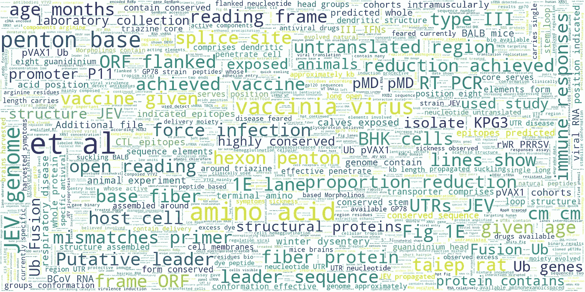

# CoronAI:新冠肺炎相关文章的深度信息抽取

> 原文：<https://towardsdatascience.com/coronai-deep-information-extraction-for-covid-19-related-articles-f7c016149586?source=collection_archive---------24----------------------->


https://alachuacounty.us/的好意，新冠肺炎

## 一种挖掘 CORD-19 冠状病毒文章数据集的无监督方法

# 介绍

我们的世界目睹了许多病毒和疫情，但就全球影响而言，它们中没有太多能与新冠肺炎相比。尽管如此，我乐观地认为，加州的“在家更安全”和“社会距离”等措施有助于彻底根除这种病毒。我们因这一疾病失去了许多伟大的人，而它似乎不愿意让我们更容易阻止这一疾病。

为了响应白宫关于使用人工智能帮助新冠肺炎研究的行动呼吁，[新冠肺炎公共数据集](https://www.kaggle.com/allen-institute-for-ai/CORD-19-research-challenge)已经由 AllenAI，微软研究院，Chan-Zuckerberg Initiative，NIH 和白宫发布。该数据集包括约 44，000 篇研究文章，涵盖了与冠状病毒(如 SARS、MERS 等)相关的各种主题。)

由于数据集没有标签，因此其上定义的主要任务都是一般性的问题，如“我们有哪些关于疫苗接种的信息？”。也有根据主题组织论文的伟大作品，如[和](https://maksimekin.github.io/COVID19-Literature-Clustering/plots/t-sne_covid-19_interactive.html)。

在这篇文章中，我们将介绍一个小工具，它可以利用自然语言处理对这些文章中的主题进行无监督聚类，这样我们就可以更好地了解这些文章中发生了什么。

# 文本片段:该数据集的原子

每个文档都由不同的部分组成，而部分标题就在我们发布的数据集中。在每篇文章中的单词之前，保留语义的最小实体是文本片段和句子。在本帖中，展示了如何在一个桶中使用这些来帮助对这些文章中的焦点进行无监督聚类。随后，给定不同的部分和部分间或纸张间的亲和力(甚至可能使用图形卷积网络、图形注意力网络等)。)或下面提到的主题组织工作，可以应用更好的聚类技术来获得更好的结果。

我们使用自然语言处理工具包的句子标记器将每篇文章分解成这些原子片段，然后为它们生成最先进的表示，以便在我们管道的后期阶段使用。

# 文本表示:一种基于 BERT 的方法

使用我们的 [word_embedding_warehouse](https://github.com/shayanfazeli/word_embedding_warehouse) 您可以轻松地获取和处理基于 BERT 的预训练表示权重，以便在 PyTorch 或 Tensorflow 中使用(文档可在[这里](http://web.cs.ucla.edu/~shayan/word_embedding_warehouse/docs/)获得)。其中的代码易于阅读，应该简单易懂。

要使用它，请使用以下方式从 github 获得该软件包:

```
git clone [https://github.com/shayanfazeli/word_embedding_warehouse.git](https://github.com/shayanfazeli/word_embedding_warehouse.git)
```

然后重定向到它的存储库并安装它:

```
python3 setup.py install
```

现在您可以运行它并获取数据。确保选择一个有大量未使用空间的文件夹，并运行以下命令:

```
build_word_embedding_warehouse --warehouse_folder=.../path_to_your_folder --clear_cache=0
```

将在其中创建表示。需要注意的一点是，注意配置中的“dropout”值，您可能需要手动将它们设置为零。

# 预处理、数据准备和生成表示

我们的 CoronAI 包及其应用程序可用于生成表示。目前，我只使用了大版本的 NCBI-伯特(现在在[这里](https://github.com/ncbi-nlp/bluebert)改名为蓝铃)来生成表示。这些权重在 PubMed archive 和 MIMIC-III 公共电子健康记录库中进行了微调，因此，假设该模型能够很好地处理医疗领域的问题是合理的。

这些权重是按照上一节中的描述生成的。现在，使用以下命令获取 CoronAI 包:

```
git clone [https://github.com/shayanfazeli/coronai.git](https://github.com/shayanfazeli/coronai.git)
```

然后继续并重定向到其文件夹，并安装软件包:

```
python3 setup.py install
```

这个库的不同部分的文档可以在[这个链接](http://web.cs.ucla.edu/~shayan/coronai/docs/)中找到。

此时，您可以使用应用程序来生成制图表达并执行无监督聚类。

## 生成基于 BERT 的表示

您可以使用以下命令生成基于 BERT 的表示(有关更多信息，请访问用于 coronai 的[github](https://github.com/shayanfazeli/coronai))。

```
*coronai_segment2vector* --gpu=2 \
--input_csv=.../text_segment_dataset.csv \
--output_pkl=.../output.pkl \
--path_to_bert_weights=.../NCBI_BERT_pubmed_mimic_uncased_L-24_H-1024_A-16 \
--batch_size=25
```

请注意，对于“NCBI _ BERT _ PubMed _ mimic _ un cased _ l”表示，您可以从 CoronAI 的共享驱动器下载它们(本文底部的链接)。

## 无监督片段组发现

为此，可以使用另一个 CoronAI 应用程序。这一部分的动机是，在这个数据集上设计的当前任务是通用任务，例如“我们对它的疫苗接种了解多少？”。但是，使用这种方法，我们可以更好地了解这个数据集中实际包含了什么。我们可以从少量集群开始，然后增加集群数量，并寻找进入稳定状态的起点。


聚类数量对基于距离的损失的影响

## 组:解释

作为解释组的例子，对于 296 个集群的情况，为每个集群创建单词 cloud。然后，我请我的一个行医的朋友来看看它们。下面是一个样本聚类的表示和一个可能的解释:



集群 35:该示例显示该组的语义主要围绕疫苗接种的概念

本页中的[提供了更多示例。](http://web.cs.ucla.edu/~shayan/coronai_some_interpretations.html)

## 科罗纳伊的共享驱动器

请点击查看[。](https://drive.google.com/drive/folders/1NGwteuPIbX3acWRLASFnos3lnhS9XgPk?usp=sharing)

附:代码和这篇文章将随着时间的推移而被编辑，因为它们都是以一种仓促的方式写成的。任何贡献也是受欢迎的。谢谢你。

# 参考

[1] Gardner，Matt 等，“Allennlp:一个深度语义的自然语言处理平台。” *arXiv 预印本 arXiv:1803.07640* (2018)。

[2] Lee，Jinhyuk，等，“BioBERT:一个用于生物医学文本挖掘的预训练生物医学语言表示模型。”*生物信息学*36.4(2020):1234–1240。

[3]彭，王一凡，，严，."生物医学自然语言处理中的迁移学习:在十个基准数据集上对 BERT 和 ELMo 的评估." *arXiv 预印本 arXiv:1906.05474* (2019)。

[4]新冠肺炎开放研究数据集与挑战:[https://www . ka ggle . com/Allen-institute-for-ai/CORD-19-Research-Challenge/kernels](https://www.kaggle.com/allen-institute-for-ai/CORD-19-research-challenge/kernels)(2020)。