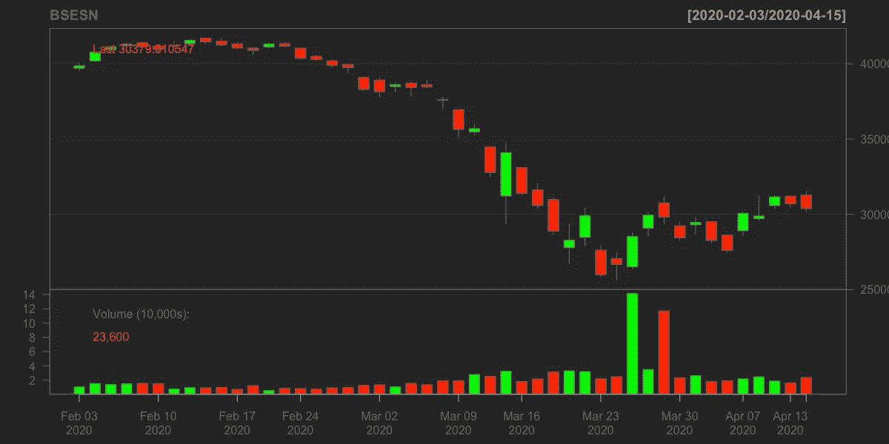
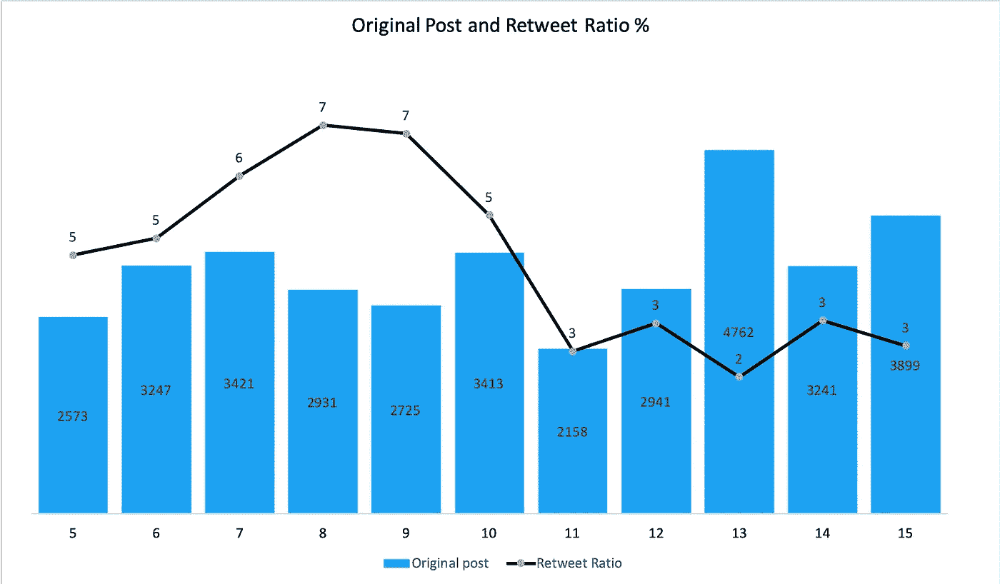
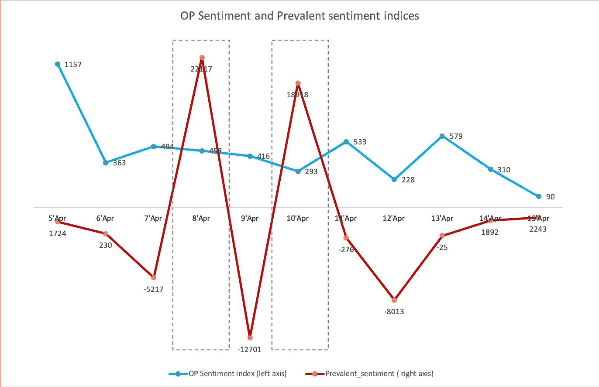
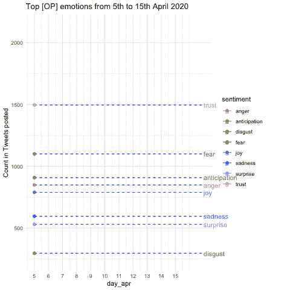
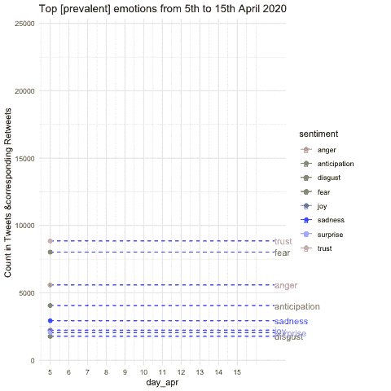
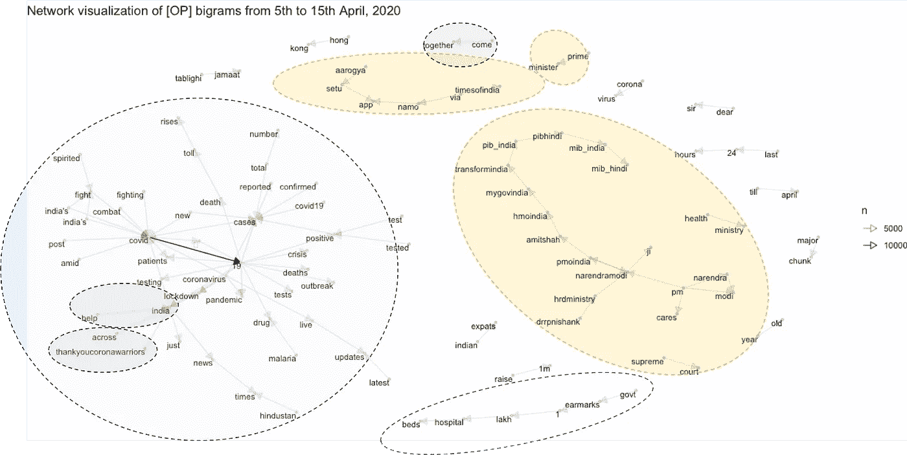
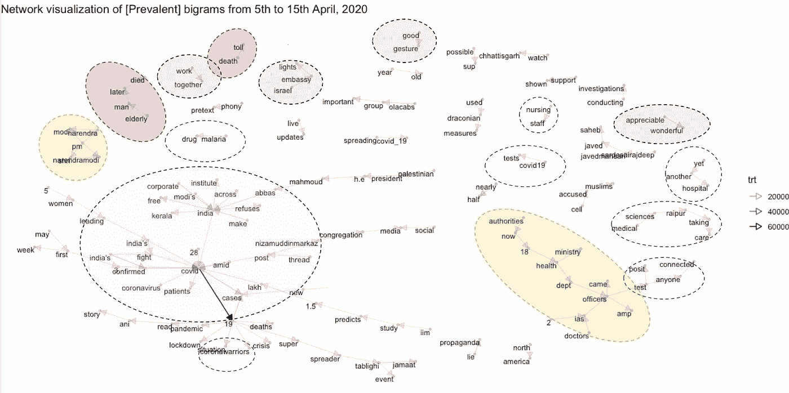
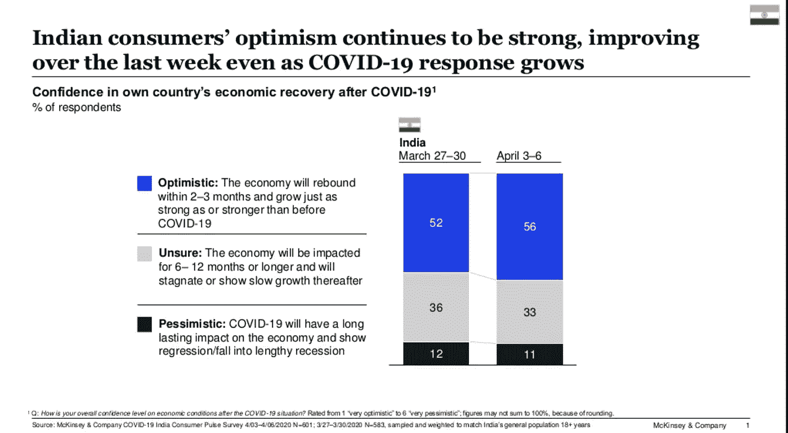
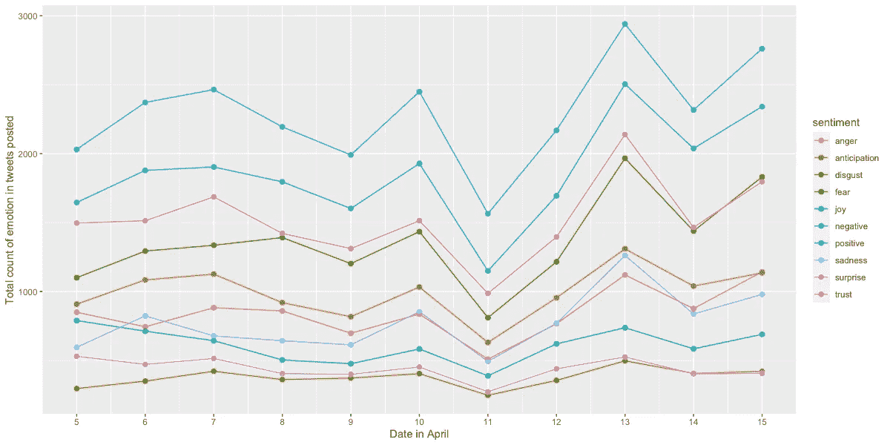
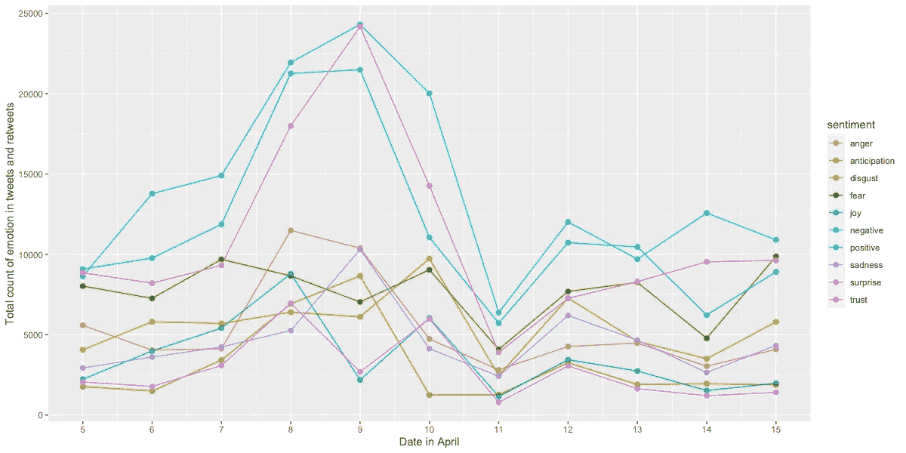

# 恐惧、焦虑还是信任？印度对日冕危机有什么看法？

> 原文：<https://towardsdatascience.com/coronasentiment-india-61a03d0b0fff?source=collection_archive---------33----------------------->

阿明·莫什菲在 [Unsplash](https://unsplash.com?utm_source=medium&utm_medium=referral) 上的照片

## 对 2020 年 4 月 5 日至 4 月 15 日超过 150，000 条推文的情绪和情感分析

对我们所有人来说，这绝对是一个不确定的时期。我们不确定如何理解我们面临的宏观或微观经济因素。在个人层面上，人们正在处理许多问题，如裁员、减薪、停工和感染风险(特别是对那些在此期间从事医疗和其他基本服务的人，谢谢！).

与此同时，我们不禁要思考宏观因素，如政府平曲线的措施、股市的复苏(见图 1)以及最糟糕的是，在不久的将来是否会出现任何后续衰退。

图 1:描绘 2020 年 3 月股票价格和交易量下降的烛台；来源:Srinivas Vadrevu 使用雅虎财经数据进行分析

最近，有很多关于事件将如何在印度展开的预测和场景。在大多数预测和情景中，一个重要的共同点是锁定期间和锁定后的消费者情绪。虽然这些报告大多依赖于对个人特定消费选择的调查，但我想通过利用现有的最好的社交媒体平台之一——**Twitter**来形成对印度情绪脉动的观点

# **“发生什么事了？”**

照片由[🇨🇭·克劳迪奥·施瓦茨| @purzlbaum](https://unsplash.com/@purzlbaum?utm_source=medium&utm_medium=referral) 在 [Unsplash](https://unsplash.com?utm_source=medium&utm_medium=referral) 上拍摄

当我登录 Twitter 时，我看到了一个文本框，提示我“发生了什么事情”。体会到这种讽刺，我心想..

“这正是我想知道的……*Twitter 上发生了什么”？*

数百万印度人每天都在推特上向世界表达自己。不仅仅是个人，组织、媒体公司、政府部门和名人都在使用 Twitter 向世界表达他们的观点。只有 280 个字符，我们试图明智地使用它们来表达我们想要的。因此，来自用户的推文将清晰、准确、具体地描述他们的感受和想法。这就是我写这篇文章的动机……建立一个与 COVID 和印度相关的推特的大数据集，以了解当前的时代精神。

**有什么办法？**

就在我用 NLP 写了第一篇探索网飞 的 [**内容策略的文章之后，我决定应用另一种 NLP 技术——情绪分析来绘制当前的情绪以及最近几天它在印度是如何演变的。正如你已经猜到的那样，整个练习的繁琐部分是收集数据——它涉及到在 Twitter 开发者平台上创建一个应用程序，以请求必要的 API 令牌和提取推文的权限。使用这些 API，从 2020 年 4 月 5 日到 2020 年 4 月 15 日的过去 11 天里，我每天提取 20，000 条推文。我的搜索主要围绕两个关键词“Covid”和“India”。**](/deciphering-netflixs-content-strategy-through-nlp-b59cd2e84873)

在过去 11 天下载了 22 万条推文后，我删除了所有独立的转发，以避免重复计算，只使用原创推文。我剩下 35311 条原创推文，包含大约 50 万字。每条原始推文都有相应的转发总数。截至 2020 年 4 月 15 日，这 35311 条原始推文有 152756 次转发。我将分析分为两类:a)基于人们发布的内容(仅基于原始推文), b)印度普遍的整体情绪(考虑原始推文的相应转发量)。我想知道的第一件事是我们所有人在脸书上发布推文或状态后检查的同一件事…

乔治·帕甘三世在 [Unsplash](https://unsplash.com?utm_source=medium&utm_medium=referral) 上的照片

**我的一条推文获得了多少转发(在数据集中)？**

在删除独立的转发后，我绘制了下面的分布图，显示了原始推文及其在数据集中相应的转发数。

在过去的 11 天里，平均每条原创推文被转发 4 次。

4 月 7 日和 8 日的转发率最高——平均每个原创帖子被转发 7 次。

图 2:从 4 月 5 日到 4 月 15 日，每天的 Tweets 和 Retweet 比率分布；资料来源:Srinivas Vadrevu 的分析

**在样本中，4 月 13 日的原始推文数量最高，但过去 10 天的转发率最低**。4 月 13 日，与其他日子相比，人们似乎忙着发更多的帖子，转推更少。其中相当多的推文是关于猜测 14 日上午 10:00 的封锁公告。以下是 2020 年 4 月 13 日推特上的几个例子。

> *“据推测，该中心可能会延长计划于 4 月 14 日结束的#一级防范措施”*
> 
> *“@…PM 对抗#COVID2019 的下一步会是什么？”*

# ***A .追踪印度情绪的指数？***

现在让我们看看人们输入的文本内容，以创建一个衡量整体情绪的指数。本着按照“ [Volfefe index](https://www.bloomberg.com/news/articles/2019-09-09/jpmorgan-creates-volfefe-index-to-track-trump-tweet-impact) ”的思路创造东西的精神，我使用了包含 2477 个单词的 AFINN 词典，每个单词的情感分数在-5 到+5 的范围内。例如，“糟糕”和“糟糕”等词的得分为-3，而“有效”和“有动机”等词的得分为+2。

使用推文的文本提取单词作为标记，并从数据中清除 https 链接，我计算了情感得分的总和，以得出“**OP-perspective-score”。** OP 是 Reddit 上常用的一个术语，用来指代原海报。它测量发布这些推文的人的情绪。

为了考虑 Twitter 上的整体情绪，我用(1+转发数)*对原始推文中的每个观察进行了加权。我用相应的转发计数和原始帖子本身对 OP-perspective-score 进行加权，以计算“**流行情绪得分”**。后者指示总体情绪，因为它测量该情绪被所有其他用户转发的程度。

图 3: OP 情绪指数和流行情绪指数；资料来源:Srinivas Vadrevu 的分析

从图 3 中的情感得分得到的有趣发现:

*   平均来说，发微博的人每天都有积极的观点/情绪。 从 4 月 5 日到 4 月 15 日，平均 OP 情绪指数每天为正。
*   当我用转发数来衡量时，除了 4 月 8 日和 4 月 10 日，普遍情绪变成了负面。
*   虽然发布推文的人每天都有积极的观点/情绪，但数据表明 *twitter 受众转发消极情绪推文的次数远远多于转发积极情绪推文的次数。*

> ***如果我们将 Twitter 视为一个交流情绪的市场，在过去 10 天里，市场似乎对负面情绪的回报多于正面情绪***

*   在过去的三天里，13 日至 15 日，OP 情绪指数和流行情绪指数都向 0(中性情绪)靠拢。积极和消极的情绪相互抵消，导致“推特市场”的情绪几乎是中性的。

# **B .印度围绕科维德的情绪暗流**

如果你想知道将复杂的人类情感转换成单一的价值观是否过于简单化，那么我同意你的观点。所以我想用一个词库，把这些情绪解构为情感，看看情感每天是如何变化的。我下载了 NRC(加拿大国家研究委员会)的词典，里面有 13，901 个单词情感和单词情感关联。数据集中的情绪有*恐惧、愤怒、信任、悲伤、厌恶、期待、喜悦和惊喜*。一个词可以有多种情感联想。

我从 35311 条原始推文中提取了单词，并将单词-情绪关联和情绪(积极或消极)关联映射到这些推文中的每个单词。类似于指数方法，我绘制了所有原始推文的情绪，以获得 OP-情绪暗流，并通过其相应的转发计数进行加权，以获得印度流行的情绪暗流。

[腾雅特](https://unsplash.com/@tengyart?utm_source=medium&utm_medium=referral)在 [Unsplash](https://unsplash.com?utm_source=medium&utm_medium=referral) 上拍照

***OP 情绪暗流***

那么，在过去的 11 天里，发布这些推文的人在想些什么呢？将一种情绪在一天中所有推文中重复的次数加起来，我得出了这一天的情绪得分。下图描绘了过去 11 天所有帖子的各种情绪得分。

图 4:对发布的推文中的情绪计数- -[OP]情绪得分；资料来源:Srinivas Vadrevu 的分析

根据在推特上发布的常见情绪，出现了以下模式:**信任>恐惧>期待>愤怒>悲伤>快乐>惊讶>厌恶**(按降序排列)

*   信任是从 4 月 5 日到 4 月 15 日发布推文的人最常见的情绪。但是，恐惧紧随其后。
*   期待是排在愤怒和悲伤之后的第三种常见情绪。
*   正如所料，快乐、惊讶和厌恶等情绪是发布推文的人最少出现的情绪
*   在过去的 11 天里，上面的层叠顺序每天变化不大。

**印度盛行的情感暗流**

图 5:发布的推文中情感的加权计数- -(普遍的)情感分数；资料来源:Srinivas Vadrevu 的分析

在用 retweet count 衡量了情绪的数量之后，我计算了所有情绪的加权情绪分数。

*   从 4 月 5 日到 4 月 7 日，恐惧和信任正在紧密地移动。从 4 月 7 日开始，包含信任词的推文被转发的次数比包含恐惧词的推文多了近 3 倍。从 4 月 5 日到 11 日，信任是最普遍的情绪。
*   在 4 月 7 日至 4 月 11 日期间，愤怒成为了排在恐惧之后的第二大流行情绪。
*   从 4 月 11 日到 4 月 15 日，恐惧和信任紧紧相随
*   从 4 月 11 日到 4 月 15 日，期待是波动的，但是保持在前三种情绪中

我在附录中附上了基于 NRC 词典的 OP 和流行推文的情感和情绪得分。有兴趣的可以最后去看看。

> 与其他情绪——愤怒、悲伤、厌恶、快乐和惊讶——相比，与信任、恐惧和期待(按此顺序)相关的词在帖子和相应的转发中更常见

# **什么主题可能会导致这些情绪？**

我绘制了以常用词为节点的二元模型网络图，通过将二元模型分类为几个主题来识别顶部主题。这类似于我在[的上一篇文章](/deciphering-netflixs-content-strategy-through-nlp-b59cd2e84873)中使用的方法。

***发布的推文中有哪些热门主题？【OP】***

图 5:tweet 文本中二元模型的网络可视化(n > 100)-[OP]主题；资料来源:Srinivas Vadrevu 的分析

*   **政府办公室(黄色泡泡)** *-* 总理纳伦德拉·莫迪，印度项目管理办公室，印度健康维护组织，印度公共卫生委员会，印度政府，人力资源开发部，卫生部，最高法院，印度信息和广播部，印度公共卫生委员会，印度公共卫生委员会。
*   **政府措施**(透明气泡)-行动*“政府指定 10 万张医院病床”，* Aarogya setu app、Namo app、PM cares
*   COVID 数字(蓝色气泡)-检测呈阳性的病例数、死亡人数、确诊病例、报告病例、疫情、死亡人数上升、总数
*   张贴的其他突出主题是:Tablighi Jamaat 问题，印度侨民

***有哪些被转发较多的热门主题？* 【T21 盛行】**

在这个网络图中，我用转发数来衡量二元模型的数量，以确定排名靠前的二元模型。

图 6:发布的推文文本中二元模型的网络可视化**(加权计数> 1000)-[OP]主题；资料来源:Srinivas Vadrevu 的分析

*   **政府干预**(黄色泡泡)- *卫生部，当局，官员，IAS，总理纳伦德拉·莫迪。*
*   **医疗机构和护理**(透明泡泡)*医学科学**护理人员**电晕战士*和*又一家医院*
*   **COVID numbers** (蓝色气泡)——*检测阳性病例数、死亡人数、确诊病例、报告病例、疫情、死亡人数上升、总人数、检测相关人员、Covid 19 检测、疟疾药物*
*   **正面底色**(灰色气泡)——*可观精彩，良好姿态，以色列大使馆灯火通明，齐心协力，示支持*
*   发布的其他突出主题有:T *ablighi Jamaat 活动、北美查蒂斯格尔邦、Ola Cabs、IIM 研究……*

# **结论**

**(1)当人们发布积极情绪的推文时，twitter 用户似乎更喜欢消极情绪，而不是积极情绪，将整体极性逆转为消极情绪。**

***(2)将情感分析与 bigrams 网络叠加，看起来最近 11 天发布和转发的推文主要反映了对政府和医疗机构的信任感。但是，对 COVID 和未来的恐惧和期待也很常见。***

图 7:电晕病毒危机期间麦肯锡-印度消费者情绪；来源:[https://www . McKinsey . com/business-functions/marketing-and-sales/our-insights/survey-Indian-consumer-sensition-in-the-coronavirus-crisis](https://www.mckinsey.com/business-functions/marketing-and-sales/our-insights/survey-indian-consumer-sentiment-during-the-coronavirus-crisis)

作为发布推文或观点的个人，即使在这种可怕的情况下，我们每个人似乎都有积极的前景。[麦肯锡关于冠状病毒危机期间消费者情绪的报告](https://www.mckinsey.com/business-functions/marketing-and-sales/our-insights/survey-indian-consumer-sentiment-during-the-coronavirus-crisis)也表明，当被问及对经济状况的信心水平时，大多数(56%)受访成员对经济复苏持乐观态度。

如果我们发布积极的推文，并在被单独询问时报告对经济前景的乐观看法，那么为什么我们转发负面情绪的推文比积极的推文多得多？我只能猜测，带有负面情绪的推文更容易引起我们的注意，并在我们内心引起回应(转发)。

从我的观察来看，虽然我们面临着对冠状病毒和未来的恐惧和预期，但对印度政府解决冠状病毒危机的信任取代了所有这些恐惧和预期情绪。在这一点上，我希望同样程度的信任超越了对危机后经济复苏的乐观和信心。

## 来源和附录

*   **(1)普通单词和短语引发的情感:使用机械土耳其人创建情感词典**，赛义夫·穆罕默德和[彼得·特尼](http://apperceptual.com/)，在*NAACL-HLT 2010 年关于文本情感分析和生成的计算方法研讨会上，*2010 年 6 月，加利福尼亚州洛杉矶
*   发现下面的文章对文本挖掘和情感分析很有用。

[https://www.datacamp.com/commu](https://www.datacamp.com/community/tutorials/sentiment-analysis-R)

 [## 如何高效地对 Twitter 中的流行语进行网络分析？

### 数据收集、预处理、分析、可视化和交互的一站式解决方案。

towardsdatascience.com](/how-to-perform-a-network-analysis-for-buzzwords-in-twitter-efficiently-ebf8e139037d)  [## NBA 领先球员推特账户的情感分析——第一部分数据收集

### NBA 领先球员的推特和他们的表现有相关性吗？

towardsdatascience.com](/do-tweets-from-nba-leading-players-have-correlations-with-their-performance-7358c79aa216)  [## 在 r 中为文本挖掘设置 Twitter。

### 关注 Twitter 作为数据挖掘的热点。

towardsdatascience.com](/setting-up-twitter-for-text-mining-in-r-bcfc5ba910f4) 

图 8:2020 年 4 月 5 日至 4 月 15 日之间发布的推文中的情绪和情感计数- -[OP]情绪得分；资料来源:Srinivas Vadrevu 的分析

图 9:2020 年 4 月 5 日至 4 月 15 日之间发布的推文中情感和情绪的加权计数- -[OP]情感得分；资料来源:Srinivas Vadrevu 的分析

**免责声明** : *本文中表达的所有观点均为 Srinivas Vadrevu(以下简称“作者”)的观点，不代表作者曾经、现在或将来隶属的任何实体的观点。以上所有观点都不是统计推断，而是作者根据自己的观察得出的观点。本文作者对本文内容中的任何错误或遗漏不承担任何责任或义务。你不应该依靠这篇文章来作出任何商业、法律、投资或任何其他决定。虽然作者试图保持文章中的信息准确，但作者不对本文中包含的图形、图表和数据的完整性、准确性、可靠性、适用性或可用性做出任何形式的明示或暗示的陈述或保证。作者没有任何义务更新本文的内容，并否认与本文相关的任何责任。*