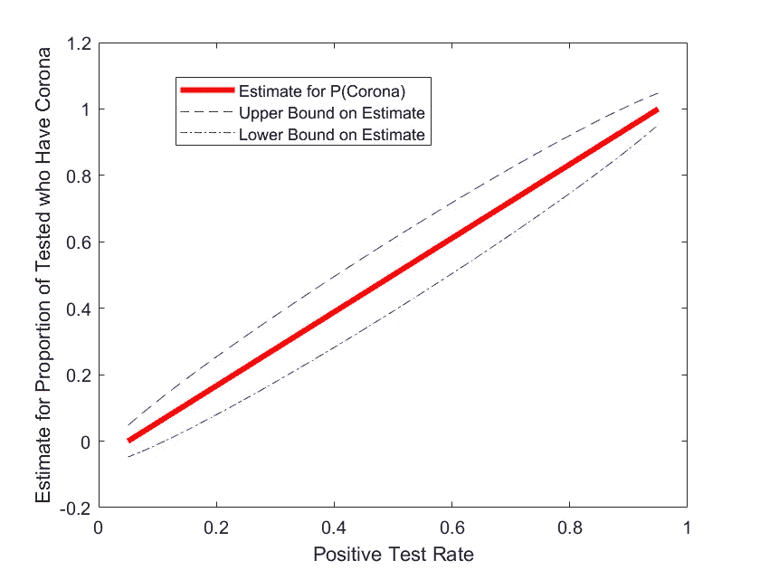

# 冠状病毒:真阳性的置信区间

> 原文：<https://towardsdatascience.com/coronavirus-a-confidence-interval-for-true-positives-444962ea2348?source=collection_archive---------36----------------------->

## [现实世界中的数据科学](https://towardsdatascience.com/data-science-in-the-real-world/home)

## 如何利用基础统计学创造新的数学来研究重要问题

***编者注:*** [*走向数据科学*](http://towardsdatascience.com/) *是一份以研究数据科学和机器学习为主的中型刊物。我们不是健康专家或流行病学家，本文的观点不应被解释为专业建议。想了解更多关于疫情冠状病毒的信息，可以点击* [*这里*](https://www.who.int/emergencies/diseases/novel-coronavirus-2019/situation-reports) *。*

冠状病毒数据极其杂乱。不同地区报告数据的方式并不一致。由于这个原因，以及其他原因，包括一周中的某一天的影响，很难推断出趋势。

此外，由于假阳性和假阴性的性质，阳性检测的数量并不能告诉我们有多少人检测到了病毒。

在这篇文章中，我将在给定四条信息的情况下，为阳性测试的真实数量建立一个置信区间。首先，我们需要真阳性率和假阳性率。这些是测试本身的属性。然后，我们需要给出测试总数以及阳性总数。这些给了我们关于被研究人群的信息。

# 敏感性和特异性

每当你上统计学入门课程时，关于贝耶定理的部分总是有下面的例子。如果你有一项测试，在你患病的 99%的时间里呈阳性，在你没有患病的 99%的时间里呈阴性，并且这种疾病只影响 1%的人口，那么阳性测试只意味着你有 50%的机会患病。

这是经典的“抓住你了！”moments intro stats 教师喜欢使用，起初可能会觉得不直观。然而，这真的很容易理解。因为健康的人是患病的人的 99 倍，即使假阳性率很低，它也会因为所有健康的人而膨胀 99 倍。因此，假阳性非常普遍。

我上面给出的 99%的数字被称为测试的灵敏度和特异性。测试的敏感性是测试识别测试者的能力:它是以“你有疾病”为条件的阳性测试的概率。检测的特异性是检测疾病何时不存在的能力。同样，它是以‘你没有这种病’为条件的否定概率。在上面的例子中，我描述的测试具有 99%的灵敏度和特异性。

# 对真实阳性率的估计

现在，我们的推导只涉及几件事。首先，我们使用全概率定律。然后，我们会用到随机变量方差的性质。让我们从全概率的标准定律开始。回想一下，阳性率(或检测结果为阳性的百分比)可以细分如下:

嗯，我们想解决 P(电晕)，测试的人谁实际上有病毒的百分比。这样我们就得到了表达式

注意:阳性率是阳性测试与总测试的比率。我们知道这个数字。第二，真阳性率和假阳性率是凭借知道敏感度和特异度才知道的！因此，我们可以估计我们想要的数量。

现在，如果我们认为左边和右边的量是观察到的随机变量，那么右边的量是冠状病毒受试者比例的*无偏估计量*。这意味着，如果我们通过采样计算右边，平均来说，我们会得到正确的答案。我们得到的答案不是*偏向*一个方向或另一个方向。

为什么这三条信息要足够计算 P(日冕)？让我们用一点代数来进行逻辑思考。

如果假阳性率是 5%,真阳性率是 95%,那么阳性率，即两者的[凸组合](https://en.wikipedia.org/wiki/Convex_combination#:~:text=In%20convex%20geometry%2C%20a%20convex,negative%20and%20sum%20to%201.),必须在 5%和 95%之间。如果阳性率接近 95%，那么我们知道大多数被测试的人实际上都患有这种疾病。如果该比率接近 5%，那么我们知道大多数接受测试的人没有患病。确切地知道两者之间的阳性率有多远，可以告诉我们真阳性和假阳性的确切混合。

第二点你可能已经用敏锐的眼睛注意到了:这只有在真阳性和假阳性率不同时才有效！否则，这两个比率之间就没有“中间值”。如果敏感性和(1-特异性)是相同的，我们根本无法进行这种分析。稍后我们将展示更糟糕的情况:随着敏感度和(1-特异性)越来越接近，我们的置信区间的质量将会下降。(幸运的是，大多数测试的灵敏度和特异性接近于 1，因此灵敏度和 1-特异性彼此相差很远)。

# 敏感性和特异性重要吗？

这可能会令人惊讶。只要敏感度和特异度是不同的数字，我们就会得到与实际患病人数完全相同的估计值。也就是说，当从测试人群中估计患病人群的比例时，测试的准确性并不重要。让我们通过下面的例子来了解我的意思(这也将验证我们的方法给出了 P(Corona)的正确值)！)

在这两种情况下，为了便于讨论，我们假设我们测试了 1000 人，其中 300 人生病。让我们首先假设 95%的真阳性率和 5%的假阳性率。然后，我们预计在总共 320 次阳性测试中会有 285 次真阳性和 35 次假阳性。如果你用这个 32%来代替上面公式中的阳性率，我们得到

现在以 60%的真阳性率和 40%的假阳性率重复上述实验。从表面上看，这是一个非常糟糕的冠状病毒测试。我们预计在这个设置下，总共 460 次阳性测试中，会有 180 次真阳性和 280 次假阳性。如果您使用上面的相同公式，我们将再次看到我们计算 P(电晕)=0.3。在这种情况下，灵敏度和特异性并不重要！

那么，为什么进行准确的测试是可取的呢？我在上面得出的唯一结论是，对于整个人口，我们将计算相同比例的病人。不过，准确性对个人来说很重要。

如果你测试呈阳性，那么你实际患病的概率很大程度上取决于测试的准确性和疾病的流行程度。这就是我上面讲的经典的贝叶定理问题。敏感性和特异性低的测试对个体来说是不好的。

敏感性和特异性非常重要的第二个原因是，它们极大地影响了我们估计量的方差。记住:本文的目标是开发一种方法来生成实际生病人数的置信区间。为了做到这一点，我们首先需要一个无偏估计量，我们有。然而，第二，也是非常关键的:我们需要能够计算估计量的方差。

请记住，估计量的方差告诉我们，样本与样本之间，我们对待估计参数的猜测变化有多大。一个低方差、无偏的估计量将对所讨论的数量产生一致、准确的结果。(注意:这就是为什么在本科统计课上，我们要学习最小方差无偏估计量的概念。)

在下一节中，我们将开发特定估计量的方差，并展示它如何关键地依赖于灵敏度和 1-特异性之间的距离。

# 我们估计量的方差

这是我们需要记住更多介绍统计资料的地方。看看我们估计阳性率的公式，我们必须问自己:哪些东西是随机的(取决于观察到的数据)，哪些是已知值(常数)。事实上，唯一依赖于观察数据的是参数“阳性率”。其他的是我们正在进行的测试的已知事实。因此，稍微改写一下，我们对 P(日冕)的估计是阳性率的缩放和移动版本。让粗体 X 表示我们的阳性率估计值，使用方差的基本性质，我们得到:

此外，阳性率是通过二项式过程估计的，所以我们知道它的方差！这是构建比例置信区间时使用的标准技术。在我们的估计量的方差中代入 P(Corona ),由下式给出:

这就是我们上述观察的理由:真阳性率和假阳性率越接近，这种差异就越大。事实上，如果真阳性率和假阳性率非常接近，那么我们的估计不会比说 P(日冕)在 0 和 1 之间更好！

然而，对于合理的敏感性和特异性测试，我们可以得出有意义的区间。

# 结论

让我们来看看截至撰写本文之日(2020 年 7 月 20 日晚上)来自佛罗里达州的数据。我将使用 95%和 99%的特异性和敏感性值重复这一部分。使用[这个来源](https://floridahealthcovid19.gov/)，我们看到佛罗里达州有 360，394 个阳性测试，阳性率为 11.8%。让我们计算出 95%的置信区间，以确定接受检测的佛罗里达人中实际患病的比例。首先，我们对比例的估计。

在我们有 95%的敏感性和特异性的情况下，我们估计 7.57%的被测试者实际上患有该疾病。在准确率为 99%的情况下，我们得到 11.03%的被测试者患有这种疾病。差别很大。

现在是差异。因为我们的样本量实际上很大，所以在 95%准确率的情况下，我们的方差是 4.21e-8。在准确度为 99%的情况下，方差为 3.55e-8。

假设这些测试是一个真正的佛罗里达随机样本(不！)，那么使用高斯近似法，我们对患有该疾病的受试者比例的估计是 2.1e-4，或者大约是百分之二。这使得我们在 95%灵敏度和特异性的情况下，置信区间[7.53%，7.61%]。

在 99%的情况下，同样的计算告诉我们，被测试者的比例约为[10.99%，11.07%]。无论哪种情况，我们都得到一个很紧的区间！

当我们从百分比转到疾病总数时，间隔就扩大了一点。7.53%至 7.61%的范围代表了大约 24，000 例的差异。这是一个更大的数字和更大的影响。

为了使事情不那么具体，更直观，我画了一个给定阳性率的 P(日冕)估计图。对于这个实验，我假设测试了 100 人(总体而言，样本量更小，更合理)，冠状病毒测试具有 95%的特异性和敏感性，我们构建了 95%的置信区间。结果如下:

对于给定的阳性检测率，估计患有冠状病毒的受试者的比例(包括假阳性！)显示的是 95%的置信区间。图片作者。

# 结论

我在这里的主要观点不一定只是“如何为医学测试设定置信区间”。相反，我想展示推导新数学的过程，以回答一个问题。一个好的数据科学家不应该只是记住数百个 Python 库的语法。一个优秀的数据科学家对基本原理有很好的理解，并且应该能够改变他们已经知道如何使用的技术，以适应您可能无法在堆栈交换上找到任何东西的情况。

特别是关于冠状病毒，主要观点是报告阳性检测率和新病例数量有多么重要。否则，你只讲述了故事的一半。