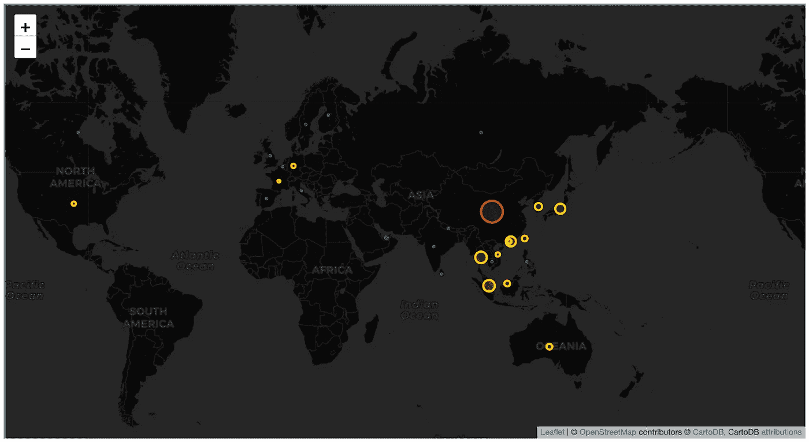
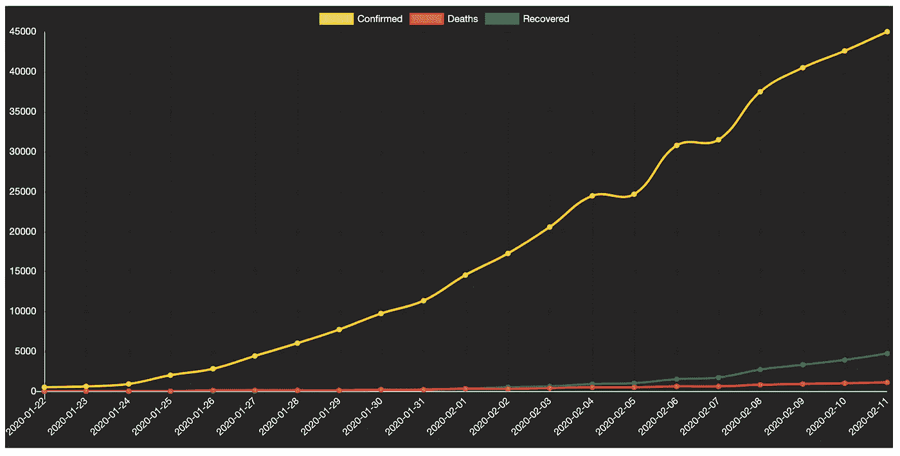
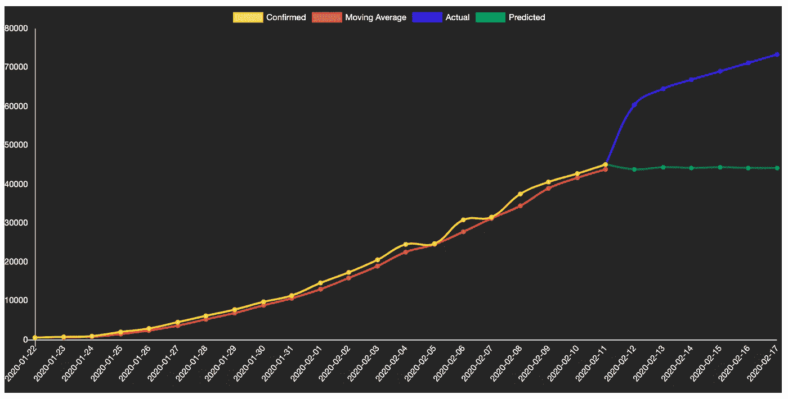

# 冠状病毒:数据科学家的观点

> 原文：<https://towardsdatascience.com/coronavirus-a-data-scientists-perspective-e3ac1cbe8916?source=collection_archive---------50----------------------->

## 冠状病毒数据的分析和可视化

***编者注:*** [*走向数据科学*](http://towardsdatascience.com/) *是一份以研究数据科学和机器学习为主的中型刊物。我们不是健康专家或流行病学家，本文的观点不应被解释为专业建议。想了解更多关于疫情冠状病毒的信息，可以点击* [*这里*](https://www.who.int/emergencies/diseases/novel-coronavirus-2019/situation-reports) *。*

# 介绍

源于中国武汉的新型冠状病毒疫情已导致数千名中国公民感染，并已蔓延至全球 20 多个国家。虽然世界卫生组织宣布这种病毒为全球紧急情况可能有点令人担忧，但我作为数据科学家对围绕这种流行病的数据以及利用这些数据可能实现的目标感到好奇。这是几个月前我在自己的网站上写的一篇文章，是关于我对冠状病毒数据的分析。

# 冠状病毒数据

找到一个冠状病毒数据源并没有那么难。几个新闻来源每天更新他们的网站，提供新的感染病例数、发现地点和死亡人数。然而，这些数据源通常不是可下载的文件或以任何方式结构化。

但是，善良的老卡格尔又提供了。🙌🏻

该[数据集](https://www.kaggle.com/sudalairajkumar/novel-corona-virus-2019-dataset/version/11)包括 2020 年 1 月 22 日至 2020 年 2 月 11 日期间来自 32 个国家的确诊病例记录。在我写这篇文章的时候，数据集只落后一天——所以它是最新的！

在我做任何事情之前，对于任何数据科学项目，首先我必须观察和预处理数据。

# 检查数据

因为这个数据集是 CSV 格式的，所以我可以使用 Pandas 将数据读入我的 Python 脚本。Pandas 是一个我已经广泛使用了一年的库，好家伙，它把我从我曾经使用的史诗列表中拯救了出来！所以一旦它被导入，我就可以把 CSV 读入熊猫数据帧，看看里面有什么。

那么，我们知道些什么？嗯，如果我们关注*确诊*病例列，我们可以使用`df[*column_name*].sum()`函数来统计病例总数。该死，确诊病例真多！如果我们考虑到数据还显示有 22，307 起收回，这意味着收回率为 5.97%。

如果我们根据*国家*列对行进行分组，并对*确诊*病例的数量进行求和，我们就可以对输出进行排序。这表明，与任何其他国家相比，中国确实有大量确诊病例。这可能是一个显而易见的观察，因为我们从新闻来源知道它起源于中国。但是，值得查数据！

我们可以应用完全相同的代码来观察每个国家或省有多少人死亡和多少人康复。如果我们按*省/州*列分组，*【湖北】*【武汉】省记录的确诊病例数最高。同样，一个直观的观察，但值得检查。

# 数据预处理

仅仅通过快速浏览数据，似乎不需要极端的预处理。但是我注意到了三件事，这三件事引起了我的强迫症，在我开始着手做任何事情之前，可能需要解决这三件事，它们是:

在*国家*栏中，报告了*‘中国’*和*‘Mainland China’*，而它们应该是*‘中国’*或*‘Mainland China’*。

检查*日期*列的数据类型是否为*日期时间*，因为这样更容易处理。

*已确认，死亡，*和*已恢复*列数据类型需要是整数，而不是浮点数。

首先，让我们把所有出现的*【Mainland China】*改成*【中国】*。我们可以通过检查*国家*列中所有唯一国家列表的长度来检查这是否成功。

现在来检查*日期*列的数据类型。我们可以使用 Pandas 的`.info()`函数来查看数据帧中所有列的数据类型。数据类型表明*日期*列是一个*对象*数据类型。为了方便起见，我将把它的数据类型改为*日期时间*。然后，我可以分别使用`df['Date'].dt.time`或`df['Date'].dt.date`来访问日期本身的日期或时间元素。让我们这样做吧——我将用 Date 元素替换 *Date* 列，方法是将该列重命名为它本身。

`.info()`结果也确认了*已确认、死亡*和*已恢复*数据类型为浮点。理想情况下，你会希望这些是整数，因为你不能有一个小数人数。因此，类似于*日期*列，我们将更改这些数据类型。

太好了—数据现在可以使用了。在这个阶段，有些人还会使用`del df[*column_name*]`删除他们不需要的列。我不会删除这里的任何列，因为我可以只选择那些适用于我将要做的事情的列。实际上，我建议不要删除列，只是因为您可能最终会需要它们，并且不得不检查您的代码来找到您要删除的位置，这听起来像是一个不必要的任务——所以总是选择列，不要删除它们。💡

# 数据可视化

考虑到数据包括位置，显然首先要做的是使用地图可视化。我只使用 Python 通过 Matplotlib 或 Seaborn 创建过热图或条形图。由于缺乏文档，我过去一直推迟用 Python 创建地图，所以我最初使用这种类型的可视化会像 Tableau 一样。但这一次，我决定重新拾起它，看看我是否有耐心把事情搞清楚！

首先，让我们决定我们想要观想什么。鉴于数据集报告称，中国以外几乎没有死亡或康复病例，全球确诊病例的数量很少。在这种情况下，我可以使用我最初观察到的`df_country`，其中我根据*国家*列对行进行了分组，并对*确诊*病例的数量进行了求和。

有几个 Python 库支持创建地图。在这里，我将使用叶创建一个气泡图。对于那些不知道气泡图是什么的人来说，它是一系列圆圈，其大小代表一个区域中的一个数值。或者在这种情况下，全球不同国家报告了多少冠状病毒确诊病例。为此，叶需要标记气泡的坐标。为了找到这个数据集中的国家的纬度和经度，我很快搜索了 web，找到了一个 JSON 坐标文件，打开这个文件，遍历我的数据帧，将这些国家与它们的坐标匹配起来。

如果我照现在的样子绘制数据，气泡的半径会太大而无法进行任何形式的观察。因此，我们需要将其正常化或以某种方式处理它。在这种情况下，我决定将除中国以外的所有国家的确诊病例除以 50。为什么是 50？因为它在地图上看起来只是一个很好的比例。您可以尝试不同的标准化方法，以获得对您有用且不太需要人工的东西。为什么不把中国确诊病例按 50 分？因为中国有如此高的病例数，泡沫仍然太大，淹没了周边国家的数据。因此，为了大幅缩小规模，但仍显示它具有最高的案例数，我将其除以 25k。

接下来，我设置图表的参数，选择它作为黑暗和神秘的背景，开始缩放级别为 2。我还指定我想要一个弹出窗口，显示气泡所在国家的确诊病例数。最后，我写了一个简短的规则集，规定如果确诊病例数(非标准化版本)少于 100 例，气泡为绿色，如果在 101 到 500 例之间，气泡为黄色，如果是任何其他值，气泡为红色。

瞧，这就是输出！如果您点击气泡，您将看到该特定国家的确诊病例总数。从气泡的颜色和大小可以很快观察到，大量确诊病例主要发生在亚洲。

使用叶子的气泡图

# 预测未来案例

在我做任何类型的预测之前，让我们绘制数据报告期间的确诊病例、死亡和康复总数，看看我们是否有某种趋势。为了制作这个图表，我根据*日期*将*已确认、死亡*和*已康复*列组合在一起，并对这些值求和。然后，我使用 iPlotter 在 ChartJS 中生成图形。我过去使用过 chartj，我非常喜欢图表的外观和它们的交互性。

绘制原始数据

那么，从图表中我们能看出什么呢？它显示在 21 个数据点中，每个变量都有线性增长。

鉴于我们没有足够的数据点，很难使用机器学习模型或时间序列模型(如 ARIMA)来预测疫情。但我们可以使用 ARIMA 的移动平均线(MA)部分，并采用 2 或 3 个移动平均线来获得未来每日确诊病例数的粗略想法。假设每日确诊病例数将继续增长，让我们来看看一段时间内确诊病例的移动平均值。

首先，我使用 Pandas 的`rolling`函数计算 2 的移动平均值。这个函数的作用是计算数据帧中每 2 行的平均值。为什么是 windows 2？如果我们绘制移动平均数图，它似乎很好地遵循了与实际每日确诊病例数相同的趋势。事实上，这一趋势比原始数据稍微平稳一些，从 2020 年 2 月 4 日到 2020 年 2 月 5 日以及 2020 年 2 月 6 日和 2020 年 2 月 7 日，病例数量的增加只是轻微的。我将移动平均线添加到新列中的数据帧中， *MA* 。

假设我们想预测 6 天内确诊病例的数量。我们可以使用最后的移动平均值(43，807)作为第一个预测案例数。然后，我们可以通过计算最后一个实际案例数(44，982)与第一个预测案例数(43，807)的移动平均值来预测 2 天前的案例数。我们可以使用 for 循环迭代这个过程，直到我们预测了 6 个值。我们可以将它们放在一个列表中，准备放入 graph 函数中。

由于我对预测是否真实很感兴趣，我等了 6 天才收集到新的数据。所以，我在 2020 年 2 月 23 日写下了以下几段文字。但是通常情况下，你要做的是将你的数据帧分成一个训练集和一个测试集。然后，您可以根据定型集进行预测，并使用测试集来评估预测。

我使用与以前相同的技术处理新数据，并计算每天确诊病例的数量。然后我制作了下图。黄线代表实际每日确诊病例数，红线代表移动平均数 2，蓝线代表 2020 年 2 月 12 日至 2020 年 2 月 17 日的每日新病例数，最后，绿线代表预测病例数。

预测病例

# 结论

那么，我从这个分析中学到了什么？

我主要意识到一个简短的分析需要多少预处理和数据争论！我还对 follow 库的输出以及地图在可视化基于位置的数据方面的有效性印象深刻。

然而，结果表明，预测方法并不奏效。比如 2020 年 12 月 2 日，实际病例数和预测数相差 20k 左右！但是，如果我们观察 2020 年 2 月 11 日和 2020 年 2 月 12 日之间实际确诊病例数的差异，就会发现增加了大约 16k 例病例！这是我们没有预料到的……如果我们考虑到实际确诊病例的平均日增长率为 0.27%，您会预计 2020 年 12 月 2 日的病例总数将在 45k 左右，而不是 60k。但是，嘿，我想这就是数据的本质！

完整的笔记本，请查看下面我的 GitHub 回购:[https://github.com/LowriWilliams/Coronavirus](https://github.com/LowriWilliams/Coronavirus)

如果你喜欢这篇文章，别忘了点赞和分享。