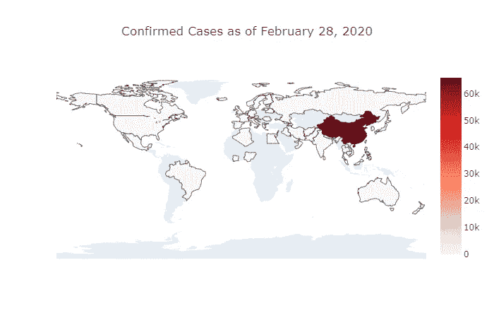
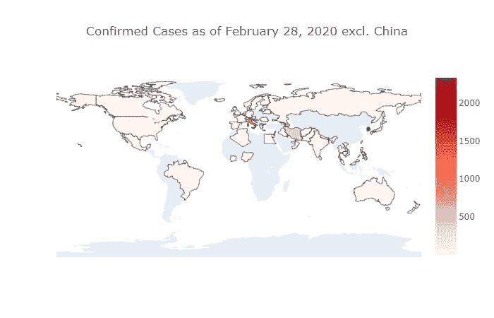
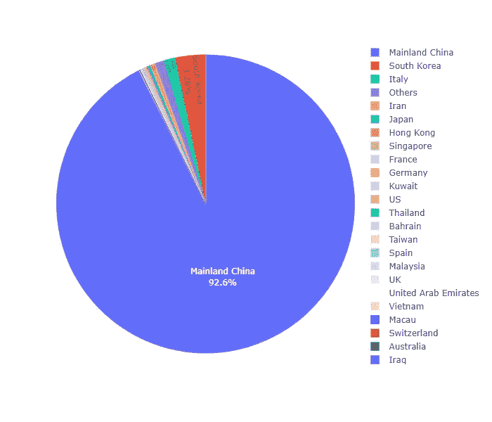
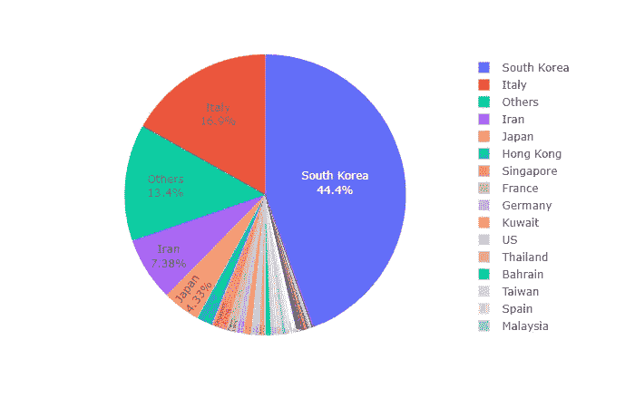
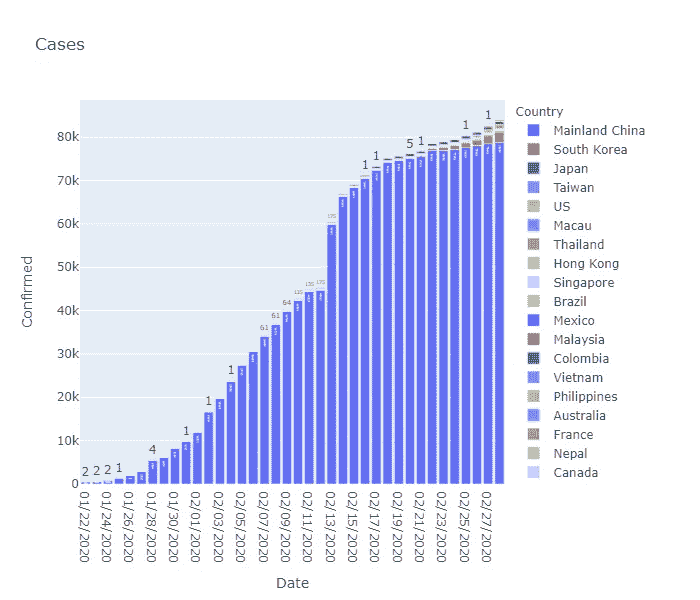
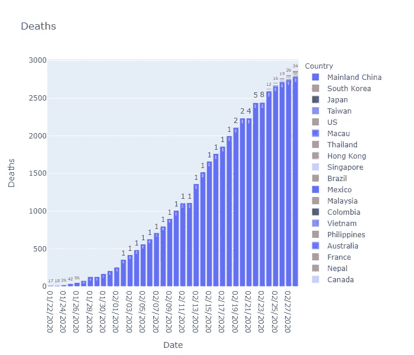
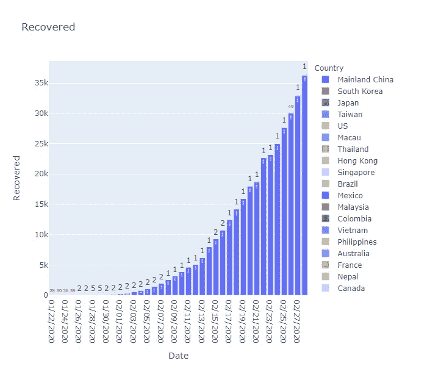
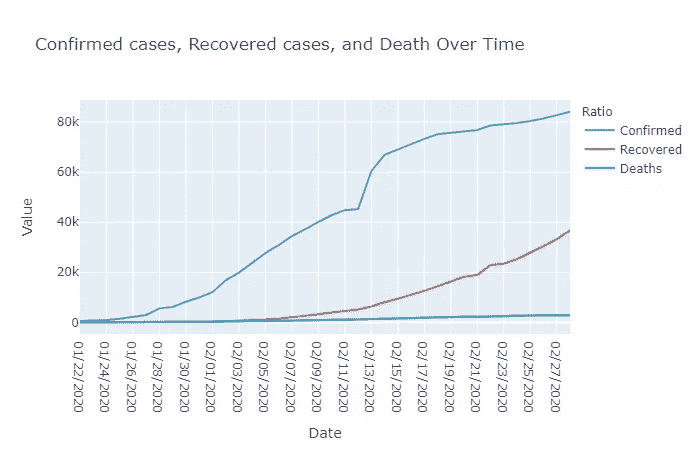
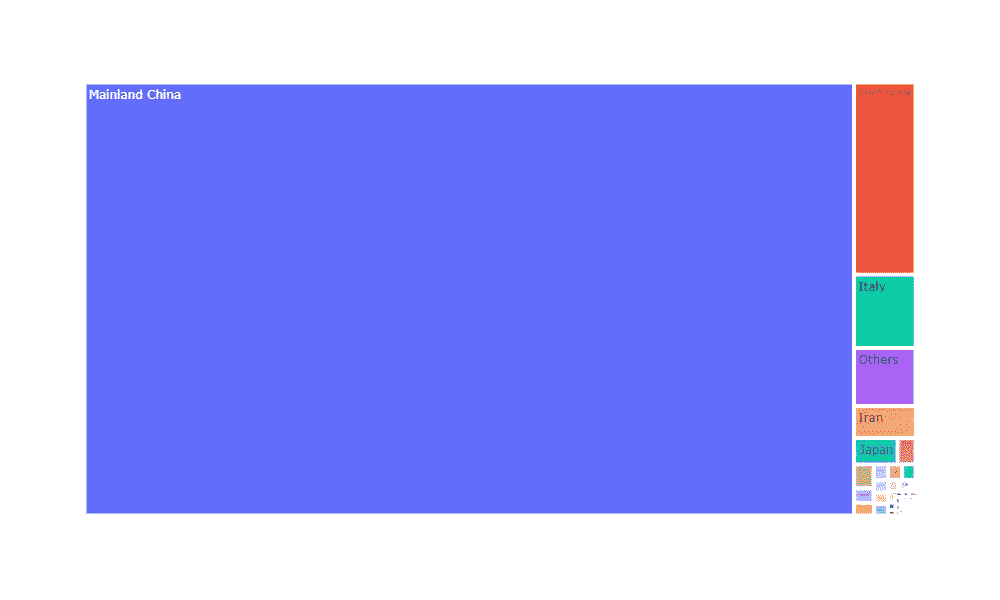
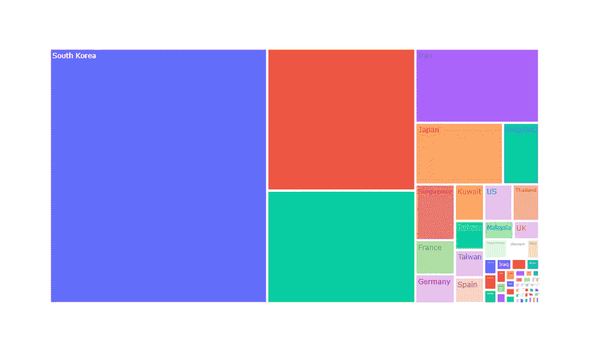

# 使用 Plotly 实现冠状病毒数据可视化

> 原文：<https://towardsdatascience.com/coronavirus-data-visualizations-using-plotly-cfbdb8fcfc3d?source=collection_archive---------3----------------------->

## 小说《电晕病毒 2019》数据集分析附代码！

# 介绍

今天，我发现了一个新的数据集，名为“[Novel Corona Virus 2019 Dataset](https://www.kaggle.com/sudalairajkumar/novel-corona-virus-2019-dataset)”,因为人们对我之前的文章 [**非常感兴趣，所以我想我应该使用 Plotly 创建一些数据可视化！**](/9-fascinating-novel-coronavirus-statistics-and-data-visualizations-710cfa039dfd)

Plotly 是 Python 中的一个库，用于创建**交互式动态数据可视化。如果你想与这些可视化互动，我会在本文底部提供我的 Kaggle 笔记本的链接。**

*注:所有图片和 gif 都是我自己用 Plotly 和 Giphy 创建的。*

***如果这是你喜欢的那种东西，请成为第一批订阅*** [***我的新 YouTube 频道在这里***](https://www.youtube.com/channel/UCmy1ox7bo7zsLlDo8pOEEhA?view_as=subscriber) ***！虽然还没有任何视频，但我会以视频的形式分享很多像这样的精彩内容。感谢大家的支持:)***

# 目录

1.  [Choropleth 地图](#b60f)
2.  [饼状图](#c5dc)
3.  [条形图](#0058)
4.  [线图](#39eb)
5.  [树形图](#fc91)

# Choropleth 地图

## 冠状病毒在全球范围内的传播

由作者用 Giphy 创建

*   这是一个动画的 choropleth，显示了冠状病毒在 2020 年 2 月传播到了哪里。如果你想看更清晰的完整版本，链接在这篇文章的底部！

```
fig = px.choropleth(df_countrydate, 
                    locations="Country", 
                    locationmode = "country names",
                    color="Confirmed", 
                    hover_name="Country", 
                    animation_frame="Date"
                   )

fig.update_layout(
    title_text = 'Spread of Coronavirus',
    title_x = 0.5,
    geo=dict(
        showframe = False,
        showcoastlines = False,
    ))

fig.show()
```

## 全球确诊病例热图



使用 plot.ly 创建

*   很明显，中国的病例数是其他任何有确诊病例的国家无法相比的。因此，我在下一张图的分析中去掉了中国。

```
fig = go.Figure(data=go.Choropleth(
    locations = df_countries['Country'],
    locationmode = 'country names',
    z = df_countries['Confirmed'],
    colorscale = 'Reds',
    marker_line_color = 'black',
    marker_line_width = 0.5,
))

fig.update_layout(
    title_text = 'Confirmed Cases as of February 28, 2020',
    title_x = 0.5,
    geo=dict(
        showframe = False,
        showcoastlines = False,
        projection_type = 'equirectangular'
    )
)
```

## 全球确诊病例热图(不包括中国)



使用 plot.ly 创建

*   在这里，你可以看到，除了中国之外，韩国、伊朗和意大利显然是病例数量最多的三个国家。

```
df_countries_no_china = df_countries[df_countries['Country'] != 'Mainland China']
fig = go.Figure(data=go.Choropleth(
    locations = df_countries_no_china['Country'],
    locationmode = 'country names',
    z = df_countries_no_china['Confirmed'],
    colorscale = 'Reds',
    marker_line_color = 'black',
    marker_line_width = 0.5
))

fig.update_layout(
    title_text = 'Confirmed Cases as of February 28, 2020 excl. China',
    title_x = 0.5,
    geo=dict(
        showframe = False,
        showcoastlines = False,
        projection_type = 'equirectangular'
    )
)
```

# 饼图

## 按国家分列的确诊病例比例



*   很明显，大多数病例仍在中国，但在下一张图中，你可以看到中国以外的病例比例

```
fig = px.pie(df_countries, values = 'Confirmed',names='Country', height=600)
fig.update_traces(textposition='inside', textinfo='percent+label')

fig.update_layout(
    title_x = 0.5,
    geo=dict(
        showframe = False,
        showcoastlines = False,
    ))

fig.show()
```

## 按国家(不包括中国)分列的确诊病例比例



*   “其他”是指钻石公主号游轮上的案例

```
fig = px.pie(df_countries_no_china, values = 'Confirmed',names='Country', height=600)
fig.update_traces(textposition='inside', textinfo='percent+label')

fig.update_layout(
    title_x = 0.5,
    geo=dict(
        showframe = False,
        showcoastlines = False,
    ))

fig.show()
```

# 条形图

## 一段时间内确诊病例总数



*   2 月 13 日出现了一个高峰，这是由于一种对确诊病例进行重新分类的新方法
*   它开始趋于平稳，但由于钻石游轮上成员的释放，你可以看到越来越多的国家在 2 月底出现病例。这可能表明病毒的传播远未达到稳定状态。

## 一段时间内的死亡总数



## 一段时间内恢复的案例总数



*   死亡和康复病例的数量是滞后指标，所以随着时间的推移，我们应该会看到其他国家的一些数字在上升。

```
bar_data = df.groupby(['Country', 'Date'])['Confirmed', 'Deaths', 'Recovered'].sum().reset_index().sort_values('Date', ascending=True)

fig = px.bar(bar_data, x="Date", y="Confirmed", color='Country', text = 'Confirmed', orientation='v', height=600,
             title='Cases')
fig.show()

fig = px.bar(bar_data, x="Date", y="Deaths", color='Country', text = 'Deaths', orientation='v', height=600,
             title='Deaths')
fig.show()

fig = px.bar(bar_data, x="Date", y="Recovered", color='Country', text = 'Recovered', orientation='v', height=600,
             title='Recovered')
fig.show()
```

# 线图



*   这是上面显示的条形图的综合表示。理想情况下，我们希望看到红线和蓝线相交并相互穿过。

```
line_data = df.groupby('Date').sum().reset_index()

line_data = line_data.melt(id_vars='Date', 
                 value_vars=['Confirmed', 
                             'Recovered', 
                             'Deaths'], 
                 var_name='Ratio', 
                 value_name='Value')

fig = px.line(line_data, x="Date", y="Value", color='Ratio', 
              title='Confirmed cases, Recovered cases, and Death Over Time')
fig.show()
```

# 树形图

树状图是一种类似饼图的表示方式，因为它表示比例。

## 按国家分列的确诊病例



```
fig = px.treemap(df_countries, path=['Country'], values='Confirmed', height=600, width=1000)

fig.update_layout(
    title_x = 0.5,
    geo=dict(
        showframe = False,
        showcoastlines = False,
    ))

fig.show()
```

## 按国家(不包括中国)分列的确诊病例



```
fig = px.treemap(df_countries_no_china, path=['Country'], values='Confirmed', height=600, width=1000)

fig.update_layout(
    title_x = 0.5,
    geo=dict(
        showframe = False,
        showcoastlines = False,
    ))

fig.show()
```

# 感谢阅读！

如果你喜欢我的工作，想支持我…

1.  支持我的最好方式就是在**媒体**T2 上关注我。
2.  在**推特** [这里](https://twitter.com/terence_shin)成为第一批关注我的人之一。我会在这里发布很多更新和有趣的东西！
3.  此外，成为第一批订阅我的新 **YouTube 频道** [这里](https://www.youtube.com/channel/UCmy1ox7bo7zsLlDo8pOEEhA?view_as=subscriber)！
4.  在 **LinkedIn** [这里](https://www.linkedin.com/in/terenceshin/)关注我。
5.  在我的**邮箱列表** [这里](https://forms.gle/UGdTom9G6aFGHzPD9)报名。
6.  查看我的网站，[**terenceshin.com**](https://terenceshin.com/)。

# 更多相关文章

[](/9-fascinating-novel-coronavirus-statistics-and-data-visualizations-710cfa039dfd) [## 9 种有趣的新型冠状病毒统计和数据可视化

### 以下是你应该知道的关于冠状病毒的知识

towardsdatascience.com](/9-fascinating-novel-coronavirus-statistics-and-data-visualizations-710cfa039dfd) [](/an-extensive-guide-to-exploratory-data-analysis-ddd99a03199e) [## 探索性数据分析的广泛逐步指南

### 我对任何数据集执行 EDA 的个人指南

towardsdatascience.com](/an-extensive-guide-to-exploratory-data-analysis-ddd99a03199e) 

# 资源

[](https://plot.ly/python/choropleth-maps/) [## Choropleth 地图

### 如何用 Plotly 在 Python 中制作 choropleth 地图？

plot.ly](https://plot.ly/python/choropleth-maps/) [](https://plot.ly/python/reference/#scattergeo-locationmode) [## 图形参考

### Plotly 属性是如何组织的？plotly 图表是用 plotly.graph_objects 和…中的对象以声明方式描述的

plot.ly](https://plot.ly/python/reference/#scattergeo-locationmode) [](https://plot.ly/python/plotly-express/) [## Plotly Express

### 每行代表一朵花。https://en.wikipedia.org/wiki/Iris_flower_data_set 回复:一个 150 元的“熊猫. DataFrame”

plot.ly](https://plot.ly/python/plotly-express/)